# Python 时间序列预测入门👍

> 原文：<https://medium.com/analytics-vidhya/get-started-with-time-series-forecasting-in-python-c8ca78ee84a5?source=collection_archive---------2----------------------->

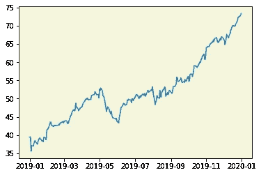

**概述:**

*   什么是时间序列？
*   时间序列的不同组成部分。
*   不同的时间序列预测模型
*   Python 中的苹果股价预测

**什么是时间序列？**

时间序列仅仅是在连续的时间点对一个数量变量的有序观察。时间可以是年、月、日、小时等。这取决于数据收集过程。时间序列在许多不同领域都有应用，例如:

*   国民收入和外汇储备
*   行业内的销售额和利润
*   股票交易市场
*   天气统计分析
*   农业生产
*   人口统计学等。

数学上，时间序列被定义为

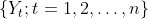

其中`n`表示观察次数。由于各种因素，值`Yt`随时间`t`波动，因此时间序列不是时间的常数函数。让我们研究一下引起这些波动的一些因素。这些也被称为时间序列的组成部分。

1.  **趋势:**数据在一段较长的时间内一般会有增加或减少的趋势称为具有某种趋势。这在企业的经济统计中最为常见。在整个给定的时间段内，增加或减少的方向可能不同。在不同的时间会有不同的趋势。然而，总体趋势可能是向上或向下的。
2.  **季节性:**时间序列中的季节性变化是由于一些因素在不到一年的时间内以规则和周期性的方式发生作用，并且年复一年具有相同的模式。这些因素可能是自然发生的，也可能是人为的干预。季节性研究对于企业在某个季节时间窗内创造更多收入的决策是非常有用的。
3.  **周期型:**波动周期超过一年的时间序列的波动称为周期型。一个完整的周期称为“周期”。你可能听说过“商业周期”，在这种周期中，需求和供给会受到一些经济因素的影响。与季节性不同，循环模式不是周期性的。

**平稳性**

直观上，平稳性意味着时间序列的统计特性不会随时间而改变。例如，具有上述成分的时间序列趋势、季节性等。不是静止的。平稳过程很容易分析。时间序列的平稳性主要有两种类型——严格平稳性或弱平稳性(在随机过程理论中也称为二阶平稳性)。

*   **严格平稳性:**如果`Yt`的边际分布在不同的时间点 t 相同，即

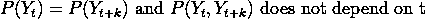

这里，`k`表示滞后。

*   **弱平稳性:**一个序列被称为弱平稳的，如果

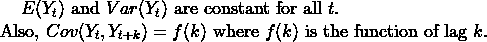

因此，协方差不是`t`的函数。现在，首先想到的问题是，如果级数不是平稳的，我们该怎么办？简单的答案是——让它静止不动。我们怎么做呢？有不同的方法可以做到这一点，但这里有一个简单且最受欢迎的方法——“差异”。

**差异**

差分基本上是从时间序列的当前值中减去先前的值，即

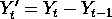

然后使用这个新的平稳差分序列。有时一阶差分不能使它稳定，那么我们可以去更高阶，像差分一阶差分序列等等。差异稳定了序列的平均值，这有助于消除趋势和季节性。诸如对数变换的其他方法稳定了方差。

**自相关函数**

两个随机变量的相关函数度量两个变量的关联。类似地，自相关测量相同时间序列的两个值之间的相关性。这些值由滞后 k 分隔，滞后 k 时的 ACF 可由下式给出:

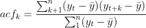

**偏自相关函数(PACF)**

部分自相关函数是在去除对其他滞后项的任何线性依赖之后`Yt`和`Y{t-k}`之间的自相关，由下式给出

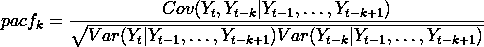

为什么 ACF 和 PACF 很重要？

一旦你使时间序列平稳，我们必须计算 ACF 和 PACF 相关图，这样我们就可以找到预测模型所需的参数。迷茫？？？不要…继续写这篇文章。一旦我们看完这个例子，你就会明白了。

**白噪声**

白噪声不过是一个均值为零、方差不变、协方差为零的随机序列。

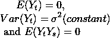

如果时间序列是白噪声，我们就无法预测。就停在那里！

# **预测模型**

现在，让我们讨论四个重要的预测模型。

1.  **自回归模型(AR(p))**

在 AR(p)模型中，我们使用变量过去值的线性组合来预测感兴趣的变量。术语 A***utoregression***表示它是变量对自身的回归。`p`表示模型中包含的过去值的数量。AR(p)模型由下式给出

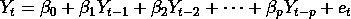

2.**均线模型(MA(q))**

移动平均模型不是在回归中使用预测变量的过去值，而是在回归中使用过去的预测误差`e`。`q`表示模型中使用的过去误差项的数量。MA(q)模型给出为

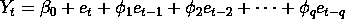

3.**自回归移动平均模型(ARMA(p，q))**

现在很直观的就能弄清楚这个模型有什么。你是对的！它包含两项，即序列的过去值和误差项。`p`和`q`分别是 AR 和 MA 模型的参数。ARMA(p，q)模型给出如下:

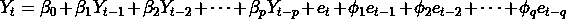

4.**自回归综合移动平均模型(ARIMA(p，d，q))**

当我们将差分与自回归移动平均模型(ARMA)相结合时，我们得到一个 ARIMA 模型。这有三个参数。`p`是 AR 模型的阶数，`q`是 MA 模型的阶数，`d`是差分的阶数。ARIMA(p，d，q)模型由下式给出

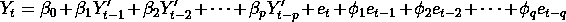

其中虚线 Y 项是差分级数项。

# 博克斯-詹金斯法(B-J 法)

Box-Jenkins 方法是由 George Box 和 Gwilym Jenkins 在他们 1970 年的开创性教科书[时间序列分析:预测和控制](https://amzn.to/31OLnFH)中提出的。

他们制定了以下三个步骤来预测单变量时间序列:

1.  **识别:**在这个步骤中，我们通过查看 ACF 和 PACF 图或者通过一些统计测试来识别 ARIMA 模型`p`、`d`和`q`的参数。通常，根据 ACF 和 PACF 图中的模式选择以下模型:

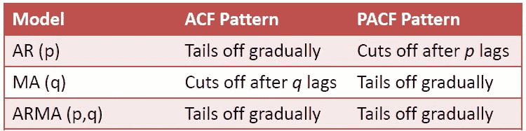

**2。估计:**在这一步中，我们通过使用像最大似然估计(MLE) / Yule-Walker 过程/矩方法(MOM)这样的方法来估计时间序列回归模型中的以下参数。

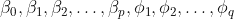

**3。诊断检查:**在这一步中，我们使用不同的指标，如 AIC、BIC、MAPE 等，来检查模型的预测准确性。

> 受够了概念！让我们来看看 Python 中的苹果股价预测。

首先让我们加载所有需要的包。

```
from pandas_datareader import data
from datetime import datetime
import numpy as np
import matplotlib.pyplot as plt
import pandas as pd
from statsmodels.graphics.tsaplots import acf, plot_acf, plot_pacf
from statsmodels.tsa.stattools import adfuller
from pmdarima.arima.utils import ndiffs
from statsmodels.tsa.arima_model import ARIMA
import pmdarima as pm
```

现在，让我们从雅虎下载 2019 年 1 月 1 日至 2020 年 1 月 1 日的苹果股票数据，并绘制截至目前的收盘价。在本教程中，我们将使用收盘价作为预测的单变量时间序列。

```
aapl = data.DataReader('AAPL', 'yahoo', datetime(2019, 1, 1), datetime(2020, 1, 1))
series1 = aapl.Close.dropna() #original series
ax = plt.axes()
ax.set_facecolor('beige')
plt.plot(series1)
```


我们可以看到 2019 年 12 个月的增长趋势，这告诉我们股票表现很好。👍

现在，因为有一个趋势，它不是一个平稳的序列，我们不能使用这个序列进行预测，我们需要差分它，并找到差分的顺序，使它平稳。让我们首先进行一阶差分，看看它是否使序列平稳。

```
ax = plt.axes()
series2 = aapl.Close.diff().dropna() #first order differenced series
ax.set_facecolor('silver')
plt.plot(series2)
```

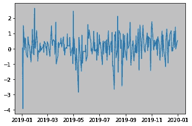

它确实使它成为了一个固定系列！现在，如果你仍然不相信看到的图，让我们使用一些统计测试，给我们所需的差分顺序，使一系列平稳。

```
# Adf Test
ndiffs(series1, test='adf')  # output is 1# KPSS test
ndiffs(series1, test='kpss')  # output is 1# PP test:
ndiffs(series1, test='pp')  # output is 1
```

因此，在所有三个测试中，我们得到的差值顺序为 1。

太好了！让我们也检查一下 ACF 图在差分后是否改变了。可以看到，非平稳序列的 ACF 衰减缓慢，而平稳序列的 ACF 衰减很快。

```
plt.rcParams.update({'figure.figsize':(12,7), 'figure.dpi':120})
# Original Series
fig, axes = plt.subplots(2, 2)
axes[0, 0].plot(series1); 
axes[0, 0].set_title('Original Series')
plot_acf(series1, ax=axes[0, 1])# 1st Differencing
axes[1, 0].plot(series2); 
axes[1, 0].set_title('1st Order Differencing')
plot_acf(series2, ax=axes[1, 1])plt.show()
```

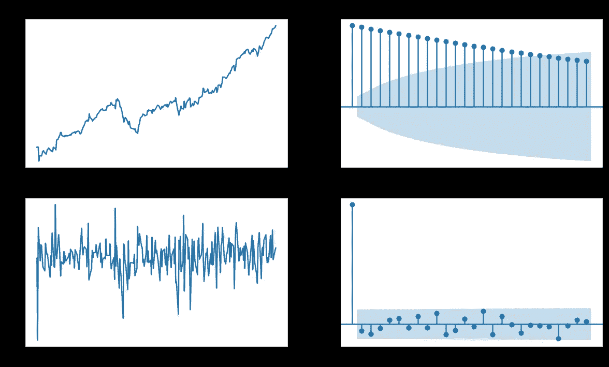

现在，我们已经确定了参数`d`的值。接下来，我们要确定分别是 AR 和 MA 模型阶数的`p`和`q`的值。

为了确定`p`，我们需要看看 PACF 图，所以让我们在下面绘制它。

```
fig, axes = plt.subplots(1, 2)
axes[0].plot(series2); 
axes[0].set_title('1st Differencing')
axes[1].set(ylim=(-1,1))
plot_pacf(series2, ax=axes[1])plt.show()
```

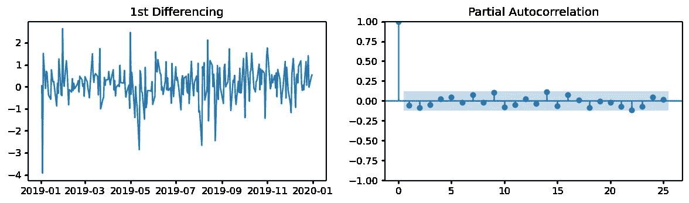

你可以看到唯一有意义的滞后是 0。于是，搞定`p=0`

现在，让我们通过查看 ACF 图来找到 MA(q)模型中的`q` 项。

```
#Find q in MA(q)
plt.rcParams.update({'figure.figsize':(12,3), 'figure.dpi':120})
fig, axes = plt.subplots(1, 2)
axes[0].plot(series2); 
axes[0].set_title('1st Differencing')
axes[1].set(ylim=(-1,1))
plot_acf(series2, ax=axes[1])plt.show()
```

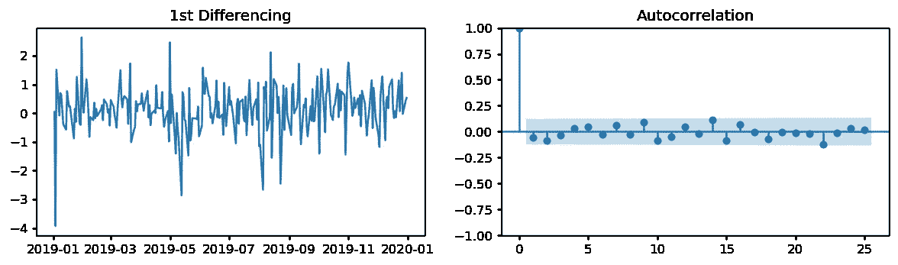

你可以看到唯一有意义的滞后是 0。因此，固定 q=0

现在，我们有`p=0`、`d=1`和`q=0`。你还在等什么？？？

让我们来拟合 ARIMA (0，1，0)模型。

```
# 0,1,0 ARIMA Model
model = ARIMA(series1.dropna(), order=(0,1,0))
model_fit = model.fit(disp=0)
print(model_fit.summary())
```

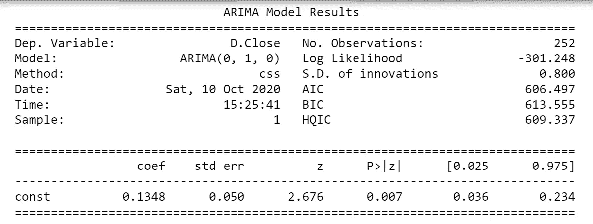

你可以看到，在系数中，我们只有常数项，没有其他系数。这是因为我们有`p=0`和`q=0`，这意味着模型中不包含过去的值和错误。有道理对吗？

既然我们已经拟合了模型，让我们通过绘制残差图来检查它的准确性。现在，记住我们使用的时间序列模型只不过是参数回归模型。因此，残差应该遵循回归模型的假设，或者简单地说，它们应该是白噪声。现在你明白了——什么是白噪音。

```
# Plot residual errors
residuals = pd.DataFrame(model_fit.resid)
fig, ax = plt.subplots(1,2)
residuals.plot(title="Residuals", ax=ax[0])
residuals.plot(kind='kde', title='Density', ax=ax[1])
plt.show()
```

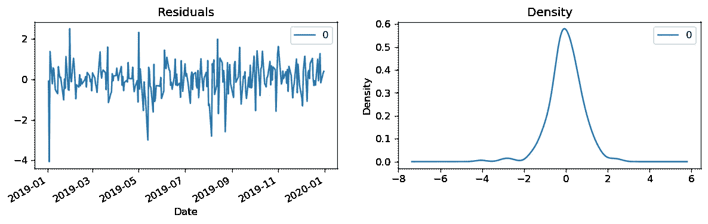

我们可以看到残差是随机白噪声，正态分布！太好了，我们刚刚找到了最适合我们数据的时间序列模型。

现在，让我们绘制实际的和拟合的时间序列。

```
# Actual vs Fitted
model_fit.plot_predict(dynamic=False)
plt.show()
```

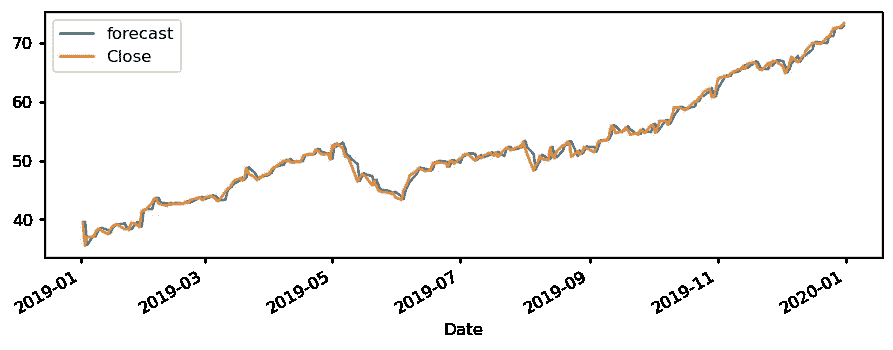

非常适合！现在我们了解了什么是时间序列建模。让我们预测，这是本教程的主要目标。首先根据我们的数据创建训练和测试集，构建模型，然后进行预测。简单！

```
# Create Training and Test
train = series1.dropna()[:200] #first 200 rows in the training set
test = series1.dropna()[200:] #remaining rows in the test set#If it is not a time series, then this is not the ideal way for #train-test split. You may use scikit-learn library and use function #train_test_split() by providing the ratio. Since this is a time-#series data set, we cannot use future values to predict past #values.# Build Model
# model = ARIMA(train, order=(0,1,0))  
model = ARIMA(train, order=(0, 1, 0))  
fitted = model.fit(disp=-1)# Forecast
fc, se, conf = fitted.forecast(53, alpha=0.05)  # 95% conf# Make as pandas series
fc_series = pd.Series(fc, index=test.index)
lower_series = pd.Series(conf[:, 0], index=test.index)
upper_series = pd.Series(conf[:, 1], index=test.index)# Plot
plt.figure(figsize=(12,5), dpi=100)
plt.plot(train, label='training')
plt.plot(test, label='actual')
plt.plot(fc_series, label='forecast')
plt.fill_between(lower_series.index, lower_series, upper_series, 
                 color='k', alpha=.15)
plt.title('Forecast vs Actuals')
plt.legend(loc='upper left', fontsize=8)
plt.show()
```

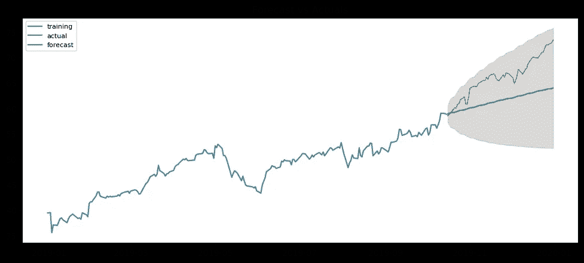

这是一个不错的预测，因为实际值位于置信区间内。

现在，让我们看看几个准确性指标，看看这个模型是否好。

```
# Accuracy metrics
def forecast_accuracy(forecast, actual):
    mape = np.mean(np.abs(forecast - actual)/np.abs(actual))  # MAPE
    me = np.mean(forecast - actual)             # ME
    mae = np.mean(np.abs(forecast - actual))    # MAE
    mpe = np.mean((forecast - actual)/actual)   # MPE
    rmse = np.mean((forecast - actual)**2)**.5  # RMSE
    corr = np.corrcoef(forecast, actual)[0,1]   # corr
    mins = np.amin(np.hstack([forecast[:,None], 
                              actual[:,None]]), axis=1)
    maxs = np.amax(np.hstack([forecast[:,None], 
                              actual[:,None]]), axis=1)
    minmax = 1 - np.mean(mins/maxs)             # minmax
    acf1 = acf(fc-test)[1]                      # ACF1
    return({'mape':mape, 'me':me, 'mae': mae, 
            'mpe': mpe, 'rmse':rmse, 'acf1':acf1, 
            'corr':corr, 'minmax':minmax})forecast_accuracy(fc, test.values)
#MAPA is 0.065 which implies 93.5% accuracy in the prediction
```

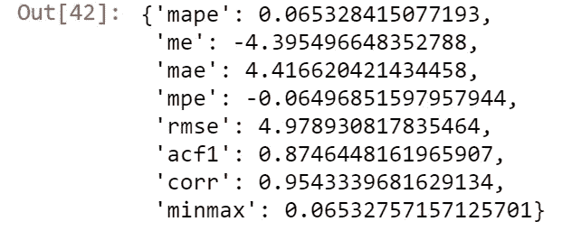

我们可以看到，MAPE(平均绝对预测误差)为 0.065，这意味着预测的准确度为 93.5%。还不错！

现在，如果你不想做这个寻找`p`、`d`和`q`的大程序，那我们就长话短说吧。只需使用 auto_arima()函数，它会为您提供最佳的参数和模型。

```
#Automate ARIMA modelmodel = pm.auto_arima(series1.dropna(), start_p=0, start_q=0,
                      test='adf',       # use adftest to find optimal 'd'
                      max_p=3, max_q=3, # maximum p and q
                      m=1,              # frequency of series
                      d=None,           # let model determine 'd'
                      seasonal=False,   # No Seasonality
                      start_P=0, 
                      D=0, 
                      trace=True,
                      error_action='ignore',  
                      suppress_warnings=True, 
                      stepwise=True)print(model.summary())
```

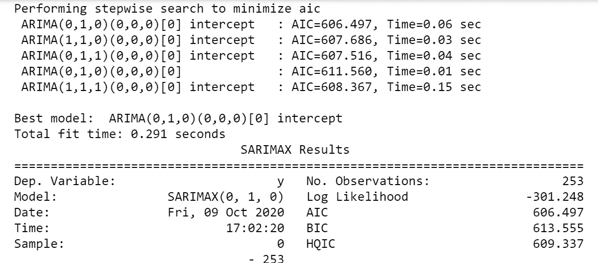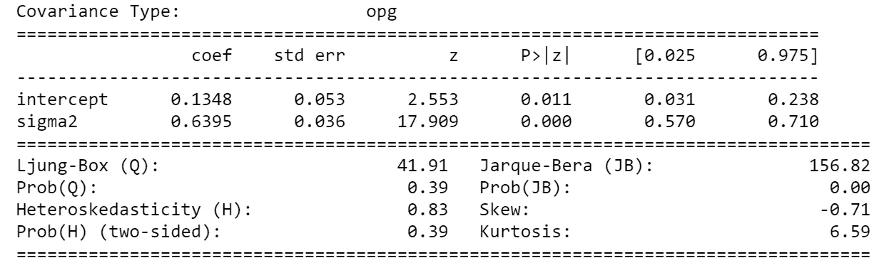

因此，我们的模型估计确实是正确的。我们数据的最佳模型是 ARIMA(0，1，0)。太好了！

现在，只需查看最佳模型的残差直方图和 QQplot。

```
model.plot_diagnostics(figsize=(7,5))
plt.show()
```

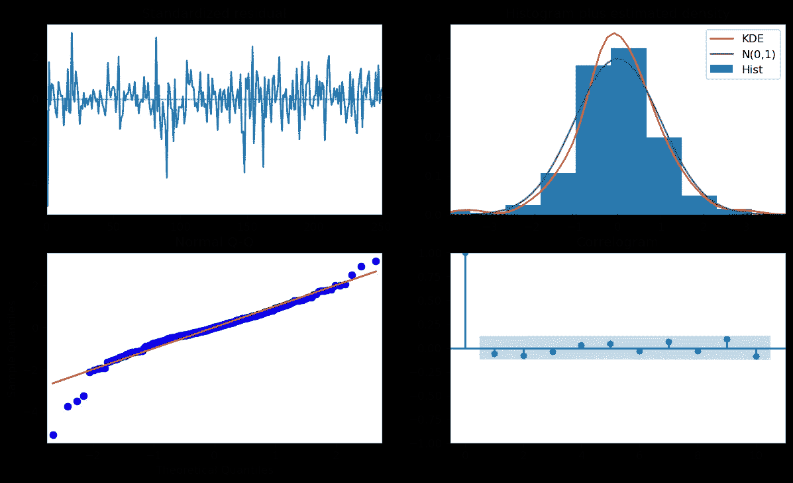

QQplot 似乎遵循正态分位数。没有大尾巴。直方图和密度看起来也正常。相关图说，我们有一个平稳的时间序列。太好了！！！！一切都好！！！让我们拍拍背，是时候做些总结了。

## **结尾备注:**

我们刚刚用单变量时间序列探讨了时间序列分析的基本框架。像 RNN 这样的非参数模型和深度学习模型也用于预测。多元时间序列建模也在实践中使用。前面还有很多东西要学。我将在接下来的故事中讨论更复杂的模型。敬请期待！

如果你觉得这个博客有用，请点赞、评论并分享。我很乐意在评论区回答你的问题。

# 回头见！