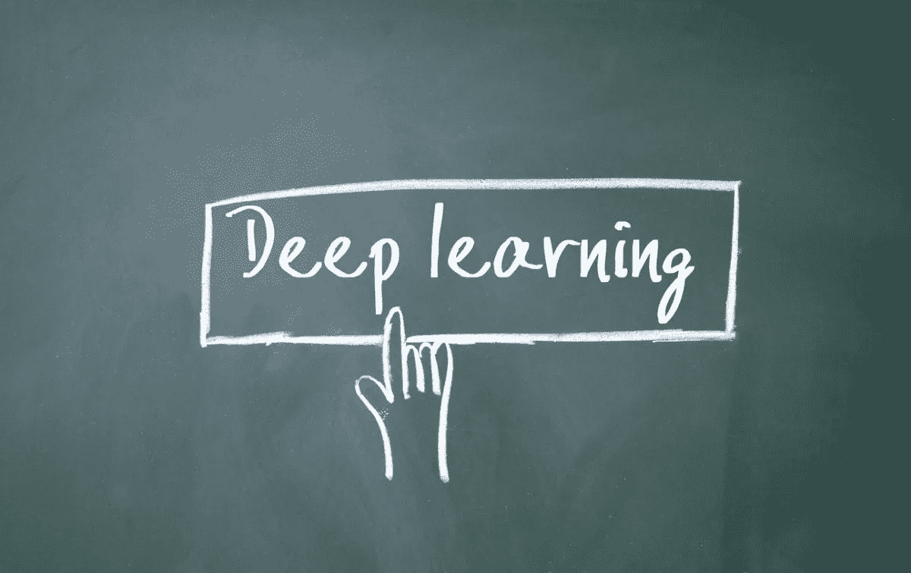

# 开始你的第一个深度学习项目

> 原文：<https://medium.com/analytics-vidhya/get-started-with-your-first-deep-learning-project-7d989cb13ae5?source=collection_archive---------12----------------------->

一种使用 MNIST 数据集和简单神经网络开发手写数字分类模型的简单方法

> 深度学习可以被认为是机器学习的一个子集，其中模型通过检查计算机算法来自行学习和改进。