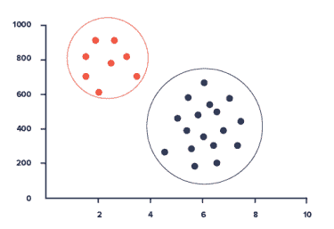
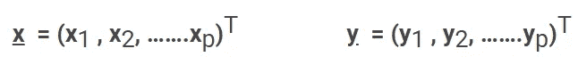
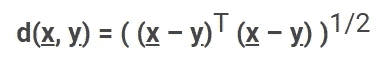
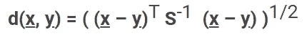
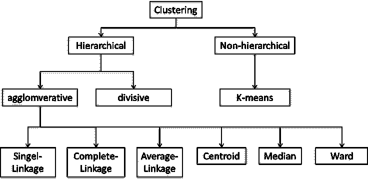
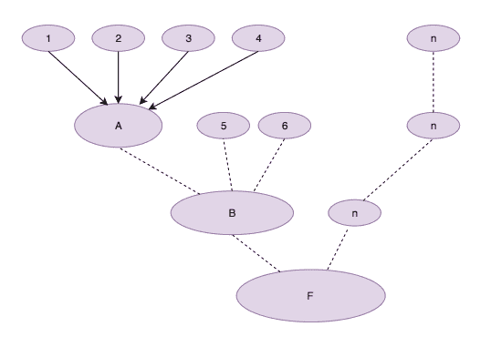
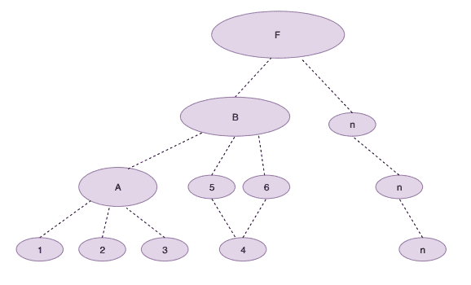
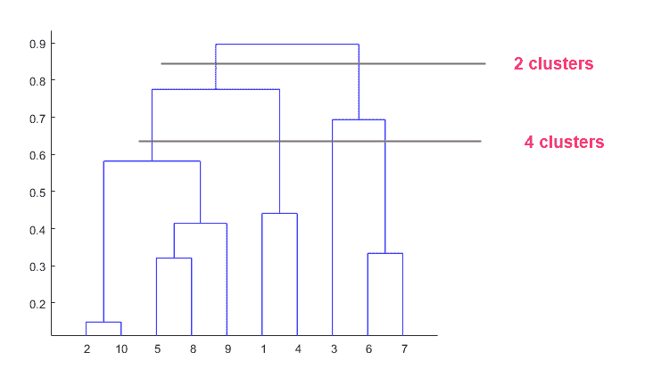

# 了解聚类分析

> 原文：<https://medium.com/analytics-vidhya/get-to-know-about-cluster-analysis-1c6fce416712?source=collection_archive---------29----------------------->

在本文中，我计划讨论一种机器学习分组技术的理论背景——聚类。

示例:两个集群

我们使用分类方法来表示一种组织大型数据集的方便方法。这些小组将帮助经理们做出决定。例如，在银行业，经理希望识别他们的 NPA 客户。为此，我们需要首先根据关键指标/参数对客户进行分组。然后，我们可以确定哪个群体的 NPA 风险更大，并据此做出决策。

**聚类介绍。**

分类可以被看作是将相似的对象分成类别或组。这样一组相似的群被称为**星团**。

为了能够将相似的对象放入组中，我们需要一种接近度或相似度的度量。相似性度量的选择取决于变量类型。这意味着它是离散的、连续的、二进制的还是其他的..

然后我将讨论如何基于变量类型进行测量。这里我们可以把变量分成两大类，定性的和定量的。

**量化变量的相似性度量。**

这里我们考虑两个项目 x 和 y，我可以把这两个变量定义为数学上的矩阵。

二维观测值之间的距离可以用两种方法测量。

**1。欧几里德距离**

这是欧氏空间中两点之间的普通直线距离。等式如下所示:

**2。统计(马哈拉诺比斯)距离**

这是对测量 x 距离 y 的平均值多少标准差的概念的多维概括(来自统计理论多元)。该方程包含一个新符号， **S-1** ，它来自称为**共方差矩阵**的多元统计方法。等式如下所示:

上面我只提到了一种测量距离的方法，但是有很多方法可以进行测量。例如，如果我们想测量一个二元变量中的距离，有一个单独的方法来做。在这种情况下，我们首先需要将所有的分类变量归类为二元变量。然后根据调查结果继续分析。

现在我将讨论聚类方法。

**聚类方法。**

聚类方法图。

聚类方法基本上可以分为两大类。

1.  层次聚类方法
2.  非等级聚类方法

**层次聚类方法**

层次聚类方法通过一系列连续的合并或一系列连续的分割来进行。有两种类型的层次聚类方法；

**1。凝聚层次方法**

这种方法从单个对象作为主群集开始。最相似的对象首先被组合以形成一个组，并且这些初始组根据它们的相似性被合并。同样，最后一个集群出现了。凝聚法的主要类型。

*   单链——考虑最短距离(最近邻)的一组成员
*   完全连锁——考虑最远距离(最远邻居)的一组成员
*   平均关联-根据平均距离对成员进行分组。

**2。分裂层次法**

对象的初始组被分成两个子组，使得每组中的对象远离另一组中的对象。这些子群被进一步划分成不同的子群。这个过程一直持续到得到不同的子群。

凝聚法和除法的结果都可以显示在一个叫做**树状图**的图表中。这有助于以清晰的方式识别集群。

样本树突图

**非层次聚类方法**

非层次聚类技术被设计成将项目而不是变量分组到 K 个聚类的集合中。可以预先或者通过遵循分层聚类技术来定义聚类的数量。

**K-均值聚类。**

K-means 将每个项目分配给具有最近质心的聚类。(此处质心描述平均值)。这里我列出了 K 均值聚类的理论步骤。

1.  将项目划分为 K 个初始聚类。
2.  继续查看项目列表，将一个项目分配给质心最近的群集。重新计算接收新项目的群和丢失项目的群的质心。
3.  重复步骤 2，直到不再发生重新分配。

希望本文能帮助你获得一些关于聚类分析的理论基础。这是我在 Medium 上的第一篇文章，非常感谢你的评论和反馈。