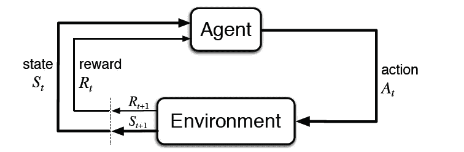
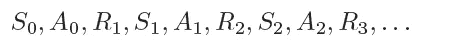
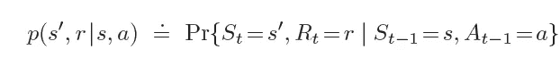
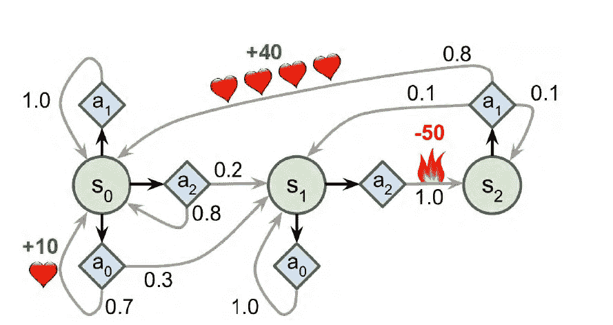
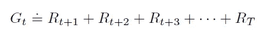
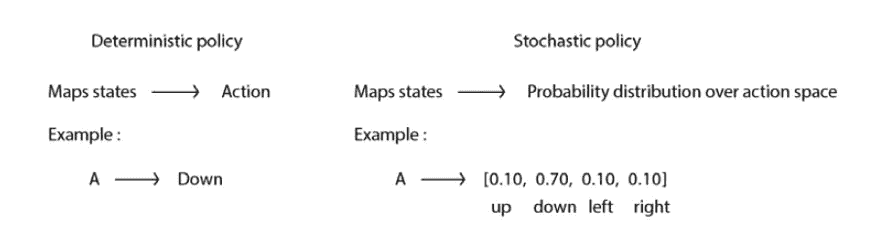

# 了解马尔科夫，以及他是如何决定

> 原文：<https://medium.com/analytics-vidhya/get-to-know-markov-and-how-he-decide-dd6deb3254da?source=collection_archive---------16----------------------->

## 马尔可夫决策过程作为一个强化学习框架 JML x AWS 深赛车 Bootcamp Pt。2

弗拉季斯拉夫·巴比延科在 [Unsplash](https://unsplash.com?utm_source=medium&utm_medium=referral) 上的照片

在本系列的 [**第一部分**](https://nickodemus-r.medium.com/how-a-self-driving-car-works-9956274ca6f6) 中，我们采用了什么是 ***强化学习*** 的高级方法，并在 AWS Deepracer 控制台上进行了直升机视图。现在，我们将更仔细地看看如何用数学方法处理强化学习概念。

## 马尔可夫链

20 世纪初，俄罗斯数学家安德烈·马尔科夫(Andrey Markov)学习了没有记忆的随机过程，后来被称为马尔科夫链(Markov chain)。它是过程序列的统计模型，其中事件下一状态的预测概率完全取决于当前状态。例如，我们想预测天气，现在( ***当前状态*** )有风，一小时后( ***下一状态*** )会下雨。下一个小时下雨的概率将只取决于当前的风况，我们甚至不关心上一个小时是晴天还是雷雨。从当前状态到下一个状态的概率称为 ***转移概率*。**马尔可夫链可以分为两种类型，离散型和连续型。

## 马尔可夫奖励过程

马尔可夫链的一个扩展是*马尔可夫奖励过程。*在这个概念中，我们引入了*奖励函数的概念。因此，模型将在其选择的状态上获得奖励，奖励可以是正的，也可以是负的。*

## 马尔可夫决策过程(MDP)

基于马尔可夫链和马尔可夫奖励过程，我们接着定义了一个马尔可夫决策过程(MDP)，一个对*强化学习*问题进行数学建模的框架。在强化学习中，有一个学习者， ***智能体，*** 从它之外的一切事物中学习， ***环境*。**环境给代理一个 ***状态*** ，代理用一个 ***动作*来响应。**基于其行动，代理人将获得 ***奖励*** 。

来源:[《强化学习导论》，作者:R .萨顿& A .巴尔托(麻省理工学院出版社)](https://web.stanford.edu/class/psych209/Readings/SuttonBartoIPRLBook2ndEd.pdf)

所以在 MDP 有一些关键词:

*   **州**
*   **动作**
*   **转移矩阵**
*   **奖励**
*   **政策**

如前所述，马尔可夫链是过程序列。在给定的时间步长内，主体-环境交互将遵循这一过程顺序 *t = 0，1，2，3，…* 在给定的时间步长内，将有一个状态、一个动作和一个奖励。

对于那些喜欢看数学方程的人来说，给定*之前的*状态和动作的特定值，那么在时间 *t，*出现值的概率可以写成

这个概率也被称为**。*当我们把它写成矩阵形式时，我们可以把它定义为 ***转移矩阵****

**

*[MDP 的例子，来源:用 Scikit-Learn、Keras 和 TensorFlow 进行机器实践学习，第二版，作者 Aurélien Géron](https://www.oreilly.com/library/view/hands-on-machine-learning/9781492032632/)*

*我们在图上看到 s *tate* 是圆形节点，*动作*是菱形节点，正奖励是心，负奖励是火。因此，在状态 0 时，代理可以选择给定概率为 0.7 的动作 a0 来获得奖励+10 或概率为 0.3 并移动到状态 1，或采取概率为 0.2 的动作 a2 来移动到状态 1 或概率为 0.8 的动作来返回状态 0，依此类推。*

## **奖励**

*我们读了很多关于奖励的书，但是什么是奖励呢？奖励可以说是环境基于主体的行动而给予主体的信号。奖励可以是正数或负数，但不能是零(0)。如果我们选择零作为报酬，那么代理人不能从它的行为中学到任何东西。它不会知道这个行为是好是坏。在强化学习中我们有*奖励假设*的想法*

> *我们所说的目标和目的都可以被认为是接收到的标量信号的累积和的期望值的最大化(称为回报)。*

*因此，代理在强化学习中的目标是最大化期望的累积回报。*

**

*由[彼得罗·德·格兰迪](https://unsplash.com/@peter_mc_greats?utm_source=medium&utm_medium=referral)在 [Unsplash](https://unsplash.com?utm_source=medium&utm_medium=referral) 上拍摄的照片*

## *插曲*

*当我们谈论*有限* MDP 时，代理人不会无限地做序列。所以有一个终态。从代理开始与环境交互直到终端状态的时间称为事件。在模拟中训练自动驾驶汽车的例子，当汽车停止时，无论是因为它已经越过终点线，撞车，还是作为一个情节脱离轨道。然后汽车又从起点出发，直到又一次停下来。基于报酬假设，代理人希望获得最大的预期累积报酬。一集获得的累计*奖励*称为*回报。*如果我们把 return 表示为 G，它可以写成这样，*

****

*兰迪·法特在 [Unsplash](https://unsplash.com?utm_source=medium&utm_medium=referral) 上的照片*

*我们可以通过使用 ***贴现因子γ来控制是考虑更多的眼前报酬还是未来报酬。*** 这是一个介于 0 和 1 之间的数字。如果我们更多地考虑*即时奖励*我们可以将数字设置为接近 0，如果我们想更多地考虑*未来奖励*那么将因子设置为接近 1。那么如何贯彻这个理念呢？想象下象棋，如果代理的目标是赢得象棋比赛。代理人将获得积极的回报时，它可以杀死对手的棋子，但从长远来看，赢得国际象棋比赛是杀死国王。因此，当我们更加重视*即时*奖励时，代理人将最终学会杀死尽可能多的兵，并可能最终输掉游戏，因为它采取了错误的行动，导致其国王被杀。相反，如果我们更重视未来的回报，也许代理人不会学会杀死许多棋子，但它可以学会采取更好的策略来获得对手的王。*

## *政策*

*我们已经了解了代理、状态、转移矩阵和奖励。现在，什么是政策？实际上，策略是我们给定的规则，用来定义代理在环境中的行为。策略告诉代理在每个状态下要执行的操作。有两种类型的策略。*

1.  *确定性策略 →告诉代理在给定的状态下该做什么。如果状态为 X，则 Y*
2.  ***随机策略→** 告诉代理在给定状态下行动的概率。如果状态是 X，那么用概率 z 做 Y。*

**

## *MDP 和强化学习*

*我们已经对 MDP 的这一特定关键术语有所了解。*

1.  ***状态( *S* ) →** 一组*状态**
2.  ***动作(*一套* ) →** 一套*动作**
3.  ***转换矩阵→** 代理从一个状态到下一个状态的转换*
4.  ***奖励( *R* ) →** 一套*奖励**
5.  ***策略→** 一个给定的函数将每个状态映射到另一个状态*

*现在，作为总结，我们将看看它如何与*强化学习相关联。*简而言之，在强化学习方面，我们不像在 MDP 那样给出代理的转移矩阵和策略，但是代理会通过代理与环境的交互来自己学习。*

*   *状态*
*   *行动*
*   *t̷r̷a̷n̷s̷i̷t̷i̷o̷n̷̷m̷a̷t̷r̷i̷x̷*
*   *报酬*
*   *̷P̷o̷l̷i̷c̷y̷*

*这就是学习这个术语的由来，也是我们称之为人工智能的原因。这不仅仅是如果…否则…的条件，但是代理人会自己计算出什么样的策略是好的，可以最大化累积报酬。当然有一种方法可以帮助代理学习更好的策略，比如 ***近似策略。我们将在下一部分了解它。****

*恭喜你们和好如初。希望你能更好地理解 MDP，以及我们如何将它用作强化学习的框架。随着我们继续在 JML x AWS DeepRacer Bootcamp 上的旅程，我们将在下一篇文章中更深入地讨论强化学习的政策，以及如何在 AWS DeepLearning 控制台上构建我们的强化学习模型。*

## *资源:*

1.  *JML x AWS 深赛车训练营 MDP 介绍唐尼和苏曼*
2.  *强化学习，导论，第 2 版。理查德·萨顿和安德鲁·伯顿*
3.  *使用 Scikit-Learn、Keras 和 TensorFlow 进行机器学习，第 2 版。作者:奥雷连·盖伦*