# 使用 Hadoop Map 简化工作使用 Cloudera 平台

> 原文：<https://medium.com/analytics-vidhya/get-your-hands-dirty-with-hadoop-map-reduce-job-using-cloud-era-platform-big-data-f929fe0f12b4?source=collection_archive---------3----------------------->

# **利用云时代平台分析连锁门店销售数据**

# 我们将通过这个博客实现什么！！

> **分析使用 MapReduce 的不同用例。**
> 
> **实现基本的 MapReduce 概念。**
> 
> 运行一个 MapReduce 程序。
> 
> **了解 MapReduce 中的输入拆分概念。**
> 
> **·了解 Map Reduce 作业提交流程。**
> 
> **在 MapReduce 中实现作业跟踪器和作业追踪器。**

# **什么是 MapReduce？**

作为云计算、虚拟化和大数据等技术的结果，MapReduce 是用于处理大数据的新编程范式，称为大数据。MapReduce 计算发生在与云相关的数千台计算机上。因此，它可以利用与云相关联的图形处理单元(GPU)的并行处理能力。现实世界的公司正在从传统计算转向云计算，从传统数据挖掘转向大数据分析。这背后的原因是数据的指数级增长。存储和处理这些数据需要一个与云计算相关的大型数据生态系统。在这种情况下，MapReduce 编程模型受到分布式编程框架(如 Hadoop)的支持。然而，很难保护 MapReduce 计算免受恶意攻击。

文献中有很多云存储机制。然而，在 Hadoop 和大数据生态系统中保护 MapReduce 编程范式仍有待探索。在本文中，我们提出了一种差分隐私算法来保护大数据免受恶意软件映射器和 Reducer 的攻击。我们构建了一个应用程序原型来演示概念证明。结果表明了该方法的有效性。

最近，公司开始更加重视数据和数据分析，以进行战略决策。由于现实应用中的数据呈指数级增长，拥有一个良好的生态系统来存储和管理以数量、速度和多样性为特征的大数据变得至关重要。云计算的出现通过提供大量流行的共享计算资源，使得大数据的处理成为可能。同时出现了 Hadoop 分布式编程框架。该基础设施支持存储和处理大量数据，并利用数千台标准计算机进行并行处理。因为大数据处理需要计算能力和存储，云计算已经成为实现这一点的方式。借助云计算、虚拟化、大数据、Hadoop 等大数据平台，在分布式环境中打造生态系统。MapReduce 是用于大型数据处理的编程模型。这是一种新的编程方法，它包含了地图并减少了任务。这项工作是在许多标准计算机分布的环境中完成的。如上所述，Amazon 提供了自己的 MapReduce 编程模型，称为基于 Hadoop 的弹性 MapReduce。所以 Hadoop 是通过支持 MapReduce 编程来处理大数据的框架。然而，当映射器或齿轮箱受到损害时，就会出现安全问题。映射和作业缩减容易受到各种类型的攻击。在本文中，我们使用了 mapper 和 reducer 来计算美国每个商店的总销售额。

# ***意念***

分析和确定一个国家/地区不同商店的收入。

利用大数据 Hadoop 平台的核心概念 HDFS 和 MapReduce 来解决问题。

通过将工作分成一组独立的任务来并行处理大量数据。

使用 MapReduce 进程文件将它分成块并并行处理。

# **数据的初步概念**

# **A .数据描述**

数据集取自 Udacity，一个提供广泛课程的在线学习平台。数据集包含关于沃尔玛每个商店在特定年份的销售数据的数据。这个数据集包含分类变量和数值变量。有 6 个属性和超过 10，000，000 个实例。

**以下是必需的字段:**

日期

时间

位置

项目

价格

卡片

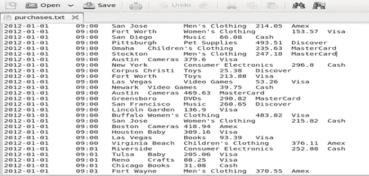

**图 1 商店销售数据集**

数据集可从以下链接下载:

[**https://drive . Google . com/file/d/1 ar 12 gzislf-jmqsj 1 fqsy 0 _ xhsqmh 4 f 9/view？usp =共享**](https://drive.google.com/file/d/1Ar12GZISlf-JMQSj1FQsy0_XhSqMH4F9/view?usp=sharing)

# **B .方法论**

**Hadoop 框架**

Hadoop 是一个开源框架，可用于处理海量数据，即数据的大小可能以 peta 字节为单位。它是一个分布式计算框架。Hadoop 的架构是主从架构，其中 Hadoop 的底层包括并行工作的其他机器。大量数据被分成在不同机器上运行的不同数据集。每台机器将执行任务。每台机器都有一个任务跟踪器和作业跟踪器。Hadoop 框架的主要组件是 HDFS (Hadoop 分布式文件系统)和 MapReduce 概念。

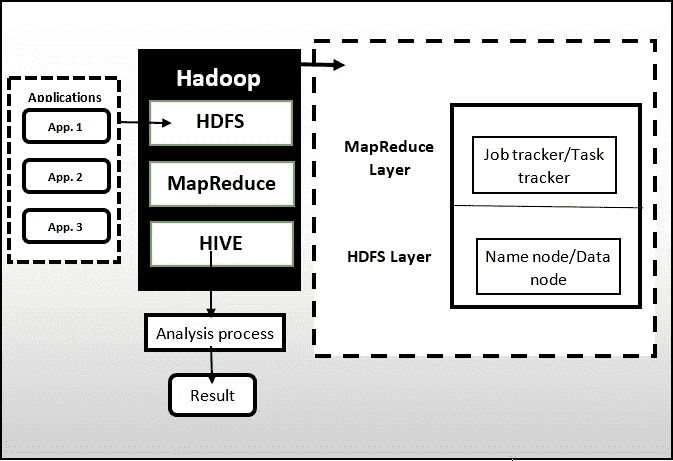

**图 2 Hadoop 框架的高层设计**

**MapReduce 概念**

MapReduce 是一个编程模型。它通过并行拆分大量数据并将其发送到不同的机器来简化处理过程。它支持结构化和非结构化数据格式。使用的主要编程语言是 Java，但也支持其他编程语言，如 python、c、c++。R 等其他数据分析编程工具也可以与 Hadoop 集成。

**MapReduce 编程有两个功能:**

**a .映射器功能**

在这个函数中，大输入被分成子问题输入或任务。这些任务被分配给节点，这些节点还将子任务分成子子任务。一旦处理完成，它就映射成键值对格式。在映射被发送到 reducer 函数之前，它们会根据键进行混洗和排序。

**b .减速器功能**

此函数用于处理，例如查找每个键的总计数或其他需要找出的分析。它产生一个或一组结果。

**HDFS — Hadoop 分布式文件系统**

在处理之前，本地磁盘中的大文件或实时数据存储在 Hadoop 的分布式文件系统中，称为 HDFS。它有用于存储和计算的节点。可以在 HDFS 内创建、删除或管理文件。它还允许创建目录。它有数据节点和名称节点，用于存储和访问文件。

# **C.** **工艺设计**

假设有一个销售数据的大文件，里面包含了沃尔玛各个门店在特定年份的销售数据。文件的行看起来像这样。我们需要找出 2012 年每个商店的总销售额。现在，由于该文件将包含数百万个项目，串行处理该文件是不可行的。Map Reduce 帮助我们将文件分成更小的块，在集群中的不同机器上处理这些块，然后合并结果。

我们将有一组称为映射器和减速器的机器来帮助并行运行这个过程，而不是一台机器来完成这项工作。制图者和简化者的工作是什么？该文件将被分成较小的区块，我们将为每个映射器分配一个区块。映射器的工作将是获取大块并分离每个商店的销售数据。例如，如果一个制图者得到上述记录，他将做三堆，即纽约、迈阿密和洛杉矶，并将每一堆的销售数据保存在特定的堆中。每个减速器将被分配一组存储。reducer 将从其指定商店的映射器中收集数据，并对该商店的销售额求和。例如，如果第一个 reducer 被分配到 NYC，他将从每个映射器收集 NYC 销售数据，并对这些值求和以获得 NYC 的总销售额。每个减速器按字母顺序通过他的桩。所以，第二个减速器将在迈阿密之前处理 LA 的销售。

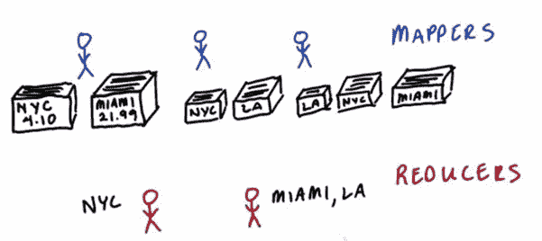

**映射器-减速器**

所以，映射器只是程序，每个程序作用于文件的一小块。映射器产生一个中间键值对。在我们的例子中，它是商店名称和商品价格。一旦地图绘制者完成了他们的工作，一个被称为洗牌和排序的阶段就开始了。Shuffle 是将记录从映射器移动到已经分配了这些记录的缩减器。排序是通过特定的缩减器对数据进行排序。reducers 得到一个键和值的列表。在我们的例子中，商店名称和每个商店的销售数据。它遍历所有的值，最终产生每个商店的总销售额。

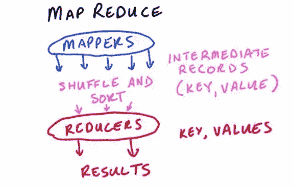

**键值对**

# **丁实施**

现在是时候着手使用 Hadoop Map Reduce 了。在运行 Map Reduce 作业之前，您需要安装一些有助于在您的机器上设置 Hadoop 环境的东西。你可以从 cloudera 网站下载 [CDH](http://www.cloudera.com/content/support/en/downloads/download-components/download-products.html) 包，并尝试设置环境。或者，如果你像我一样懒，只需下载这个已经设置好环境的[虚拟机](http://content.udacity-data.com/courses/ud617/Cloudera-Udacity-Training-VM-4.1.1.c.zip.)，然后用 Virtual Box 运行它。我已经使用 Oracle VM VirtualBox Manager 安装了 CloudEraDistribution。你也可以这样做，只要谷歌一下或者看一段 youtube 视频。

通常 Map Reduce 代码是用 java 编写的。但是有了一个叫做 Hadoop Streaming 的特性，你可以用任何语言编写你的映射器和缩减器。我们将使用 python 编写地图缩减作业。

我假设您已经安装了虚拟机。打开机器后，转到项目文件所在的目录。它将有一个映射器和减速器程序。它包含一个文件` `` **purchases.txt ``` ,该文件包含一个虚拟商店的销售数据。首先，我们需要将这个输入添加到 Hadoop 集群中。要在 Hadoop 集群上运行任何命令，我们需要给它添加 **Hadoop fs** 。

1.转到计算机中项目文件所在的文件夹。

2.使用****hadoop fs-put purchases . txt***将 **purchases.txt** 文件放到 Hadoop 集群中*

*3.使用****hadoop fs-ls***检查文件是否在 Hadoop 集群中**

**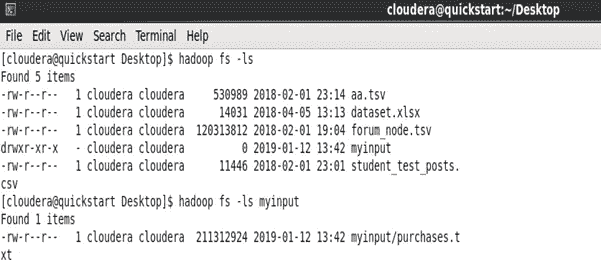**

****HDFS (CloudEra)****

**现在让我们看看映射器和缩减器代码。我们的 purchases.txt 数据如下所示。**

**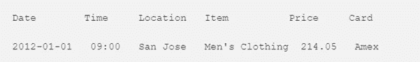**

****purchases.txt 示例****

**项目文件夹包含 **mapper.py** 和 **reducer.py** 文件。**

****映射器代码如下所示。****

**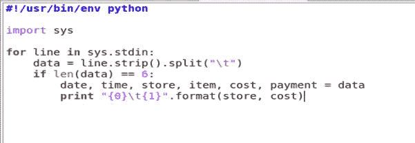**

****映射器代码(mapper.py)****

**映射器读取文件的区块，并使用制表符分隔符拆分文件。然后，它只打印出商店位置和商品价格作为输出。**

****减速器代码如图所示。****

**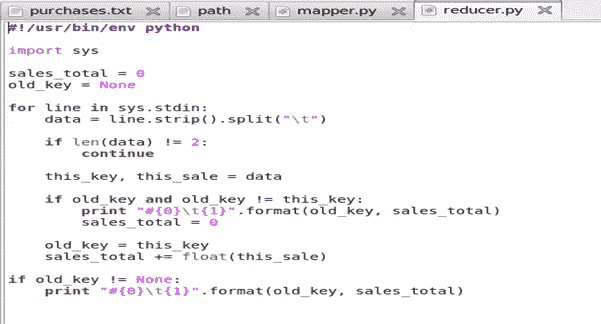**

****减速器代码(reducer.py)****

**我们假设我们只有一个 reducer，它将从 mappers 获得排序后的输入。reducer.py 接受排序后的输入，并继续检查新键是否等于前一个键。当发生变化时，它打印商店名称和商店的总销售额。**

**编写完映射器和缩减器后，您可以使用以下命令启动映射缩减作业:**

> ****Hadoop jar/usr/lib/Hadoop-0.20-MapReduce/contrib/streaming/Hadoop-streaming-2 . 6 . 0-mr1-CD H5 . 12 . 0 . jar-mapper . py-reducer . py-file mapper . py-file reducer . py-input my input-output job output****

**运行这个程序后，需要一些时间来计算。您可以在输出终端中观察映射器和缩减器是如何运行的。终端将显示各种信息，如工作完成的百分比。**

**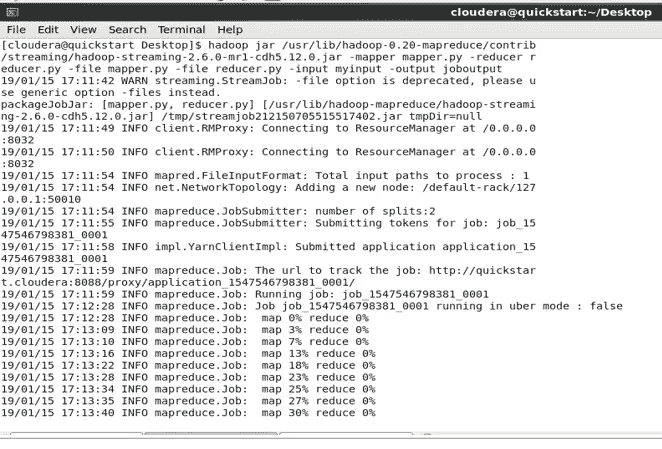**

****输出端子-1****

**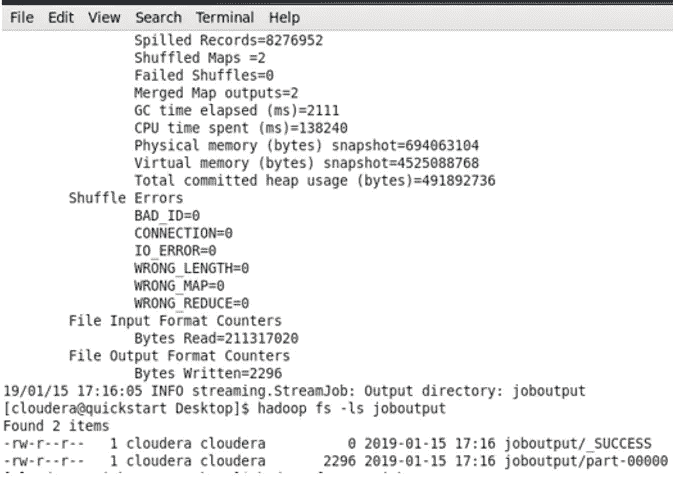**

****输出端子-2****

**我们程序的输出保存在文件 **joboutput/part-00000** 中**

**您可以通过运行命令 **hadoop fs -ls joboutput** 在同一个终端中查看输出**

**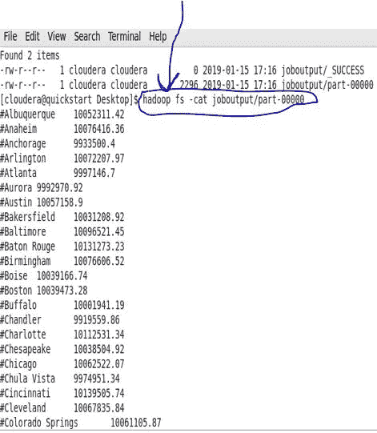**

****产出(每个商店产生的总收入)****

**您可以使用命令**Hadoop fs-cat job output/part-00000 | less**来查看一小部分输出，而不是查看整个输出**

**一旦您任务完成，现在您可以从我们的 HDFS 系统中删除 joboutput 文件。原因是，我们不能用相同的输出文件名生成不同的输出工作负载。这可以通过运行下面的命令 **hadoop fs -rm -r -f joboutput** 来实现**

**同时，您可以将数据导出到文本文件中，并将其保存在您的目录中以备将来使用。**

# ****E .结论****

**为了分析和确定一个国家/地区不同商店的收入，我们使用了核心概念——来自大数据 Hadoop 平台的 HDFS 和 MapReduce 来解决这个问题。**我们**通过将工作分成一组独立的任务来并行处理大量数据。**我们使用了 MapReduce 流程文件将数据分成块并并行处理，并且能够找出美国各个商店使用 reducers 获得的收入。****

**这就是这篇文章的全部内容。我希望你真正理解 HDFS 和 MapReduce 框架背后的神话，以及如何实现它。**

**这个项目的代码可以在我的 GitHub 页面上找到:**

**` `**https://github.com/MaajidKhan/HadoopMapReduce_BigData ` `****

**如果你喜欢这篇文章，点击下面的拍手图标，将这篇文章分享给你的朋友和网络。谢了。**