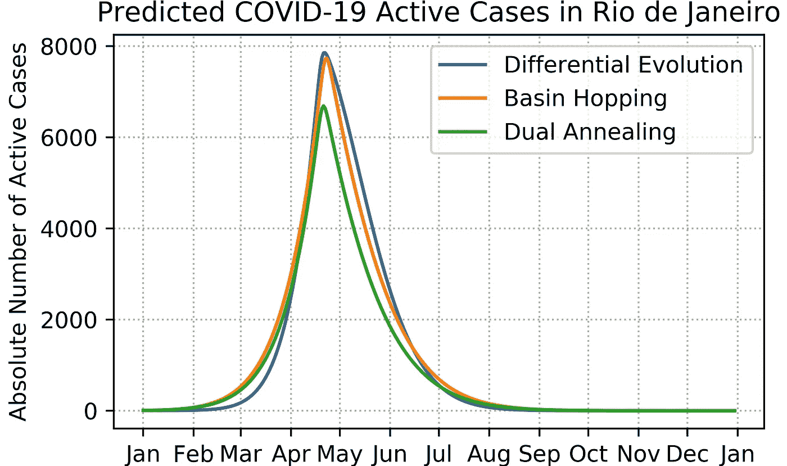
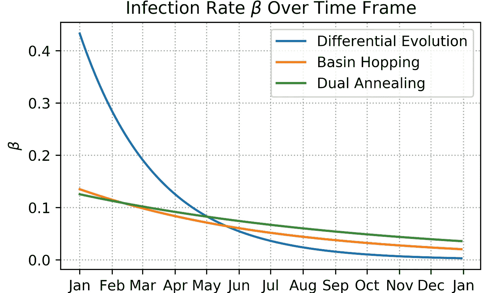
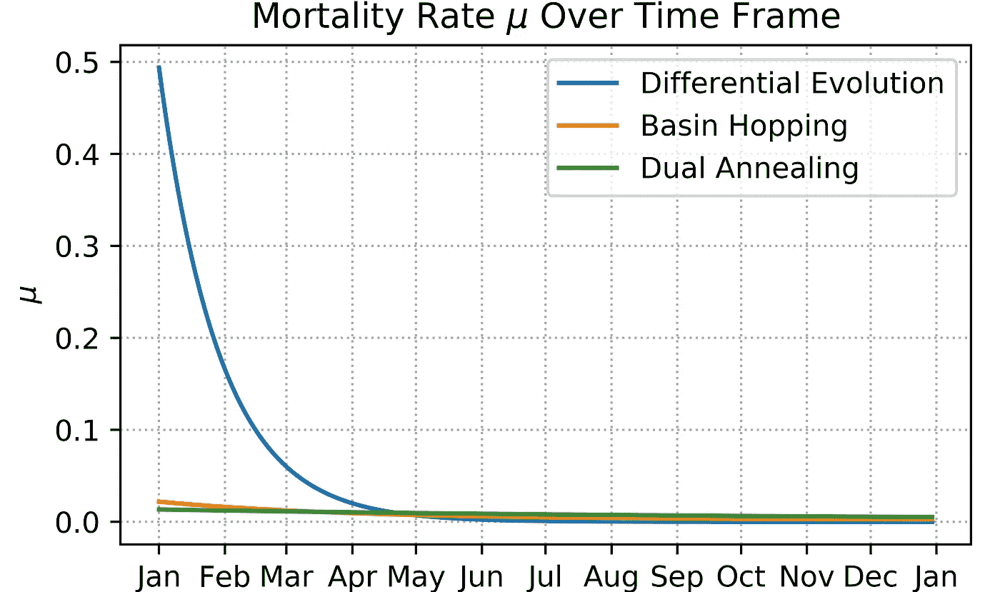

# 在里约热内卢更清楚地了解新冠肺炎

> 原文：<https://medium.com/analytics-vidhya/getting-a-clearer-picture-of-covid-19-in-rio-de-janeiro-5c9f2f3bfee2?source=collection_archive---------25----------------------->

## 使用季节性动力学 SIRD 模型预测感染、死亡率和放松社会距离措施的影响

图片由 [Aline](https://stock.adobe.com/br/contributor/209473101/aline?load_type=author&prev_url=detail) 通过 [Adobe Stock](https://stock.adobe.com)

到目前为止，2020 年是正确的一年吗？我们被困在家里，我们不能见朋友或家人，我们的大部分日常事务都被抛到了窗外，每次我们打开电视，查看推特或任何新闻渠道，我们都会得到关于悲惨的新冠肺炎·疫情的最新消息。随着我的大学课程转向在线形式，我决定从纽约回到我的家乡巴西里约热内卢，直到一切恢复正常，并希望与家人呆在一起会让隔离更好，社交距离不会像在家里那样艰难。

关于和家人呆在一起，我是对的，我无法想象在后来的春天和夏天呆在空荡荡的大学宿舍里会是什么样子，但我错了，我错在社交距离上。“哦，我们几乎没有病例”，我想，“我们会没事的！”，我想。截至撰写本文时，巴西是世界上确诊新冠肺炎病例第二多的国家，美国刚刚发布了来自巴西的冠状病毒旅行禁令，*刚刚好*？不用说，社交距离措施在这里已经成为一个巨大的话题，就像在美国一样，里约热内卢市政府最近表示，放松社交距离措施可能即将到来。像任何一个数学专业的学生一样，我控制不住自己，决定自己看看这些数据，试图更好地了解里约正在发生的事情。为了吸引更多的读者，我会尽量在整篇文章中保持随意的语气，但是，我不可避免地需要在这里或那里使用一些行话。

首先，我必须声明，我不是政府机构，所以你不应该仅仅根据我的结果就对里约的冠状病毒状况得出任何明确的结论。我只是一个在业余时间进行分析的人，所以我很可能完全错了。据你所知，我甚至可能在我的代码中有一个 bug，但是我想你必须相信我(包含本文中使用的所有代码的 GitHub 库可以在这里找到)。

# 分析目标和获取数据

我的目标是找到一个符合数据的模型，并从中得出一些关于疫情在城市层面的行为的有趣信息，例如感染和死亡人数的估计、社会距离测量的影响和 R₀估计。值得注意的是，后者是病毒的基本繁殖数，即新冠肺炎患者康复前平均感染的人数，这是医学界经常谈论的参数，如果你想了解更多，我强烈推荐琼斯的[1]。

本文使用的冠状病毒数据包括里约热内卢州确诊的新冠肺炎病例和死亡人数，由里约热内卢医疗保健秘书处编制**并于 2020 年 5 月 26 日**访问，可在此处访问[，并仅减少到里约热内卢市的病例，因为这是我们感兴趣的地区。秘书处指出，如果一个被确认患有新冠肺炎病毒的人在其最初症状出现后 14 天内没有死亡或住院，他们就被认为是康复了，因此这就是如何计算康复人数的。](http://painel.saude.rj.gov.br/monitoramento/covid19.html)

此外，里约热内卢的人口估计数是从巴西地理和统计研究所[2]获得的，用于计算冠状病毒易感者的人数，假设康复的个体对该病毒具有免疫力。

# 模型、假设和优化

## 模型定义

这里使用的模型是 Danon 等人[3]和 Caccavo [4]在他们各自出色的论文中使用的模型的混合物，我(相当没有创造性地)称之为季节性动力学 SIRD 模型，我将在下面描述它。

设 *S* ( *t* )， *I* ( *t* )， *R* ( *t* )， *D* ( *t* )分别表示新冠肺炎易感人数，当前感染人数， 在时间 *t，*定义*N*(*t*)=*S*(*t*)+*I*(*t*)+*R*(*t*)-*D*(*t *为了获得在 *t.* 的城市总人口，SIRD 模型被用作捕捉这些变量的基础，在该模型中，处于易感状态的人一旦被感染，就转变为受感染状态，在受感染状态，他们可能会感染其他易感个体，然后最终转变为恢复状态或死亡状态。 这可以在下图中看到**

显示在 SIRD 模型中被感染的个体的可能发展路径的图表。

在下面将要列出的假设下，这些量遵循常微分方程系统

SIRD 微分方程组

其中 *β* ( *t* )是感染率， *γ* ( *t* )是恢复率， *μ* ( *t* )是死亡率，都被定义为一个人在某个时刻 *t* 从先前状态过渡到各自状态所需的平均时间的倒数。例如， *β* ( *t* )是一个人在时间 *t 从易感到被感染的平均时间的倒数。*传统的 SIRD 模型假设这些比率是恒定的，但是我们的季节性动力学前缀来自于我们让这些比率采取依赖于时间的形式

季节性动力学 SIRD 模型的速率定义

让我们花一些时间来了解这些参数的含义，为此我们需要了解它们背后的基本原理。在这里，感染率随季节而增加，在冬季达到季节性高峰，这符合新冠肺炎在更冷、更干燥的天气中更具传染性的假设，但随着时间的推移，感染率也呈指数下降，因为社会距离 measures⁴.较远恢复率随着时间的推移在逻辑上增加，以反映保健系统逐步适应 pandemic⁴.最后，随着时间的推移，死亡率呈指数下降到持平，这意味着医疗基础设施的适应，以及随着疫情病毒转向 on⁴.，致死率较低的病毒株可能会变得相对更广泛然后，我们能够直观地将我们的参数定义为:

*   ₀:初始基础感染率
*   *τᵦ* :感染率下降速度的时间滞后术语
*   m:感染率季节性增长的幅度
*   ₀:初始回收率
*   *γ* ₀ + *γ* ₁:最终回收率
*   *τᵧ* :恢复速度增加速度的时间滞后术语
*   *μ* ₀ + *μ* ₁:初始死亡率
*   ₀:最终死亡率
*   τ_μ:死亡率下降速度的时间滞后术语(抱歉格式不好，我想是 Unicode 的错)

## 假设

最后，以下是季节性动态 SIRD 模型做出的假设:

1.  总人口保持不变，不会与建模人口之外的人进行交互。
2.  个人只有在与受感染的个人互动时才可能被感染。
3.  个体均匀混合，随机互动。
4.  个人在不同状态之间转换所花费的时间是指数分布的。
5.  康复后的人对这种疾病有免疫力，不会再被感染。
6.  疾病平等地影响所有人口统计数据。
7.  感染率随着时间的推移而下降，恢复率随着时间的推移而上升，死亡率随着时间的推移而下降。

当然，这些假设中的一些在微观层面上并不完全正确，然而，在宏观层面上，我们的模型和更复杂的模型之间的差异在统计学上变得无关紧要。必须注意的是，由于它依赖于这些假设，这个模型不适合建模非常小的社区。

## 优化程序

从我在有关新冠肺炎建模的文献中看到的情况来看，有两种使用这种模型的一般方法:或者根据特定特征确定参数并执行蒙特卡罗模拟，或者将 ODE 系统与数据相匹配并计算解决方案。我选择了后者，因为它允许我们的参数更具体地适用于里约热内卢，那里的感染率和时间滞后可能与意大利或美国等地非常不同。

这是事情变得有点技术性的地方，所以如果你对这些细节不感兴趣，可以随意跳到结果。与任何优化方案一样，我们需要一个损失函数来确定我们的模型与数据的拟合程度。再次借用 Caccavo [4]的思想，由于疫情数据不可避免的噪声，选择了加权平方损失函数，因为它允许消除异常值的影响。设θ为模型参数的集合， *tᵢ* ∈ ℤ₊为第 *i* 个数据点时间， *x* ᵢ， *f* ( *tᵢ* | θ) ∈ ℝ₊⁴分别为第 *i* 个数据点和模型预测时间 *tᵢ* 给定参数θ。注意，用爱因斯坦符号，*xᵢ*=*s*(*tᵢ*)，*xᵢ*=*I*(*tᵢ*)，*xᵢ*=*r*(*tᵢ*)和*xᵢ*⁴=*d*(*t 第 *i* 个数据点的加权平方损失函数定义为*

加权平方损失函数定义

其中*k*= 4.365⋅mad(*εʲ*)，其中 MAD( *εʲ* )是第 *j* 个变量的残差的平均绝对偏差， *wⱼ* 是分配给每个变量的权重，意在抵消不同变量由于其不同标度对损失函数的影响，定义为*wⱼ*= max { max(|*εⁱ*请注意，我们使用可变有限差分的残差，这有助于通过减少相关性来优化模型，并且只有感染、残留和死亡人群，因为易感人群紧随其后。

当寻求最小化损失函数时，我们可以在理论上使用任何局部优化程序，例如拟牛顿法或单纯形法，因为二次函数是凹的，因此任何局部最小值也必须是全局最小值。然而，当尝试这样做时，我遇到了几个处理最佳参数变化的问题，这取决于最初的猜测，我怀疑这可能是由于函数在| *εʲ* | = *k* 时不可微以及当| *εʲ* | > *k.* 时零导数造成的。因此，应用了三种不同的全局优化方法:**差分进化**(de)**盆地跳跃** (BH) 如果你想了解这些方法的细节，我分别推荐[5]、[6]和[7]。

# 结果和预测

## 最佳参数结果

使用优秀的 *lmfit* Python 库，我们的季节性动态 SIRD 模型与所有可用数据相拟合，最终参数和模型的 BIC(一种拟合优度的度量，随着模型拟合度的提高而降低)如下表所示。

不同优化程序的拟合模型参数和 BIC 比较表

尽管差异进化显示了所有拟合中最好的 BIC 值，但它们彼此足够接近，我发现考虑其他拟合参数的结果仍然很有趣。模型预测与经验数据的对比图如下所示。

与数据相比，使用不同拟合参数的模型预测

## 人口、比率和 R₀的预测

利用我们新拟合的参数，我们能够预测未来任何时候易感、感染、康复和死亡的人数，但在这里，我选择将预测限制在 2020 年底之前。关于活跃感染人数、累计感染人数和死亡率的预测，我认为是感兴趣的主要变量，如下所示。

使用不同拟合参数的模型预测，以及截至 2020 年底的感染和死亡总数的估计

我们看到，当考虑死亡总数时，跳盆参数似乎是最乐观的，而双重退火参数在总感染数方面更是如此。无论哪种方式，很明显，达到最佳拟合的差异进化参数预测了最高的感染和死亡率。

接下来，将感染、恢复、死亡率和 R₀定义为 r₀≦*β*(*t*)/(*γ*(*t【T25)+*μ*(*t*))绘制如下。*

使用拟合参数估计感染率、恢复率和死亡率以及 R₀

这是我们开始看到不同模型参数集之间的一些定性差异的地方。尽管差异进化参数预测的感染率从较高的值开始下降，但所有参数集都预测 4 月份的恢复率会急剧上升，感染率会随着时间的推移而逐渐下降。还必须指出的是，所有拟合的模型都表明季节性对感染率的边际影响，这并不令人惊讶，因为像里约这样的热带地区的温度变化远不如欧洲或美国东北部那样明显。此外，当观察死亡率时，盆地跳跃和双重退火参数都表明死亡率近似不变，而差异进化导致更大的初始死亡率，该死亡率在 4 月份左右指数下降到可比水平。

然而，在我看来，R₀的情节给我们提供了最有趣的信息。所有参数显示，R₀值在 4 月份左右急剧下降，这是在全州范围的社会距离协议开始后的大约一个月，并且通常与该市的高峰隔离水平相一致。这有力地表明了州政府和市政府采取的社会距离措施的有效性，特别是当考虑到 R₀降至 1.0 以下时，在这种情况下，疫情肯定会收缩，因为每个冠状病毒携带者在整个感染期内感染的人不到一个。根据优化情况，R₀的初始行为也可能提供一些有趣的线索，说明疫情在早期阶段的行为。跳盆和双重退火参数都表明，疫情病毒开始传播得非常快，随着个体开始隔离和远离自己，病毒传播的速度开始下降，当实施隔离方案时，速度急剧下降。另一方面，差异演化参数表明，R₀已经低于 1.0，这意味着在早期阶段，疫情仍然是非常可控的。然而，它继续增长，直到在社会距离措施开始后不久稳定下来，随后 R₀值也急剧下降。

# 重新开业，恢复正常

毫无疑问，每个人都希望隔离结束，一切恢复正常，然而，过早重新开放城市和经济可能会极大地冒着抵消社会距离政策所取得的所有进展的风险。正是在这种情况下，我受到 Jones 和 Fernándes-Villaverde 的研究的极大启发(很大程度上也是该研究的一面镜子),开始分析放松各级隔离协议会产生什么样的影响[8]。再说一次，**我不是政府机构，这一点不能全信，我很可能错了！**

这里的一些人大声疾呼，要求立即解除隔离，没有但是！似乎有理由假设这种情况下的模型参数(在最好的情况下)与我们已经发现的参数相同，除了β(t)=β₀(1-(1+m/2 cos(2πt/365))，这消除了应该代表社会距离效应的术语。好吧，让我们看看季节性动态 SIRD 模型预测在这种情况下会发生什么。

主动感染和死亡的模型预测，假设完全中止社会距离协议，以及对 2020 年底前感染和死亡总数的估计

*呀！*是啊，这可能不是个好主意。我们看到，不仅感染和死亡人数飙升，而且在某些情况下，疫情还会延伸到 2021 年。相反，让我们用聪明的方法来做这件事*。*

我们的主要兴趣点变成了群体免疫，粗略地说，感染和康复的人越多，病毒可以感染的人就越少，这导致新感染人数的减少。为了更好地了解群体免疫如何影响病毒的生长，我个人认为将感染过程视为随机变量的组合是有帮助的，即使你没有任何统计方面的经验。

设 **X** ( *t* ) 为在 *t，受感染个体在整个感染期内传播病毒的(随机)人数。根据 R₀的定义，e[**x**(*t*)]= r₀(*t*，其中 E[⋅]为期望值。然而，只有在易感人群中，病毒携带者才会被感染，这种情况的概率是*S*(*t*)/*N*(*t*)。因此，设 **Y** ( *t* )为伯努利(二元)随机变量，使得 P(**Y**(*t*)= 1)=*S*(*t*)/*N*(*t*)和 P( **Y** ( *t* ) = 0*

有效再生数定义

即所谓的**有效繁殖数**。我们想看看我们能在多大程度上放松检疫，这不可避免地增加了 R₀，但仍然将 Rₑ保持在 1 以下，以便病毒在缩小，这可以实现如果 r₀(*t*)<*n*(*t*/*s*(*t*)。

我们假设 R₀在隔离完全放松时达到最大值，并且随着活动的增加而成比例增加。然后，假设 R'₀是截至 5 月 26 日的当前 R₀，我们得到最大可能的活动增加百分比由下式给出

定义在抑制病毒的同时最大可能的活性增加

下面给出了不同拟合参数的最大增量图。

正如我们从图表中看到的，这对力拓来说绝对不全是坏消息！似乎根据双重退火，这给出了最乐观的参数感染明智的，我们现在能够返回略低于 15%回到正常。另一方面，预测更多感染和更多免疫个体的差异进化表明，现在我们能够让更多的 20%和 25%恢复正常。随着我们对未来的展望越来越长，这些估计值将继续提高，然而，在没有更多活跃的受感染个体之前，它们中没有一个接近于表明 100%恢复正常是可能的。

此外，让我们考虑一个模型，其中恢复率和死亡率继续表现为确定的，但是当局能够控制感染率，使得 R₀保持在病毒抑制所需的百分比余量δ内。注意，我不知道这样的感染率是如何达到的，毕竟我只是一个学数学的学生，而不是政策制定者。下面，根据包容裕度δ预测的疫情结束日期、总感染数和总死亡率的曲线图如下所示

根据远离病毒抑制最大 R₀的百分比，估计疫情终止日期、总感染和死亡率

这些情节向我们展示了与疫情打交道“没有免费的午餐”的本质。我们减少的δ越多，也就是说，我们重新开放的次数越多，越接近让病毒开始生长，我们就会有越多的感染和死亡，疫情本身将延续到 2021 年，其值低于 20%。

采取什么方法，以及如何有效地执行，是里约热内卢当局的责任。里约是我生于斯长于斯的地方，它一直是我心中的一个地方，看到它被新冠肺炎蹂躏真是一场悲剧。在当前的错误信息浪潮中，分析这里提供的信息帮助我更清楚地了解了正在发生的事情以及冠状病毒在城市层面的表现，我希望对你来说也是如此。

# 参考

[1]琼斯，2007 年。*《r₀笔记》。*斯坦福大学人类科学系。【https://web.stanford.edu/~jhj1/teachingdocs/Jones-on-R0.pdf 

[2]巴西地理和统计研究所，2019 年。【人口估计:】T6。[https://www . ibge . gov . br/estatisticas/sociais/populacao/9103-estimativas-de-populacao . html？= & t=resultados](https://www.ibge.gov.br/estatisticas/sociais/populacao/9103-estimativas-de-populacao.html?=&t=resultados)

[3] L .达农等人，2020 年。“英格兰和威尔士新冠肺炎传播的空间模型:早期传播和高峰期”。[https://doi.org/10.1101/2020.02.12.20022566](https://doi.org/10.1101/2020.02.12.20022566)

[4] D. Caccavo，2020 年。“中国和意大利的新冠肺炎疫情可以用一个修正的 SIRD 模型来正确描述”。[https://doi.org/10.1101/2020.03.19.20039388](https://doi.org/10.1101/2020.03.19.20039388)

[5] A. K. Qin，V. L. Huang 和 P. N. Suganthan，“用于全局数值优化的具有策略适应性的差分进化算法”，载于 *IEEE 进化计算汇刊*，第 13 卷第 2 期，第 398-417 页，2009 年 4 月，doi: 10.1109/TEVC.2008.927706。

[6] G. G .龙迪纳和 J.L.F .达席尔瓦。"改进的跳盆蒙特卡罗算法用于团簇和纳米粒子的结构优化."*化学信息与建模杂志*53.9(2013):2282–2298。

[7] C. Tsallis 和 D. A. Stariolo。“广义模拟退火。” *Physica:统计力学及其应用*233.1–2(1996):395–406。

[8] C.I .琼斯和 j .费尔南德斯-维拉维尔德，2020 年。为许多国家、州和城市估算和模拟新冠肺炎的 SIRD 模型。