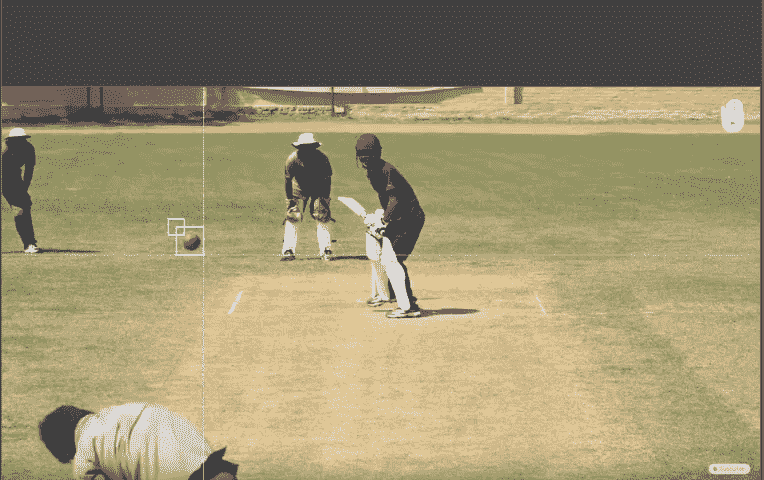
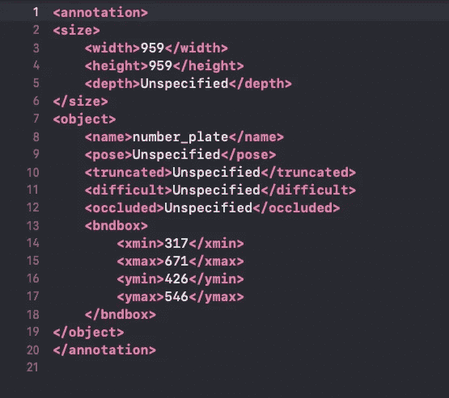

# 为对象检测任务获取正确的数据注释格式

> 原文：<https://medium.com/analytics-vidhya/getting-data-annotation-format-right-for-object-detection-tasks-f41b07eebbf5?source=collection_archive---------4----------------------->



在图像中标注板球以进行目标检测。图片取自[https://www.sikana.tv/en/sport/cricket#chapter-3_](https://www.sikana.tv/en/sport/cricket#chapter-3_)

如果你正在寻找方法来注释你的图像，并把它们传递给你的物体检测算法，那么这里有一个简短的阅读，告诉你如何正确处理。
我将用一个 YoloV3 注释格式作为例子来说明这个过程。我不会深入讨论 Yolo 如何工作的细节，但是你可以在这里[阅读](https://pjreddie.com/darknet/yolo/)

如果您想在 YoloV3 上训练自定义数据以检测图像中的对象，您需要首先注释(在感兴趣的对象周围标记或绘制边界框)您的自定义数据(图像)，然后将这些注释传递给模型以进行训练。

注释的格式是

```
**<class> <x> <y> <width> <height> 
ex: 0 0.25 0.44 0.5 0.8** class is the object class, (x,y) are centre coordinates of the bounding box. width, height represent width and height of the bounding box
```

有很多工具可以让你注释图像并导出到正确的格式。我用过 [RectLabel](https://rectlabel.com) ， [LabelMe](http://labelme.csail.mit.edu/Release3.0/) ，我个人选择的是[云注释](https://cloud.annotations.ai/login)(因为你可以如何将其与 IBM cloud 链接起来进行存储，并允许你的团队协作完成任务)。[这里](/analytics-vidhya/label-training-data-using-cloud-annotation-for-object-detection-7e8338573d35)是我写的一篇关于如何使用云注释来注释你的图片的帖子。
我还发现[这个](https://lionbridge.ai/articles/image-annotation-tools-for-computer-vision/)指南在从无数可用选项中选择工具时很有用。

这些工具中的大多数都允许您对图像进行注释，并直接以上面提到的 YoloV3 格式导出，但是有些工具以下面的格式导出 XML 文件，您必须将其转换为可接受的格式。



需要解析以转换为 Yolo 格式的 XML 格式

我发现下面这段 Python 代码在解析 XML 文件和转换成 YoloV3 注释格式时很有用。Python 有一个很酷的模块叫做 [xml.etree.ElementTree](https://docs.python.org/3/library/xml.etree.elementtree.html) 来解析和创建 xml 内容。我们的目标是读取宽度、高度、xmin、xmax、ymin 和 ymax 值，然后将它们转换为标准化的 x、y、宽度和高度。

```
**import xml.etree.ElementTree as ET
from pathlib import Path**path = 'your/path/to/the/xmlFiles
def parsethefile(listOfFiles):
    for myFile in listOfFiles.iterdir():
        filePath = myFile
        **parser = ET.XMLParser(encoding="utf-8")
        targetTree = ET.parse(filePath, parser=parser)
        rootTag = targetTree.getroot()**
        width = int(rootTag.getchildren()[2][0].text)
        height = int(rootTag.getchildren()[2][1].text)
        xmin = int(rootTag.getchildren()[3][1][0].text)
        xmax = int(rootTag.getchildren()[3][1][1].text)
        ymin = int(rootTag.getchildren()[3][1][2].text)
        ymax = int(rootTag.getchildren()[3][1][3].text)
        category = 0 
# Replace this with the class label of your objectparsethefile(Path(path))
convertLabels(xmin, ymin, xmax, ymax, height, width, category)
```

**转换为标准化值**
通常，标准化值是一个好主意，这样在网络上更容易，运行速度更快

```
def convertLabels(x1, y1, x2, y2, height, width, cat):
    def sorting(v1, v2):
        if v1 > v2:
            vmax, vmin = v1, v2
            return vmax, vmin
        else:
            vmax, vmin = v2, v1
            return vmax, vmin
    size = (height, width)
    xmax, xmin = sorting(x1, x2)
    ymax, ymin = sorting(y1, y2)
    dw = 1\. / size[1]
    dh = 1\. / size[0]
    x = (xmin + xmax) / 2.0
    y = (ymin + ymax) / 2.0
    w = xmax - xmin
    h = ymax - ymin
    x = x * dw
    w = w * dw
    y = y * dh
    h = h * dh
    return cat, x, y, w, hThis will return the required annotation format
```

我希望这有助于获得正确的图像注释，并训练您的对象检测算法。请留言，我会很乐意回复