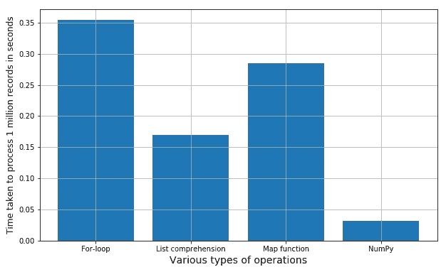

# 熟悉 Numpy

> 原文：<https://medium.com/analytics-vidhya/getting-familiar-with-numpy-854fc60ac497?source=collection_archive---------28----------------------->

在接下来的几分钟内，我们将覆盖 Numpy！每个机器学习从业者都必须熟悉的极其热门的核心科学计算 Python 库！


图片来源:【https://github.com/numpy/numpy.org/issues/37 

***NumPy***—***Num****erical****Py****thon*是一个流行的 Python 库，用于大型*多维数组*和*矩阵处理*，借助了大量的高级数学函数集合。

对于 ***机器学习*** 中的基础科学计算非常有用。对*线性代数*、*傅立叶变换*、*随机数能力*特别有用。像 ***TensorFlow*** 这样的高端库在内部使用 NumPy 对张量进行*操作。*

Numpy 使用了一种叫做“向量化”的东西。

***矢量化*** 是 Numpy 中的一项强大功能，可以将操作表达为发生在*整个数组*上，而不是发生在它们的*单个元素*上。

以下是韦斯·麦金尼*的简明定义——*

**“这种用数组表达式替换* ***显式循环*** *的做法，一般称为* ***矢量化*** *。一般来说，向量化数组运算往往会比它们的纯 Python 等价物***快一两个(或更多)数量级，在任何一种数值计算中都具有最大的影响”——*[*来源*](https://www.oreilly.com/library/view/python-for-data/9781449323592/ch04.html) *。***

*****为什么需要这个？*** 这基本上使得一个程序相对于一个普通程序运行起来*快很多*和*计算起来更简单*。**

> **下面的要点说明了这一点。**

****

**图片来源:Experfy —简单数学运算的相对执行速度**

> **因此，我们应该忘记循环，拥抱使用 Numpy 进行数据科学、机器和深度学习的矢量化:)**
> 
> **希望您充分利用了 Numpy 和矢量化，现在让我们快速使用 Numpy 吧！打开 Python 笔记本，在阅读的同时执行代码！**

# **Numpy 入门**

****Numpy 安装 ****

```
**pip install numpy**
```

***参考*[***numpy PyPI***](https://pypi.org/project/numpy/)*排除故障***

*****导入数字*****

```
**import numpy as np**
```

*****初始化数组*****

```
**n = np.array([1,2,3,4,5,6,7,8,9,10])
print(n)**Out:** 
[ 1  2  3  4  5  6  7  8  9 10]**
```

*****用随机整数生成 Numpy 数组*****

```
**n1 = np.random.randint(9,999,(4,5))
n1**Out:** 
array([[685, 904, 953, 322, 220],
       [919, 890, 581, 682, 154],
       [479, 749, 146, 430, 182],
       [330,  33, 930, 405, 329]])**
```

*****用随机浮点值创建 Numpy 数组*****

```
**n2 = np.random.uniform(9,90,[3,8])
n2**Out:** 
array([[61.00623473, 32.99151717, 82.36365056, 64.83039314, 85.97665935, 22.03596134, 42.82392491, 45.39703135],
      [46.262442, 28.94826025, 17.008214, 74.5860076, 41.018801,
30.99864407, 36.21946347, 40.80893724],
      [41.8882586 , 46.27282087, 24.57065243, 37.72429426, 68.97633365,40.8597184 , 39.99579792, 20.82462527]])**
```

*****用随机生成的复数创建 Numpy 数组*****

```
**n3 = np.random.random(10) + np.random.random(10)*1j 
n3 
*#a = np.array([10,20,40],dtype="complex")* 
*#print(a)***Out:** 
array([0.95684921+0.36194087j, 0.38534034+0.48054872j,
       0.80468821+0.44215539j, 0.85340675+0.96173861j,
       0.56802172+0.7995005j , 0.86488822+0.41566963j,
       0.36902005+0.03253745j, 0.69961173+0.97159714j,
       0.12345621+0.3942298j , 0.68082262+0.96007271j])**
```

*****打印 Numpy 数组的形状、尺寸和大小*****

```
**print(n1.shape, n1.ndim, n1.size)
print(n2.shape, n2.ndim, n2.size)
print(n3.shape, n3.ndim, n3.size)

C = np.random.randint(1,100,(4,4))
print(C)
print(C.shape)
print(C.ndim)
print(C.size)**Out:** 
(4, 5) 2 20
(3, 8) 2 24
(10,) 1 10
[[59 79 38 30]
 [55 61 20 20]
 [33 98 59 38]
 [ 4 99 22 85]]
(4, 4)
2
16**
```

*****type(NP _ array)给出什么？*****

```
**type(n1)**Out:**
numpy.ndarray**
```

*****整形*****

```
**A = np.arange(16)
print(A)
print(A.shape)
print(A.reshape(2,8))
print(A.reshape(4,4))**Out:**
[ 0  1  2  3  4  5  6  7  8  9 10 11 12 13 14 15]
(16,)
[[ 0  1  2  3  4  5  6  7]
 [ 8  9 10 11 12 13 14 15]]
[[ 0  1  2  3]
 [ 4  5  6  7]
 [ 8  9 10 11]
 [12 13 14 15]]**
```

*****两个矩阵的加法*****

```
**a = np.random.randint(1,100,(4,5))
b = np.random.randint(1,100,(4,5))
print("A =\n",a)
print("\nB =\n",b)
print("\nA+B =\n",a+b)
*#np.add(a,b)***Out:**
A =
 [[66  3  4 30 88]
 [65 23 88 32 34]
 [69 61 85 93 37]
 [36 36 77  9 47]]

B =
 [[20 31 94 31 30]
 [31 95 72 14 94]
 [26 84 62 76 59]
 [53 60 37 74 86]]

A+B =
 [[ 86  34  98  61 118]
 [ 96 118 160  46 128]
 [ 95 145 147 169  96]
 [ 89  96 114  83 133]]**
```

*****矩阵的转置*****

```
**print(a)
print("\nTranspose of A =\n",a.T)
*#print(a.transpose())*
print("\nDouble Tranpose of A = A\n",(a.T).T)**Out:**
[[66  3  4 30 88]
 [65 23 88 32 34]
 [69 61 85 93 37]
 [36 36 77  9 47]]Transpose of A =
 [[66 65 69 36]
 [ 3 23 61 36]
 [ 4 88 85 77]
 [30 32 93  9]
 [88 34 37 47]]

Double Tranpose of A = A
 [[66  3  4 30 88]
 [65 23 88 32 34]
 [69 61 85 93 37]
 [36 36 77  9 47]]**
```

*****点积*****

```
**m1 = np.array([[1,2],[3,4]])
m2 = np.array([[5,6],[7,8]])
np.dot(m1,m2)**Out:**
array([[19, 22],
       [43, 50]])**
```

*****元素乘*****

```
**np.multiply(55,2)
x1 = np.arange(9).reshape(3,3)
x2 = np.arange(3)
print("X1 =\n",x1)
print("\nX2 =\n",x2)
print("\nElement wise Multiplication =\n",np.multiply(x1,x2))
*#print(x1*x2)***Out:**
X1 =
 [[0 1 2]
 [3 4 5]
 [6 7 8]]X2 =
 [0 1 2]

Element wise Multiplication =
 [[ 0  1  4]
 [ 0  4 10]
 [ 0  7 16]]
[[ 0  1  4]
 [ 0  4 10]
 [ 0  7 16]]**
```

*****访问矩阵元素—行和列*****

```
**z = np.arange(16).reshape(4,4)
print(z)
print(z[0,1]) *#Element - First Row Second Column*
print(z[1,3]) *#Element - Second Row Fourth Column*
print(z[-1,-1]) *#Element - Last Row Last Column***Out:**
[[ 0  1  2  3]
 [ 4  5  6  7]
 [ 8  9 10 11]
 [12 13 14 15]]
1
7
15z1 = np.arange(27).reshape(3,3,3)
print(z1)
print(z1[0,1,2]) *#Third Element of Second Array of First Array***Out:**
[[[ 0  1  2]
  [ 3  4  5]
  [ 6  7  8]]

 [[ 9 10 11]
  [12 13 14]
  [15 16 17]]

 [[18 19 20]
  [21 22 23]
  [24 25 26]]]
5**
```

*****切片*****

```
**print(p)
print(p[2:,2:])
p1 = np.random.randint(10,200,(5,5))
print(p1)
print(p1[:-2,:-2])
p2 = np.arange(10).reshape(2,5)
print(p2)
print(p2[1,1:4])
*#print(p2[0:2,2])***Out:** [[102  18  48  70  91]
 [ 11  72  97  75 189]
 [ 27  67 161 181  60]
 [120 111  57 101  61]
 [ 81 122 148 109  85]]
[[161 181  60]
 [ 57 101  61]
 [148 109  85]]
[[171 184 111 146 159]
 [141 151  53 176 154]
 [ 31 197 139 112 180]
 [ 97  77  78  41 158]
 [ 36 145 140  81 145]]
[[171 184 111]
 [141 151  53]
 [ 31 197 139]]
[[0 1 2 3 4]
 [5 6 7 8 9]]
[6 7 8]z1 = np.arange(10)
print(z1)
print(z1[4:])
*#print(z1[:4])*
*#print(z1[-3:-1])*
*#print(z1[1:5:2])*
*#print(z1[::2])***Out:** [0 1 2 3 4 5 6 7 8 9]
[4 5 6 7 8 9]**
```

*****换向*****

```
**R = np.random.randint(1,30,(4,4))
print(R)
R = R[::-1]
print(R)
R1 = np.array([1,2,3,4,5,6,7])
R1 = R1[::-1]
print(R1)**Out:**
[[12 29  4 21]
 [16  9 20 15]
 [18  9  7  9]
 [11 18 27  1]]
[[11 18 27  1]
 [18  9  7  9]
 [16  9 20 15]
 [12 29  4 21]]
[7 6 5 4 3 2 1]**
```

*****通过 URL 下载数据并导入 Numpy 数组*****

```
**from numpy import genfromtxt
N = genfromtxt('https://ndownloader.figshare.com/files/12707792', delimiter=',')
print(type(N))
print(N)
print(N[1])**Out:** <class 'numpy.ndarray'>
[[ 1.07  0.44  1.5   0.2   3.2   1.18  0.09  1.44  1.52  2.44  0.78  0.02]
 [ 0.27  1.13  1.72  4.14  2.66  0.61  1.03  1.4  18.16  2.24  0.29  0.5 ]]
[ 0.27  1.13  1.72  4.14  2.66  0.61  1.03  1.4  18.16  2.24  0.29  0.5 ]**
```

*****沿特定轴对数组排序*****

```
**arr = np.random.rand(5,5)
#sort along the row
arr.sort(axis=0)
print(arr)**Out:** [[0.32367677 0.160538   0.07577069 0.02051216 0.23410999]
 [0.54927129 0.20910696 0.2196075  0.22756129 0.67417506]
 [0.63553217 0.56279363 0.62776371 0.32657277 0.79901529]
 [0.7183594  0.69288395 0.70838123 0.52581954 0.96520237]
 [0.81701677 0.79908087 0.98800108 0.54773388 0.97694313]]*#sort along the column*
print(np.sort(arr, axis=1))**Out:** [[0.02051216 0.07577069 0.160538   0.23410999 0.32367677]
 [0.20910696 0.2196075  0.22756129 0.54927129 0.67417506]
 [0.32657277 0.56279363 0.62776371 0.63553217 0.79901529]
 [0.52581954 0.69288395 0.70838123 0.7183594  0.96520237]
 [0.54773388 0.79908087 0.81701677 0.97694313 0.98800108]]**
```

*****【arg sort】函数*****

```
**arr = np.random.rand(5,5)
*#along the row* 
print(np.argsort(arr, axis=0))**Out:** [[1 1 2 2 0]
 [2 2 1 3 2]
 [0 4 0 1 4]
 [4 3 3 0 3]
 [3 0 4 4 1]]*#along the column*
print(np.argsort(arr, axis=1))**Out:** [[4 3 2 0 1]
 [0 3 1 2 4]
 [3 2 4 0 1]
 [3 4 0 1 2]
 [4 0 1 2 3]]*#if axis=None, return the indices of a flattened array* print(np.argsort(arr, axis=None))**Out:** [13 12 5 18 4 8 6 7 14 3 10 24 2 11 0 19 20 21 9 15 16 17 22 1 23]**
```

*****查找 Numpy 数组中的元素*****

```
**arr = np.array([1, 2, 3, 4, 5, 4, 4])
x = np.where(arr == 4)
print(x)**Out:**
(array([3, 5, 6]),)**
```

*****拼接和拆分 Numpy 数组*****

```
**#joining 
arr1 = np.array([1, 2, 3])
arr2 = np.array([4, 5, 6])
arr = np.concatenate((arr1, arr2))
print(arr)**Out:**
[1 2 3 4 5 6]#splitting
arr = np.array([1, 2, 3, 4, 5, 6])
newarr = np.array_split(arr, 3)
print(newarr)**Out:** [array([1, 2]), array([3, 4]), array([5, 6])]**
```

> **我知道一下子很难接受。但是你坚持到了最后！恭喜你。**

***还有，别忘了通过****——***[***NumPy 文档***](https://numpy.org/doc/)**

***完整代码请访问—***

**[*https://Gist . github . com/tanvipenumudy/71 D4 bccef 08d 018 b 37 Fe 4a 97272 b 342 f*](https://gist.github.com/tanvipenumudy/71d4bccef08d018b37fe4a97272b342f)****(初始代码 Gist)******

*****上半年实现:*****

**[](https://github.com/tanvipenumudy/Winter-Internship-Internity/blob/main/Day%2002/Day-2%20Notebook-1.ipynb) [## tanvipenumudy/Winter-实习-实习

### 存储库跟踪每天分配的工作-tanvipenumudy/Winter-实习-实习

github.com](https://github.com/tanvipenumudy/Winter-Internship-Internity/blob/main/Day%2002/Day-2%20Notebook-1.ipynb) 

***后半段实现:***

[](https://github.com/tanvipenumudy/Winter-Internship-Internity/blob/main/Day%2002/Day-2%20Notebook-2.ipynb) [## tanvipenumudy/Winter-实习-实习

### 存储库跟踪每天分配的工作-tanvipenumudy/Winter-实习-实习

github.com](https://github.com/tanvipenumudy/Winter-Internship-Internity/blob/main/Day%2002/Day-2%20Notebook-2.ipynb)**