# 在火花三角洲湖弄脏手

> 原文：<https://medium.com/analytics-vidhya/getting-hands-dirty-in-spark-delta-lake-1963921e4de6?source=collection_archive---------0----------------------->

## 从亲身体验中了解三角洲湖的世界

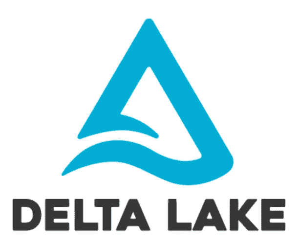

嘿伙计们，

这是我文章的第二部分，我在文章中概述了 Delta Lake 及其使用案例，如果您碰巧直接来到这里，请阅读我的第一篇文章以了解一些背景。这是链接

[](/@merchantabid4/spark-delta-lake-d05dd480287a) [## 火花三角洲湖

### 嘿伙计们，

medium.com](/@merchantabid4/spark-delta-lake-d05dd480287a) 

因此，在本文中，我们将介绍 Delta Lake 所做的令人惊叹的工作，代码在 Pyspark 中。首先，让我们看看如何让三角洲湖出火花笔记本。

```
pip install --upgrade pysparkpyspark --packages io.delta:delta-core_2.11:0.4.0
```

如果你已经有一个升级的 spark，第一个命令是不必要的，第二个命令将启动我们的 pyspark shell 和 Delta 包，瞧！安装部分没有更多的事情要做。请注意，Delta lake 所需的最低 Spark 版本是 Spark 2.4.2。

因此，根据我以前的文章，三角洲湖给我们带来了以下重要的业务:

*   架构实施
*   数据湖上的 ACID 事务
*   时间旅行能力

我们将逐一介绍这些功能，首先让我们了解模式实施。

# 架构实施

正如我所说的，Delta Lake 遵循“写时模式”,所以写时模式的任何变化都将被跟踪，任何差异都将在那时引发异常。下面的代码将制作一个由 1-5 个数字组成的数据帧，我们将把它写成一个增量表。

```
data = spark.range(1,5)
data.write.format("delta").mode("overwrite").save("/mnt/data/delta_sample")
```

让我们签出输出文件

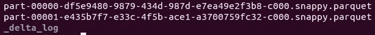

你可以看到写格式是拼花地板。维护一个包含所有交易日志的日志文件。日志文件是一个 JSON 文件，其中包含关于在数据集上执行的操作的元数据，该日志文件将首先由 spark 读取，而不是直接读取零件文件。

现在，我将创建一个数字为 5-10 的数据帧，并将它的数据类型指定为字符串，并尝试将数据集追加到我们现有的数据集上。

```
import pyspark.sql.functions as fn
new_data = spark.range(5,10)
new_data = new_data.withColumn("id",fn.col("id").cast("String"))
new_data.write.format("delta").mode("append").save("/mnt/data/delta_sample")
```

执行下面的代码片段导致我犯了一个错误，其中提到:

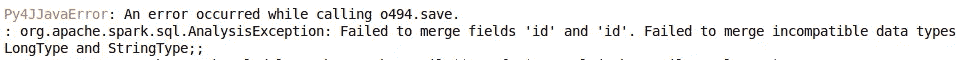

因此，Delta lake 阻止了不正确的数据进入我们的 delta Lake，而且在将我的列名从“id”改为“id1”时，我得到了另一个异常。因此，作为一个整体，在写入任何现有数据集时，不允许任何更改。最后，我将用正确的模式追加数据集。

```
new_data = spark.range(5,10)
new_data.write.format("delta").mode("append").save("/mnt/data/delta_sample")
```

现在，我的数据集包含以下文件:

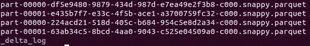

让我们看一下日志文件:

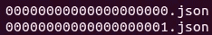

因此，当我写入数据集时，会生成新的日志文件，该日志文件包含以下内容:

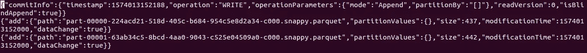

它指示 spark 添加新写入数据集的零件文件以及指定信息，如写入模式和修改时间。

因此，这就是写入模式的实施方式和 Delta Lake 表的工作方式。现在，我们将深入了解 Spark 中的合并、更新和删除操作。

# 删除

现在，在执行删除操作之前，让我们读取 Delta 格式的表，我们将读取刚刚写入的数据集。遵循下面的代码行。

```
from delta.tables import *delta_df = DeltaTable.forPath(spark, "/mnt/data/delta")
```

Delta_df 属于 Delta table 类型，我们不能对其执行 spark 数据帧操作，但可以通过 delta_df.toDF()操作将其转换为 Spark 数据帧。

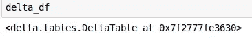

现在，我们将删除 id≤2 的数据。

```
delta_df.delete("id<=2")
```

就是这样，增量表是 ***自动刷新*** ，我们在这里对数据做的任何更改都会直接反映到我们的数据集中。所以，就在执行上述删除操作之后，另一个会话上的某人读取我们的数据集将不会找到 id≤2。删除后，又创建了一个提交日志，让我们检查一下提交日志是如何为删除操作编写的。

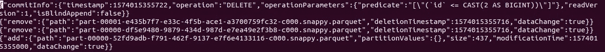

它指导 spark 通过 remove 删除原始零件文件，然后添加谓词为 id≤2 的新零件文件，即使指定了执行的操作(删除)。因此，提交日志是详尽的，并且是我们数据集的所有元数据的一站式服务。现在，我们将对数据集进行更新。

# 更新

现在，在这一部分中，我们将尝试对数据进行更新操作。我们将再次读取数据集，并将值从 5 更新到 500。签出更新操作的代码段

```
delta_df = DeltaTable.forPath(spark, "/mnt/data/delta")
delta_df.update(condition = "id = 5", set = { "id": "500" })\
```

上面的操作将 id 设置为 500，其中 id 为 5，更不用说当增量表自动刷新时，数据被更新。正如你所看到的，语法非常简单，即使是外行也能一目了然。所以，我们进行最后的合并操作。

# 合并

现在，我们将在增量表上执行合并操作。在执行合并之前，我将读取一个包含国家、年份和温度列的新数据集，并将它写成一个增量表。

```
df = spark.read.csv("/mnt/data/dataset", inferSchema=True, sep=',', header=True)df.write.format("delta").save("/mnt/data/delta_merge")
```

我们的增量表包含以下数据…

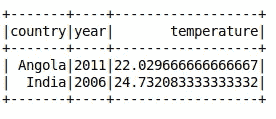

现在，我们有增量馈送，它必须合并到 Spark 数据帧中的增量表中，数据是…

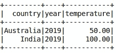

我们收到了 2 个新记录，其中*澳大利亚*将被添加，而*印度*将被合并到我们的增量表中。

```
delta_merge.alias("delta_merge").merge(
    updatesDf.alias("updates"),
    "delta_merge.country = updates.country") \
  .whenMatchedUpdate(set = { 
        "temperature" : "updates.temperature",
        "year" : "updates.year"
  } ) \
  .whenNotMatchedInsert(values =
    {
      "country": "updates.country",
      "year": "updates.year",
      "temperature": "updates.temperature"
    }
  ) \
  .execute()
```

merge 语法非常类似于 Hive 中的 merge 语法。首先，我们给我们的表 table 一个别名“delta_merge ”,给我们的 Spark 数据帧一个别名“updates”。现在，当国家列在两个数据集中匹配时，我们将把温度和年份列从 Spark Dataframe 更新到我们的 Delta Lake，当不匹配时，我们将把所有列插入到我们的 Delta Lake 中，这很简单，不是吗！

最终合并的记录将看起来像…

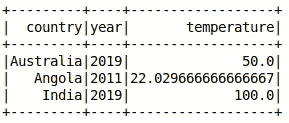

因此，印度的温度更新为 100.0，年份更新为 2019 年，这就是合并操作的全部内容。

# 时间旅行

这是三角洲湖最凉爽的部分。正如我在第一篇文章中解释的那样，使用 Delta Lake，我们将能够维护数据集的不同版本，并且可以在需要时重用。在这一节中，我们将进一步了解如何获得数据集的不同版本。

在解释如何获取任何版本的数据之前，首先我将向您展示如何知道我必须获取哪个版本的数据，但是我如何知道我上次更新数据的时间、我更新了什么以及实际创建了多少个版本？要知道，Delta 表维护了一个历史记录，可以通过调用 history()方法获得，该方法将返回一个 Spark 数据帧，这样我们就可以查询它并知道我们想要获得的版本。历史数据将看起来像:

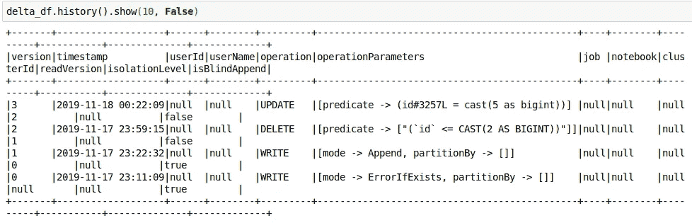

因此，如您所见，它包含了我们理解数据操作所需的每个细节。现在，我将读取我们最初创建的数据集，它只包含一个由数字组成的列“id”。我们摆弄了那个数据集，但在这么做的同时，我们所有的活动都被跟踪了，没有任何东西被德尔塔湖发现。事不宜迟，我将读取数据集。

```
delta_df = DeltaTable.forPath(spark, "/mnt/data/delta")
```

我们数据集的最终版本包含:

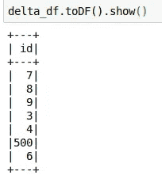

现在，我将获取“版本 1”的数据集，如历史表所示，我们已将数据追加到现有的数据集，如果您能回想一下，我们已将 5–10 个数字追加到我们的数据集。现在，让我们将这些数据放入 Spark 数据框中:

```
version_1 = spark.read.format("delta").option("versionAsOf",1).load("/mnt/data/delta")
```

这将为我们提供 Spark Dataframe 中从 0 到 9 的数据，您可以指定您想要的版本，并让您丢失的宝宝回到婴儿车中玩耍。

除了这些，Delta Lake 的一个更重要的特性是在一段时间后删除旧版本数据。因为，我们不希望我们的存储系统在一段时间后爆炸。为此，我们有一个名为 vacuum()的函数，它会递归地删除表中不需要的文件和目录，以便将旧版本保持到给定的保留阈值。该方法将在成功完成时返回一个空数据帧。

```
deltaTable**.**vacuum**()**     *# vacuum files not required by versions more than 7 days old*

deltaTable**.**vacuum**(100)**  *# vacuum files not required by versions more than 100 hours old*
```

所以，这就是所有的乡亲，希望你发现我的文章有帮助。

如果你想核实我写的是真的:请找到下面的链接供你参考。

 [## 欢迎来到 Delta Lake 的 Python 文档页面- delta-core 0.4.0 文档

### 用于以编程方式与增量表交互的主类。您可以使用以下路径创建 DeltaTable 实例…

文档增量 io](https://docs.delta.io/0.4.0/api/python/index.html)  [## 表删除、更新和合并

### Delta Lake 支持几个语句，以便于从 Delta 表中删除和更新数据。你可以…

docs.databricks.com](https://docs.databricks.com/delta/delta-update.html)