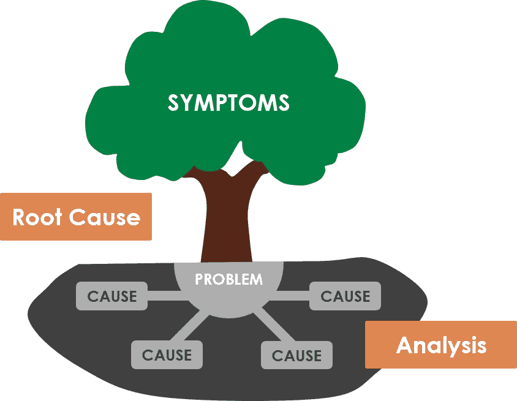
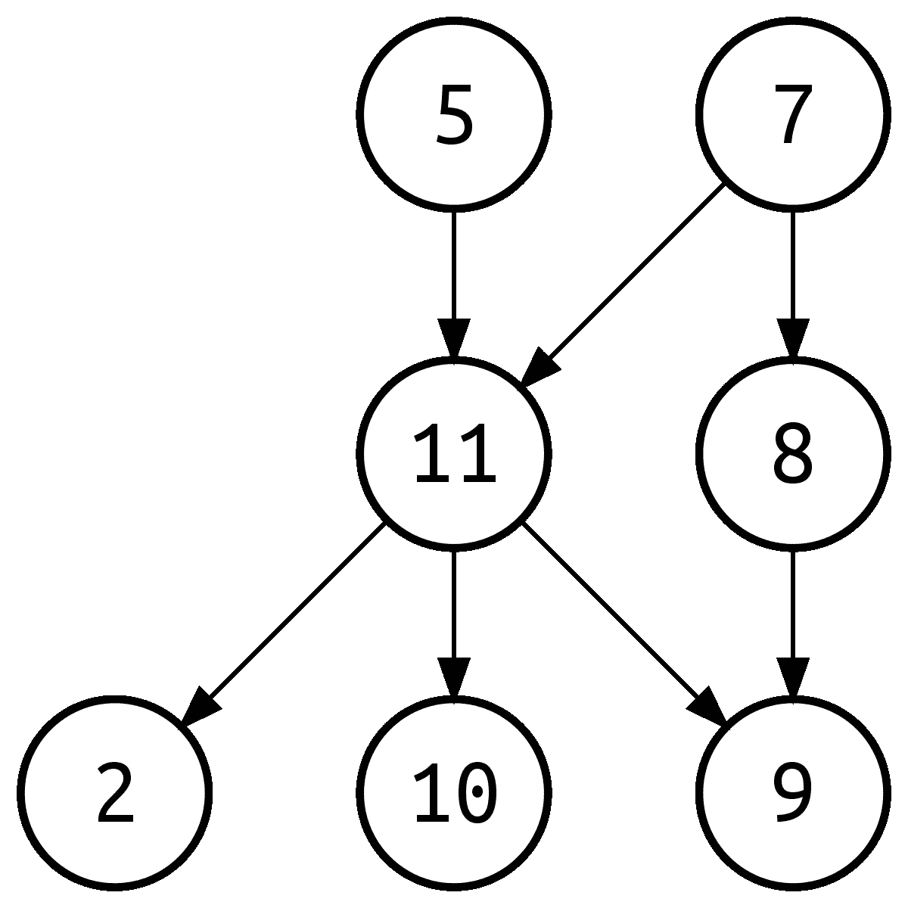

# 使用(基本)机器学习从生产警报中获得洞察力

> 原文：<https://medium.com/analytics-vidhya/getting-insights-from-production-alerts-using-basic-machine-learning-44dd805d899?source=collection_archive---------8----------------------->


许多科技公司都有外部监控工具来帮助他们获得关于生产环境中发生的问题的通知。

然而不幸的是，不同错误之间的联系通常是由经验而不是实际研究来定义的，因此导致优先级定义不佳，并使缓解过程效率较低。

一些流行的监控工具有 OpsGenie、Victor-Ops 和 Pager-Duty。
(这将是一个很好的时机来澄清以上没有一个赞助本文的人)。

在本文中，我将分析来自 OpsGenie 的警报，因为我有机会使用它，但这无关紧要，因为稍加调整，任何其他监视工具都可以用作警报数据源。



# 首先，我们如何确定哪个错误导致了另一个错误？

有几种方法可以做到这一点，我们将探索一个简单的机器学习算法称为关联规则。

算法实现我就不深究了，请参考这里理解算法的逻辑(并不复杂):

[关联-规则-维基](https://en.wikipedia.org/wiki/Association_rule_learning)

Let׳s 通过一个例子说明了这种算法的使用。
在超市中组织产品——输入将是一个类似如下的数据集:

```
**transaction_id, name, groceries** 1, John,{potato, onion}
2, John,{cucumber, tomato}
3, Don, {lettuce, onion}
```

输出将是一起购买的产品(有一定的可能性)。
所以，如果我们能知道大多数时候人们买土豆的同时也会买汉堡，我们会把它们放在一起。

## 了解了这个方法的用法之后，我们该如何使用它来达到我们的目的呢？


通常，如果引发另一个警报的生产警报被触发，该另一个警报也会在不久的将来被触发。
也就是说，我们需要创建警报数据集，使算法能够为我们提供有意义的连接，这些连接是由警报的时间戳得出的。

让我们看一个所需警报数据集的示例

```
**alert_name,ts**
alert_a, 22/01/2020:16:20
alert_b, 22/01/2020:17:20
alert_a, 22/02/2019:14:20
…
```

在这种情况下，我们将使用时间戳连接不同的警报，并将其输入到算法中，以便它可以生成相关警报之间的连接，类似于它如何在相关产品之间创建连接。
只有在这个例子中，连接是一个单一的购买者——一个交易 id，在这个例子中，有一个时段连接(例如，在 30 分钟范围内触发的所有警报都属于同一个交易)。

算法的输出看起来会像这样-

```
**alert_a, alert_b, confidence a->b, conf b->a**
alert_a, alert_b, 0.8, 0.2
alert_c, alert_b, 0.1,0.7
alert_a, alert_c, 0.8, 0.3
…
```

任何一个运营团队的成员或者任何一个正在处理生产错误的专业人士(大多数创业公司都没有运营团队)都可以在这些结果中发现很多价值，并相应地设置警报的优先级。

我们流程的最后一个阶段是将结果建模为图表。
由于我们想要了解不同错误之间的根源和原因，以这种方式显示我们的结果将允许我们了解警报之间的路径，该错误影响许多其他错误(图中的许多邻居)等等。

这可以通过简单地将每个唯一的错误名称声明为一个顶点，并在以足够高的概率**导致另一个错误的任何警报之间添加一条边来实现。** 这将是一个有向图(否则我们不会知道根源和原因是什么)。

*   可视化图表的一个好方法是将每个误差表示为一个数字。
    (您可以将权重添加到边缘，作为一个警报引起另一个警报的概率)。



# 那么如何在实践中运用呢？

在文章的最后，有一个到我的 GitHub 的链接，其中包含从 OpsGenie 获取警报的脚本，以及使用 Spark 的算法实现。


> 有两种方法可以让你快速产生相关的错误—

*   在我看来(在准确性和效率方面)，首选是使用 Spark FPGrowth 算法。网上有很多信息，使用起来非常简单。
    请注意，我用于获取警报的脚本不会针对该算法正确组织数据，因为它期望每行代表一个完整的事务。
    您可以在时间窗口中组织警报，也就是说，假设您已经决定一个事务由一个小时组成。
    然后，您将从一个给定的时间(例如三个月前)开始，然后滑入一个时间窗口(例如两分钟)，并根据检查的小时数生成一条交易线。
    即使多行包含相同的错误，您也不会(几乎)错过两个不同错误之间的联系。
*   第二种方式是使用我的代码，这意味着您需要像在第一个示例中看到的那样组织它将使用的数据(alert_name，ts)。
    如前所述，您可以使用我的代码从 OpsGenie 获取警报(您需要提供一个 API 密钥),它会正确地安排数据。
*   重要提示—代码写得又快又难看

我希望你能从这篇文章中受益，
如果你把它作为一个资源使用，我将非常感谢收到任何评论和用例，也可以随时联系任何技术/其他问题。

*   [Github 资源库链接](https://github.com/royashcenazi/spark_and_stuff)
*   如果你需要将算法输出转换成可视化图形的帮助，有一个很好的 Python 库叫做 networkx(还有很多其他的)
    有任何问题随时联系我。

*我可以在这里联系到

> 感谢阅读！