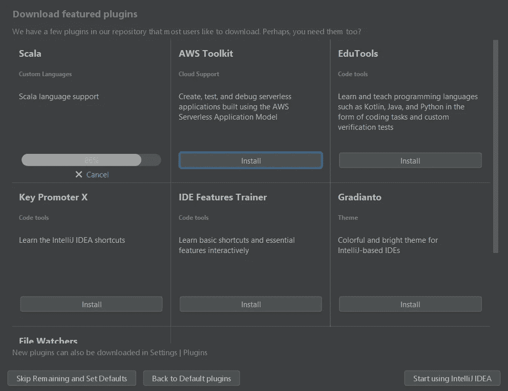
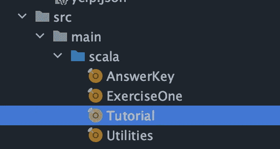

# 开始使用 IntelliJ、Git、Java 和 Apache Spark

> 原文：<https://medium.com/analytics-vidhya/getting-set-up-with-intellij-git-java-and-apache-spark-c6b6272dc3c0?source=collection_archive---------3----------------------->

来源:[https://www.vecteezy.com/free-vector/data-engineer](https://www.vecteezy.com/free-vector/data-engineer)

装置。一听到这个词，恐惧就开始袭来。

**但是等一下……在你把电脑扔到房间的另一头之前，让我们看看我们是否能一起做到这一点。**

来源:[https://www . Reddit . com/r/reaction ifs/comments/2 vr1 uf/mrw _ document 1 _ word _ not _ responding/](https://www.reddit.com/r/reactiongifs/comments/2vr1uf/mrw_document1_word_not_responding/)

# 设置 IntelliJ

让我们用一个简单的来热身。IntelliJ 是一个集成开发环境(IDE ),它将为您提供一个用于数据工程的优秀用户界面。

我建议从社区版开始。它是免费的，并且拥有您开始一些数据工程项目所需的所有功能。在这里下载 IntelliJ:[https://www.jetbrains.com/idea/download](https://www.jetbrains.com/idea/download)

点击下载，你应该看到它开始安装。

点击下一步通过几个默认选项，在某一点上，你会被要求选择你的主题。你可以选择光明或黑暗，不要担心你可以随时改变！

# 重要！确保添加 Scala 插件

Scala 将是我们用来编写 Spark 应用程序的语言。这个插件增加了一些内置功能，使得学习 Apache Spark 和 Scala 对初学者更加友好。

就是这样！你可以走了。您应该会看到如下欢迎消息:

# 设置 Git

在您的计算机上安装 Git 之前，让我们先运行一个快速测试，看看您是否已经安装了它。打开终端(如果使用 Mac)或命令提示符(如果使用 Windows)。如果您以前从未使用过它们，您可以在您的计算机上搜索它们。

打开终端后，输入:`git --version`。如果你已经安装了 git，它会打印出类似于`git version 2.21.1`的东西。如果没有，不用担心，这就是这篇教程的目的！

**Windows 和 Mac 用户会有不同的步骤，因此请遵循适用于您的步骤。**

## Windows 用户:

1.  下载 Git:[https://git-scm.com/downloads/](https://git-scm.com/downloads/)。确保单击下载部分下的 Windows。
2.  点击下载完成后，你应该会看到一个安装程序弹出。您将在`C:\Program Files\Git`下安装 Git。这是默认设置，因此您不必做任何更改。

3.在前进的道路上，你的每一步都会有多种选择。点击“下一步”，然后**接受您看到的默认选项**。下面是几个例子:

4.编辑您的系统环境变量。这将是在 Windows 上配置 git 的关键一步。要找到这些，在你的 windows 搜索栏中键入编辑系统环境变量。您应该会看到这个弹出窗口。

5.单击路径，将其突出显示为蓝色，然后单击编辑。

6.在此添加两条新路径。单击“新建”并键入以下两个路径:

`C:\Program Files\Git\bin\`

`C:\Program Files\Git\cmd\`

7.点击“确定”就完成了！现在关闭命令提示符并重新打开。键入`git --version`，你应该会看到类似`git version 2.28.0.windows.1`的内容

## **Mac 用户**

1.  在 IntelliJ 的欢迎屏幕中，单击“从版本控制获取”您将收到一个通知，提示“git”命令需要命令行开发工具。**点击安装。**

2.等待安装完成后(可能需要几分钟)，您应该可以开始了！点击 **Command + Space** 打开终端，打开 Spotlight，搜索终端。

3.在终端中，键入`git --version`。如果成功，您应该会看到如下内容:`git version 2.21.1 (Apple Git-122.3)`

# 设置 Java

与 Git 类似，您可以通过键入`java --version`来检查您是否已经安装了 Java。对于 Apache Spark，我们将使用 Java 11 和 Scala 2.12。如果您没有安装 Java 11，请按照下列步骤操作:

## Windows 用户

1.  导航到 Oracle 的 Java 11 下载:[https://www . Oracle . com/Java/technologies/javase-JDK 11-downloads . html](https://www.oracle.com/java/technologies/javase-jdk11-downloads.html)
2.  单击下载 Windows x64 安装程序。它将是一个. exe 文件。

3.接受 Oracle 协议后，系统会提示您创建一个 Oracle 帐户。

4.创建您的 oracle 帐户以便下载 Java 11。除非您创建一个帐户，否则 Oracle 不会让您下载。

5.完成您的帐户后，您可能需要再次点击[https://www . Oracle . com/Java/technologies/javase-JDK 11-downloads . html](https://www.oracle.com/java/technologies/javase-jdk11-downloads.html)Windows x64 安装程序。现在它应该允许您下载。exe 文件复制到您的计算机上。

6.在默认步骤中单击“下一步”,直到您看到 Java 11 已成功安装。

7.搜索“编辑系统环境变量”,如 Windows 的 Git 设置部分所示。

8.在“用户变量”下，单击“新建”将 JAVA_HOME 作为变量添加到您的路径:`C:\Program Files\Java\jdk-11.0.8`

9.单击“路径”将其突出显示为蓝色，然后单击“编辑”

10.在此添加一个新路径。单击“新建”并键入:

`%JAVA_HOME%\bin`

**注意你下载的是哪个版本。我示例中的 11.0.8 可能会根据您的版本而有所变化。**

10.打开一个新的命令提示符，键入`java --version`。您现在应该看到 java 11.0.8 弹出来了。祝贺您设置了 Java！

## Mac 用户

1.  导航到 Oracle 的 Java 11 下载:[https://www . Oracle . com/Java/technologies/javase-JDK 11-downloads . html](https://www.oracle.com/java/technologies/javase-jdk11-downloads.html)
2.  点击 macOS 安装程序的下载，它将是一个. dmg 文件。

3.接受 Oracle 协议后，系统会提示您创建一个 Oracle 帐户。

4.创建您的 oracle 帐户以便下载 Java 11。除非您创建帐户，否则 Oracle 不会让您下载。

5.完成帐户后，您可能需要再次点击[https://www . Oracle . com/Java/technologies/javase-JDK 11-downloads . html](https://www.oracle.com/java/technologies/javase-jdk11-downloads.html)MAC OS 安装程序。现在它应该允许您下载。dmg 文件到你的电脑。

6.单击打开下载，并继续完成 JDK 11.0.8 安装程序。

7.打开一个终端，输入:`java --version`。你现在应该看到`Java SE 11.0.8`。你都准备好了！

# **使用 Apache Spark 进行设置**

我们在最后冲刺阶段！让我们以您的第一个 Apache Spark 程序结束吧。

1.  在一个新标签页，调出你的 GitHub 账户。如果您还没有，现在是开始跟踪您的数据工程进展的最佳时机。如果你没有 GitHub 帐号，在这里创建一个:[https://github.com/](https://github.com/)
2.  导航到[https://github.com/nickrafferty78/Apache-Spark-Is-Fun](https://github.com/nickrafferty78/Apache-Spark-Is-Fun)并派生存储库。
3.  在您的存储库中，单击 Code 并复制下面弹出的 URL。

4.导航到要存储项目的新文件夹。对于这个例子，在 Documents 下，我创建了一个名为 temp 的文件夹。键入以下命令:`git clone [https://github.com/nickrafferty78/Apache-Spark-Is-Fun.git](https://github.com/nickrafferty78/Apache-Spark-Is-Fun.git)`

5.打开 IntelliJ 并点击“打开”导航到您刚刚克隆存储库的文件夹，然后单击“确定”

6.在 IntelliJ 的左上角，单击项目上的下拉列表，然后单击项目文件。

7.导航到 src/main/scala/Tutorial。

8.您将看到一个弹出窗口，显示“JDK 项目未定义”点击“设置 JDK”确保你没有点击下载 JDK 或添加 JDK。相反，您将点击检测到的 SDK 的链接，将 Java 11 设置为您的项目版本。

9.点击后，请耐心等待，因为这将需要几分钟的索引。您可以从 IntelliJ 底部的进度条检查状态。

10.您现在应该能够运行您的第一个 Spark 程序了！在 src/main/scala/Tutorial 目录中点击显示在`object Tutorial extends App {`旁边的绿色 play 按钮。

## 给 Windows 用户的最后一个提示

你还有一步！如果您运行这个程序，您可能会看到一个错误，显示:`Filed to locate the winutils binary in the hadoop binary path`。

要解决这个问题，您需要遵循以下步骤:

1.  从[http://public-repo-1 . Horton works . com/HDP-win-alpha/winutils . exe 下载 winutils.exe](http://public-repo-1.hortonworks.com/hdp-win-alpha/winutils.exe)
2.  创建一个新文件夹来存储它。在我的例子中，我使用了`C:\winutils\bin`(文件 winutils.exe 放在 winutils 文件夹中嵌套的 bin 文件夹中)
3.  将`winutils.exe`移动到你刚刚创建的文件夹中:`C:\winutils\bin`
4.  回到 IntelliJ，让我们设置您的 Hadoop 主目录。将这行代码添加到`object Tutorial extends App {`下

`System.setProperty("hadoop.home.dir", "C:\winutils")`

# 你完了！

来源: [nbctv . Tumblr . com/post/60082868678/work-hard-or-hardly-work-we-hope-its](http://nbctv.tumblr.com/post/60082868678/working-hard-or-hardly-working-we-hope-its-the)

您刚刚完成了数据工程所需的所有设置！随意举办一个小型的办公室主题舞会🎉

# 继续学习

通过我的系列继续学习 Apache Spark:[Apache Spark 好玩！](/@nickrafferty78/apache-spark-is-fun-eadcaf141c02)

 [## 阿帕奇 Spark 很好玩！

### Spark 数据框架实践教程。

medium.com](/@nickrafferty78/apache-spark-is-fun-eadcaf141c02)