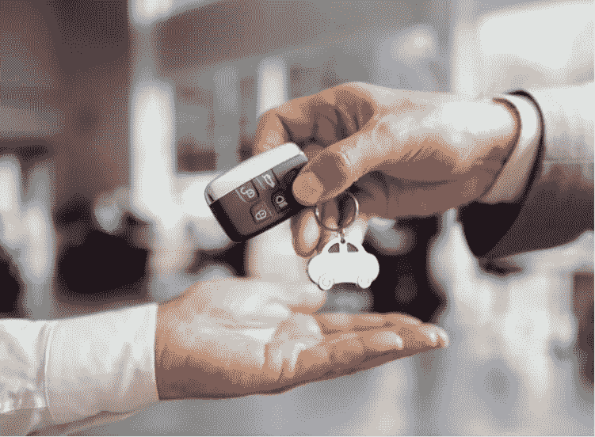
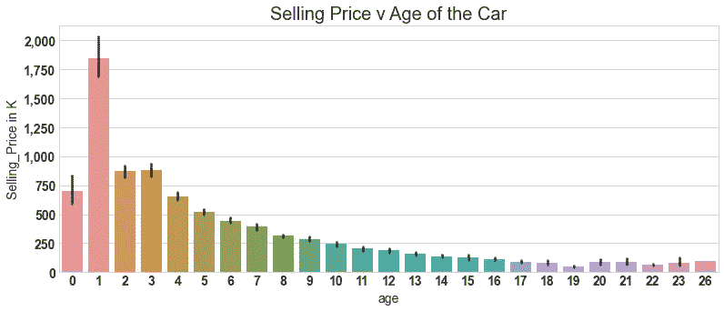
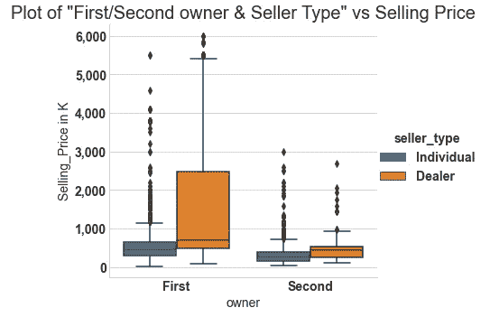
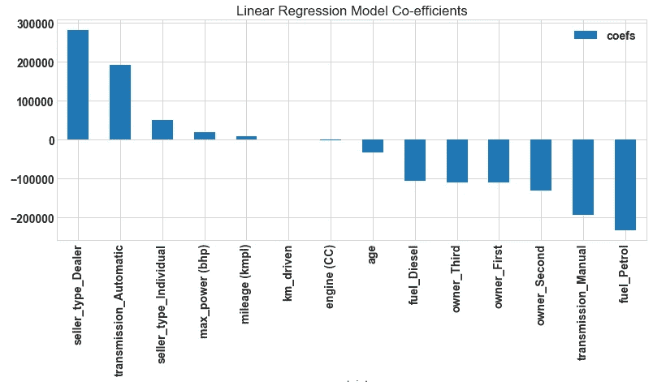

# 卖二手车变得聪明

> 原文：<https://medium.com/analytics-vidhya/getting-smart-with-selling-used-cars-ef77257d6c73?source=collection_archive---------17----------------------->

销售旧车的数据驱动方法。

欢迎来到我的博客，这是我第一篇关于二手车销售价格分析和预测的文章。

## 简介:

当我打算买一辆新车时，我有一些关于如何销售我现在的车的问题:比如最好的销售价格是多少，是直接销售还是通过经销商销售，我是否在正确的时间销售汽车等等…

这促使我深入研究，看看数据表明了什么。

数据来自 [kaggle](https://www.kaggle.com/nehalbirla/vehicle-dataset-from-cardekho) ，收集的 CarDekho 网站上列出的二手车信息。

该数据有来自 1540 个五座汽车模型的 6440 行。数据集包含的信息包括汽车的销售价格、是直接销售还是通过经销商销售、车主数量、车龄、行驶距离和汽车规格。

**第一部分:什么时候是卖车的最佳时机？** 不太清楚你，但我很好奇想知道答案。

数据显示，51%的车龄在 1 年到 5 年之间的汽车被售出，第 3 年售出的汽车数量最多。
1 年内卖出价格最高，但 1 年内卖出的不多。下一个最佳时间是汽车使用 2 或 3 年后&，然后逐渐减少，如下图 1 所示。

图 1:售价与车龄的关系

从上图可以看出，销售价格与使用年限成间接比例，所有燃料类型(汽油/柴油/天然气)的上述趋势相似

**第二部分:直接销售时的售价是否更好，所有权数量？**

售出的汽车中，十分之九(91%)是二手车或二手车。
大多数汽车(81%)直接销售&只有 15%通过经销商销售。

如下图 2 所示，通过经销商销售的第一手汽车售价较高。
这可能是因为它的无争议交易&方便了卖家。

图 2:卖家类型和所有者与售价

**第三部分:预测汽车售价**

最后，我利用数据集中可用的其他信息(如自动/手动变速器、燃料类型、里程、行驶距离、发动机容量)来查看它们是否会影响销售价格。

如下图所示，经销商销售的汽车、自动挡汽车、直接销售的汽车、最大功率和里程影响汽车的销售价格。

图 3:影响汽车售价的重要因素

结论

在本文中，我们分析了决定汽车销售价格的因素。

1.  这辆车最好在购买 3 年后卖掉。
2.  通过经销商销售可以获得更高的售价&最好是二手车。
3.  有自动变速器和更好的行驶里程的汽车有好的销售价格。

以上发现是基于对数据的分析。根据你的经验，你有什么看法？

要查看更多的分析，我的 GitHub 链接是[这里](https://github.com/prasannakr/Write_a_Data_Science_Blog_Post)