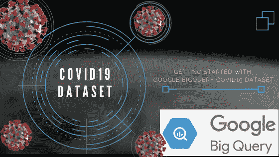

# 入门指南:COVID19 Bigquery 数据集

> 原文：<https://medium.com/analytics-vidhya/getting-started-guide-covid19-bigquery-dataset-ee97a99b20ad?source=collection_archive---------26----------------------->

由于艾滋病的广泛传播，世界正面临着当代最大的挑战。伴随着所有的恐慌、悲伤和封锁，我们也见证了公司和个人为更好地理解这个疫情所做的努力。

Google 通过提供必要的数据处理基础设施和各种协作来积极地帮助社区。其举措之一是托管和维护关于 COVID19 的公共数据集。

我写了一个入门指南来访问关于 COVID19 的 Google Bigquery 数据，并与社区分享。我试着让这个笔记本自给自足。

> **通过 Google Bigquery 开始使用 COVID19 数据集**

如果您喜欢这个笔记本，我请求您写一些关于 covid19 数据集的文章/分析，与社区分享您的分析。任何人都可以免费使用这个笔记本。

我也感谢谷歌和团队付出的努力。

## **玩得开心！**