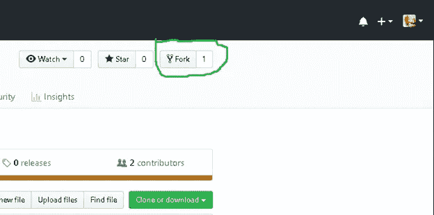
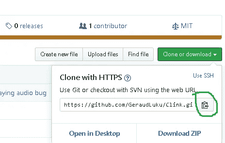
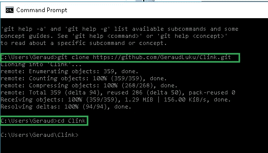
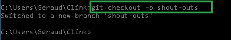
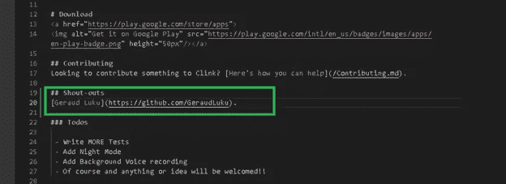
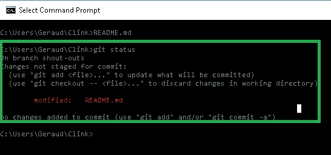
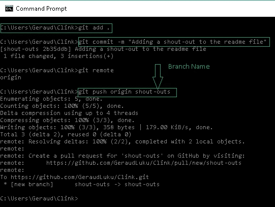
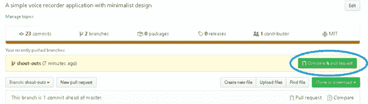
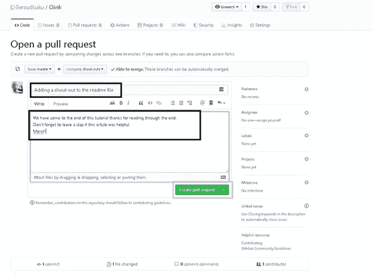
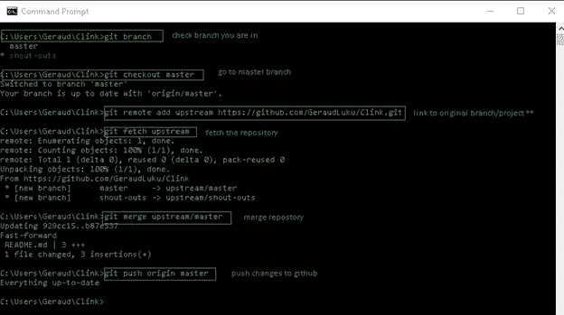

# 开始—提出拉取请求

> 原文：<https://medium.com/analytics-vidhya/getting-started-making-a-pull-request-d6dcc9bc6d66?source=collection_archive---------26----------------------->


照片由 [Will O](https://unsplash.com/@blnk_kanvas?utm_source=unsplash&utm_medium=referral&utm_content=creditCopyText) 在 [Unsplash](https://unsplash.com/?utm_source=unsplash&utm_medium=referral&utm_content=creditCopyText) 上拍摄

> *“走到一起是开始，待在一起是进步，一起工作是成功”——亨利·福特*

你想进入开源开发领域吗？你终于学完了编程语言，想测试一下你的技能吗？或者你只是想通过贡献开源软件为你最喜欢的库添加一个很酷的特性。

在许多平台上，开源项目由许多组织托管。其中最著名的是 GitHub。

# 为什么要投稿？

你这么做可能还有很多其他原因。开源社区为有抱负的程序员提供了一个脱颖而出的绝佳机会；并且通过**为各种项目贡献**，开发者可以提高自己的技能，从志同道合的人那里获得灵感和支持。无论是出于什么原因，这篇文章都将帮助你掌握在 GitHub 上参与开源项目所需的必要知识。

# **什么是拉请求？**

> 拉请求是一种向开源项目提交贡献的方法。当开发人员要求将提交给外部存储库的变更考虑包含在项目主存储库中时，就会发生这种情况。

听起来很复杂？我向你保证这不是，这意味着“**要求开源项目的所有者审查并考虑为他们的项目添加你开发的功能或你修复的 bug**”。看起来一点也不复杂🙌。

正是因为这个主要原因，当我试图进入开源世界时，人们和我自己对术语“**拉请求”**感到困惑，所以我写了这篇博客，以防有些人会觉得它有帮助。

# **让我们发出第一个拉取请求**

为此，我将借助我的代码库，它位于 GitHub 上。您可以通过调整[库](https://github.com/GeraudLuku/Clink)来自由地进行进一步的实验，但是对于本教程，我们将修改**自述文件。MD** 文件，方法是在**射出部分**下添加我们的**名称或 GitHub profile** 链接。您可以了解更多关于 readme 的信息。MD 文件上我的另一篇文章[在这里](/@lukugeraud97/getting-started-with-github-readme-md-bc348b943478)。

1.  派生存储库

当我们喜欢某人的存储库，并希望将它放在我们的 GitHub 帐户中时，我们会将它分叉，以便我们可以单独使用它。派生存储库基本上意味着创建我们自己的存储库副本。

通过单击页面顶部的 Fork 按钮来派生存储库。这将在您帐户中创建整个存储库的一个实例。



派生存储库

2.克隆存储库

一旦存储库在您的帐户中，将其克隆到您的机器上，以便在本地使用它。

要克隆，单击克隆按钮并复制链接。



克隆存储库

打开终端，在本地计算机上克隆存储库，然后转到克隆的目录。

```
**git clone [HTTPS ADDRESS]
cd [Repo Name]**
```



克隆存储库

3.创建分支

在使用存储库时创建一个新的分支是一个很好的实践，无论是一个小项目还是为一个小组的工作做贡献。分支机构的名称应该简短，并反映你正在做的工作。

现在使用以下命令创建一个分支:

```
**git checkout –b [branch name]**
```



创建分支

4.进行更改并提交它们

在自述文件的大声部分添加您的姓名。MD 文件并保存它。然后执行 **git status** 来查看变化。

```
**git status**
```



对自述文件所做的更改



查看对存储库的更改

4.将更改推送到 GitHub

使用 **git add 将这些更改添加到您刚刚创建的分支中。**命令，现在使用 **git commit** 命令提交这些更改，最后将更改推送到 GitHub。

```
git add .
git commit -m ["Commit message here in quotes"]
git push origin [name of branch]
```



向 GitHub 推送更改

5.创建拉式请求

转到你在 GitHub 上的资源库，你会看到一个按钮“比较&拉请求”并点击它。



创建拉式请求

请提供您所做工作的必要详细信息(您可以使用“#”引用问题)。现在提交拉取请求。

> **注意:在向原始存储库提交任何拉请求之前，您必须将您的存储库与原始存储库同步。**

恭喜你！您已经提出了第一个拉取请求。



提交拉取请求

6.同步您的分叉主分支

```
git branch
git checkout master
git remote add upstream [HTTPS]
git fetch upstream
git merge upstream/master
git push origin master
```



将分叉存储库与主分支同步

最后但并非最不重要的是，感谢你阅读这篇文章，因为我是一个初学者，我可能会犯错误，请随时指出来，以便我可以纠正他们。👋🏻 👋🏻