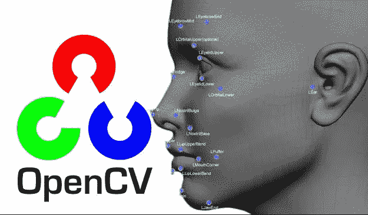

# OpenCV 对象检测入门

> 原文：<https://medium.com/analytics-vidhya/getting-started-on-object-detection-with-opencv-5962a75876a6?source=collection_archive---------4----------------------->



随着当前的技术趋势，计算机视觉已经成为技术领域中的重要实体，导致无限的计算机创新。从这个角度来思考计算机视觉: ***作为人类，我们的眼睛是身体的重要部分，因此将视觉嵌入计算机/机器以使它们能够看见。***

注意:有很多框架和工具可以用来处理计算机视觉，比如 [IBM 视觉识别](https://www.ibm.com/watson/services/visual-recognition/)、[微软 Azure](https://azure.microsoft.com/en-gb/services/cognitive-services/computer-vision/) 、 [openCV](https://opencv.org/) 等等…

在这篇文章中，我们将学习如何使用 python 中的 openCV 在流式视频中检测对象。

注意:你也可以使用我们将在另一篇文章中介绍的图像，因为现在我们将在视频流中识别物体，特别是人脸。活下去！！

要求:

1.  Linux 操作系统
2.  Python3
3.  pip3
4.  opencv-python
5.  网络摄像头或照相机
6.  用于编写代码的 IDE 或编辑器

# **安装 openCV**

要在 linux 中安装 openCV for python，请打开您的终端并键入下面的命令:

注意:我从我的桌面目录工作

`**pip3 install opencv-python**`


安装 opencv python 包

很好，看，开始使用 python openCV 包是如此简单。现在让我们开始编码吧！！

# **编码开始**

打开你最喜欢的编辑器，粘贴下面的代码，然后我会解释每一行。

```
**import cv2**#https://github.com/Itseez/opencv/blob/master/data/haarcascades/haarcascade_frontalface_default.xml#face haar cascade detection
**face_cascade = cv2.CascadeClassifier(‘<dir to the face.xml file>/face.xml’)****cap = cv2.VideoCapture(0)****while(True):** #Capture frame-by-frame
  **ret, frame = cap.read()** #Our operations on the frame come here
  **gray = cv2.cvtColor(frame, cv2.COLOR_BGR2GRAY)** #faces multiscale detector
  **faces = face_cascade.detectMultiScale(gray, 1.3, 5)** #loop throughout the faces detected and place a box around it
  **for (x,y,w,h) in faces:
    gray = cv2.rectangle(frame,(x,y),(x+w,y+h),(255,0,0),2)
    font = cv2.FONT_HERSHEY_SIMPLEX
    cv2.putText(gray,’FACE’,(x, y-10), font, 0.5, (11,255,255), 2, cv2.LINE_AA)
    roi_gray = gray[y:y+h, x:x+w]** #Display the resulting frame
  **cv2.imshow(‘black and white’,gray)
  if cv2.waitKey(1) & 0xFF == ord(‘q’):
    break**# When everything done, release the capture
**cap.release()
cv2.destroyAllWindows()**
```


面部检测代码

让我们讨论代码…

首先，我们在第一行导入 openCV 库。

在 openCV 中，使用 xml 文件中的[**Haar Cascade**](http://www.willberger.org/cascade-haar-explained/)**代码检测对象。让我解释一下。如果您以前使用过 IBM 视觉识别，您会理解注释的过程，其中我们有多个想要训练和创建模型的图像，对吗？**

**在 IBM 视觉识别中，在标记过程中，我们通过在特定图像周围画出方框并标记它们来准备数据/图像。在测试和使用模型时，来自该过程的 xml 文件用于识别对象，因为它包含特定的细节，如宽度、高度，可能还有颜色以及所有这些元素。希望我们还在一起…呵呵呵**

**在 openCV 中。xml 文件是使用分类器 Haar Cascade 生成的，因此。本例中用于人脸检测的 xml 保存在名为 f *ace_cascade* 的变量中。**

**这里有几个已经生成的 xml 文件。获取所需的 xml 文件，将其复制粘贴到文件中并保存。**

**然后，我们现在创建另一个名为 *cap* 的变量，它将保存我们的网络摄像头捕捉到的视频流。*。videoCapture(0)* 方法是 openCV 自带的，方法中指定的 0 表示我们将使用计算机上的默认网络摄像头。因此，如果您使用另一个外部摄像头，请将其更改为 1。**

**在 **while 循环**中，我们所说的是当有一个视频被捕获时，将视频存储在一个名为 *frame* 的变量中，然后将视频转换成灰度视频(如果你不需要灰度帧，你也可以直接使用它)。然后，我们使用 *detectMultiScale()* 方法，使用包含坐标的 face.xml 来检测人脸，该坐标是我们的 Haar 级联文件。**

**在循环的**中，我们正在遍历所有检测到的面，并使用*绘制一个矩形。rectangle()* 方法，并使用*追加一个名称。putText()* 方法甚至在名字上加了一个*字体*！****

**在 openCV 中，我们使用*显示结果。imshow()* 方法然后我们指定字母 q 在我们想要的时候退出或者关闭窗口。**

**最后，我们发布了网络摄像头。**

# ****演示****

**在 python 中运行该文件。打开终端并键入**

****python 3<文件名>。py****

**为了好玩，我把脸这个名字改成了我的名字..呵呵呵**

**就这样，希望一切都很清楚，如果没有，不要犹豫，在评论区提问，并为更多的未来鼓掌，这只是一个开始**

**谢谢你。你可以自由地加入我们创造惊人的东西，只要给我们发电子邮件在 devligenceltd@gmail.com**

**作者:[柯林斯. h .穆尼内](https://collinsmunene.github.io/collinshillary.github.io/)**

**首席执行官。 [**发展有限公司**](http://devligence.com/)**

**Youtube: [人工智能项目](https://youtu.be/EePxzHUu3IM)**