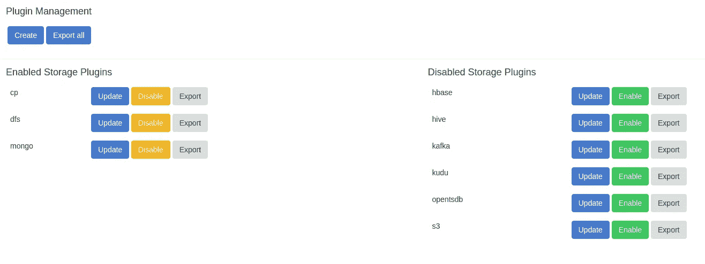
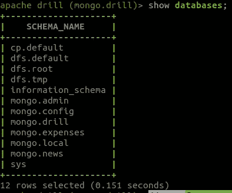
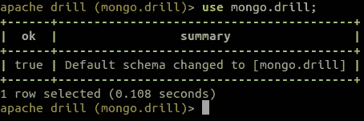
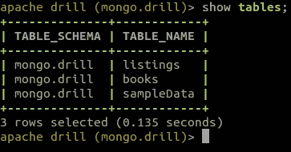
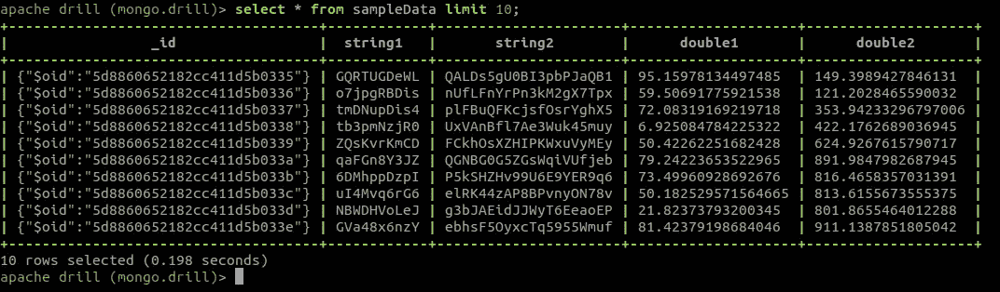

# Apache Drill 和 MongoDB 入门

> 原文：<https://medium.com/analytics-vidhya/getting-started-with-apache-drill-and-mongodb-edb856395c24?source=collection_archive---------7----------------------->

> 原文发布于此:[https://blog . contact sunny . com/tech/getting-started-with-Apache-drill-and-MongoDB](https://blog.contactsunny.com/tech/getting-started-with-apache-drill-and-mongodb)

听说过阿帕奇演习的人不多。这是因为 Drill 迎合了非常特定的用例，它非常适合。但是在使用时，它会对您与数据的交互方式产生重大影响。首先，让我们看看什么是 Apache Drill，然后我们如何连接我们的 MongoDB 数据源来钻取和轻松查询数据。

# 什么是阿帕奇演习？


根据他们的网站，Apache Drill 是“用于 Hadoop、NoSQL 和云存储的无模式 SQL 查询引擎”这是不言自明的。所以，Drill 是一个查询 Hadoop、MongoDB 和其他 NoSQL 数据库的工具。您可以编写对存储在其他数据库中的数据运行的简单 SQL 查询，并以行列格式获得结果。最棒的是，你甚至可以用它来查询 Apache Kafka 和 AWS S3 的数据。

让我们看看如何连接到 MongoDB 并查询一些数据。

# 下载 Apache Drill

要在您的本地机器上测试 Apache Drill，您只需要下载压缩文件，提取它，并运行一个 shell 脚本。你已经准备好了。你可以从[这里](https://drill.apache.org/download/)下载阿帕奇演习。

# 将 Apache Drill 连接到 MongoDB

将刚刚下载的文件 *cd* 解压到 *bin* 目录，然后运行以下命令来运行嵌入式 Drill 服务:

```
./drill-embedded
```

您将得到类似以下内容的提示:

```
apache drill>
```

您现在在本地机器上运行 Apache Drill。现在让我们将它连接到本地 MongoDB 实例。打开你的网络浏览器，进入 [http://localhost:8047](http://localhost:8047/) 。这是 Apache Drill web UI。从这里，您可以配置存储(连接)、运行 SQL 查询和更改配置。

现在，前往*存储*标签。在这里，你会发现两个列表。左侧的第一个列表包含已启用的存储插件或连接。在右边，你会看到被禁用的插件。你会看到 MongoDB 在右边，在禁用列表中。启用 MongoDB 插件，它将被添加到左侧列表中。页面看起来应该是这样的:



如果您没有使用默认端口或者想要连接到远程 MongoDB 实例，您可以在这里编辑 MongoDB 连接字符串。启用这个插件后，我们将切换回命令行界面来运行一些示例查询。

在我们开始之前，如果您还没有任何样本数据，您可以使用我编写的 Java 工具轻松生成数千条记录。Github 上这里的代码是[。](https://github.com/contactsunny/MongoDB_Sample_Data_Loader)

# 在 Apache Drill shell 中运行查询

在我们开始使用 Drill 查询 MongoDB 之前，让我们看一下我们的样本数据集。我用随机值生成了 20，000 个文档，这些数据的子集在这里:

```
{
   "_id": "5d8860652182cc411d5b0335",
   "string1": "GQRTUGDeWL",
   "string2": "QALDs5gU0BI3pbPJaQB1",
   "double1": 95.15978134497485,
   "double2": 149.3989427846131
 },
 {
   "_id": "5d8860652182cc411d5b0336",
   "string1": "o7jpgRBDis",
   "string2": "nUfLFnYrPn3kM2gX7Tpx",
   "double1": 59.50691775921538,
   "double2": 121.2028465590032
 },
 {
   "_id": "5d8860652182cc411d5b0337",
   "string1": "tmDNupDis4",
   "string2": "plFBuQFKcjsfOsrYghX5",
   "double1": 72.08319169219718,
   "double2": 353.94233296797006
 },
 {
   "_id": "5d8860652182cc411d5b0338",
   "string1": "tb3pmNzjR0",
   "string2": "UxVAnBfl7Ae3Wuk45muy",
   "double1": 6.925084784225322,
   "double2": 422.1762689036945
 },
 {
   "_id": "5d8860652182cc411d5b0339",
   "string1": "ZQsKvrKmCD",
   "string2": "FCkhOsXZHIPKWxuVyMEy",
   "double1": 50.42262251682428,
   "double2": 624.9267615790717
 },
 {
   "_id": "5d8860652182cc411d5b033a",
   "string1": "qaFGn8Y3JZ",
   "string2": "QGNBG0G5ZGsWqiVUfjeb",
   "double1": 79.24223653522965,
   "double2": 891.9847982687945
 },
 {
   "_id": "5d8860652182cc411d5b033b",
   "string1": "6DMhppDzpI",
   "string2": "P5kSHZHv99U6E9YER9q6",
   "double1": 73.49960928692676,
   "double2": 816.4658357031391
 },
 {
   "_id": "5d8860652182cc411d5b033c",
   "string1": "uI4Mvq6rG6",
   "string2": "elRK44zAP8BPvnyON78v",
   "double1": 50.182529571564665,
   "double2": 813.6155673555375
 },
 {
   "_id": "5d8860652182cc411d5b033d",
   "string1": "NBWDHVoLeJ",
   "string2": "g3bJAEidJJWyT6EeaoEP",
   "double1": 21.82373793200345,
   "double2": 801.8655464012288
 },
 {
   "_id": "5d8860652182cc411d5b033e",
   "string1": "GVa48x6nzY",
   "string2": "ebhsF5OyxcTq5955Wmuf",
   "double1": 81.42379198684046,
   "double2": 911.1387851805042
 }
```

如你所见，这些数据毫无意义。

现在，使用 Apache Drill 从 MongoDB 获取相同的数据集就像最基本的 SQL 查询一样简单:

```
select * from sampleData;
```

但在此之前，我们先来看看其他几个查询。

运行以下查询，列出您有权访问的所有数据库。请注意，您不仅限于 MongoDB 数据库，而是来自当前启用的所有存储插件的数据库。



我将样本数据加载到“mongo.dill”数据库的集合中。让我们利用这一点:



现在让我们看看这个数据库中有哪些表:



现在，我们运行*选择*查询来列出我们的数据:



差不多就是这样。现在，您可以开始用现有的数据进行更复杂的查询实验。