# Apache Kafka 入门— Windows

> 原文：<https://medium.com/analytics-vidhya/getting-started-with-apache-kafka-windows-dff0bb7c6543?source=collection_archive---------6----------------------->

你好。在[之前的文章](/@nandini.vishwa94/apache-kafka-an-introduction-beaaaedb6cfa)中，我简要概述了 Kafka 的基础知识，回答了基本的“是什么”和“为什么”的问题，以帮助你很好地理解这项技术。在本文中，我将带您完成安装，我们将看到一个简单的生产者和消费者的行动！

在文章的最后，我列出了您将使用来完成本教程的所有命令。所以只要复制粘贴，节省时间！目标是学习概念，而不是浪费时间键入命令。

## 家政

在我们开始 Kafka 安装之前，请确保您的系统上已经安装了 java，并将 jre 添加到您的路径中。

要安装 java，去[这个链接](https://www.java.com/en/)下载最新的 jre 版本。然后，您可以将 jre bin 路径添加到 path 变量中，并验证您的系统上是否安装了 java。

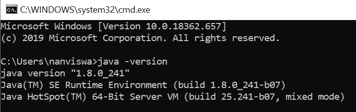

## 卡夫卡装置

我在上一篇文章中提到，安装不会超过 3 分钟。我没开玩笑。你所要做的就是下载一个 tar 文件，解压它，瞧，你的系统中就有了卡夫卡的力量。没有复杂的安装向导，让你不断点击下一步。我几乎能听到你如释重负的叹息。

1.  从 [Apache](https://www.apache.org/dyn/closer.cgi?path=/kafka/2.4.0/kafka_2.12-2.4.0.tgz) 下载最新的 Kafka 版本。最新的版本是 2.4.0(从推荐的镜像站点下载以获得最稳定的版本)。

**注意:**如果您计划将 Kafka 与现有的 Scala 项目集成，您可能需要下载一个与您正在使用的 Scala 版本兼容的 Kafka 版本。

你怎么知道的？tar 文件通常遵循命名约定 *kafka_ < scala 版本> - < kafka 发布版本>。tgz* 。例如，您现有的项目可以在 Scala 2.11 上编译，因此您必须选择 *kafka_2.11- <最新的 kafka 版本>* 。大多数人没有注意到这一步，这会导致各种版本问题。预防胜于治疗，对吗？

现在，解压缩 tgz 文件:

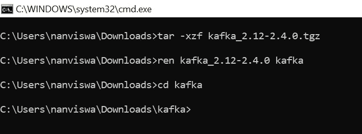

***注:*** 你可能已经注意到了，我把目录重命名为卡夫卡。这是为了防止启动 Kafka 服务器时出现*“输入路径过长”*错误。

幸运的是，Kafka 内置了一个单节点 Zookeeper 实例。这为我们节省了几分钟时间。这甚至不需要 3 分钟，不是吗？

# 投入卡夫卡的世界

## 单一代理集群

我们将从一个简单的代理 Kafka 集群开始，看看生产者和消费者是如何交互的！

另外，快速提醒一下！你将有很多终端开放。对这个事实不能全信。我们开始吧！

卡夫卡**不能离开动物园管理员**跑！现在重复令人作呕！

1.  **Zookeeper 实例** —第一步是启动 Zookeeper 实例。

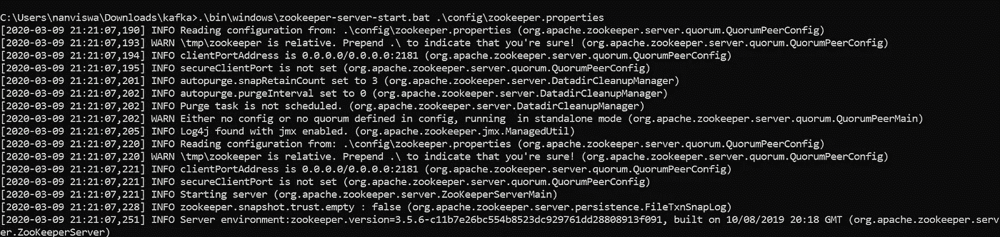

2.**启动 Kafka 服务器—** 一旦 zookeeper 启动并运行，您就可以使用下面的命令启动 Kafka 服务器。

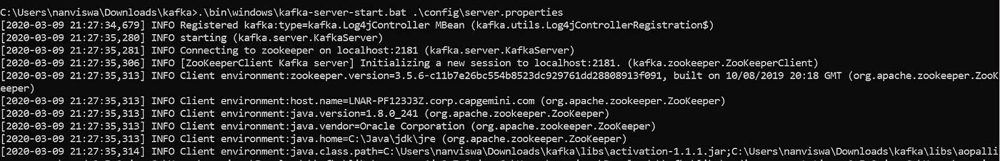

请注意，我们已经将属性文件作为参数传递来启动 zookeeper 和 Kafka 服务器。属性文件不过是一堆键值对，允许您定义服务器的“特性”并对其进行配置。请随意打开属性文件并浏览它。

3.**创建主题** —接下来我们将创建一个主题，生产者将向其发布消息。我们把这个题目叫做*“test topic”*。


这个指挥部里似乎有很多事情在进行。我们来分解一下。

a.**引导服务器** —引导服务器只不过是代理的地址(还记得代理吗？负责接收来自生产者的信息并将其发送给消费者的人？如果不回去看[上一篇](/analytics-vidhya/apache-kafka-an-introduction-beaaaedb6cfa))。

b.**复制因子** —这表示我们选择保留在 Kafka 集群中的主题的副本数量。在这种情况下，我们维护主题的一个副本。在多代理集群中，我们可以有更多的副本，并将它们均匀地分布在 Kafka 代理之间(容错)。可以在主题级别定义复制因子。复制因子为 3 通常是一个好习惯。如果您正在处理关键项目，这个数字可能会更高。

请务必注意，复制因子不能超过可用代理的数量。例如:对于 2 个代理的集群，允许的最大复制因子是 2。

c.**分区** —分区是卡夫卡的基本平行单位。分区可以分布在多个代理上。这允许多个使用者并行读取来自主题的消息。

4.**生产者** —现在让我们开始我们的第一个适度的命令行生产者。每一行(以'>'开头的将是发送到 Kafka 集群的新消息)。

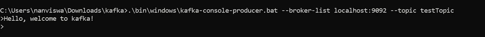

您可以看到，这里的代理列表指向与我们在前面的命令中提供的引导服务器相同的地址。生产者将把消息发送给本地主机上的代理:9092。

5.**消费者** —消费者订阅 testTopic 并消费来自代理的消息(在 localhost:9092，没什么奇怪的)。注意命令中的*【从-开始】*。这表明使用者将从最早的消息到最新的消息读取由生产者发送的所有消息。

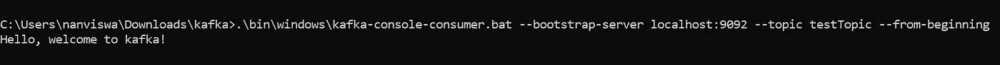

你正式成为卡夫卡的用户了！恭喜你！您刚刚创建了您自己的生产者和消费者，并从一个向另一个发送消息。

现在，您已经看到了消息以最快的速度在两个窗口之间流动，让我们快速看看多代理 Kafka 集群是如何工作的。

## 多代理集群

在下一个示例中，我们将看一个 3 节点 Kafka 集群。通常，每个代理都与其自己的机器相关联。但是出于演示的目的，我们将在本地机器上启动所有 3 个代理。

1.  还记得 server.properties 文件吗？这就像经纪人的 PII。经纪人有他们自己指定的属性文件，这些文件唯一地标识了他们，并赋予他们特征(现在这有点过火了，但你明白了)。

**我们不能用同一个房产档案创建多个经纪人！！**

1.  要在集群中引入 2 个额外的代理，您所要做的就是复制 server.properties 文件，并将其命名为 server-1.properties 和 server-2.properties(或者您想要的任何名称，但请记住它必须仍然是一个*。属性文件。发挥创造力！)对应于 2 个新经纪人。

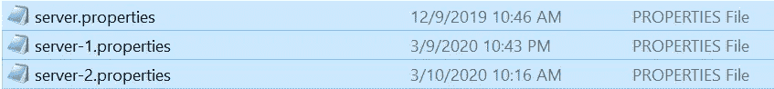

3.现在，您必须修改这些新创建的属性文件中的 3 个属性。

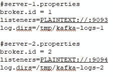

i. **broker.id** —这是代理的唯一标识符。默认情况下，您的第一个经纪人 id 应该是 0。

二。**监听器** —这是代理与生产者和消费者通信的端口。如果你不修改地址，经纪人将重写彼此的数据，这不是我们想要的。(如果代理在不同的机器上，则不必修改端口号)。

三。 **log.dirs** —代理生成的所有日志将存储到的目录。

4.我们已经运行了动物园管理员和经纪人 0。我们将使用修改后的 server-1.properties 和 server-2.properties 文件来启动第二个和第三个代理。

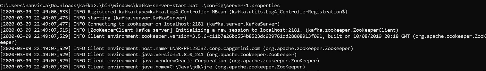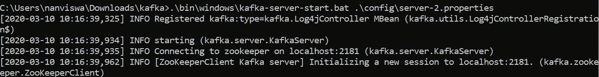

4.我们将创建一个复制因子为 3 的新主题。这意味着我们将在集群中的 3 个代理之间维护 3 个主题副本。

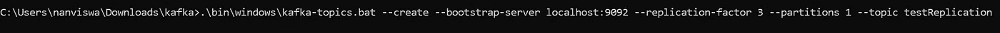

5.好了，现在我们已经创建了一个新主题，并设置了复制因子。但是内部发生了什么呢？让我们看看。对该主题的简单描述给出了以下输出:

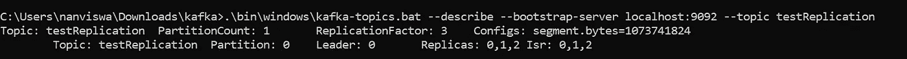

## 领导者-追随者模型

要解释上面的输出，我们需要了解卡夫卡的固有模式。Kafka 遵循领导者-追随者模型，每个分区选出一个经纪人作为领导者。在我们的示例中，我们有 1 个分区，代理 0 被选为其领导者。

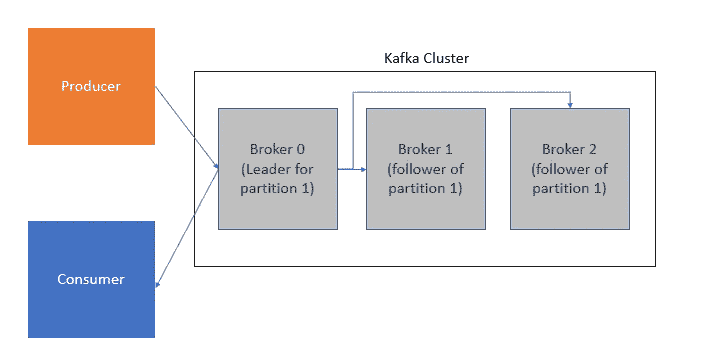

a.**领导** —领导负责与客户的所有互动。换句话说，领导者负责所有的读写。生产者将为分区向其指定的领导者发送消息。在这种情况下，生产者将其所有消息发送给代理 0。反过来，消费者与领导者交互以消费来自分区的消息。那么复制在哪里起作用呢？

b.**副本** —一旦消息被发送到领导者，该分区的从者将复制领导者中存在的数据。由于生产者将数据发送给领导者，因此在代理 0 中已经存在一个副本。为了再创建 2 个副本，Kafka 找到了 2 个代理，并在其中复制了分区。

c. **Isr(同步副本)** —表示与领导者同步的副本数量。目前，所有 3 个代理都是同步的。

6.现在我们将启动一个生产者 shell 来发布消息到主题

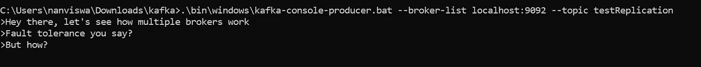

7.让我们启动一个消费者来消费这些消息。

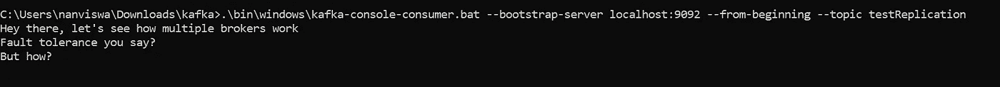

## 容错在行动

现在来看看容错是如何工作的，让我们杀死其中一个 Kafka 服务器(代理)。使用下面显示的命令获取任何一个代理的进程 ID。

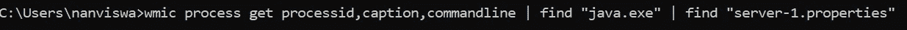

如果这个命令对您不起作用，请尝试 netstat。您必须选择当前正在监听的进程 ID。

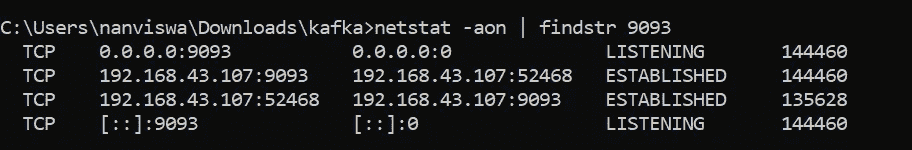

现在，您已经有了进程 id，继续执行并终止任务。


我们刚刚做了什么？我们杀了一个经纪人。我们来描述一下题目，进一步分析一下内部。

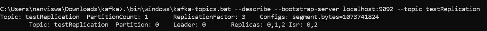

可以看到，领头的还是经纪人 0。请注意，同步副本(ISR)已经更改。因为我们杀死了代理 1，所以当前同步的副本是代理 0 和代理 2。现在下一个逻辑问题出现了。消费者还能从主题中获取信息吗？

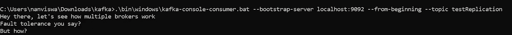

是啊！尽管代理受到威胁，消费者仍然能够从主题中读取消息。因此是容错的！

现在，为了让事情变得更有趣一点，我改变了主题中的分区数量，终止了代理 0 并重新启动了代理 1。


现在描述这个主题给出了下面的输出。

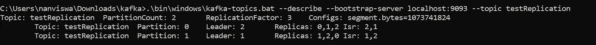

我们看到每个分区都有自己的领导者。领导者选举是自动的，尽管最初的领导者受到威胁，但没有数据丢失。容错能力再次得到证明！

你爱上卡夫卡了吗？什么事？我想是的！今天就到这里，伙计们。希望您在学习和交流中获得乐趣！

下面是您开始工作所需的命令列表:

```
**###Commands** **##Un-tarring the tar file you downloaded. Make sure the it's the ##same tgz file. Modify it if you have downloaded a different ##version**tar -xzf kafka_2.12-2.4.0.tgz
ren kafka_2.12-2.4.0 kafka
cd kafka**##Single node Kafka cluster**1\. Zookeeper instance (new terminal)
.\bin\windows\zookeeper-server-start.bat .\config\zookeeper.properties2\. Kafka server (new terminal)
.\bin\windows\kafka-server-start.bat .\config\server.properties3\. Create a topic (new terminal)
.\bin\windows\kafka-topics.bat --create --bootstrap-server localhost:9092 --replication-factor 1 --partitions 1 --topic testTopic4\. Producer (new terminal)
.\bin\windows\kafka-console-producer.bat --broker-list localhost:9092 --topic testTopic5\. Consumer (new terminal)
.\bin\windows\kafka-console-consumer.bat --bootstrap-server localhost:9092 --topic testTopic --from-beginning**##Multiple node Kafka cluster**1\. Zookeeper instance (new terminal)
.\bin\windows\zookeeper-server-start.bat .\config\zookeeper.properties2\. Kafka server 0(new terminal)
.\bin\windows\kafka-server-start.bat .\config\server.properties3\. Kafka server 1(new terminal)
.\bin\windows\kafka-server-start.bat .\config\server-1.properties4\. Kafka server 2(new terminal)
.\bin\windows\kafka-server-start.bat .\config\server-2.properties5\. Create a topic (new terminal)
.\bin\windows\kafka-topics.bat --create --bootstrap-server localhost:9092 --replication-factor 1 --partitions 1 --topic testReplication6\. Describe the topic
.\bin\windows\kafka-topics.bat --describe --bootstrap-server localhost:9092 --topic testReplication7\. Producer (new terminal)
.\bin\windows\kafka-console-producer.bat --broker-list localhost:9092 --topic testReplication8\. Consumer (new terminal)
.\bin\windows\kafka-console-consumer.bat --bootstrap-server localhost:9092 --topic testReplication --from-beginning
```