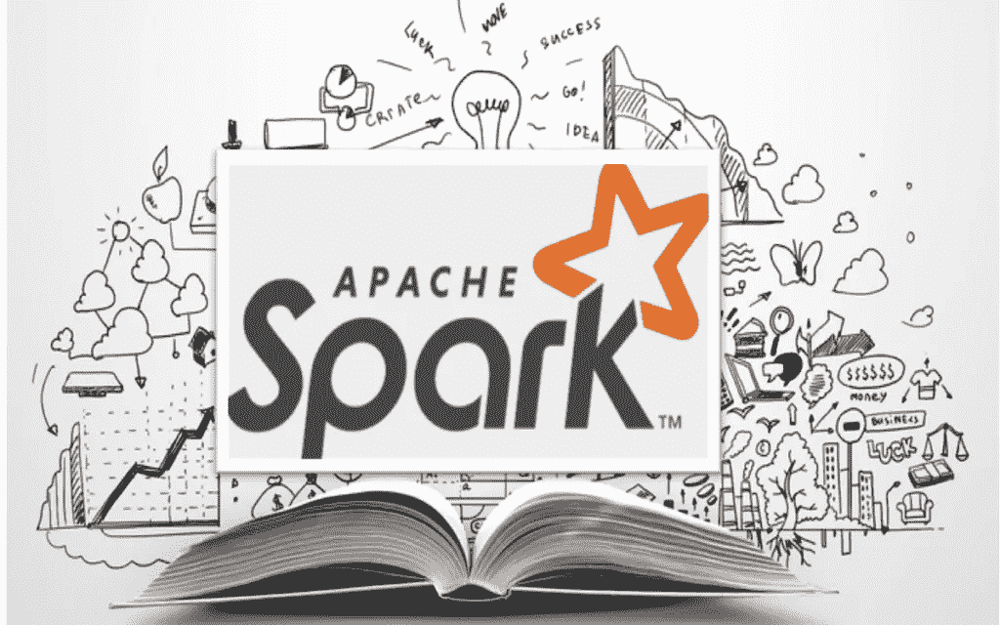

# Apache Spark 入门—第 1 部分

> 原文：<https://medium.com/analytics-vidhya/getting-started-with-apache-spark-part-1-91b379204ae0?source=collection_archive---------12----------------------->

资料来源:Udemy

在这个大数据时代，每分钟都在创造令人难以置信的大量数据，对企业来说，分析这些数据以获得快速洞察变得越来越重要。这就产生了对更快更有效的数据处理技术的需求。随着“大数据”和“数据科学”成为当今世界的流行语，难怪行业会落后于 Apache Spark 这样的大数据引擎。考虑到对 Apache Spark 开发人员的需求，我们可以肯定地说 Spark 是下一代大数据工具，也是您应该知道的最受欢迎的大数据技能之一。如果你期待在这个领域开始，那么这个博客有你想要的东西。

这篇博客是 Apache Spark 系列的第一篇**、**，在这篇**、**中，我们将看到什么是 Apache Spark，为什么使用它，Spark 的行业用例，以及它如何在无数行业中使用。我们还将了解 Apache Spark 生态系统及其组件。接下来，我们将看到为什么 Spark 是首选，它的哪些特性使它成为可取的，最后以 Spark 的内部架构及其工作方式结束。

# 阿帕奇火花——是什么？

资料来源:PNGkey

Apache Spark 是一个数据处理框架，可以在非常短的时间内对非常大的数据集执行任务。Spark 最初由加州大学伯克利分校开发，快速灵活，后来成为大数据领域最大的开源社区，被认为是世界上最好、最广泛使用的大数据处理框架之一。因此，它被各行各业的主要企业广泛采用。

Apache Spark 是一个分布式数据处理框架，它可以通过将任务分布在多个节点上来快速处理大型数据。大规模部署 Spark 有助于在成千上万个节点的集群上高速处理甚至数 Pb 的数据！事实上，Spark 进行大规模数据处理的速度比 Hadoop 快 100 倍。Spark 可以执行批处理和流处理，这使它成为一个强大的引擎，可以以实时和批处理模式处理数据。凭借其易于使用的 API，Spark 使其用户更容易完成与分布式计算和大数据处理相关的工作。

Spark 建立在 Scala 之上，通过为 Scala、Java、Python 和最新的 r 提供 API 来支持多种语言。这是 Spark 的一个关键特性，使开发人员可以灵活地用他们方便的语言创建和运行应用程序。

# Apache Spark 用例

如今，几乎每个行业都在处理大数据。对于这些行业中的许多行业，考虑到 Apache Spark 惊人的特性和它提供的众多优势，Apache Spark 是首选。Spark 被几乎所有行业的许多公司广泛使用。它被大规模部署，在超过数千个节点的集群上共同处理数 Pb 的数据。以下是一些使用 Spark 处理大数据三个 V 的行业，即数量、速度和多样性。

*   今天，**媒体和娱乐业**作为发展最快的行业之一，正在向在线流媒体发展。像网飞这样的领先工业巨头使用 Apache Spark 进行实时流处理，每天处理数十亿个事件，以便向其客户提供个性化的在线推荐。此外，雅虎使用 Spark 进行机器学习，为其客户个性化网页和新闻文章。
*   **金融部门**是实时处理发挥重要作用的另一个行业。Apache Spark 用于分析和快速洞察客户细分、目标广告、信用风险评估、客户流失预测、交易欺诈检测等方面，以便在业务中做出正确的决策。它用于在分析大量事务日志时获得一流的结果。
*   Spark 发挥重要作用的另一个领域是**医疗保健行业**，在该行业中，Spark 用于分析大量患者健康记录和临床数据，以获得快速而有用的见解。
*   来到**旅游行业**，像猫途鹰和 OpenTable 这样的领先旅游网站和应用程序使用 Apache Spark 来加速向用户提供定制化的推荐。
*   最后但同样重要的是，与数据分析和目标广告密不可分的一个行业是**电子商务和零售部门**。像阿里巴巴和易贝这样的电子商务领导者使用 Spark 来分析数 Pb 的数据。Spark 的一些使用案例是定向广告、个性化推荐和优惠等。

# Spark 生态系统及其组件

让我们简单了解一下 Apache Spark 生态系统及其组件。Spark 整合了各种内置库和组件，即 Spark core、Spark SQL、Spark Streaming、Spark MLlib 和 Spark GraphX。

星火生态系统

1.  **Spark 内核**—Spark 的基本功能建立在 Spark 内核之上。它整合了弹性分布式数据集(rdd ),这是 Spark 的主要抽象之一。Spark 内核负责任务调度、故障恢复、内存计算和内存管理。它是处理大型数据集的基础。
2.  **Spark SQL** —它是 Spark 的一个模块，为 Spark 提供 SQL 接口，用于处理结构化和半结构化数据，并在这些数据上执行 SQL 查询。
3.  **Spark Streaming** —它是一个构建在 Spark core 之上的 Spark 组件，负责对从 Apache Kafka、Apache Flume 和 Amazon Kinesis 等数据流源获得的连续流动数据流进行高吞吐量、可扩展和容错的流处理。
4.  **Spark MLlib** —这是一个 Spark 库，有助于实现机器学习和深度学习算法，并使机器学习具有可扩展性。我们将在接下来的博客中详细讨论这个问题。
5.  Spark GraphX —这是一个 Spark API，用于操作和处理图形，并执行图形并行计算。

# 为什么是火花？

从数据收集开始，然后是数据清理和数据工程，再到高级分析，通过机器学习模型的培训、评估和验证来提供对数据的有意义的见解，像 Apache Spark 这样的统一框架将提供端到端的解决方案。

该过程中涉及的主要步骤是收集数据、分析数据、清理数据、特征工程以及通过构建机器学习模型从数据中探索和生成见解。Spark 在每一个步骤中都有自己的角色。这是 Spark 的优势，因为我们在这里讨论的数据类型是以 TB 和 Pb 为单位的，我们需要高度可扩展的管道。虽然像 Pandas 和 NumPy 这样的库在数据可以放入内存的单节点系统上工作得很好，但它们在处理大量数据时效率不高，我们需要一个统一的框架来更快地分发和处理数据。实时应用程序的实时分析处理大量实时生成的数据，如业务流程和交易。在这种情况下，Spark 将成为首选解决方案，因为它能够支持高度可扩展的数据管道。

Spark 支持批处理或实时数据。实时数据可以来自各种数据源，可以是 Kafka 消息或消息队列，也可以是来自物联网设备的实时数据，这些设备持续传输数百万笔交易，Spark 可以使用其 Spark 流组件处理这些流数据。此外，Spark 可以读取和写入各种系统，如 MongoDB、Cassandra、HBase、谷歌云、亚马逊 S3 等。Spark 与许多数据库系统和云基础设施的集成能力使其成为高度兼容和灵活的大数据框架。

资料来源:Databricks

# Spark 如何工作

在 Spark 中，大量数据被分割成块，分布在多个系统中，以对数据执行任务，而不是依赖于单个节点(如下图所示)。

Spark 应用程序的两个基本组件是驱动程序，它将应用程序代码转换成多个任务，这些任务分布在执行器上，执行器运行在工作节点上并执行分配给它们的任务。集群管理器充当这两个组件之间的中介。当客户端提交 Spark 应用程序代码时，驱动程序启动并初始化 Spark 上下文，它将转换和动作转换为逻辑有向无环图(DAG ),该图确定应该在每个节点上执行什么任务以及以什么顺序执行(我们将在接下来的博客中详细研究 Spark 上下文、转换和动作)。驱动程序还在 DAG 上执行优化，并在 worker 节点中的执行器之间分配和调度工作。然后，集群管理器启动工作节点中的执行器，并发送每个节点要执行的任务的详细信息。执行者执行工作并向驱动者报告。

总而言之，我们从 Spark 是什么、为什么使用 Spark、Spark 的一些特性及其行业使用案例开始，然后是 Apache Spark 生态系统的组件，最后是它的内部工作和架构。

祝贺您开始使用 Apache Spark，您不再是 Spark 的新手了！但是记住还有很长的路要走。查看本系列中的其他文章，继续您的 Spark 之旅并了解更多信息。在下一篇博客中，我们将关注 PySpark 和更多。快乐学习！

查看本系列中的其他博客

[***第二部分 PySpark 简介***](/@anveshrithaas/introduction-to-pyspark-part-2-6d6113e31592)

[***第三部分—了解 Spark RDDs***](/@anveshrithaas/understanding-spark-rdds-part-3-3b1b9331652a)

[***第四部分 PySpark 中的机器学习***](/@anveshrithaas/machine-learning-in-pyspark-part-4-5813e831922f)

[***第五部分——数据块上的端到端机器学习流水线***](/@anveshrithaas/end-to-end-machine-learning-pipeline-on-databricks-part-5-c10273e2cd88)