# AWS CLI 入门(命令行界面)

> 原文：<https://medium.com/analytics-vidhya/getting-started-with-aws-cli-command-line-interface-ac9ecb332e55?source=collection_archive---------10----------------------->

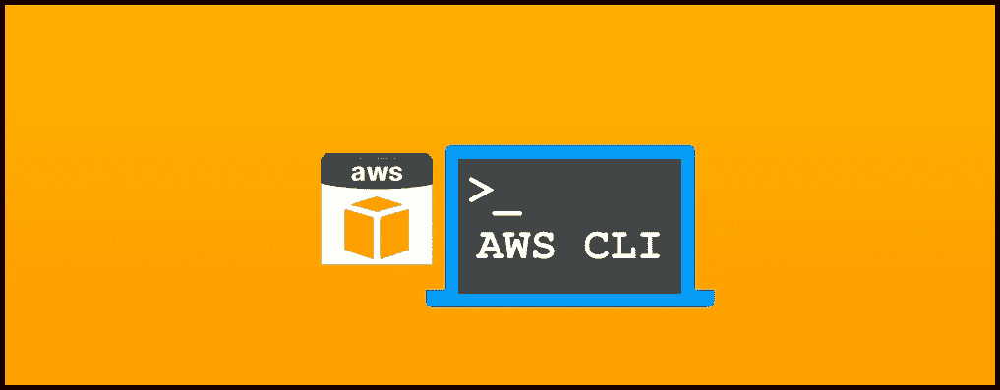

> ***什么是 CLI？***

CLI 是一个命令行程序，它接受文本输入来执行功能。AWS 为我们提供了使用 **AWS CLI** 访问其工具的选项。通过最少的配置，AWS CLI 使您能够从终端程序的命令提示符开始运行命令，这些命令实现的功能等同于基于浏览器的 **AWS 管理控制台**提供的功能

> ***为什么选择 AWS CLI？***

✔ **节省时间-** 假设你正试图寻找一个大文件夹。你必须登录你的账户，找到正确的文件夹，寻找正确的文件。但是使用 AWS CLI，如果您知道正确的命令，整个任务只需几秒钟

✔ **自动化-** 它让你能够通过脚本自动化控制和管理 AWS 服务的整个过程。有许多事情是 web 用户界面无法自动化的，一切都是非常手动的。例如，我们不能一次点击就从不同的 AMI 启动 2 个 EC2 实例。

> ***安装和配置 AWS CLI***

根据您的操作系统，您可以在此 从**安装 CLI。**

→安装好了，还得配置。它包括您的安全凭证、默认输出格式和默认 AWS 区域。为此，您将需要**访问密钥** **ID** 和**秘密访问密钥**，IAM 可以在使用适当的策略创建一个用户/现有用户之后获得它们(我已经附上了 **PowerUserAccess** )。创建用户后，您将获得凭证。

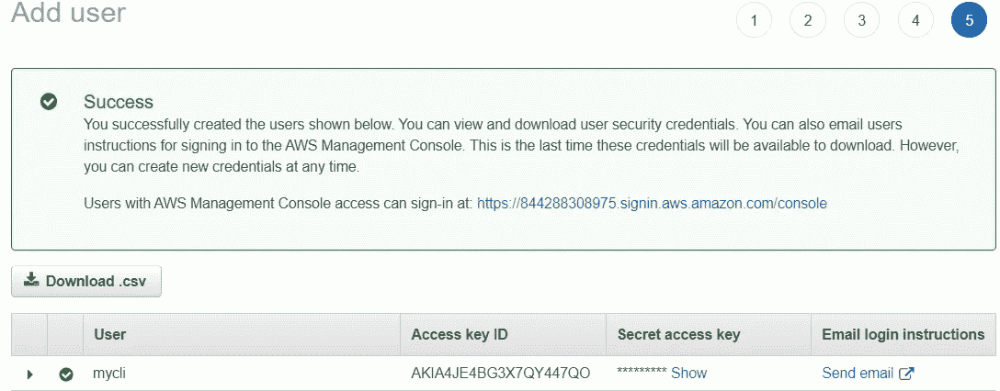

访问密钥 ID 和秘密访问密钥

→转到 CMD 并键入

```
aws configure
```

→输入访问密钥 ID、秘密访问密钥、区域和命令的输出格式(默认为 JSON)。


您已经完成了设置！

> ***实用***

本练习包括以下任务:

🔅创建密钥对

🔅创建安全组

🔅使用上面创建的密钥对和安全组启动一个实例。

🔅创建 1 GB 的 EBS 卷。

🔅最后一步是将上面创建的 EBS 卷连接到前面步骤中创建的实例

***1。创建密钥对*和**

```
aws ec2 create-key-pair --key-name myclikey
```

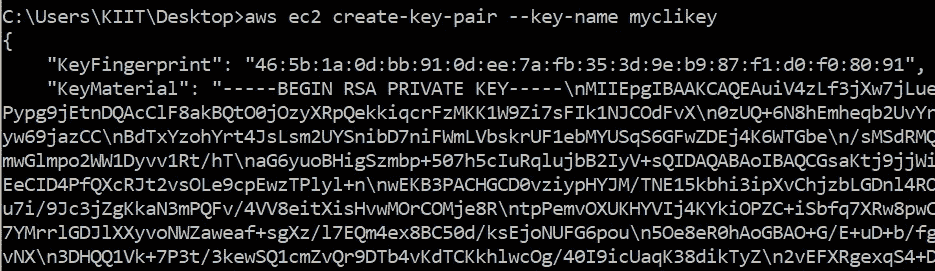

硬币指示器 （coin-levelindicator 的缩写）命令行界面（Command Line Interface for batch scripting）

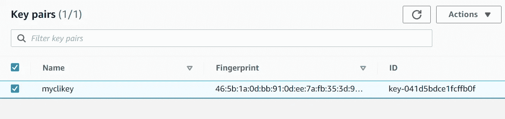

AWS 管理控制台

**2*。创建安全组***

```
aws ec2 create-security-group --group-name aws_cli_intro --description "aws cli" --vpc-id vpc-2ef81845
```

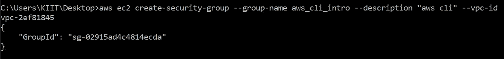

硬币指示器 （coin-levelindicator 的缩写）命令行界面（Command Line Interface for batch scripting）

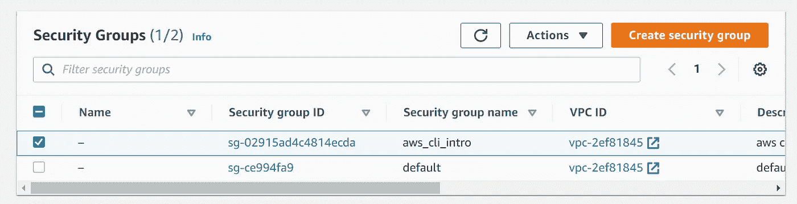

AWS 管理控制台

**向安全组添加入口规则:**

```
aws ec2 authorize-security-group-ingress -- group-id sg-02915ad4c4814ecda --group-name aws_cli_intro --protocol tcp --port 22 --cidr 0.0.0.0/0
```

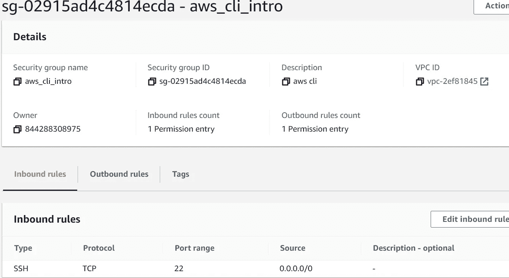

在 AWS 控制台中创建的规则

***3。启动 ec2 实例***

```
aws ec2 run-instances --image-id ami-0e306788ff2473ccb --instance-type t2.micro --count=1 --subnet-id subnet-1ce09f50 --security-group-ids sg-02915ad4c4814ecda --key-name myclikey
```

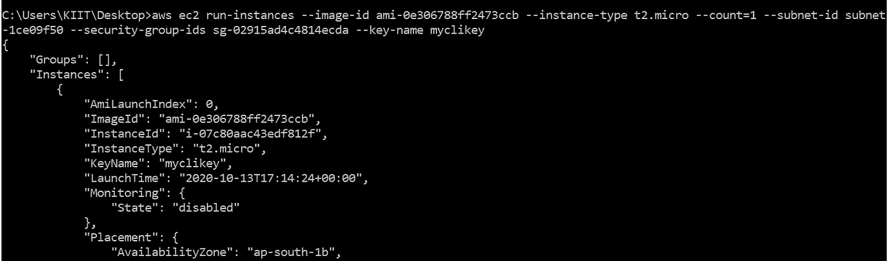

硬币指示器 （coin-levelindicator 的缩写）命令行界面（Command Line Interface for batch scripting）

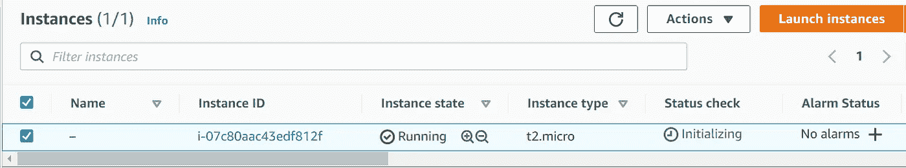

AWS 管理控制台

***4。创建 1 GB 的 EBS 卷***

```
aws ec2 create-volume --availability-zone ap-south-1b --size 1
```

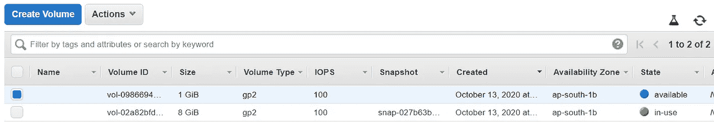

AWS 管理控制台

***5。将卷附加到实例***

```
aws ec2 attach-volume --volume-id vol-09866940fb6a5eb52 --instance-id i-07c80aac43edf812f --device=/dev/sdf
```

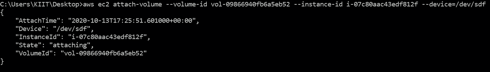

硬币指示器 （coin-levelindicator 的缩写）命令行界面（Command Line Interface for batch scripting）

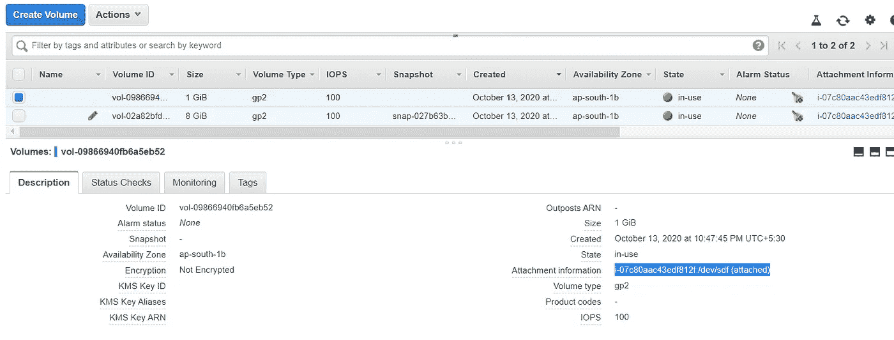

附卷

**现在我们可以使用**进行远程登录

```
ssh -l ec2-user <public IP> -i myclikey.pem
```

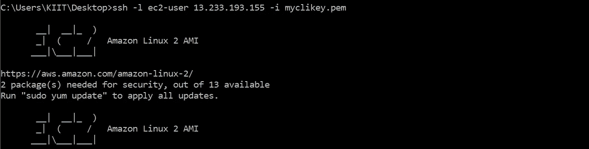

使用 SSH 连接到实例

**此外，创建分区并存储数据**

**→创建分区:**

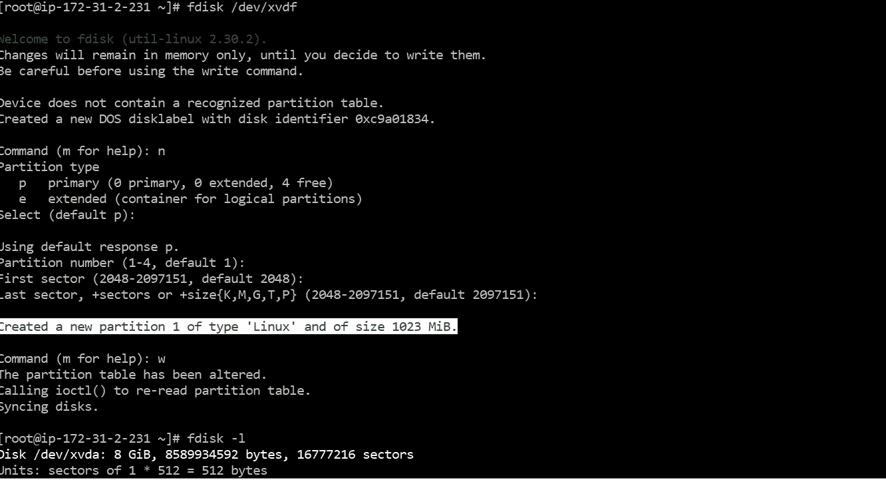

**→格式化分区:**

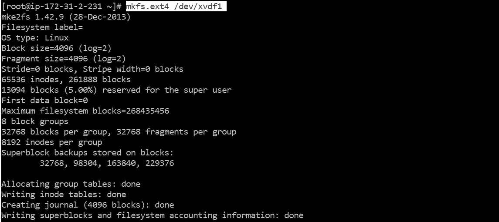

**→挂载分区:**


**你可以走了！**

谢谢你！希望你有一个美好的阅读 ⭐

如有任何疑问，请通过 [**联系我。**](https://www.linkedin.com/in/megha-bansal-8aa76996/)