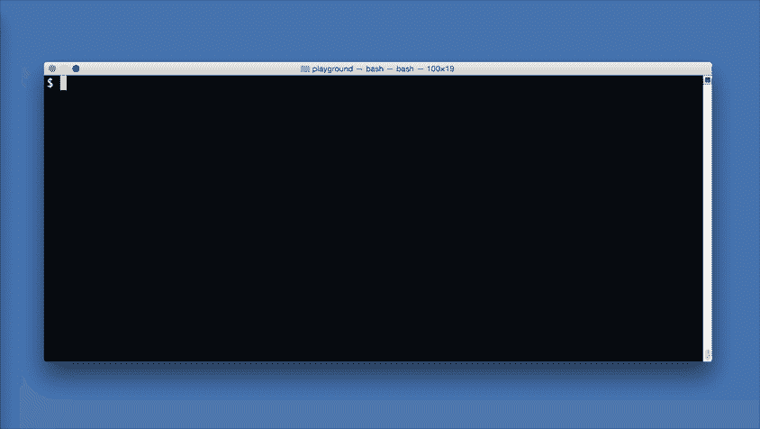
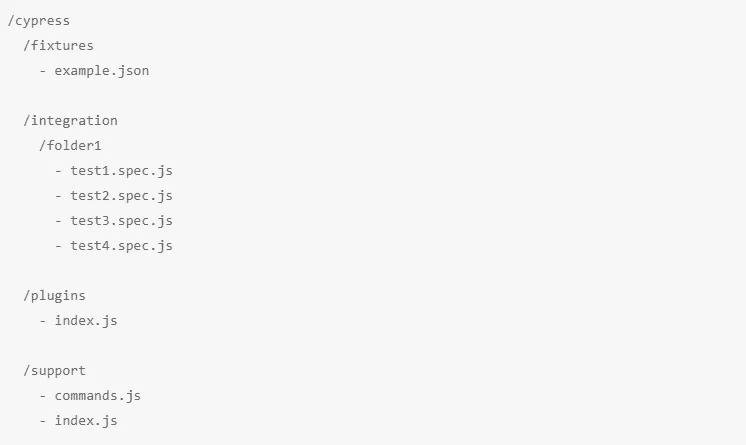
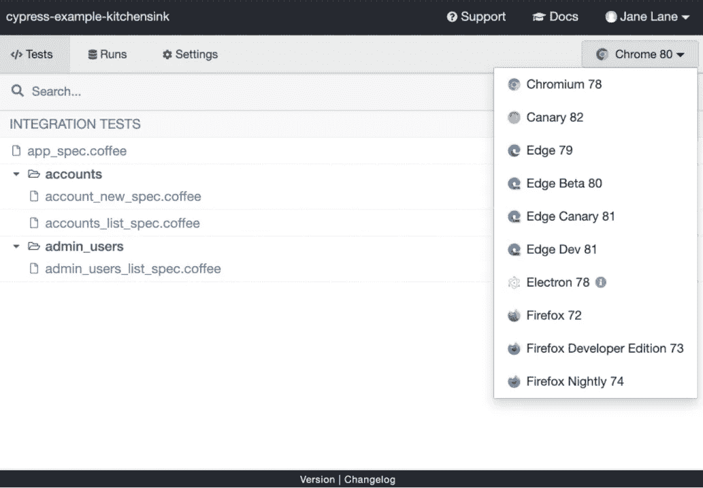
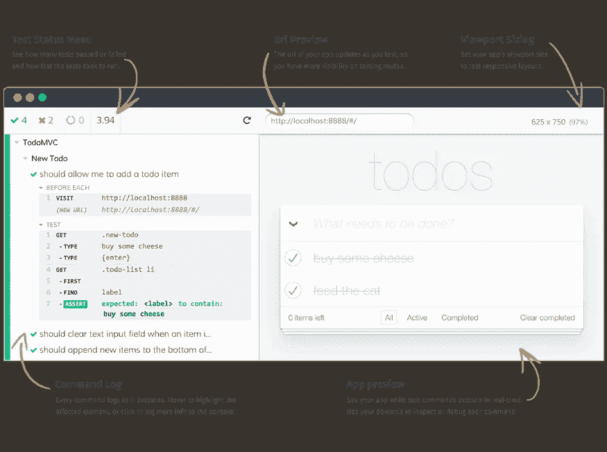

# Cypress 测试入门

> 原文：<https://medium.com/analytics-vidhya/getting-started-with-cypress-testing-ba8ffc8334a1?source=collection_archive---------20----------------------->

## 在编写 Cypress 测试之前需要知道的基础知识


**资料来源:automationpanda**

最近，**自动化**是我们在软件行业听到的热门词汇之一。今天，任何有自动化范围的东西都在被自动化。测试就是这样一个方面，它有很多自动化的空间，但是我们在自动化*测试*的过程时需要非常小心，因为这是软件开发周期中非常重要的阶段之一，并且给了我们

*   系统的可信度和质量分析
*   识别缺陷和减少系统缺陷的机会

在本文中，我们将讨论一种特定测试类型的自动化框架，即*端到端测试*。

***端到端测试*** 是一种通过模拟真实的用户行为来测试一个应用的流程从开始到结束是否如预期的那样运行的技术。

***Selenium*** 是一款浏览器自动化工具，多年来通过自动化浏览器动作被广泛用于 web 应用的 *E2E 测试*。

***Cypress*** 是一个相对较新的 *E2E 测试*框架，它被引入测试社区，获得了巨大的吸引力，并被广泛采用。

因此，本文的 ***目标*** 是为了了解编写测试之前需要了解的*柏树*的基础知识。

## 柏树是什么？

Cypress 是一个用 JavaScript 编写的测试工具，它是一个免费的开源库。它可以测试在浏览器中运行的任何东西，并且构建在非常著名的测试工具之上，如

*   ***【Mocha】***一个 JavaScript 测试框架，借用了**测试结构**`describe()``context()``it()``specify()`**钩子**`before()``beforeEach()``after()``afterEach()`。
*   ***柴，*** 一个 BDD & TDD 断言库。
*   ***Sinon，*** 一个 JavaScript 库，通过它可以创建间谍、存根和模仿。

既然 Cypress 拥有测试所需的一切，我们可以在安装它之后马上开始编写测试***。***

## ***柏树 vs 硒***

***我打赌你已经有这个问题了。关于这一点有很多讨论，因为在选择自动化测试的理想工具之前，测试人员比较这两个著名的框架是很自然的。***

***用外行人的话来说，这两个框架的区别是***

*   ***Selenium 在浏览器外运行****通过 web 驱动向浏览器发送远程命令*** ，而 Cypress 在浏览器 内运行 ***并使用底层浏览器 API 和 DOM 事件来执行命令。******* 
*   **Selenium 测试可以用 ***编写 ***多种语言*** 和 it*****多种浏览器*** 而 Cypress 测试只能用 Javascript***** 编写 ***和 ***不支持很多现代浏览器*** (目前)。
    ***底线:*** 如果你是不熟悉 JS 的 QA 或者开发人员，上手 Cypress 是有点挑战的。*****
*   *登上 Cypress 非常简单，因为所有东西都是一个命令包(Cypress 的安装将在下一节中详细介绍)，而登上 Selenium 则需要花费一些时间，因为我们需要安装 web 驱动程序、断言库和其他所需的依赖项。
    ***底线:*** 登上 Cypress 非常简单容易。*

*如果有兴趣了解更多关于 Selenium 和 Cypress 之间的不同/相似之处，这里有一些有用的链接*

*   *[【网上研讨会】Cypress vs Selenium web driver——更好，还是只是不同？—带吉尔·塔亚尔](https://www.youtube.com/watch?v=D7vxFuwnUio&feature=youtu.be)*
*   *[柏树 vs 硒:主要区别](https://www.browserstack.com/guide/cypress-vs-selenium)*
*   *Selenium vs . Cypress:web driver 要被淘汰了吗？*

**

*快速演示我们将在本文中了解的内容。**来源:**[**Cypress-GitHub-Readme**](https://user-images.githubusercontent.com/1271364/31740846-7bf607f0-b420-11e7-855f-41c996040d31.gif)*

## *安装 Cypress*

*Cypress 是一个安装在我们电脑上的桌面应用程序。桌面应用程序支持以下操作系统:*

*   *macOS 10.9 及以上*(仅限 64 位)**
*   *Linux Ubuntu 12.04 及以上，Fedora 21 和 Debian 8 *(仅限 64 位)**
*   *Windows 7 及更高版本*

*通过执行项目文件夹中的以下命令，Cypress 可以轻松安装 **npm** 和 **yarn** 。*

*   *`npm install cypress --save-dev`*
*   *`yarn add cypress --dev`*

*一旦下载了 cypress，我们可以通过下面的命令`./node_modules/.bin/cypress open`打开 Cypress。呃…我已经忘记命令了😅。更好的方法是将以下内容添加到您在`package.json`的`scripts`字段中*

```
*{   
    "scripts": {     
       "cypress:open": "cypress open"  
     } 
}*
```

*现在我们可以通过`npm run cypress:open`或`yarn cypress:open`打开柏树，柏树测试滑道将立即启动。我们将在本文后面讨论更多关于 Cypress 测试运行程序的内容。*

> *如果项目中没有使用 Node 或`*npm*`，也可以通过从 CDN 下载来直接安装 Cypress(更多关于直接下载的信息可以在[这里](https://docs.cypress.io/guides/getting-started/installing-cypress.html#Direct-download)找到)*

## *了解文件夹结构*

*一旦 Cypress 被添加到项目中，它会自动在根目录中创建以下文件夹结构。在`cypress.json`的帮助下，我们可以按照自己的意愿配置文件夹结构(测试、夹具和支持文件所在的位置)，但是下面显示的文件夹结构被 cypress 社区广泛使用并强烈推荐。*

**

*柏树文件夹结构。**来源:作者***

*现在让我们来讨论一下上述文件夹结构中每个文件夹的重要性*

1.  ****Fixtures:*** 这是一个文件夹，我们可以在其中存储运行时测试可以使用的静态数据。简而言之，我们可以存储配置文件、模拟网络请求/API 调用的响应数据等。更多关于灯具的信息可以在[这里](https://www.toolsqa.com/cypress/fixtures-in-cypress/)找到*
2.  ****集成:*** 这是我们默认放置所有测试文件的文件夹。在**集成中，**我们可以根据需要进一步创建嵌套的逻辑文件夹。*
3.  ****插件:*** 这是一个文件夹，我们可以在其中输入代码，修改或改变 Cypress 的内部行为。我们可以使用插件以编程方式改变已解析的配置和环境变量，例如，如果我们必须向浏览器注入定制选项，如接受证书，或者在测试用例通过或失败时进行任何活动，或者处理任何其他事件，如处理屏幕截图。它们使您能够扩展或修改 Cypress 的现有行为*
4.  ****支持:*** 这是一个文件夹，我们可以将 ***可重用代码*** 以自定义命令的形式放入其中，这些代码对所有测试文件都可用。一个经典的用例是创建定制命令`login()`，它可以在所有需要登录的测试文件中重用。*

*Cypress 会在每次测试文件前自动运行`cypress/plugins/index.js`和`cypress/support/index.js`。在 ***插件&支持*** 文件夹中，我们可以有不止一个文件/文件夹(逻辑上可以理解)，但最终所有东西都要导入到各自文件夹的`index.js`中。*

## *赛普拉斯试跑者*

*从上面的一段中，我们知道当我们执行`npm run cypress:open`时，Cypress 测试运行器将被打开。现在我们来讨论一下。*

*Cypress Test Runner 是一个交互式的*桌面 GUI* ，它列出了`cypress/integration`文件夹中所有可用的测试文件。在右上角，我们可以选择一个浏览器实例来运行我们的测试。*

**

*赛普拉斯试跑者。**来源:** [**柏树文档**](https://docs.cypress.io/guides/getting-started/installing-cypress.html#Switching-browsers)*

*在选择一个测试文件时，Test Runner 会打开一个浏览器实例(在上面的步骤中选择的),它允许我们在命令执行时查看命令，同时查看测试中的应用程序。它有两个重要部分，即 ***命令日志*** 和 ***App 预览****

**

*赛普拉斯试跑者。**来源:** [**柏树文档**](https://docs.cypress.io/guides/core-concepts/test-runner.html#Overview)*

***命令日志:**这是正在执行的测试套件的可视化表示。它记录顺序执行的命令。每个测试块都被正确嵌套，对于每个块，当点击时，显示在测试块中执行的每个 Cypress 命令和断言，以及在相关的`before`、`beforeEach`、`afterEach`和`after`钩子中执行的任何命令或断言。我们还可以通过悬停在命令日志中的日志上，在测试套件执行流程中进行时间旅行，即当我们悬停在日志上时，我们可以看到应用程序(这可以在应用程序预览中看到)正在恢复到命令执行时的状态。*

***App 预览:**显示被测应用(AUT)。简而言之，这是正在测试的应用程序的模拟 UI，我们可以看到 UI 是如何基于测试文件*中指定的操作而改变的。*这里 AUT 不仅可见，而且完全可以交互。我们可以打开开发工具(右键单击→检查)来检查元素，就像在普通浏览器中一样。DOM 完全可以用于调试。*

*关于赛普拉斯测试赛跑者提供的许多其他令人惊奇的特征的更多信息可以在这里找到。*

*至此，我们已经知道了开始编写 Cypress 测试所需要知道的一切。因为已经有很多精彩的、解释清楚的文章了，所以我们*

## *延伸阅读:*

1.  ****编写 Cypress 测试:*** 有很多令人敬畏且解释清楚的文章。我个人感觉官方的[柏树文档](https://docs.cypress.io/guides/getting-started/writing-your-first-test.html#Add-a-test-file)是最好的。*
2.  ****异步性质的柏树命令****
3.  ****命令链****
4.  ****断言和超时****