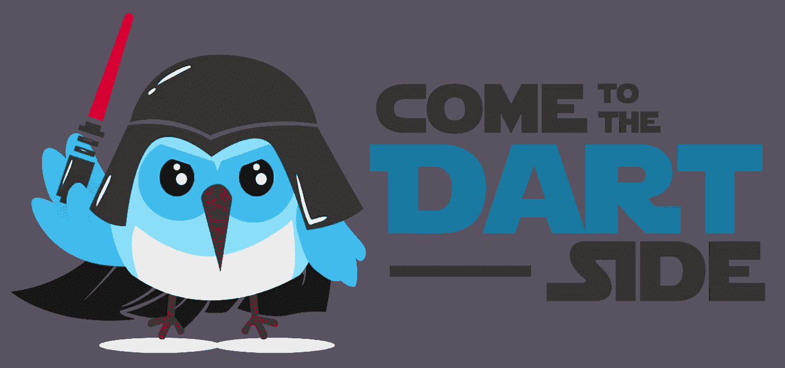

# Dart 入门:基础知识

> 原文：<https://medium.com/analytics-vidhya/getting-started-with-dart-the-basics-24ac13efbc27?source=collection_archive---------19----------------------->

## 深入探讨飞镖郎的基本原理。

戴着达斯·瓦达头盔的飞镖鸟欢迎你加入飞镖队

答是的，所以，如果你正在学习 Dart，你*可能*想用 **Flutter 制作应用。**虽然这从来不是开发 Dart 的目的(最初是为了取代 JavaScript)，但它是未来最有前途的语言之一。