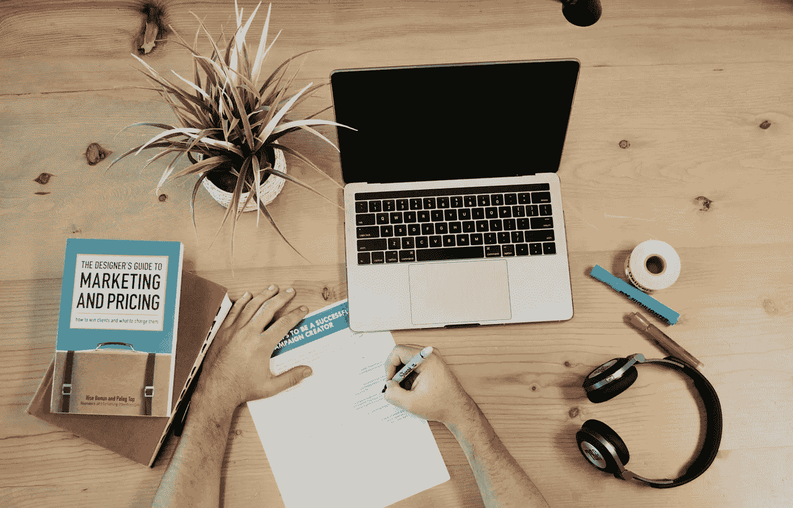

# 通过清理数据开始学习数据科学

> 原文：<https://medium.com/analytics-vidhya/getting-started-with-data-science-by-cleaning-up-data-f16dfeab0d32?source=collection_archive---------14----------------------->

[活动发起人](https://unsplash.com/@campaign_creators?utm_source=unsplash&utm_medium=referral&utm_content=creditCopyText)在 [Unsplash](https://unsplash.com/t/business-work?utm_source=unsplash&utm_medium=referral&utm_content=creditCopyText) 上的照片

## Hy 各位，这是我在数据科学领域的第一个起点。在本文中，我将分享我在 Python 上进行简单数据清理的经验。

# **简介**