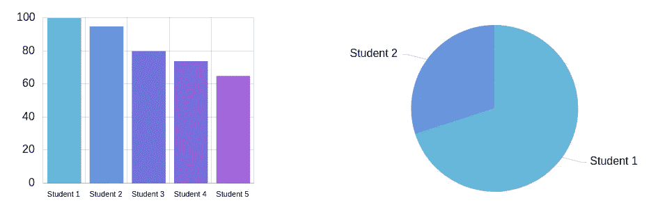
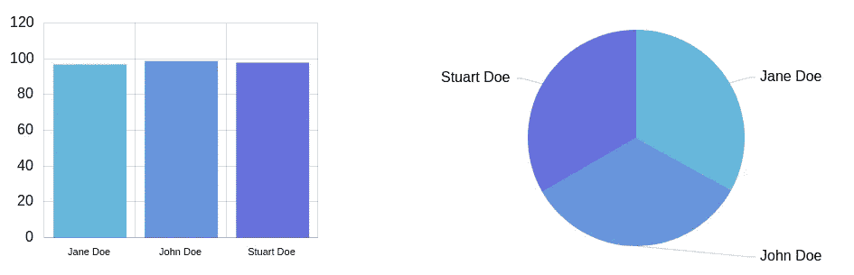

# 数据可视化入门

> 原文：<https://medium.com/analytics-vidhya/getting-started-with-data-visualization-1718053f474?source=collection_archive---------27----------------------->

照片由[法比奥](https://unsplash.com/@fabioha?utm_source=medium&utm_medium=referral)在 [Unsplash](https://unsplash.com?utm_source=medium&utm_medium=referral) 上拍摄

可视化主要是了解数据集的细节。领域专业知识带来了更好的数据可视化。如果不消化数据集的关系和边界，不关注您想要显示的内容，了解所有的数据可视化工具对您没有帮助。

另一方面，如果你是一个领域专家，即使是最简单的工具也能为你创建很好的数据视觉效果。因此，在本文中，让我们来了解一下更好的数据可视化的必备条件。在此之前，如果你不熟悉什么是数据可视化，请先阅读[这篇关于它的文章](https://dataforvisualization.com/data-visualization/)。

# 1-了解领域

了解您的数据包含哪些内容非常重要。例如，如果您的数据是学生成绩的集合，可能您希望看到最成功的学生。要做到这一点，你必须知道评分标准。因为数据可视化工具关系到它是否是一个字母等级。

**用例；显示前 3 名学生**

如果你不知道评分标准是如何应用的，通过简单的计算，你可能会认为显示前 3 名 A+的学生就足够了，这可能是错误的。我们再考虑一下。

我们的样本学校有 10K 学生，假设有 100 个 A+成绩。现在，您用一个简单的选择查询列出了前 3 名学生，并使用表视图来可视化这些数据。

此列表是最常见的排序方式的结果。因为等级相同，所以按名字排序。根据[美国评分标准](https://en.wikipedia.org/wiki/Academic_grading_in_the_United_States)，A+表示 97–100%。所以这个数据可视化的问题是，我们不知道这些学生的百分比是否是 100%。

让我们问一些问题来深入了解细节。

*   这个评分系统的基础是什么？
*   是某种字母或数字的聚合吗？
*   如果是数字，规模是多少？0–100, 0–10, 0–5?
*   你为什么从整个名单中选择这些学生？大一和大四没有区别吗？

如果我们不知道答案，即使我们的分组也可能是错误的。因此，您必须了解该领域的细节，以提供有用和正确的数据视觉效果。

# 2-了解数据可视化工具

好了，现在我们有了一些领域的专业知识，下一步是什么？

当然，我们需要知道展示什么和如何展示。在本节中，我们将介绍如何展示零件。

有很多数据可视化工具，如果你根据自己的背景选择，它们大多是易于使用的组件。例如，**python 的数据可视化工具**看起来更容易，如果你有用 python 编码的经验。另一方面，大多数工具以某种方式支持不同的编程语言和环境。

您不必学习数据可视化库，而是必须关注它们提供了什么，以及如何根据您的需求定制它们。当然，您必须首先学习数据可视化工具的基础知识。这样，让我们来看两个著名的图表，如**条形图**和**饼图**。

我们通常使用条形图来显示和比较数字、频率等。同样，饼图也便于显示比例对比。参见下面的例子。

# 3-体验你学到的东西

因此，我们谈论学习领域和数据可视化工具。现在，我们必须根据经验使用这些信息。如您所见，这两个图表都可以根据其功能来可视化这些数据。让我们把它们放在一起，看看现实中会发生什么。

如你所见，有两个数据图像，相同的数据告诉我们不同的事情。显示赢家的条形图略有不同。另一方面，饼状图告诉你它们几乎是一样的。但是在开始的时候，我们必须展示前三名的学生，我想这也意味着展示他们的顺序。

因此，饼图不会帮助您完成这项任务。为了更好地理解，你必须挖掘细节。

*原载于 2020 年 1 月 7 日 https://dataforvisualization.com**[*。*](https://dataforvisualization.com/getting-started/)*