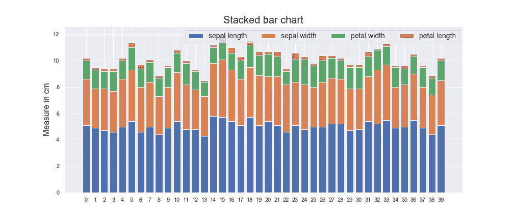

# 使用 Matplotlib 开始数据可视化

> 原文：<https://medium.com/analytics-vidhya/getting-started-with-data-visualization-using-matplotlib-f5c6fbb9f421?source=collection_archive---------37----------------------->


由 [Webaroo](https://unsplash.com/@webaroo?utm_source=medium&utm_medium=referral) 在 [Unsplash](https://unsplash.com?utm_source=medium&utm_medium=referral) 上拍摄的照片

探索和分析数据是任何数据科学项目中最重要的部分之一。然而，从统计角度探索数据会给你带来深刻的见解，但是，数据的可视化可以向你展示一些显而易见而你看不到的东西。

Matplotlib 是一个用 python 编写的广泛而健壮的库。在这篇文章中，我只打算触及它的表面。与其说这是一篇文章，不如说是一篇教程。

**本教程包含:-**

1.  设置和下载数据
2.  线条
3.  柱状图
4.  酒吧
5.  馅饼
6.  分散

**设置并下载数据**

本教程的必需软件包是 pandas、numpy 和 matplotlib。您可以使用 pip 命令从 python 命令行下载这些包。

```
pip install matplotlib
pip install pandas
pip install numpy
pip install sklearn
pip install seaborn
```

从 [**这里**](https://github.com/mrcaptain28698/Data_visulaization_with_matplotlib_part_1) **下载数据。**

打开 jupyter 笔记本，导入所需的包。

```
import pandas as pd
import numpy as np
import matplotlib.pyplot as plt
import seaborn as sns
sns.set() # it will make graphs look better. Try without it also, you will see the difference by yourself.
%matplotlib inline # magic command 
```

## **线**

```
data= np.random.randint(0,10,size=5)
plt.plot(data)
```


简单线图

使用 plot()函数渲染线条。

1.  接受单个 iterable #必需参数
2.  值沿 y 轴绘制
3.  x 轴值默认为从零开始的连续整数
4.  默认情况下，线条的颜色是蓝色

```
data= [50, 60, 39 ,56, 78,80, 48, 29, 89, 38]
labels=['A', 'B','C' ,'D', 'E', 'F', 'G','H', 'I','J']
plt.figure(figsize=(5,3))
plt.plot(data)
plt.xticks(ticks=np.arange(10), labels=labels)# ticks list or ndarray  and labels is list
plt.xlabel("Characters", fontsize=16)
plt.ylabel("Values", fontsize=16);
plt.title("Line Plot", fontsize=20);
```


上述代码片段的输出

“X”和“Y”轴上的刻度可以由 matplotlib.pyplot 包提供的 xticks()和 yticks()方法控制。在 xticks()和 yticks()中，我们还可以提到标签来定制刻度的标签。注意:**ticks 中的标签不同于 xlabel()和 ylabel()**

***颜色和款式***

*styles = ['实线'，'虚线'，'点划线'，'虚线'，'无']*

```
*for i, sty in zip(np.arange(10), styles):
    plt.plot(np.arange(10)+i, ls=sty, linewidth=i+5)*
```

**

*上述代码片段的输出*

1.  *我们可以通过给“颜色”关键字或“c”赋值来设置线条的颜色。可能的值可以是任何十六进制颜色代码。有 8 种常用的颜色，我们可以直接用它们的名字来提及:红色、蓝色、洋红色、黑色、黄色、绿色、青色、白色。你可以用缩写代替他们的名字，缩写将是名字的第一个字母，除了 black，我们用 k 来消除 blue 和 black 之间的歧义。即使我们不提及线条的颜色，matplotlib 也会根据循环将不同的颜色分配给单个图形中的不同线条。我们可以改变色彩循环，也可以定制我们自己的循环。如果你想了解更多关于 cycles**[**的信息，请点击这里**](https://matplotlib.org/tutorials/colors/colors.html)***
2.  ***线型:matplotlib 提供了 5 种不同的线型，如图所示。***
3.  ***linewidth:可选整数参数，用于自定义线条的宽度。***

```
***styles = [':','-.','-','--',' '] #linestyle can also be provided as abbreviations
for i, sty in zip(np.arange(10), styles):
    plt.plot(np.arange(10)+i, ls=sty, linewidth=i+5)***
```

******

***上述代码片段的输出***

```
***# There is one more method to control the line style 
plt.plot(np.arange(10), linestyle=(3, (1, 10, 5, 1)), linewidth=5);
plt.plot(np.arange(10)+1, linestyle=(3, (1, 2, 4, 1)));***
```

******

***上述代码片段的输出***

***这种类型的线称为虚线元组引用。它给程序员更精细的控制。我们需要提供开关序列的偏移量和偶数。linestyle= (3，(1，2，4，1))它的意思是(offset，(1pt on，2pt off，4pt on，1pt off))一个开关序列(1，1)将给出虚线。***

****实际例子****

```
***iris_data = pd.read_csv('iris_with_cluster.csv')
plt.figure(figsize=(10,6))plt.plot(iris_data['sepal_length'], linestyle="solid", linewidth=2, color='r', solid_joinstyle='miter', label="Sepal length")plt.plot(iris_data['sepal_width'], linestyle="-.", linewidth= 2, color= "black", label="Sepal Width")plt.plot(iris_data['petal_length'],linestyle='dashed', linewidth=1, color="green", dash_capstyle= "butt", label="Petal length") 
plt.plot(iris_data['petal_width'], linestyle=(0,(1,1,1,1)), linewidth=2, color="magenta", label="Petal Width")
plt.legend(loc="upper left",ncol=2, fontsize=12)
plt.ylabel("In cm", fontsize=16)
plt.title("Iris data line plot", fontsize=20);***
```

******

***solid_joinstyle:控制每个数据点处线条的接合样式。可用选项有“斜接”、“圆形”和“斜角(切角)”。***

***dash_capstyle:适用于虚线。可用选项有“对接”、“圆形”和“突出”。***

***有比这更多的线阴谋。正如我在开始时所说的，这只是表面，你想了解更多，请访问 matplotlib 的官方文档。***

## ***柱状图***

***直方图用于可视化数据的频率分布。这与我们在统计中计算的一样，即有多少数据点落在区间内。***

***直方图由 **hist()** 函数生成:***

1.  ***接受数据集***
2.  ***将数据集分成相等的间隔。将值与每个间隔匹配***
3.  ***在 X 轴上绘制间隔，在 Y 轴上绘制频率。***

******

***输出***

```
***data = np.random.randn(1000)
plt.hist(data)***
```

***通过提供 bin 参数，我们可以自定义间隔的数量。箱数越多，显示的细节越多。***

******

***输出***

```
***data = np.random.randn(1000)
plt.hist(data, bins=20)***
```

***更多的箱数也会扭曲图形***

```
***data= np.random.randn(10000)
plt.hist(data,bins=70,histtype='step',cumulative=True,label='cdf <')
plt.hist(data,bins=70,histtype='step',cumulative=True,label='cdf >')
plt.legend(loc='upper center', fontsize=16)***
```

******

***输出***

***通过提供累积(布尔)参数，我们可以得到数据的累积分布。真值将给出“大于(经验)”值，而-1 值将绘制“小于(修正经验)”图。***

***histtype:通过提供 histtype 参数，我们可以控制 bin 样式。可用选项有“步进”、“步进填充”、“条形(不等箱宽)”。***

***您可以提供与线形图相同的颜色参数。***

****实际例子****

```
***plt.figure(figsize= (10,6))
plt.hist(iris_data['sepal_length'], bins=25, histtype='step', label='sepal length')
plt.hist(iris_data['sepal_width'], bins=25, histtype='step', label='sepal width')
plt.hist(iris_data['petal_length'], bins=25, histtype='step', label='petal length')
plt.hist(iris_data['petal_width'], bins=25, histtype='step',label='petal width')
plt.legend(loc='upper right', fontsize=16)
plt.title("Iris data Histogram plot", fontsize=20)
plt.xlabel('Measure in cm', fontsize=16)
plt.ylabel('Frequency', fontsize=16)***
```

******

***现在我们来看条形图。***

## ***条形图***

***条形图也称为柱形图。它的工作原理和折线图一样，但是它不是绘制一个点，而是绘制一个高度等于 y 坐标的条形。它看起来有点像直方图，但不是。***

***它用 bar()函数绘制:
1。它需要两个必需的参数。
2。首先是 X 坐标值。主要是要绘制的数据的长度。
3。第二个必需参数是 y 坐标值。
4。条形越高，值越大。***

******

***输出***

```
***plt.bar(np.arange(20), np.random.randint(0,40,20))
plt.xticks(ticks=np.arange(20));***
```

***颜色和刻度都与上述相同。***

******

***输出***

```
***labels=['A', 'B', 'C', 'D','E','F','G','H','I','J','K','L','M','N','O','P','Q','R','S','T']
plt.barh(np.arange(20), np.random.randint(0,20,20))
plt.yticks(ticks=np.arange(20), labels=labels)***
```

***使用 barh()函数，我们可以绘制水平条。注意:我们不需要交换传递的参数。条形的长度代表数值的大小。从这里我将展示一些先进的条形图与实际例子的帮助。***

****实际例子****

```
***plt.figure(figsize=(14,6))
length= 40
sepal_length=iris_data['sepal_length'][:40]
sepal_width=iris_data['sepal_width'][:40]
petal_length = iris_data['petal_length'][:40]
petal_width=iris_data['petal_width'][:40]
plt.bar(np.arange(length), sepal_length,label='sepal length' )
plt.bar(np.arange(length), sepal_width, label='sepal width', bottom=sepal_length)
plt.bar(np.arange(length), petal_length, label='petal width', bottom=sepal_length+sepal_width)
plt.bar(np.arange(length), petal_width, label='petal length', bottom= sepal_length+sepal_width+petal_length)
plt.legend(loc='best', fontsize=14, ncol=4)
plt.xticks(ticks= np.arange(40))
plt.title('Stacked bar chart', fontsize=20)
plt.ylabel('Measure in cm', fontsize=16)***
```

******

***输出***

*****堆积条形图**在同一图中用连续的条形()函数绘制。我们可以用它来可视化多个数据集并进行比较。在堆积条形图中，我们绘制了一个数据集相对于另一个数据集的值。x 和 Y 坐标值将与之前相同。通过提供“bottom”关键字参数，您可以确保一个图不会掩盖之前绘制的图。它告诉 matplotlib 应该从 y 坐标的什么位置开始计数。“标签”的作用与线条或直方图相同。***

***我们可以水平绘制同样的柱状图。只需用 barh()改变 bar()，用 left 改变 bottom 参数。使用这种可视化，我们可以比较它们的值的范围。这里绘图显示一个花瓣长度值最小。在使用它来训练模型之前，我们可能必须将它们规范化。***

```
***data=iris_data.groupby('cluster').mean()
group_width=0.8
x=data.shape[0]
plt.figure(figsize=(10,6))
plt.bar(np.arange(x)- group_width/4, data['sepal_length'], width=group_width/4, label='Sepal length' )
plt.bar(np.arange(x)-group_width/2, data['sepal_width'], width=group_width/4, label='Sepal width')
plt.bar(np.arange(x) , data['petal_length'], width= group_width/4, label='Petal length')
plt.bar(np.arange(x)+group_width/4, data['petal_width'], width=group_width/4, label='Petal width')
plt.legend(loc='upper left', fontsize=14, ncol=2)
plt.ylabel('Mean length/Width(in cm)', fontsize=14)
plt.xlabel('Cluster', fontsize=14)
plt.title('Grouped bar chart', fontsize=18)***
```

******

***输出***

***组合条形图与堆积条形图几乎相同，但它不是一个一个地显示值，而是显示彼此平行的值。所有 bar()函数的 x 坐标会不同。在第一个图中，X=np.arange(x)- group_width/4 将在(0–0.8/4 =)-0.2(-0.2 到 0)处绘制萼片 _ 长度，即蓝色条。在第二个条形图()中，函数 X= np.arange(x)- group_width/2 将在(0–0.8/2 =)-0.4(-0.4 到-0.2)处绘制橙色条形图(sepal_width)。绿色条(花瓣长度)将从 0 到 0.2，红色条(花瓣宽度)将从 0.2 到 0.4)。下一组的橙色棒线将从(1–0.8/2 =)0.6 到 0.8 开始。两组之间的间距为(1- group_width= ) 0.2。每个图的宽度应为组宽度的 1/4，以消除歧义。两个条形图显示花瓣宽度具有最低值范围，萼片长度具有最高值，这是显而易见的。因此我们的数据是正确的。“width”参数控制条形的宽度。***

***尝试在水平条形图中绘制相同的图。在堆积条形图中，您只需通过 barh()更改 bar()，通过 left 参数更改 bottom 参数。输出应该如下图所示。***

******

***堆积条形图(水平)***

## *****饼状图*****

*   ***它代表整体的一部分。
    -仅显示单个数据集。
    -所有数值均显示为与 360 度圆相关的百分比。
    -每个楔形显示为不同的颜色。
    -百分比值相加为 100%。
    -每个值的大小与值的总和成正比。
    -每个值被表示为数据集的切片。***

******

***输出***

```
***wedges=[38, 45, 56 ,78]
plt.pie(wedges);***
```

***饼图是用 Pie()绘制的:一个必需的参数是 dataset。***

```
***labels=['Highly unsatisfied', 'unsatisfied','satisfied','Highly satisfied']plt.pie(wedges, labels = labels, rotatelabels=True,           labeldistance=1.2, autopct='%0.2f%%');***
```

******

***输出***

*   ***“labels”参数接受列表。默认情况下，它以相应的颜色显示标签。***
*   ***rotatelabels 的参数接受布尔值。将标签旋转相应的角度。***
*   ***“labeldistance”参数接受浮点值。它是半径=1 时标签到圆心的距离。***
*   ***“autopct”参数接受格式字符串。它在圆圈内的楔形上显示百分比值。***

***根据这个图，如果有两条没有太大差别的边。肉眼很难识别。为此 matplotlib 提供了“explode”参数。***

```
***explosion = [0.3, 0, 0, 0]
plt.pie(wedges, labels= labels, autopct="%0.2f%%", explode=explosion, radius=1.2)
plt.savefig('pie3')***
```

******

***输出***

***“explode”参数接受浮点数组。浮点值显示了楔形分解的单位。值 0.0 不会分解楔形体。“radius”参数也接受浮点值。它控制圆的半径。***

****实际例子****

```
***data= iris_data.groupby('cluster').count()
data['count'] = data['sepal_length']
wedges = data['count']
labels= ['cluster 0', 'cluster 1', 'cluster 2', 'cluster 3', 'cluster 4', 'cluster 5', 'cluster 6']
explosion = [0, 0.2, 0, 0,0, 0.2,0]
plt.figure(figsize=(5,6))
plt.pie(wedges, autopct="%0.2f%%", radius=1.5, explode=explosion, startangle=90)
plt.legend(labels, loc=[1.2,0])
plt.title('Percentage of flowers in different clusters',pad=30, fontsize=16)***
```

******

*   ***“startangle”参数提供了绘制第一个楔形区的角度***

***你可以看到这条直线现在是 90 度角。***

*   ***title()函数中的“pad”参数为 y 轴上方的标题提供填充。它适用于教程中的所有地块。***

## ***散点图***

***散点图是 matplotlib 中使用最多的图。它显示各个点。秩序无关紧要。它显示了两个值之间的关系。在回归问题中，通过查看散点图，我们决定哪条曲线可以被拟合。***

******

***输出***

***它由 scatter()函数绘制:***

*   ***两个必需的参数。***
*   ***首先是 x 轴。***
*   ***第二个是 y 轴。***

```
***x= np.linspace(0, 50, 30)
y= np.log(x)
plt.scatter(x, y)***
```

******

***输出***

***即使我们改变了点，这个图还是和上面一样。这表明顺序对于散点图是不重要的。***

```
***import random
points = list(zip(x, y))
random.shuffle(points)
points = np.array(points)
plt.scatter(points[:,0],
points[:,1])***
```

******

***这个图是用小噪声绘制的。对数曲线表明它能很好地拟合数据点。***

```
***x= np.linspace(0, 50, 30)
y= np.log(x)+np.random.randn(30)*0.3
plt.scatter(x, y)
plt.plot(x, np.log(x), c= 'r')***
```

****实际例子****

```
***iris_data['sepal_area'] = iris_data['sepal_length']*iris_data['sepal_width']
iris_data['petal_area'] = iris_data['petal_length']*iris_data['petal_width']
x= iris_data['sepal_area']
y= iris_data['petal_area']
plt.figure(figsize=(8,6))
plt.scatter(x,y, c=iris_data['cluster'],s=iris_data['cluster']*15, cmap='hsv')
plt.xlabel('Sepal area', fontsize=14)
plt.ylabel('Petal area', fontsize=14)
plt.title('Iris data clusters', fontsize=20)***
```

******

***通过提供“s”参数，您可以控制每个点的大小。iris_data['cluster']的长度与点数相同。scatter()以迭代方式绘制每个点，因此每个点的大小可能不同。大小为绘图提供了额外的维度。c '参数也接受整数数组，给每个点不同的颜色。“c”参数用字符“c”连接整数，如 C0、C1 等。cmap 的参数提供了 C0、C1 等的颜色。cmap 的其他选项有'彩虹'，'地震'，'黄昏'，'移动 _ 黄昏'，'等离子'这些是我经常使用的。还有更多选项可用，查看 [***文档***](https://matplotlib.org/3.1.0/tutorials/colors/colormaps.html) ***。******

***我想现在你可以放心地绘制基本的情节了。对于更多的自定义绘图检查 matplotlib 的文档，这是惊人的。***