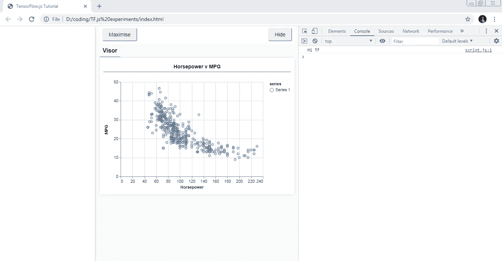

# TF.js 浏览器深度学习入门第 1 部分

> 原文：<https://medium.com/analytics-vidhya/getting-started-with-deep-learning-in-browser-with-tf-js-1e949b911e31?source=collection_archive---------25----------------------->


学分:tensorflow.org

如果你是机器学习的初学者，想开始在浏览器中开发模型，这是为你准备的，如果你已经知道 TensorFlow Python 包装器，并想探索 TF.js，你来对地方了！不像传统的博客，我相信实践学习，这就是我们在这里要做的。

所有的代码都在这里-

[](https://github.com/Rishit-dagli/Get-started-with-TF.js) [## rishit-dagli/Get-started-with-TF . js

### 一个简单的存储库，可以开始使用 TF.js 并开始制作简单的模型-Rishit-dagli/Get-started-with-TF . js

github.com](https://github.com/Rishit-dagli/Get-started-with-TF.js) 

# 可以用 TF.js 做什么？

*   运行现有模型

使用 TF.js，您可以非常轻松地使用现成的 JavaScript 模型或转换 Python TensorFlow 模型以在浏览器中或 Node.js 下运行，并且仍然拥有所有功能。

*   重新培训现有模型

使用您自己的数据重新训练预先存在的 ML 模型。如果你认为这有点像迁移学习，是的，但是是在浏览器本身。

*   用 JavaScript 开发 ML

最后，这里是最好的部分，您可以使用灵活而直观的 API 直接在 JavaScript 中构建和训练模型，就像您在 Python 中使用不同的关键字一样。

*   几乎支持一切！

TF.js 支持几乎任何库的开发，2020 年 2 月你问我之前；TensorFlow 团队也宣布支持 React Native，这可以让你去任何地方。

这个特性只是 TF.js 的一个总结，让它不可或缺。

# 你需要什么？

你所需要的只是最新版本的 chrome 浏览器和你自己选择的文本编辑器。就是这样。

# 开始吧！

我们将从创建一个简单的 HTML 页面并向其中添加 JavaScript 开始。

*   将以下代码复制到一个名为`index.html`的 HTML 文件中

*   将这段代码复制到一个名为`script.js`的文件中

```
console.log("Hello Home");
```

在网络浏览器中运行`index.html`文件。如果你使用 Chrome- Ctrl + Shift + I

对于其他浏览器，找到开发者工具选项。在控制台中，你现在可以看到，Hello Home 和两个运行时变量`tf`和`tfvis`。

# 加载数据并创建一些可视化

我们现在将创建一个模型并使用它。在本教程中，我们将使用“汽车”数据集。它包含了每辆车的许多不同特征。我们只想提取关于马力和每加仑英里数的数据。因此，我们将此代码添加到`script.js`

现在让我们创建一个可视化的数据散点图，并在`script.js`中添加这些代码

当您现在刷新页面时，您将能够看到一个很酷的数据散点图



数据的散点图

这个面板被称为遮阳板，由 [tfjs-vis](https://github.com/tensorflow/tfjs-vis) 提供。它提供了一个简单而美妙的地方来显示可视化。我们的目标是训练一个模型，它将接受一个数字，*马力*，并学会预测每加仑*英里数*。让；现在看看我们将如何做到这一点，我希望你知道监督学习和神经网络的基础知识。

# 模型

这是最有趣的部分，你将自己尝试和实验。现在让我们开始吧。如果你不了解神经网络，它是一种由一组神经元层组成的算法，这些神经元层的“权重”控制着它们的输出。该神经网络的训练过程学习这些权重的理想值，以获得最准确的输出。让我们看看如何制作一个非常简单的模型-

一个非常简单的模型

我们现在将分解并理解它的每一点。

```
const model = tf.sequential();
```

这将实例化一个`[tf.Model](https://js.tensorflow.org/api/latest/#class:Model)`对象。这个模型是`[sequential](https://js.tensorflow.org/api/latest/#sequential)`,因为它的输入直接流向它的输出。如果您使用过 Python 包装器，这看起来可能与您类似。

```
model.add(tf.layers.dense({inputShape: [1], units: 1, useBias: true}));
```

这为我们的网络增加了一个输入层*和一个隐藏单元，自动连接到一个“密集”层。`dense`层是一种将其输入乘以一个矩阵(称为*权重*)然后将一个数字(称为*偏差*)加到结果上的层。由于这是网络的第一层，我们需要定义我们的`inputShape`。`inputShape`是`[1]`，因为我们有`1`数字作为输入(给定汽车的马力)。`units` 设置图层中的权重矩阵有多大。通过在此将其设置为 1，我们说数据的每个输入要素将有 1 个权重。*

现在我们需要创建模型的一个实例，所以我们将把这一行代码添加到我们之前创建的 run 函数中

```
const model = createModel();                         tfvis.show.modelSummary({name: 'Model Summary'}, model);
```

现在我们已经有了模型，我们需要准备数据来输入神经网络。

# 准备数据

为了获得 TensorFlow.js 的性能优势，使训练机器学习模型实用化，我们需要将我们的数据转换为[张量](https://developers.google.com/machine-learning/glossary/#tensor)。我们还将对我们的数据执行一些最佳实践的转换，即**混排**和 [**规范化**](https://developers.google.com/machine-learning/glossary/#normalization) **。**将此添加到代码中-

我们来分析一下-

```
tf.util.shuffle(data);
```

在这里，我们随机排列将输入到训练算法中的示例的顺序。洗牌很重要，因为通常在训练期间，数据集被分解成更小的子集，称为批次，模型在这些子集上进行训练。这进一步帮助我们去除基于序列的偏见。

```
const inputs = data.map(d => d.horsepower)
const labels = data.map(d => d.mpg);

const inputTensor = tf.tensor2d(inputs, [inputs.length, 1]);
const labelTensor = tf.tensor2d(labels, [labels.length, 1]);
```

这里，我们首先将 2 个数组作为输入和标签数组，然后将其转换为张量。

```
const inputMax = inputTensor.max();
const inputMin = inputTensor.min();  
const labelMax = labelTensor.max();
const labelMin = labelTensor.min();

const normalizedInputs = inputTensor.sub(inputMin).div(inputMax.sub(inputMin));
const normalizedLabels = labelTensor.sub(labelMin).div(labelMax.sub(labelMin));
```

这里我们使用 [*最小-最大缩放*](https://en.wikipedia.org/wiki/Feature_scaling#Rescaling_(min-max_normalization)) *将数据标准化到数值范围`0-1`内。*规范化很重要，因为您将使用 tensorflow.js 构建的许多机器学习模型的内部设计是为了处理不太大的数字。标准化数据的常见范围包括`0 to 1`或`-1 to 1`。

```
return {
  inputs: normalizedInputs,
  labels: normalizedLabels,
  // Return the min/max bounds so we can use them later.
  inputMax,
  inputMin,
  labelMax,
  labelMin,
}
```

现在我们将最终返回数据和规范化界限。

# 结束的

这不是结束，我们将在后续博客中探索下一个过程。现在我们首先看到了 TF.js 的能力，然后我们做了一些很酷的可视化。之后我们做了一个超级简单的神经网络。然后，我们看到了如何预处理数据。接下来，我们将看看如何训练我们的网络并进行预测。

点击阅读下一篇博客[。](/@rishit.dagli/getting-started-with-deep-learning-in-browser-with-tf-js-d16e0908669e)

# 关于我

大家好，我是里希特·达利

领英—inkedin.com/in/rishit-dagli-440113165/[T21](https://www.linkedin.com/in/rishit-dagli-440113165/)

[网址](http://rishitdagli.ml) — rishit.tech

如果你想问我一些问题，报告任何错误，提出改进建议，给出反馈，你可以通过网站上的聊天框或给我发邮件——

*   rishit.dagli@gmail.com
*   hello@rishit.tech