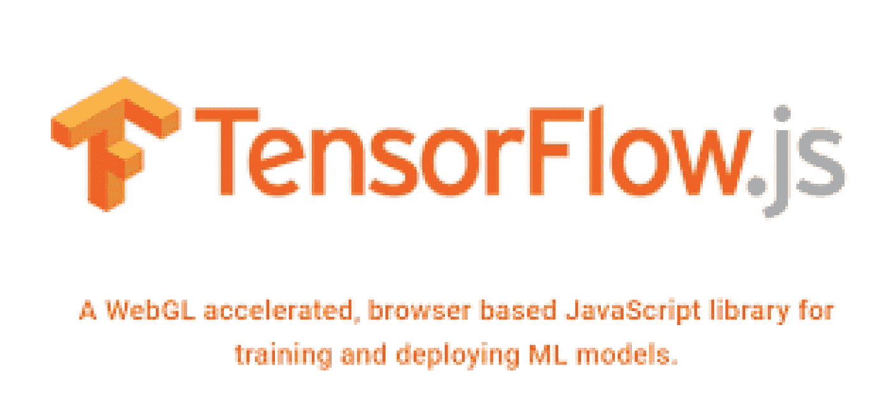
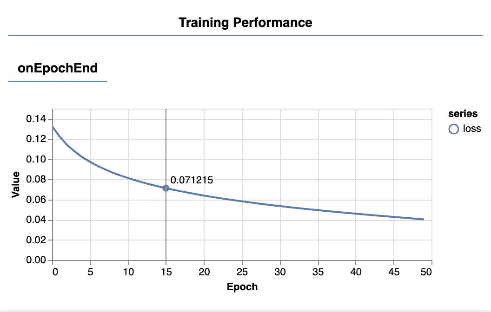
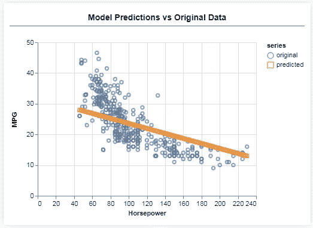

# TF.js 浏览器深度学习入门

> 原文：<https://medium.com/analytics-vidhya/getting-started-with-deep-learning-in-browser-with-tf-js-d16e0908669e?source=collection_archive---------33----------------------->



资料来源:tensorflow.org

如果你是机器学习的初学者，想开始在浏览器中开发模型，这是为你准备的，如果你已经知道 TensorFlow Python 包装器，并想探索 TF.js，你来对地方了！不像传统的博客，我相信实践学习，这就是我们在这里要做的。我建议你先在这里看一下[前传](/@rishit.dagli/getting-started-with-deep-learning-in-browser-with-tf-js-1e949b911e31)。

所有的代码都在这里-

[](https://github.com/Rishit-dagli/Get-started-with-TF.js) [## rishit-dagli/Get-started-with-TF . js

### 一个简单的存储库，可以开始使用 TF.js 并开始制作简单的模型-Rishit-dagli/Get-started-with-TF . js

github.com](https://github.com/Rishit-dagli/Get-started-with-TF.js) 

我们将继续我们在之前的博客中所做的。在上一篇博客中，我们制作了模型并对数据进行了预处理，现在让我们拟合模型并根据模型进行预测。

# 训练模型

随着我们的模型实例被创建，我们的数据被表示为张量，我们已经准备好开始训练过程了。将此代码添加到 script.js 中

现在让我们来分解一下。

```
model.compile({
  optimizer: tf.train.adam(),
  loss: tf.losses.meanSquaredError,
  metrics: ['mse'],
});
```

在我们训练它之前，我们必须“编译”这个模型。为此，我们必须指定一些非常重要的事情:

*   这是一种算法，当它看到例子时，它将控制模型的更新。TensorFlow.js 中有许多可用的优化器。这里我们选择了 adam 优化器，因为它在实践中非常有效，并且不需要任何配置。
*   `loss`:这是一个函数，它将告诉模型它在学习它所显示的每个批次(数据子集)方面做得如何。这里我们使用`meanSquaredError`来比较模型的预测值和真实值。

你可以在这里阅读更多关于他们的[。](/@rishit.dagli/get-started-with-tensorflow-and-deep-learning-part-1-72c7d67f99fc?source=---------2------------------)

```
const batchSize = 32;
const epochs = 50;
```

现在，我们将选择一个最佳的批量大小和时期

```
return await model.fit(inputs, labels, {
  batchSize,
  epochs,
  callbacks: tfvis.show.fitCallbacks(
    { name: 'Training Performance' },
    ['loss', 'mse'], 
    { height: 200, callbacks: ['onEpochEnd'] }
  )
});
```

`model.fit`是我们调用的启动训练循环的函数。这是一个异步函数，所以我们返回它给我们的承诺，以便调用者可以确定训练何时完成。为了监控训练进度，我们向`model.fit`传递一些回调。我们使用`tfvis.show.fitCallbacks`来生成函数，为我们之前指定的“损失”和“mse”度量绘制图表。

你刚刚做了一个模型，并且有了所有需要的函数来使它变得可追踪和合适，你现在会称之为这些函数。

# 调用模型

```
const tensorData = convertToTensor(data);
const {inputs, labels} = tensorData;

// Train the model  
await trainModel(model, inputs, labels);
console.log('Done Training');
```

当您将这段代码添加到`run`函数中时，您实际上是在调用模型拟合函数。当您现在刷新页面时，您将能够看到一个培训图表。



这些是由我们之前创建的回调函数创建的。它们在每个时期结束时显示整个数据集的平均损失和 mse。当训练一个模型时，我们希望看到损失降低。在这种情况下，因为我们的度量是对误差的度量，所以我们也希望看到它下降。

# 做预测

现在我们需要通过我们的模型进行预测，让我们这样做。将此添加到您的`script.js`中进行预测。

让我们来分析一下

```
const xs = tf.linspace(0, 1, 100);      
const preds = model.predict(xs.reshape([100, 1]));
```

我们生成 100 个新的“示例”来输入模型。Model.predict 是我们将这些例子输入模型的方式。请注意，它们需要具有与我们训练时相似的形状(`[num_examples, num_features_per_example]`)。

```
const unNormXs = xs
  .mul(inputMax.sub(inputMin))
  .add(inputMin);

const unNormPreds = preds
  .mul(labelMax.sub(labelMin))
  .add(labelMin);
```

这段代码将对数据进行非规范化，这样我就可以得到不为 0-1 的数据

现在让我们看看它的运行，把它添加到你的 run 函数中

```
testModel(model, data, tensorData);
```

你会得到类似的结果



# 结束的

我们创建了一个只有两层的中间模型，围绕超级参数调整看看你还能做什么。您只是在浏览器中使用 TF.js 完成了创建简单模型的基础工作，并创建了一些精彩的可视化效果。

# 关于我

大家好，我是里希特·达利

inkedin.com/in/rishit-dagli-440113165/[领英](https://www.linkedin.com/in/rishit-dagli-440113165/)—l[](https://www.linkedin.com/in/rishit-dagli-440113165/)

[网址](http://rishitdagli.ml) — rishit.tech

如果你想问我一些问题，报告任何错误，提出改进建议，给出反馈，你可以通过网站上的聊天框或给我发邮件——

*   rishit.dagli@gmail.com
*   hello@rishit.tech