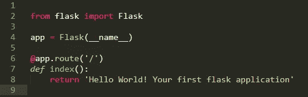
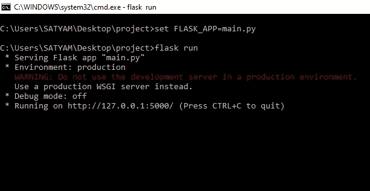
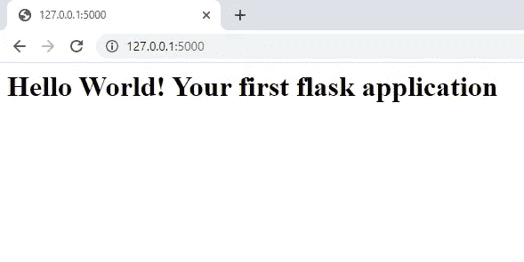
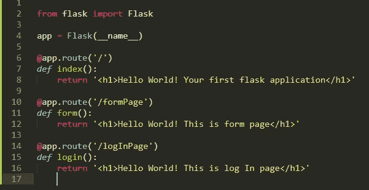
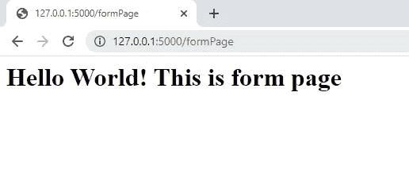
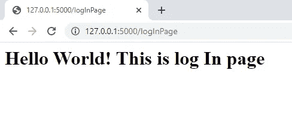

# 开始使用 FLASK

> 原文：<https://medium.com/analytics-vidhya/getting-started-with-flask-cf4c06134671?source=collection_archive---------17----------------------->

## 学习使用 Flask 框架从头开始开发应用程序


由 [Marvin Meyer](https://unsplash.com/@marvelous?utm_source=medium&utm_medium=referral) 在 [Unsplash](https://unsplash.com?utm_source=medium&utm_medium=referral) 上拍摄

**什么是烧瓶？**

*Flask* 是一个用 Python 写的微型 web 框架。它被归类为微框架，因为它不需要特殊的工具或库。它没有数据库抽象层、表单验证或任何其他组件，而现有的第三方库提供了通用功能。然而，Flask 支持可以添加应用程序特性的扩展，就好像它们是在 Flask 本身中实现的一样。

使用 Flask 框架的应用包括 [Pinterest](https://en.wikipedia.org/wiki/Pinterest) 和 [LinkedIn](https://en.wikipedia.org/wiki/LinkedIn) 。

**如何安装烧瓶？**

在 Python 中，像 Flask 这样的包可以在公共存储库中获得，任何人都可以从那里下载并安装它们。官方的 Python 包存储库叫做 [PyPI](https://pypi.python.org/pypi) ，代表 Python 包索引(有些人也把这个存储库称为“奶酪店”)。从 PyPI 安装一个包非常简单，因为 Python 附带了一个名为`pip`的工具来完成这项工作(在 Python 2.7 中`pip`没有与 Python 捆绑在一起，需要单独安装)。

要在您的机器上安装一个软件包，您可以按如下方式使用`pip`:

```
pip install Flask
```

**Flask 服务器页面中的组件:**

> Import flask class:这将创建 application 对象，作为从 flask 包导入的 Flask 类的实例。

```
from flask import Flask
```

> 实例化 flask 类:传递给`Flask`类的`__name__`变量是 Python 预定义的变量，它被设置为使用它的模块的名称。当 Flask 需要加载相关的资源(如模板文件)时，它使用这里传递的模块的位置作为起点。出于所有实际目的，通过`__name__`几乎总是要配置

```
app = Flask(__name__)
```

> decorator:“@ app . route”被称为*decorator*，这是 Python 语言独有的特性。装饰器修改它后面的函数。decorators 的一个常见模式是使用它们将函数注册为某些事件的回调。在这种情况下，`@app.route` decorator 在作为参数给出的 URL 和函数之间创建一个关联。在这个例子中，有两个装饰器，它们将 URL`/`和`/first_page`关联到这个函数。这意味着当 web 浏览器请求这两个 URL 中的任何一个时，Flask 将调用这个函数，并将它的返回值作为响应传递回浏览器。

```
@app.route('/')
```

> 描述网页应该如何执行的函数。

```
def index():
    return 'return statement'
```

**这是一个怎么样的烧瓶世界:**



**如何运行烧瓶应用:**

假设您的 python 文件的名称是“main.py”

> 打开命令提示符
> 
> 确保您位于存储“main.py”文件的目录中。

```
set FLASK_APP=main.py                                          
flask run
```



> 进入浏览器，打开网址:`[http://127.0.0.1:5000/](http://127.0.0.1:5000/)`
> 
> 或者，你也可以使用:`[http://localhost:5000/index](http://localhost:5000/index)`



**什么是装修工？**

装饰器是 Python 语言的一个独特特性。装饰器修改它后面的函数。decorators 的一个常见模式是使用它们将函数注册为某些事件的回调。例如， `*@app.route*` *装饰器在作为参数给出的 URL 和函数之间创建一个关联。在这个例子中，有两个装饰器，它们将 URL*`*/*`*和* `*/first_page*` *关联到这个函数。这意味着当 web 浏览器请求这两个 URL 中的任何一个时，Flask 将调用这个函数，并将它的返回值作为响应传递回浏览器。*

**什么是路线？**

路线是我们的应用程序的重要组成部分，使用路线，人们将访问应用程序的不同部分/页面。`@app.route("/")`是 Flask 提供的一个 Python 装饰器，用于轻松地将我们应用程序中的 URL 分配给函数。装饰器告诉 flask 应用程序，每当用户以给定的路径访问我们的应用程序域时，执行它下面定义的函数。


在网络浏览器上运行后:


使用路由中提到的名称，人们将在网页被呈现之后访问网页，执行与该路由相关联的功能。写路线的格式是`@app.route("/")`。当/之后没有可用的名称时，默认情况下，此页面将是应用程序的起始页。

/后面提到的文字可以用来加载相应的网页。默认`@app.route("/")`来电 [http://127.0.0.1:5000/](http://127.0.0.1:5000/)

`@app.route("/formPage")`调用[http://127 . 0 . 0 . 1:5000/](http://127.0.0.1:5000/)form page

`@app.route("/logInPage")`调用[http://127 . 0 . 0 . 1:5000/](http://127.0.0.1:5000/)log in page

这里有一个例子:



> 清楚地观察上面两张图片的网址和网页，并与路线联系起来。

上面几个例子的 return 语句只是一个字符串，这个字符串被当作 HTML 代码，并不总是返回一个字符串，这只是最简单的例子。在这篇文章的后面，你将了解到所有的东西都返回了什么。

> 感谢您的阅读
> 
> 请给予👏🏻如果你喜欢这个博客，请鼓掌