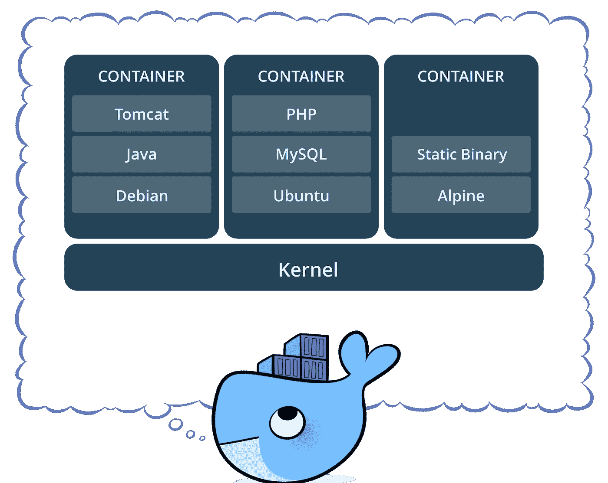
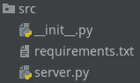
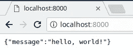
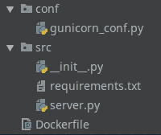
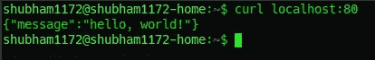
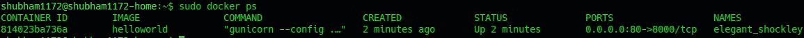
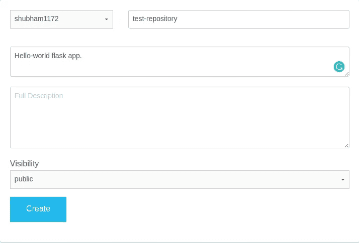

# Docker 上的 Flask 入门

> 原文：<https://medium.com/analytics-vidhya/getting-started-with-flask-on-docker-2885ad859b9a?source=collection_archive---------12----------------------->

lask 是 python 中用于 web 开发的一个漂亮的微框架。在本文中，我们将看到如何使用 Docker 将其部署在您个人喜爱的云基础设施上！

这篇文章的全部代码可以在[这里](https://github.com/shubham1172/quickstart-docker-flask)找到。

我们将创建一个 hello-world Flask 应用程序，并使用 Gunicorn 服务器托管它。请注意，Flask 应用程序通常可以使用内置的调试服务器托管，但它并不适合生产。

> 虽然轻量级且易于使用，但 Flask 的内置服务器不适合生产，因为它不能很好地扩展~ [Flask docs](http://flask.pocoo.org/docs/1.0/deploying/#deployment)

这就是我们使用 WSGI 服务器的原因。Gunicorn 简单可靠。

# **那么，Docker 是什么？**

> Docker 是推动容器运动的公司，也是解决混合云中每个应用程序的唯一容器平台提供商。~码头工人

容器是为应用程序提供运行环境的逻辑包。这是一个虚拟化的环境，包含代码、库和其他一切。容器使得在任何地方运行软件都很容易，不会与运行环境发生任何冲突！



Docker 将软件打包成标准化单元，用于开发、运输和部署—[https://www.docker.com/what-container](https://www.docker.com/what-container)

Docker 是一个容器平台。更多关于 dockers [这里](https://www.docker.com/)。

# 设置

为此活动创建一个文件夹，并导航到其中。我们将使用它来存储应用程序的源代码。

```
$ mkdir flask-app
$ cd flask-app
```

# 编写 web 应用程序

我们将在 Flask 中编写一个非常基本的 web 应用程序，它在“/”端点上返回 hello-world。

服务器代码将如下所示:

它只是在“/”处创建一个端点，并返回 JSON:

```
{message: "hello, world!"}
```

我们还为我们的应用程序编写了两个文件:

*   *__init__。py* —创建应用程序实例
*   *requirements.txt* —列出需要的模块



移动 **src** 文件夹中的所有代码，文件树应该如图所示。

让我们快速启动终端并测试这个服务器！

```
$ pip3 install -r src/requirements.txt
$ gunicorn src:app
```



/'服务 hello-world！

# 配置 Gunicorn 服务器

现在我们已经启动并运行了我们的应用程序，我们需要正确地配置 web 服务器。现在它处于非常基本的配置，没有多线程或日志记录。

让我们继续在*conf/guni corn _ config . py*中编写我们的配置

*   绑定—将 web 服务器绑定到端口 8000，并向所有接口公开
*   workers —为请求提供服务的工作线程数
*   accesslog 和 format —以给定的格式记录到 STDOUT。

关于这个文件的所有信息都可以在[文档](http://docs.gunicorn.org/en/stable/settings.html)中找到。

# Dockerizing！

现在，这个 web 应用程序和服务器已经启动并运行，我们希望将其封装到 Docker 容器中。为此，我们必须编写一个 *Dockerfile* 。

> Docker 可以通过读取 docker 文件中的指令来自动构建映像。Dockerfile 是一个文本文档，它包含用户可以在命令行上调用的所有命令来组合一个图像。~ [Docker 文档](https://docs.docker.com/engine/reference/builder/#usage)

我们的 docker 文件看起来像:

我们将逐行研究这个 Dockerfile 文件！

*   第 1 行:FROM 允许我们在基础映像上初始化构建。在我们的例子中，我们使用了一个 [python:3.6.5-alpine](https://github.com/docker-library/python/blob/b99b66406ebe728fb4da64548066ad0be6582e08/3.6/alpine3.7/Dockerfile) 图像。Alpine 是一个小型的 Linux 发行版(~ 5MB)。因为体积小，所以被 Docker 应用大量使用。简而言之，我们的应用程序使用了带有 python 3.6.5 的 Linux 环境。
*   第 3 行:我们创建一个名为 app 的 WORKDIR，在这里将设置 pwd。
*   第 8 行:将当前目录中的所有内容(我们的服务器代码和配置)复制到 app 目录中。
*   第 11 行:安装依赖项。
*   第 14 行:这暴露了我们容器的端口 8000，用于容器间的通信。稍后，我们将把这个端口连接到主机，以便在其上提供我们的 web 应用程序。
*   第 16 行:作为令牌列表传递的最后一个命令。它使用配置文件运行 Gunicorn 服务器。

# 一切准备就绪

现在我们有一个 docker 文件，我们需要做的就是建立一个图像。在这之后，我们将能够*运行*我们的图像并看到 web 应用程序的运行！



我们的源代码现在应该看起来像图片。注意 Dockerfile 在 src 文件夹之外。

我们需要创建一个 docker 映像并运行它！

```
$ docker build -t helloworld .
$ docker run -p 80:8000 helloworld 
```

*   docker build 从 docker 文件创建一个图像，并且-t 将一个*标签*赋予我们的图像。
*   docker run 接受标记参数来运行映像，而-p 将容器的端口发布给主机。

因此，我们的 web 应用程序现在在端口 80 可用。



卷曲本地主机，查看应用程序启动和运行！

我们可以使用`docker ps`列出活动容器



关于活动容器的一切！

注意我们的容器是如何被随机命名的！详见 [*本*](https://github.com/moby/moby/blob/5aa44cdf132788cc0cd28ce2393b44265dd400e9/pkg/namesgenerator/names-generator.go#L600) *围棋文件！*

# 正在部署。

现在我们有了一个 docker 映像和驻留在其中的我们自己的应用程序。我们现在想做什么？如何让这个映像对我们的 AWS EC2 实例或某个 Linux 云服务器可用？

## [码头枢纽](https://hub.docker.com)！

我们将把我们的图像推送到 Docker Hub 上的一个公共注册表中，以后我们可以从那里提取图像。为此:

在 Docker Hub 上创建一个帐户，并创建一个新的存储库！



接下来，我们需要在命令行上标记我们的图像，并推送它。

```
$ docker login
$ docker tag helloworld <username>/<repository-name>
$ docker push <username>/<repository-name>
```

现在可以使用`docker pull`从任何地方提取该图像

# 例如:Linux Box 上的 Docker

在任何 Linux 服务器上，

```
$ docker run <username>/<repository-name>
```

Docker 自动从 Docker Hub 中提取图像并运行实例！

这样，docker 映像可以部署在任何地方。

# 结论

我们看到了如何使用 Docker 环境将我们的应用程序容器化并在任何地方托管它。想了解更多关于码头工人的信息，请阅读[官方文件](https://docs.docker.com/get-started/)，亲自动手处理集装箱。