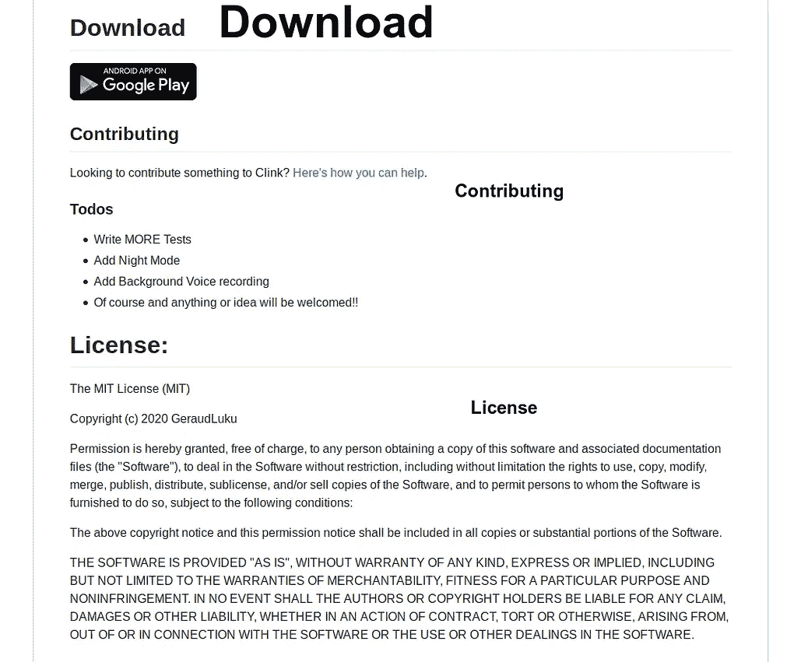
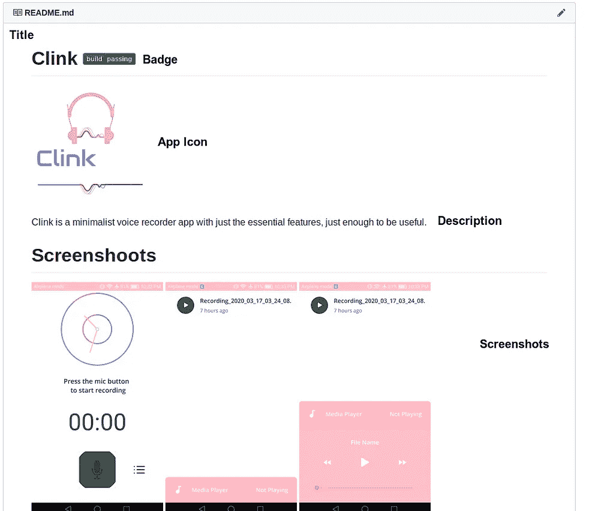

# GitHub README 入门。医学博士

> 原文：<https://medium.com/analytics-vidhya/getting-started-with-github-readme-md-bc348b943478?source=collection_archive---------13----------------------->

由 [Unsplash](https://unsplash.com/s/photos/growing-plant?utm_source=unsplash&utm_medium=referral&utm_content=creditCopyText) 上 [Nenad Tocilovac](https://unsplash.com/@nenadt?utm_source=unsplash&utm_medium=referral&utm_content=creditCopyText) 拍摄的照片

作为一名开发人员，您有时会浏览互联网，从 GitHub 存储库中为您的项目应用程序搜索完美的库。我们都遇到过带有非常漂亮的自述文件的存储库，这些文件非常详细，在指导我们安装和使用存储库方面做得很好。

但是，每当我们将代码推送到我们的存储库时，我们都不知道如何制作其中的一个。 **README.md** 文件是查看者在您的存储库中看到的第一样东西。所以它必须看起来专业，容易理解。

**自述文件**的文件扩展名为**“MD”**，意思是**降价**。 *Markdown 是一种标记语言，为网络作者执行文本到 HTML 的转换*。Markdown 允许您使用易读、易写的纯文本格式编写，然后将其转换为结构有效的 XHTML(或 HTML)。

# 我为什么要做一个？

这是一个简单的方法来回答你的观众可能会有关于如何安装和使用你的项目，以及如何与你合作的问题。**自述**。 **md 文件**是为你的朋友、同事、未来的雇主，甚至是作为你未来自己的参考而创建的。你发送到你的 GitHub 的任何人都将会看到你的项目，希望能从他们的项目中学习、贡献、受益或使用。

# README.md 文件的剖析

示例 README.md 文件

在上面的图片(2)中，你会看到自述文件的一些主要部分；

1.  标题
2.  徽章
3.  应用程序
4.  描述
5.  截屏
6.  [计] 下载
7.  贡献的
8.  许可证

## 标题

这通常是人类可读版本的存储库名称。举个例子，如果你有[https://github.com/GeraudLuku/Clink](https://github.com/GeraudLuku/Clink)资源库，那么标题的值就是“Clink”。

## 徽章

这些是你在回购页面上看到的小图片。下面是常用的:

*   **Travis CI 构建状态** —这是 travis-ci.org 中代码(失败/通过)的状态。持续集成是自动测试代码的过程，无论它是否在许多平台(多个 PHP 版本，HHVM 等)上正常运行，并触发 PHPUnit/Behat 或任何其他测试。点击可在[了解更多关于 CI 的内容。简单地说，这通常是回购在您自己的项目中使用是否安全的指标。绿色表示它已经通过了所有测试，可以使用了。](https://en.wikipedia.org/wiki/Continuous_integration)

**应用图标**

这将显示您的应用程序的徽标。记得把它上传到你的库的根目录

## 描述

这包含了关于你的存储库的基本解释。这是一个放置链接到文档页面和任何其他关于您的存储库的概述信息的好地方。

## 屏幕上显示程序运行的图片

截屏说明了项目做了什么，它们有助于区分你的存储库。它们可以帮助你记住你不久前做过的项目，也可以展示你记录工作的能力

## [计] 下载

对于移动和任何其他正在运行的应用程序，这包含您的项目的 google play 链接，单击该图像会将您重定向到您的移动应用程序的 google play 商店/应用程序商店链接或任何其他位置。

## 贡献的

本节将指导您如何为项目做出贡献，并向您展示您可以为应用程序开发的其他功能。它通常包含到一个 **contributions.md** 文件的链接，该文件包含更多关于为项目做贡献的信息。不要忘记将文件包含在您的存储库根目录中。

## 许可证

GitHub 上的公共库经常被用来共享开源软件。为了让你的库真正开源，你需要**许可**它，这样其他人就可以自由地使用、修改和分发软件。你可以在这里了解更多关于添加许可[的信息。](https://help.github.com/en/github/building-a-strong-community/adding-a-license-to-a-repository)

***注意:您应该将自述文件中引用的任何资源文件包含到您的存储库中。***

敲门。敲门。有人在吗！！？？😂 😂下面是本教程中使用的上述存储库的完整 readme.md 文件模板。您可以使用它并根据您的个人需要进行修改。

readme.md 文件

懒得自己创建自述文件？前往[迪林杰](https://dillinger.io/)，它是在线的。MD 文件编辑器，它为您提供了可供选择的模板，让您快速入门

最后但并非最不重要的是，感谢你阅读这篇文章，因为我是一个初学者，我可能会犯错误，请随时指出来，以便我可以纠正他们。👋🏻 👋🏻 👋🏻 👋🏻

-在此获取模板[https://www.makeareadme.com/](https://www.makeareadme.com/)👈

-您可以在此了解更多关于 markdown 语法的信息。https://www.youtube.com/watch?v=HUBNt18RFbo[t = 25s](https://www.youtube.com/watch?v=HUBNt18RFbo&t=25s)👈

-有兴趣参与这个项目吗？前往存储库，按照 contributions.md 文件上的说明进行操作【https://github.com/GeraudLuku/Clink 👈