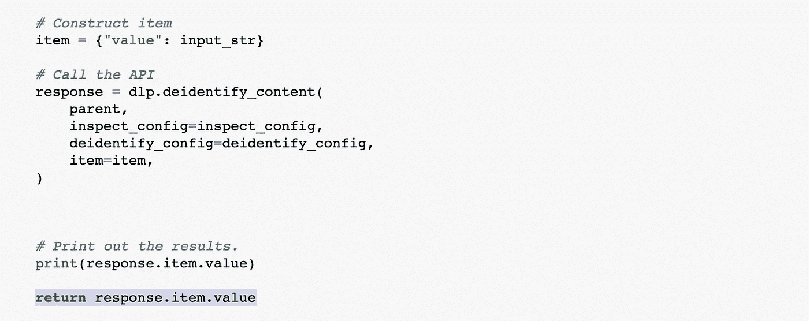

# 使用 Python 开始使用 Google 的数据丢失防护 API

> 原文：<https://medium.com/analytics-vidhya/getting-started-with-googles-data-loss-prevention-api-in-python-d90ee354047a?source=collection_archive---------2----------------------->


云数据丢失防护(DLP)是谷歌必须提供的许多云安全产品之一，允许用户掩盖其数据中的个人身份信息(PII)。

谷歌的 DLP 可以通过 GCP 控制台或 API 使用；出于本文的目的，我将重点讨论后者。

如果您的数据包括电子邮件地址等 PII，DLP 提供了几种方法来掩盖这些信息。例如，我们可以用标签替换 PII:


或者，我们可以通过用它的[信息类型]替换它来屏蔽信息:


让我们看看如何用 Python 和 [DLP API](https://cloud.google.com/dlp/docs/reference/rest) 实现这一点。

**第一步:认证**

让我们首先通过提供我们的 GCP 凭据进行身份验证。一个简单的方法是通过[创建一个服务账户](https://cloud.google.com/iam/docs/creating-managing-service-accounts)并将其添加为环境变量(使用 Python 的 OS 模块)。

```
import osos.environ['GOOGLE_APPLICATION_CREDENTIALS'] = 'data-loss-prevention-test-74b082472d34.json'print('Credentials from environ: {}'.format(os.environ.get('GOOGLE_APPLICATION_CREDENTIALS')))
```


或者，如果您已经启动并运行了 gcloud 命令行接口[,以下命令将允许您进行身份验证:](https://cloud.google.com/sdk/gcloud)

```
gcloud auth application-default login
```

**第二步:查阅谷歌文档，找到适用的 DLP 函数**

现在是时候使用 DLP API 了。下面是在 Google 的[文档](https://cloud.google.com/dlp/docs/deidentify-sensitive-data#specifying_detection_criteria)中找到的一个 Python 函数。该函数使用 google.cloud.dlp 库，读取一个文本字符串( *input_str 参数*)，并打印出基于 info_types 参数屏蔽的文本。


我对上面的函数做的一个修改在最后一行，在下面的截图中突出显示。这将返回 *response.item.value，而不仅仅是打印它。*



下面是该函数，带有上面的编辑:

```
def deidentify_with_mask(
    project, input_str, info_types, masking_character=None, number_to_mask=0
):
    """Uses the Data Loss Prevention API to deidentify sensitive data in a
    string by masking it with a character.
    Args:
        project: The Google Cloud project id to use as a parent resource.
        input_str: The string to deidentify (will be treated as text).
        masking_character: The character to mask matching sensitive data with.
        number_to_mask: The maximum number of sensitive characters to mask in
            a match. If omitted or set to zero, the API will default to no
            maximum.
    Returns:
        None; the response from the API is printed to the terminal.
    """# Import the client library
    import google.cloud.dlp# Instantiate a client
    dlp = google.cloud.dlp_v2.DlpServiceClient()# Convert the project id into a full resource id.
    parent = dlp.project_path(project)# Construct inspect configuration dictionary
    inspect_config = {
        "info_types": [{"name": info_type} for info_type in info_types]
    }# Construct deidentify configuration dictionary
    deidentify_config = {
        "info_type_transformations": {
            "transformations": [
                {
                    "primitive_transformation": {
                        "character_mask_config": {
                            "masking_character": masking_character,
                            "number_to_mask": number_to_mask,
                        }
                    }
                }
            ]
        }
    }# Construct item
    item = {"value": input_str}# Call the API
    response = dlp.deidentify_content(
        parent,
        inspect_config=inspect_config,
        deidentify_config=deidentify_config,
        item=item,
    )# Print out the results.
    print(response.item.value)

    **return response.item.value**
```

info_types 参数用于指定想要屏蔽的 PII 数据类型。谷歌有一个长长的[列表](https://cloud.google.com/dlp/docs/infotypes-reference)列出了你可以屏蔽的信息类型，从普通的信息类型如 *PERSON_NAME* 和 *EMAIL_ADDRESS* 到更具体的信息类型如特定国家的护照号码(即 *FRANCE_PASSPORT* )。

出于本教程的目的，我的信息类型如下:


当我们尝试对包含敏感信息的字符串运行 deidentify_with_mask 函数时，会返回以下内容:


DLP 会隐藏此人的姓名、电话号码和街道地址

**第三步:对 PII 数据运行 DLP 函数**

既然我们已经正确连接到 DLP API，我们就可以在包含敏感数据的数据集上运行它了。

让我们读入一些数据供 DLP 屏蔽:

```
import pandas as pddf = pd.read_csv('test_pii_data.csv')
```

*仅供参考:该数据集是随机生成的* [*数据集*](https://www.generatedata.com/) *，其中包含姓名、电话号码和电子邮件地址，以及财富 500 强总部的地址列表(DLP 不会识别或屏蔽虚假地址，因此随机生成的位置不适用于本演示)。*


正如我们在上面看到的， *Unmasked_Text* 列包含我们的姓名、地址、电子邮件和电话号码数据，这些数据被连接在一起以模拟实际的文本数据。现在，让我们将 DLP 函数应用于数据集:

```
df['Content_masked'] = df.apply(lambda row: deidentify_with_mask(row['Content']) ,axis=1)
```

我们返回一个数据集，其中一个新列 *Content_Masked，*包含我们的原始文本数据，所有敏感信息都被屏蔽。


这就是用谷歌的 DLP API 掩盖你的 PII 有多容易。结果总体上非常好，无论句子结构如何，数据的敏感信息都被正确地屏蔽了。

在实践中，通用信息类型有时会导致一些 PII 未被捕获，包括不太传统的名称(即 *Tiger* )或拼写错误的地址(即*405 Lexington****e****Ave)。*这可以通过使用[定制的](https://cloud.google.com/dlp/docs/creating-custom-infotypes)信息类型来避免，这允许用户针对其使用情形更好地优化 DLP。

我希望你喜欢这篇文章，并请让我知道任何问题。回购可以在 [Github](https://github.com/stefangouyet/cloud_dlp_intro) 上找到。