# 图像数据入门-深度学习

> 原文：<https://medium.com/analytics-vidhya/getting-started-with-image-data-deep-learning-328faad6d929?source=collection_archive---------10----------------------->

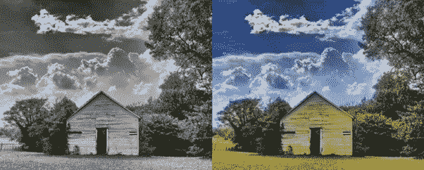

来源:Vidhya 分析

在这篇博客中，我们将研究如何应用深度学习技术来研究图像或文本等非结构化数据。我们在这个博客中的主要焦点或议程将是理解什么是图像以及我们如何使用图像数据。那么，让我们开始我们的旅程吧。

## 影像数据集简介:

想象过图像是如何存储在数据集中的吗？如果不是，让我们看看这些图像是如何储存在计算机中的。

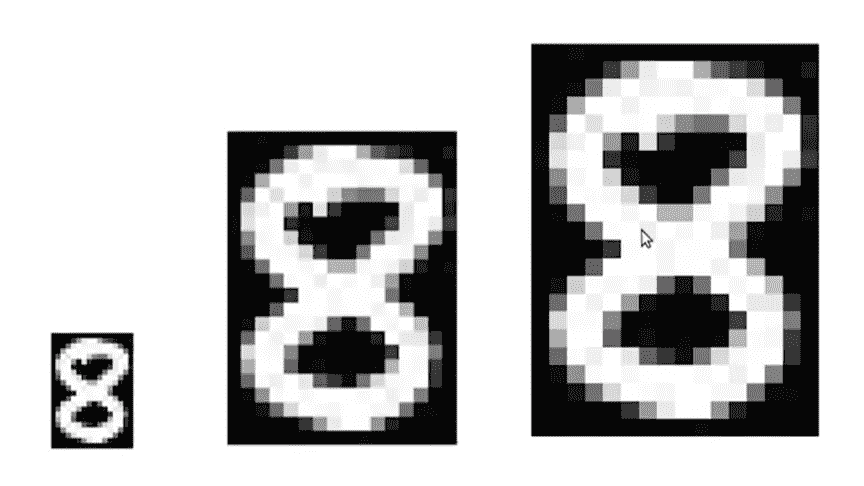

来源:Vidhya 分析

考虑黑白或灰度图像。这是数字 8 的图像。现在，如果我们继续缩放，我们会看到图像变得扭曲，我们会看到图像上的小方块。现在这些被称为**像素。**我们还使用术语“图像的尺寸是 X x Y ”,意思是跨越高度和宽度的像素数。虽然我们看到的是这种格式的图像，但计算机以数字的形式存储它，其中每个像素用数值表示，这个数值表示像素的强度。

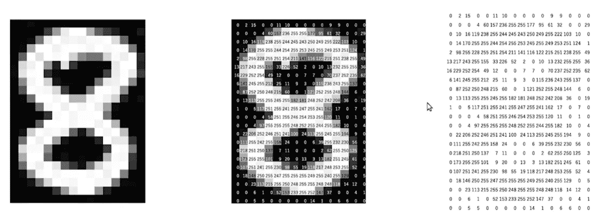

来源:Vidhya 分析

对于灰度图像，强度范围为 0–255。接近 0 值代表较暗的阴影，而接近 255 的值代表较亮的阴影。 ***所以，计算机中的每一幅图像都是以数字矩阵的形式存储的，这个矩阵也被称为通道。***

现在让我们来看看这些彩色图像是如何储存在计算机中的。考虑以下彩色图像。

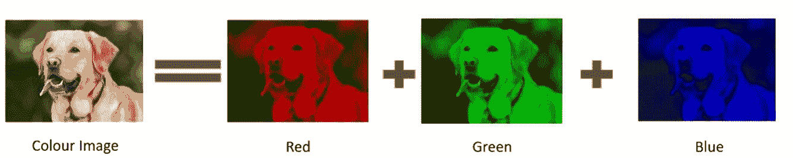

来源:Vidhya 分析

现在图像是由许多颜色组成的，几乎所有的颜色都可以由三原色产生——***红、绿、蓝。*** 因此，我们可以说每个彩色图像由 3 种颜色或 3 个通道组成，这意味着彩色图像中的通道数量会更多。

在特定示例中，我们有 3 个矩阵或通道——R、G 和 b。现在，每个矩阵的值范围为 0 至 255。最后，所有这些通道被叠加，因此当图像被加载到计算机中时，图像的形状将是 N×M×3，其中 N 代表高度上的像素数，M 代表宽度上的像素数，3 代表通道数。

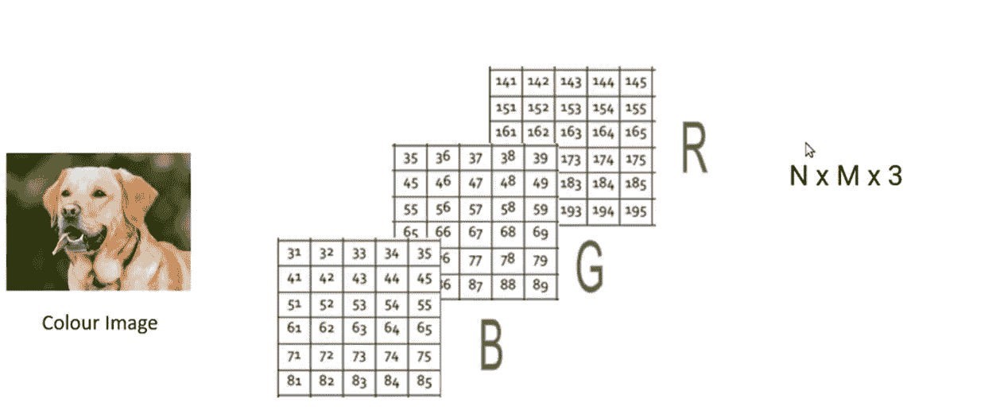

来源:Vidhya 分析

这是两种最流行的格式*灰度* & *RGB 格式。*让我们更详细地看看它们，并探索其他图像格式。

## 不同的图像格式:

我们将会遇到不同类型的图像数据集。其中一些如下。

1.  灰度图像。
2.  RGB 图像。
3.  RGBA 图像。
4.  核磁共振图像。

> **灰度图像**:这里是一些我们之前熟悉的灰度图像的例子。

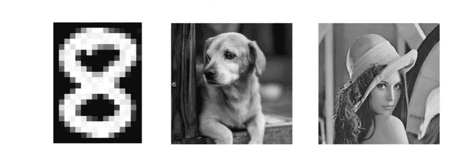

来源:Vidhya 分析

> **RGB 图像:**以下是一些 RGB 图像的例子。

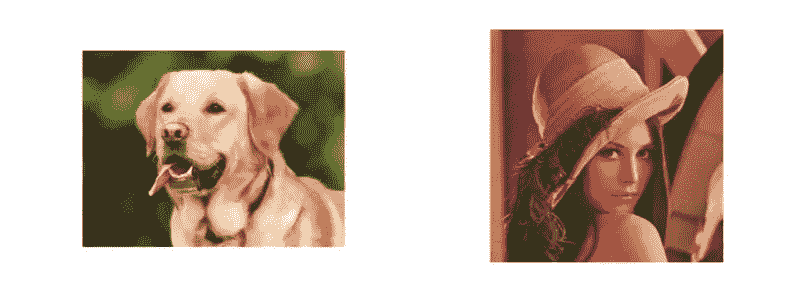

来源:Vidhya 分析

> RGBA 图片:这是一些 RGBA 图片的例子。

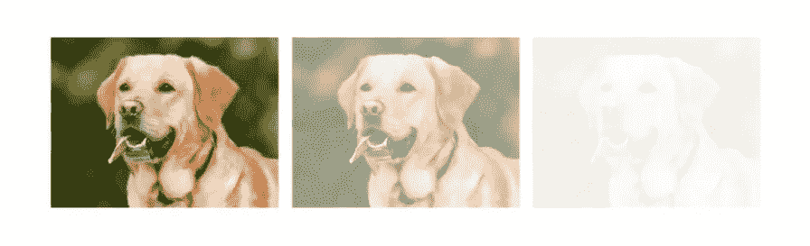

来源:Vidhya 分析

让我们了解以上图像之间的差异。第一张图片(从左开始)非常清晰。第二个图像有轻微褪色的颜色。在第三张图片中，颜色几乎不可见。

类似于 RGB 格式，RGBA 图像被存储为 3D 矩阵，其中矩阵的形状是 N×M×通道。在 RGBA 图像的情况下，我们将有 4 个通道，第四个通道被称为**阿尔法通道**，其中阿尔法控制颜色的不透明度或透明度。alpha 值的范围在(0–255)之间，其中 0 是透明的，255 完全是原始图像。如果该值在 0-255 之间，图像会部分不透明，具体取决于像素强度。

这里有几个例子，

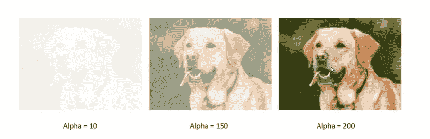

*对于 alpha = 10，图像完全被遮挡。*

*对于 alpha = 150，介于 0-255 之间，我们可以看到颜色是部分可见的，所以我们可以说它是部分不透明的。*

*对于 alpha = 200，非常接近 255，因此在这种情况下颜色是可见的，因此图像按原样显示。*

> **MRI 图像:**存储为 4D 矩阵，矩阵形状如下所示— **N x M x 切片 x 通道。**

考虑一个大脑的图像，我们知道大脑将是一个三维物体，因此从这个图像中我们可以看到大脑的外部结构。为了捕捉大脑的内部切片，我们创建了多个大脑切片，捕捉每一个切片，然后将它们堆叠起来，创建一个 4D 矩阵。一些常见的地方，我们会发现这些类型的图像是 CT 扫描和 MRI。

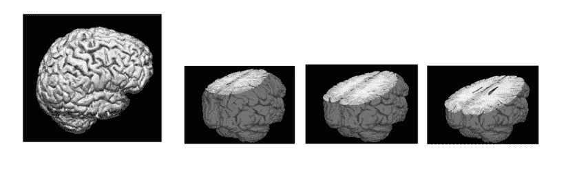

来源:Vidhya 分析

现在，在对不同类型的图像有了一个简单的了解之后，我们将通过 jupyter notebook 来看看每种格式的几个例子。

为了不把文章写得太长，我已经贴上了 jupyter 笔记本，在上面我做了与我们目前所学相关的练习。

## 我强烈推荐你们去 jupyter 笔记本链接，你们都可以在每个部分下看到，也可以理解实际的。你会非常喜欢的。那么，我们为什么要等呢？让我们开始吧。

> **第 1 部分—读取&堆叠图像。**

在本实验课中，我介绍了各种图像格式。我们如何读取图像，如何使用流行的 python 包 ***浏览图像，以及如何使用*通过减少代码行数来显示多个相同格式的图像。此外，在处理 MRI 图像时，你会遇到一个我用过的流行库，即 ***nibabel。*******

*你可以点击我的 GitHub 链接获取这部分的代码和图片文件 [***阅读 _ 堆叠 _ 图片 _DL***](https://github.com/grajpal123/Reading_Stacking_Images_DL)*

*此外，如果你只是有兴趣看看这部分的演示，请访问下面的链接。 [***阅读 _ 堆叠 _ 图片 _DL***](https://nbviewer.jupyter.org/github/grajpal123/Reading_Stacking_Images_DL/blob/main/READING%20%26%20STACKING%20IMAGES%20.ipynb)*

> ***第 2 部分—将图像转换成不同的格式。***

*在本实验课中，我已经回顾了不同类型的图像，以及我们如何将一种格式转换为另一种格式。**我们还必须明白，将图像从较低质量转换为较高质量极其困难，就像将灰度转换为 RGB 一样。***

*你可以点击我的 GitHub 链接获取这部分的代码和图片文件 [***转换 _ 图片 _DL***](https://github.com/grajpal123/Converting_Images_DL)*

*另外，如果你只是对这部分的演示感兴趣，请访问下面的链接 [***转换 _ 图像 _DL***](https://nbviewer.jupyter.org/github/grajpal123/Converting_Images_DL/blob/main/CONVERTING%20IMAGES%20-%20DIFFERENT%20FORMAT.ipynb)*

> ***第三部分——从图像中提取边缘。***

*在本实验课中，我们将讨论如何从图像中提取边缘。此外，我们还将看到两种类型的滤波器，即***Sobel&Prewitt***。*

*但是，在进入实际操作之前，让我们先了解为什么边缘很重要。考虑给你一个任务，从一堆图像中分类一个物体是人、汽车还是动物。看着它们的大小和形状，我们可以很容易地对它们进行分类。*

*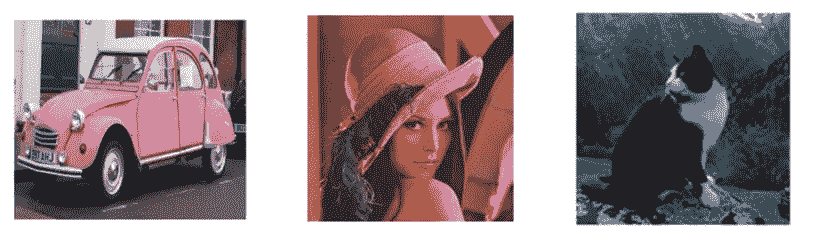*

*来源:Vidhya 分析*

*现在，让我们稍微改变一下这个例子。如果我们这样做，我们仍然能够对它们进行一点分类。*

*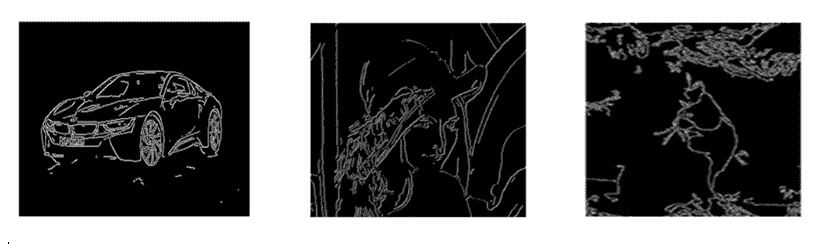*

*来源:Vidhya 分析*

*两者的主要区别在于——在第二种情况下，我们去除了颜色、背景和其他微小的细节。我们只有边缘，仍然能够识别图像中的物体。因此，对于任何给定的图像，如果我们能够只提取边缘并去除噪声，我们仍然能够对图像中的对象进行分类。*

*考虑下面的例子，*

*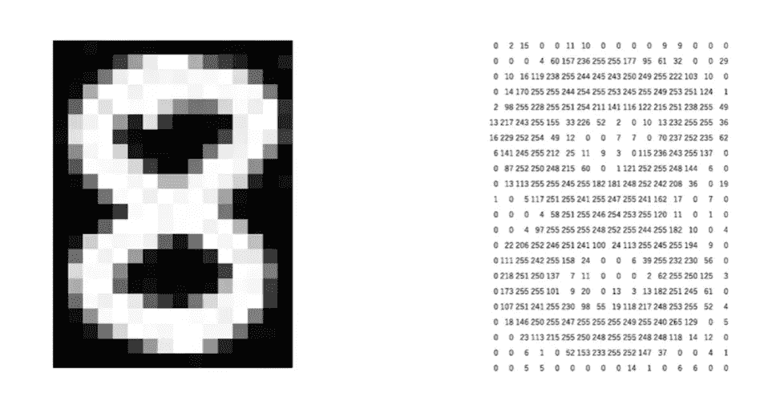*

*来源:Vidhya 分析*

*我们将清楚地观察到，在上面的例子中，边缘周围的像素值显示从左到右或从上到下的突然变化。因此，基于这个事实，我们可以识别哪个像素代表边缘或者哪个像素位于边缘上。*

*我们将像素值与其周围的像素值进行比较，以确定它是否代表边缘。例如。*

*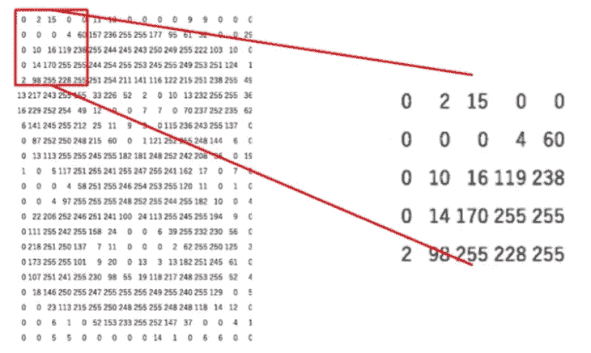*

*来源:Vidhya 分析*

*我们可以使用矩阵来执行元素乘法，以确定特定像素是否是边缘。*

*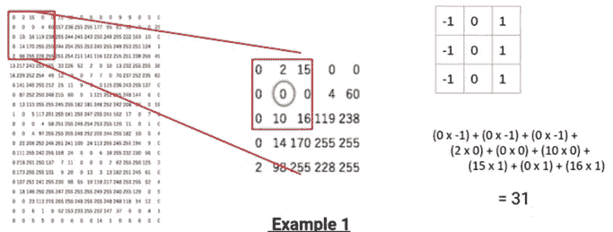*

*来源:Vidhya 分析*

*在上面的例子中，由于像素值在应用矩阵 so 后变得更小，我们可以说它可以位于边缘上，但它不代表边缘。*

*让我们考虑另一个例子，*

*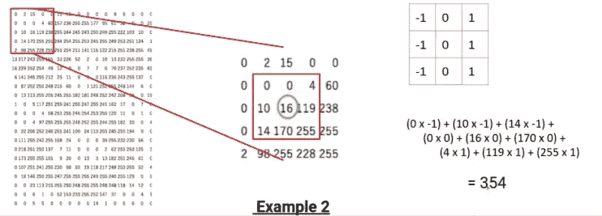*

*来源:Vidhya 分析*

*在上面的例子中，由于像素值在应用矩阵后变得非常大，我们可以清楚地说突出显示的像素值代表一个边缘。*

*现在我们在上面的例子中看到的这个矩阵被称为 ***滤波器*** 或 ***内核。*** 这个内核或者滤镜滑过整个图像生成一个新的矩阵。这个新矩阵被称为 ***特征图*** ，该特征图表示像素是否位于边缘。*

***内核类型:***

*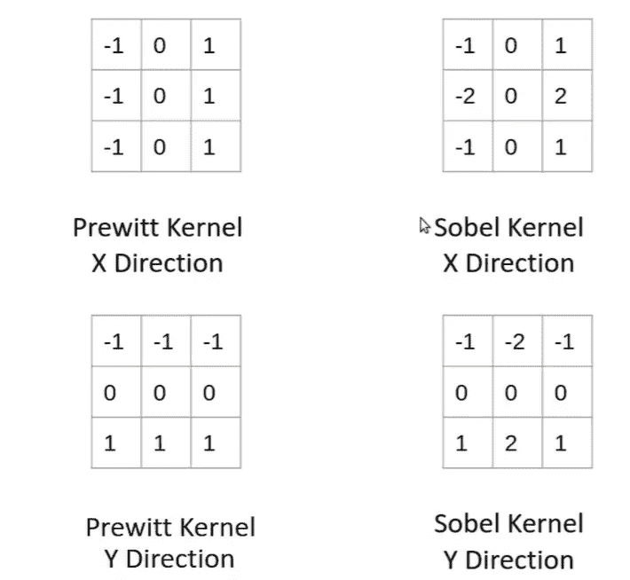*

*来源:Vidhya 分析*

*Sobel 和 Prewitt 滤波器之间的主要区别在于，在 Sobel 滤波器中，紧邻目标像素的像素值具有很高的重要性，而在 Prewitt 中则不是这样。*

*你可以点击我的 GitHub 链接获取这部分的代码和图片文件[***Extracting _ Edges _ DL***](https://github.com/grajpal123/Extracting_Edges_DL)*

*此外，如果你只是对这部分的演示感兴趣，请访问下面的链接 [***提取 _ 边缘 _DL***](https://nbviewer.jupyter.org/github/grajpal123/Extracting_Edges_DL/blob/main/EXTRACTING%20EDGES.ipynb)*

*C **结论***

*因此，在这个博客中，我们了解了各种格式的图像，如 RGB，RGBA，核磁共振成像和灰度图像。我们还就它们的尺寸进行了简短的讨论。我们还看到了如何将一种格式的图像转换成另一种格式，并遇到了一个新的库***ni label***来处理 MRI 和 CT 扫描类型的图像。最后，我们研究了各种类型的核，即***&【索贝尔】*** ，它帮助我们提取物体中的边缘特征，帮助我们减少背景中的噪声，从而减少计算量。*

*请务必在 LinkedIn 上联系我:[https://www.linkedin.com/in/gaurav-rajpal/](https://www.linkedin.com/in/gaurav-rajpal/)*

****敬请关注我们在深度学习中使用图像数据集的演示项目的进一步更新。****

*问候，*

*高拉夫·拉杰帕尔·(gauravrajpal1994@gmail.com)*