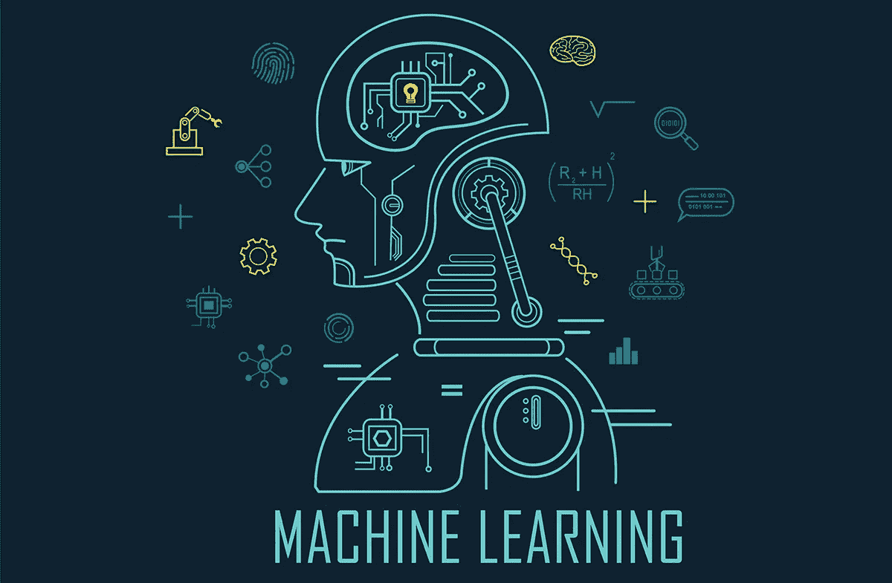

# 机器学习入门

> 原文：<https://medium.com/analytics-vidhya/getting-started-with-machine-learning-7ee6c0c78c46?source=collection_archive---------26----------------------->

> 这是对绝对初学者的机器学习世界的快速介绍，以及如何开始，在这个奇妙的领域有一个良好的开端。

来源-[https://becominghuman.ai/](https://becominghuman.ai/)

“机器学习”是人工智能的一个领域，或者我们可以简单地说是朝着建造未来智能机器人迈出的一步。但机器学习不仅仅是制造智能机器人，因此，它更经常用于几乎每个数据驱动的公司或组织。它只是一个简单的(有时)或更常见的复杂算法，只是为了训练我们的机器，或者说，一个机器人根据我们之前提供的知识或数据做出智能决策。

*但是* w *我所说的数据驱动到底指的是什么？*数据是收集在一起用于参考或分析的事实和统计数据(googled)。我们生活在数据时代。我们点击一张图片并上传到社交媒体网站，是的，这是该网站的数据。机器学习算法是当今的大趋势，但它已经存在了 15-20 年。那么为什么这个在今天被广泛使用，而在当时却没有。原因是数据(也是我们计算机的处理速度)。与 10 到 15 年前相比，我们现在正在创建大量数据，因此我们现在有大量数据要输入到我们的机器中，它们可以更好地学习。

但是机器到底是如何学习的呢？这就是机器学习的意义所在，我们使用不同的算法让我们的机器学习不同类型的数据。但是我们要先说一下基本的想法。实际上，机器学习类似于人类学习。学习基本有三种: ***1。监督学习*** ***:*** 告诉孩子什么是好的，什么是坏的(一大堆好的和坏的例子)，最终孩子会开始区分好的和坏的，并给出一个新的场景(他从来不知道)，他可能会用过去好的和坏的场景的知识来预测它是好还是坏。**②*。无监督学习*** ***:*** 给一个盲人一组球和一组棱柱(三角形)。他看不到这些(我们的机器也看不到)，但他可以触摸它们，知道它们的特征(如高度、锐度、形状)，并且可以对它们进行分组，而无需知道他分组的对象是什么。 ***3。强化学习:在一个困惑的时刻，或者在做什么和不做什么的冲突中，你可能会做出一个随机的决定，而你行动的结果将会是积极的或消极的。基于这个结果，你会知道以后面对相同或相似的情况时，你是否会再次做出那个决定。***

## 开始机器学习

1.  学习 Python 或 R 语言(个人偏好——Python 适合初学者)。只要学习语言的基础知识就可以开始了。
2.  学习一些对机器学习有用的语言包和库，如 Pandas、Numpy、Seaborn 等(python 的)。包和库包含各种算法的代码，使用它们可以让我们轻松地编写代码，而不用担心那些已经为我们完成并存储在那些库中的基本且有时复杂的工作。
3.  开始学习数据的预处理。
4.  深入 ML 算法池(从线性回归开始)。
5.  做项目。
6.  进行深度学习(让机器学习的更好算法)。

建议 -不要只是使用库来实现 ML 算法，还要理解它背后的数学原理，并尝试不使用库来实现它。

如果你选择 PYTHON 或者 R，安装 **ANACONDA** 。

*Anaconda 是用于科学计算的 Python 和 R 编程语言的免费开源发行版，旨在简化包管理和部署*(谷歌搜索)。实际上，它包含了许多已经下载的包(节省了大量的工作)。它有许多 IDE，它们都适合特定的工作。

*使用哪个* ***IDE*** *？*个人比较喜欢 **JUPYTER 笔记本**用于机器学习。您甚至可以在不下载 Anaconda 的情况下单独下载它，但是下载 Anaconda 是一个好习惯，因为它已经预装了许多包。

*为什么要 JUPYTER 笔记本？它简单易用，良好的界面和最好的部分，你可以单独运行每一行代码，坦率地说，理解和学习你的每一行代码要做什么真的很好。*

有其他 IDE 可以推荐吗？倒数第二， **Spyder。**

我希望它能帮助你了解什么是机器学习，以及从哪里开始学习之旅。快乐学习！！！！