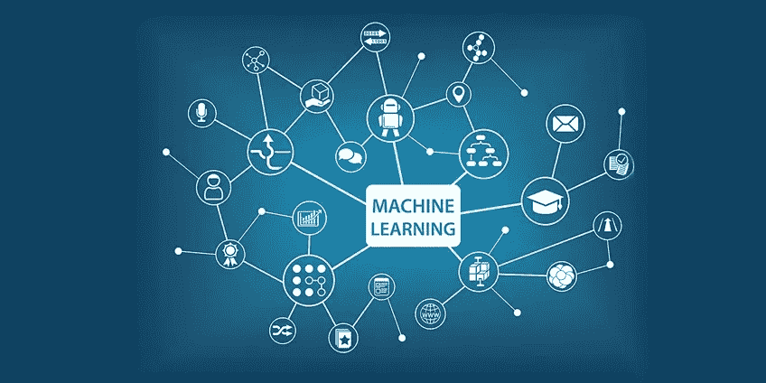
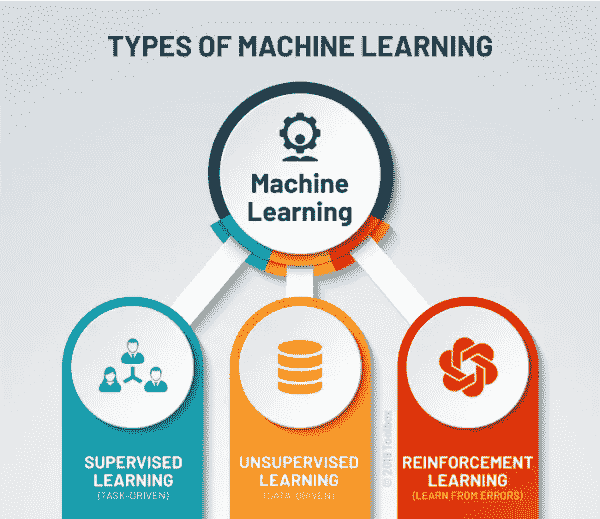

# 机器学习入门

> 原文：<https://medium.com/analytics-vidhya/getting-started-with-machine-learning-81f34fc6c11e?source=collection_archive---------31----------------------->

在博客中，我会写什么是机器学习，为什么机器学习， **ML** 的一些应用。我还会分享我的 **Github** **链接**，关于不同机器学习算法的一些很酷的初级项目。

Tom M. Mitchell 提供了一个被广泛引用的、机器学习领域中所研究的算法的更正式的定义:“*如果计算机程序在 T 中的任务上的性能(由 P 测量)随着经验 E 而提高，则称该计算机程序从关于某类任务 T 和性能测量 P 的经验 E 中学习。*

Tom M. Mitchell 给出的定义给出了关于机器学习最准确的想法。它给出了计算机程序如何从某个任务中学习并从中获得经验，执行某个任务并产生所需的结果。

# **什么是 ML？**

**机器学习** (ML)是一种人工智能**(AI)，它允许软件应用程序在预测结果时变得更加准确，而无需显式编程。**机器学习**算法使用历史数据作为输入来预测新的输出值。**

****

# ****我们为什么需要机器学习？****

**数据是所有业务的命脉。数据驱动的决策越来越决定着是跟上竞争还是进一步落后。机器学习可能是释放公司和客户数据的价值并制定决策以保持公司在竞争中领先的关键**。****

# ****ML 的一些应用****

****

## **1.图像识别:**

**图像识别是机器学习最常见的应用之一。它用于识别物体、人、地点、数字图像等。图像识别和人脸检测的常见用例是，**自动好友标记建议**:**

**脸书为我们提供了自动好友标记建议的功能。每当我们上传与脸书朋友的照片时，我们都会自动获得一个带有姓名的标记建议，而这背后的技术是机器学习的**人脸检测**和**识别算法**。**

## **2.语音识别:**

**在使用谷歌时，我们可以选择“语音搜索”，这属于语音识别，是机器学习的一个流行应用。**

**语音识别是将语音指令转换为文本的过程，也称为“**语音转文本**，或“**计算机语音识别**”目前，机器学习算法被语音识别的各种应用广泛使用。**谷歌助手**、 **Siri** 、 **Cortana** 、 **Alexa** 都在使用语音识别技术来遵循语音指令。**

## **3.交通预测:**

**如果我们想去一个新的地方，我们会借助谷歌地图，它会以最短的路线向我们显示正确的路径，并预测交通状况。**

**它通过两种方式预测交通状况，如交通是否畅通、缓慢移动或严重拥堵:**

****通过谷歌地图应用和传感器获得车辆的实时位置****

****在过去几天的同一时间内平均花费了**的时间。**

**每个使用谷歌地图的人都在帮助这个应用程序变得更好。它从用户那里获取信息，并将其发送回数据库以提高性能。**

## **4.无人驾驶汽车:**

**机器学习最令人兴奋的应用之一是自动驾驶汽车。机器学习在自动驾驶汽车中发挥着重要作用。最受欢迎的汽车制造公司特斯拉正在研究自动驾驶汽车。它使用无监督学习方法训练汽车模型在行驶中检测人和物体。**

# ****机器学习的类型(ML 算法):****

****

# ****监督学习:****

**监督学习是最基本的机器学习类型之一。在这种类型中，机器学习算法是在标记的数据上训练的。尽管这种方法需要准确地标记数据，但在正确的情况下，监督学习是非常强大的。**

**在监督学习中，给 ML 算法一个小的训练数据集来处理。该训练数据集是较大数据集的较小部分，用于为算法提供问题、解决方案和要处理的数据点的基本概念。训练数据集在其特征上也非常类似于最终数据集，并且为算法提供了问题所需的标记参数。**

**这是我的 github 链接，是一些监督学习项目的链接:**

**下面的链接包含监督学习类型的例子**

1.  **线性回归**
2.  **KNN(第 k 个最近邻)**
3.  **SVM**

** [## shag 10/机器学习

### 这个库包含机器学习算法的基础。基于监督学习的算法…

github.com](https://github.com/Shag10/Machine-Learning/tree/master/Supervised) 

# 无监督学习:

无监督的机器学习具有能够处理未标记数据的优势。这意味着不需要人工来使数据集机器可读，允许程序处理更大的数据集。

在监督学习中，标签允许算法找到任意两个数据点之间关系的确切性质。然而，无监督学习没有标签，导致隐藏结构的创建。算法以抽象的方式感知数据点之间的关系，不需要人类的输入。

**这里是我的一些无监督学习项目的 github 链接:**

下面的链接包含了无监督学习类型的例子

k 表示

[https://github . com/shag 10/Machine-Learning/tree/master/Unsupervised/k means](https://github.com/Shag10/Machine-Learning/tree/master/Unsupervised/Kmeans)

# **强化学习:**

强化学习直接从人类在生活中如何学习数据中获取灵感。它的特点是一种算法，可以自我改进，并使用试错法从新的情况中学习。有利的输出被鼓励或“加强”，而不利的输出被劝阻或“惩罚”。

基于条件反射的心理学概念，强化学习通过将算法放在有翻译和奖励系统的工作环境中来工作。在算法的每一次迭代中，输出结果都交给解释器，解释器决定结果是否有利。

所以我的博客到此结束。我希望这可能对你有帮助。**