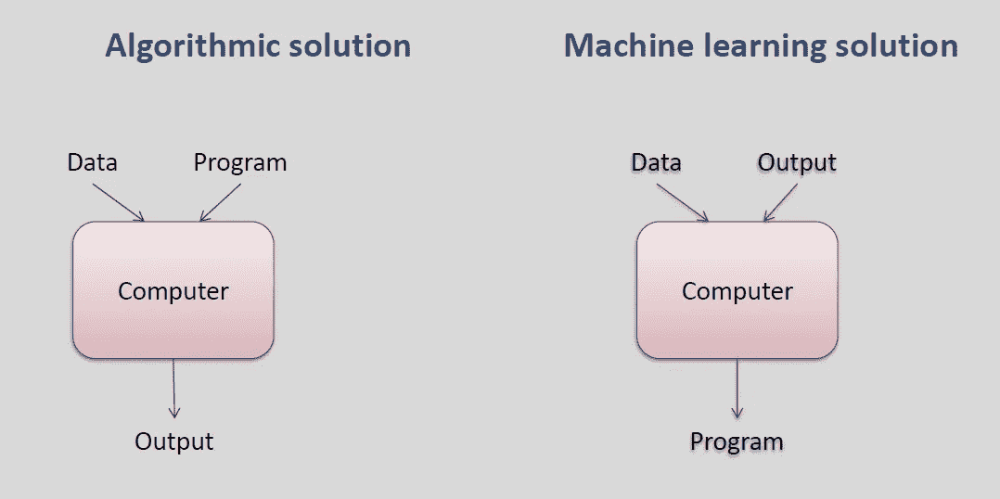
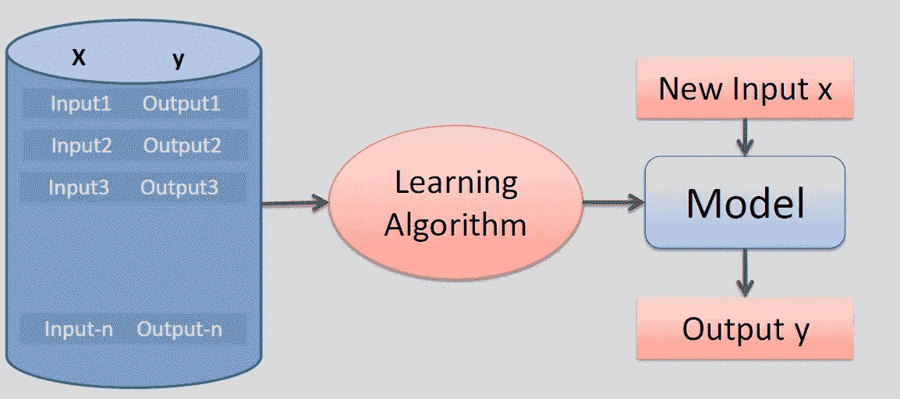
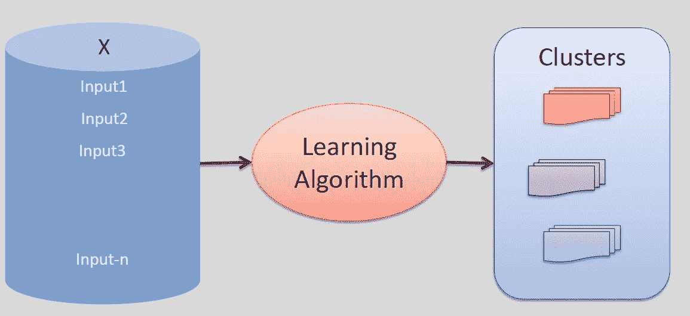
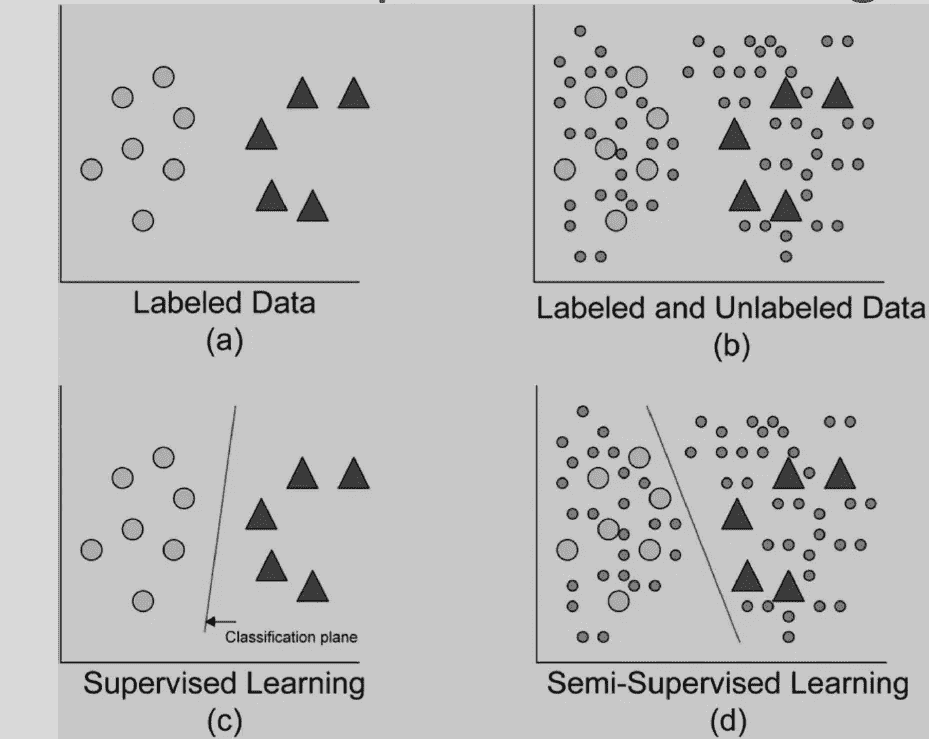
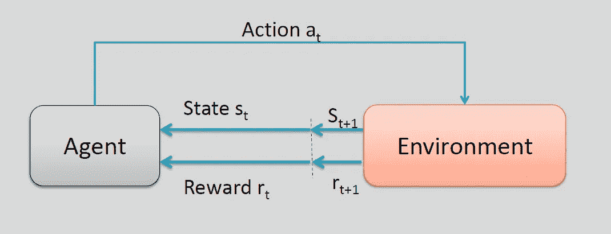

# 以简单的方式开始机器学习

> 原文：<https://medium.com/analytics-vidhya/getting-started-with-machine-learning-in-a-simple-way-43e20414e7ad?source=collection_archive---------6----------------------->

机器学习导论

当人们听到一些关于“*机器学习”*的事情时，他们会在脑海中描绘复杂的视觉化图像，认为它与编程机器人一样复杂，但相反，许多人并不知道机器学习已经存在了几十年。想想著名的电脑跳棋游戏，它只是通过理解人的移动来与人对弈。想想你的垃圾邮件过滤器，它将垃圾邮件从其他邮件中分类出来。这些都是机器学习的应用。

先了解什么是机器学习

# 什么是机器学习？

什么是机器学习

机器学习是给计算机编程的科学(和艺术)，因此它们可以从数据中学习*。*

这里有一个稍微更一般的定义:

*“[机器学习是]一个研究领域，它赋予计算机无需明确编程就能学习的能力。”*

和一个更面向工程的:

*“如果一个计算机程序在 T 上的性能，如 P 所测量的，随着经验 E 的增加而提高，那么就说它从关于一些任务 T 和一些性能测量 P 的经验 E 中学习。”* — Tom Mitchell，1997

学习是在经验的基础上改进自己行为的能力。

机器学习探索的算法可以

—从数据中学习/从数据中构建模型。

—使用模型进行预测、决策或解决某些任务。

您的垃圾邮件过滤器是一个机器学习程序，在给定垃圾邮件示例(例如，由用户标记的)和常规(非垃圾邮件，也称为“ham”)邮件示例的情况下，可以学习标记垃圾邮件。系统用来学习的例子被称为*训练集*。每个训练实例称为一个*训练实例*(或*样本*)。

在这种情况下，任务 T 是为新邮件标记垃圾邮件，经验 E 是*训练数据*，需要定义性能度量 P；例如，您可以使用正确分类的电子邮件的比率。这种特殊的性能测量被称为*准确性*，它通常用于分类任务。

# 为什么要用机器学习？

考虑如何使用传统编程技术编写垃圾邮件过滤器:

1.  首先，您会看到垃圾邮件通常是什么样子。您可能会注意到，一些单词或短语(如“4U”、“信用卡”、“免费”和“神奇”)往往会在主题行中出现很多。也许你还会注意到发件人姓名、邮件正文和邮件其他部分的一些其他模式。
2.  您将为您注意到的每个模式编写一个检测算法，如果检测到许多这样的模式，您的程序会将电子邮件标记为垃圾邮件。
3.  您将测试您的程序，并重复步骤 1 和 2，直到它足够好可以启动。

# **程序 vs 学习算法**

程序 vs 学习算法

# 机器学习系统的类型

有许多不同类型的机器学习系统，根据以下标准将它们分为几大类是很有用的:

*   无论它们是否在人工监督下接受训练(监督、非监督、半监督和强化学习)
*   他们是否能在运行中进行增量学习(在线学习还是批量学习)
*   它们是通过简单地将新数据点与已知数据点进行比较来工作，还是通过检测训练数据中的模式并建立预测模型来工作，就像科学家所做的那样(基于实例的学习与基于模型的学习)

让我们更仔细地看看这些标准。

# 1.监督/非监督学习

机器学习系统可以根据它们在训练期间得到的监督的数量和类型来分类。有四个主要类别:监督学习、非监督学习、半监督学习和强化学习。

# 监督学习

在*监督学习*中，你输入给算法的训练集包括期望的解决方案，称为*标签。*给定一个数据集(X，y)，其中 X 是我们的特征训练集，y 是我们的标签。给定一个观察值 X，我们必须确定 y 的最佳标签是什么？

监督学习

监督学习算法:

*   k-最近邻
*   线性回归
*   逻辑回归
*   支持向量机
*   决策树和随机森林
*   神经网络

示例:

1.  天气预报
2.  垃圾邮件过滤器
3.  股票价格预测
4.  预测房价

# 无监督学习

在*无监督学习*中，正如你可能猜到的，训练数据是无标签的。

给定一组 X，对它们进行聚类或总结。

无监督学习

无监督学习算法:

*   k 均值
*   基于密度的噪声应用空间聚类
*   异常检测和新奇检测
*   一级 SVM
*   隔离森林
*   可视化和降维
*   主成分分析
*   核主成分分析
*   局部线性嵌入(LLE)
*   t 分布随机邻居嵌入(t-SNE)

示例:

1.  电影推荐系统
2.  基于浏览和购买历史的购物者分组
3.  根据基因表达测量分组的癌症患者亚组

# 半监督学习

由于标注数据通常既费时又费钱，所以通常会有大量未标注的实例，而很少有标注的实例。一些算法可以处理部分标记的数据。这被称为*半监督学习*

半监督学习

大多数半监督学习算法是无监督和监督算法的结合。

# 强化学习

*强化学习*是一种非常不同的野兽。学习系统，在这种情况下称为*代理*，可以观察环境，选择并执行行动，并获得*奖励*作为回报(或以负奖励形式的*惩罚*)。然后，它必须自己学习什么是最好的策略，称为*策略*，以随着时间的推移获得最大的回报。策略定义了代理在给定情况下应该选择的操作。

强化学习

示例:

1.  交通灯控制
2.  机器人学
3.  计算机集群中的资源管理

# 2.批量和在线学习

用于对机器学习系统进行分类的另一个标准是系统是否可以从输入数据流中进行增量学习。

# 批量学习

在*批量学习*中，系统无法进行增量学习:必须使用所有可用数据对其进行训练。这通常需要大量的时间和计算资源，所以通常是离线完成的。首先对系统进行培训，然后将其投入生产并运行，不再需要学习；它只是应用它所学到的东西。这叫做*离线学习*。

如果你想让一个批量学习的系统知道新的数据(比如一种新型的垃圾邮件)，你需要在完整的数据集上(不仅仅是新的数据，还有旧的数据)从头训练一个新版本的系统，然后停止旧的系统，用新的替换它。

# 在线学习

在*在线学习*中，你通过顺序地向系统提供数据实例来对系统进行增量式训练，这些数据实例可以是单独的，也可以是被称为*小批量*的小组。每一步学习都是快速而廉价的，因此系统可以在新数据到达时即时学习。

在线学习非常适合以连续流的形式接收数据(例如股票价格)并需要快速或自主适应变化的系统。如果您的计算资源有限，这也是一个不错的选择:一旦在线学习系统了解到新的数据实例，它就不再需要它们，所以您可以丢弃它们(除非您希望能够回滚到以前的状态并“重放”数据)。这可以节省大量的空间。

在线学习算法也可以用于在无法容纳在一台机器的主内存中的巨大数据集上训练系统(这被称为*核外*学习)。该算法加载部分数据，对该数据运行训练步骤，并重复该过程，直到对所有数据运行该过程

# 3.基于实例和基于模型的学习

对机器学习系统进行分类的另一种方式是通过它们如何*概括*。大多数机器学习任务都是关于预测的。这意味着给定大量的训练示例，系统需要能够归纳出以前从未见过的示例。对训练数据有一个好的性能度量是好的，但还不够；真正的目标是在新的实例中表现良好。

概括有两种主要方法:基于实例的学习和基于模型的学习。

# 基于实例的学习

可能最简单的学习方式就是用心学习。如果您要以这种方式创建垃圾邮件过滤器，它只会标记所有与用户已经标记的电子邮件相同的电子邮件——这不是最差的解决方案，但肯定不是最好的。

您的垃圾邮件过滤器不仅可以标记与已知垃圾邮件相同的邮件，还可以标记与已知垃圾邮件非常相似的邮件。这需要对两封邮件之间的相似性进行 T2 度量。两封电子邮件之间的一个(非常基本的)相似性度量可以是计算它们共有的字数。如果一封电子邮件与一封已知的垃圾邮件有许多相同的单词，系统会将其标记为垃圾邮件。

这被称为*基于实例的学习*:系统用心学习例子，然后通过使用相似性度量将它们与学习的例子(或它们的子集)进行比较，从而归纳成新的案例。

# 基于模型的学习

从一组例子中归纳的另一种方法是建立这些例子的模型，然后使用该模型进行*预测*。这叫做*基于模型的学习。*

# 机器学习的主要挑战

1.  训练数据量不足。
2.  非代表性训练数据。
3.  数据质量差。
4.  无关的特征。
5.  过度拟合数据。
6.  数据拟合不足。