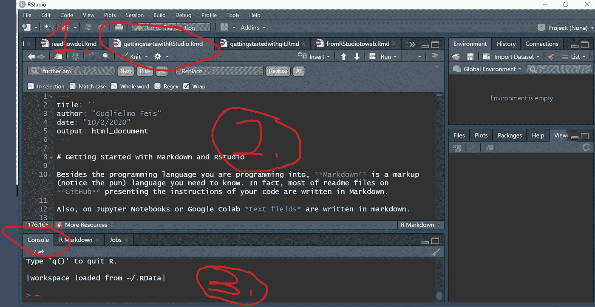

# Markdown 和 RStudio 入门

> 原文：<https://medium.com/analytics-vidhya/getting-started-with-markdown-and-rstudio-f75b1dff0796?source=collection_archive---------15----------------------->

除了你选择的编程语言(和职责)， **Markdown** 是你需要知道的一种标记语言(注意双关语)。事实上， **GitHub** 上展示代码指令的大部分自述文件都是用 Markdown 编写的。而 Jupyter 笔记本或者 Google Colab *文本字段*都是用 markdown 写的。

**TL；DR:** 如果编程中有文本，那就是 markdown。


超级英雄也读减价读物。[公路旅行照片，Raj](https://unsplash.com/@roadtripwithraj?utm_source=medium&utm_medium=referral) 在 [Unsplash](https://unsplash.com?utm_source=medium&utm_medium=referral) 上

# 降价基础

Markdown 是一种简单的标记语言(想想 *HTML* )。我们输入一些东西来得到一些格式。基本原理非常简单。

如果您想**添加章节**，您可以用“ **#** ”对其进行编号。你添加的越多，你对这些部分的理解就越深。所以'**# # #【T21]'在 HTML 中是 header3，或者如果你想要编号的部分，是 1.1.1。(还有其他选项可以设置这一点)。**

*斜体*是用' ***** '作为“标签”完成的。**粗体**是两颗星’*** ***。

创建列表时，添加一个新行，然后用“-”或数字后跟一个点(1)列出项目。, 2.,..).而**就是这样，基本上就是**。[这里有一个带降价的完整 cheatshit】(表格很好看！).](https://github.com/adam-p/markdown-here/wiki/Markdown-Cheatsheet)

(哦对了， *html 链接自动带引用*。如果你想给链接添加可点击的文本，语法是“[要显示的文本](要引用的链接)”。)

要编写 markdown，你只需要一个文本编辑器，但是如果你需要写报告、写论文或其他形式的更结构化的文本，使用不同的环境编写 markdown 是值得的，比如 RStudio。

# 通过 RStudio 进行降价:对学者的好处

通过 Rstudio 编写 markdown 为学者和处理文本和数据的人提供了一个超级优势:**作品可以导出为。pdf，。html 和。文档**。此外，您可以控制输出的形式，无论是普通文本还是幻灯片。

除此之外， **RStudio** 还为你提供了更多的工具，比如控制参考书目，你可以通过改变参数以不同的风格打印(想想 **LaTeX** )。此外，您还可以获得主题和布局。

# 安装 RStudio

*RStudio* 是 R 的集成开发环境(Integrated Development Environment，简称 IDE)**R**是一种独立的编程语言，主要用于统计。使用 R，您可以绘制数据并分析它们，但我们在这里对此不感兴趣。当然，我们鼓励你去探索 r 的力量。

我们使用 RStudio 作为一个*增强文本编辑器*。使用 RStudio，我们可以轻松地输入我们的 markdown 文本，然后格式化它，并通过特定的命令管理书目。如果你有任何使用 LaTeX 的经验，RStudio 的视觉冲击不会让你感到那么惊讶。

首先，前往 RStudio 下载部分:[https://rstudio.com/products/rstudio/download/](https://rstudio.com/products/rstudio/download/)。然后选择适合您系统的相关版本。它是免费的(也有提供更多功能的付费版本)。

打开第一个 RStudio 会话后，进入“文件”>“新建文件”>“R Markdown”。输入标题和作者，然后继续。您现在可以看到您的环境。大部分是你正在写的文件。



[这里我们使用 lo(l)-fi 教程图形]

让我们简要介绍一下主要领域。

## *1。RStudio 打开文档选项卡*

这是您浏览 RStudio 文件的地方。您可以同时打开多个文件，就像在浏览器中一样。一切都近在咫尺，视觉上井然有序。考虑在不同的标签页中处理不同的章节，然后从那里组装整本书。在 Word 中做这件事。还有*哭*。

## 2.RStudio 主工作窗口

这是你写东西的地方。你有行号，这是很好的，如果应该有一些问题，在类型设置你的数字，但主要是你的 Word 主页。如果你在你的文档中查找，你有一个类似 [LaTeX](https://en.wikipedia.org/wiki/LaTeX) 的序言。

前同步码在三行之后开始(像这样的'-')，再次以三行结束。本文档的序言如下所示:

```
---
title: “Rijeka”
author: “Guglielmo Feis”
date: “10/2/2020”
output:
 html_document: default
 pdf_document: default
---
```

HTML 输出非常适合制作电子书，而且编译速度更快。如果您需要 pdf，只需将输出替换为“pdf_document”。使用“word_document”。

(在下一节中，我们将向我们的文件添加更多的控制，比如*添加一个目录*和*添加一个参考书目*。)

## 3.RStudio 控制台

在这里，您可以选择要导出到的输出，选择模板(如果需要)，调整目录设置以及书目部分。

在这个主窗口下面是控制台，您将调用它来安装更多的包(就像在 LaTeX 中一样)。

# RStudio 工作流程和安装新软件包

你可能想暂停一下，也许可以考虑选择一个不同的主题或背景(有一个深色背景)。进入**【工具】>【全局选项】>【表观】**。

我们已经准备好开始写一些降价。尽管如此，要释放这些工具的全部潜力，您可能需要用额外的资源来增强 RStudio。在这里，我们简单地介绍一下如何安装它们，这样你就可以自由地添加你需要的东西，尽可能地做出最好的作品。

RStudio 的控制台很重要。如果你想编辑和改进你的包，这就是你要去的地方(类似于 Python PIP 安装)。

如果你想知道安装了什么包，你需要输入' **installed.package("包的名字")**'。RConsole 很友好。

它是一个命令行界面工具，因此可能需要 15-20 分钟来与之交互，但它可以友好地告诉你哪里出错了，有时它甚至会建议你下一步该怎么做(例如:“你想让我做 X，但为此我需要 Y。请通过做 Z 来安装 Y。”。—如果你的同事都像 RStudio console 一样乐于助人，那么你很幸运。)

[这里有更多关于 R 包及其安装的资源](https://www.datacamp.com/community/tutorials/r-packages-guide)。


[打印 RStudio 输出。帕特里克·托马索在 [Unsplash](https://unsplash.com?utm_source=medium&utm_medium=referral) 上拍摄的照片

# 人文科学研究(更多序言选项)

正如我们已经知道的，预表是您定义文档所有设置的地方。比如是否打印目录以及如何处理章节标题和编号。你喜欢哪种风格的书目以及一般的布局。

以下是您必须在输出选项下添加的一些强大选项的列表:

1.  **toc: TRUE(或 yes)** —显示 TOC；
2.  **toc_depth: value** —决定 toc 的深度；
3.  **numbered _ sections:TRUE**—显示目录中章节的编号。

猜猜你需要做什么来避免显示目录或数字。

作为一个练习，编写的序言会生成一个名为“*r studio is amazing and I know why*”的文档，其中您是作者，日期是当天。您希望打印不带数字的目录，并且希望显示节、子节和子节。

好了，下面是代码。

准备好了吗？

```
---
title: "RStudio is amazing and I know why"
author: "Enter your name"
date: "enter today's date"
output:
  html_document:
    toc: TRUE 
    toc_depth: 3
    numbered_sections: FALSE
---
```

(是的，如果你不想要某样东西，你可以用“假”或“否”。)

注意格式。你最好嵌套所有的选项和参数。如果你有编织错误

# 设置参考书目

在人道主义中，大量的时间被花费(浪费？)在*“提交-等待-责备审核人 2-更改格式-提交别处”*循环中。

目前的设置不能给你更快的反应或更好的评论，但它可以节省你的打字检查和改变逗号和 parantheses 管理当一个期刊要你检查“*文章遵循作者指南参考书目*”勾。(假设杂志能够将其偏好翻译成某种标准或已知的 bib 样式)。

要添加参考书目，我们只需添加:

**参考书目**序言中的参数。

然后我们需要指定格式样式(当然你意识到信息跨越了不同的 apa、作者日期、完整引用、芝加哥等。，引用总是相同的，仍然以不同的方式显示)。

这很好也很容易，但是我们需要*一个包含 bib 条目的文件，以一种可以自动管理成不同格式的方式存储*。文件格式为“”。围嘴。你可以用文本编辑器很容易地写出来，但是需要时间。

知道如何做是值得的。bib 文件是书面的，它们看起来像什么，所以你可以有效地调整它们，如果你需要它。下面是对……的解释。围兜档案。

好了，现在我们对……有了一个基本的了解。围兜文件。我们的目标是有一个. bib 文件作为序言。然后，通过序言，我们将管理我们的书目细节，我们将通过我们的主文档引用参考文献。

来产生。bib 文件我们可以使用像 [Mendeley](https://www.mendeley.com/?interaction_required=true) 或 [JabRef](https://www.jabref.org/) 这样的工具。


[不，不是这个孟德尔…照片由[miko aj Idziak](https://unsplash.com/@mikidz?utm_source=medium&utm_medium=referral)在 [Unsplash](https://unsplash.com?utm_source=medium&utm_medium=referral) 上拍摄]

这些工具允许你管理书目。你可以导入你从各种互联网数据库下载的数据，你可以浏览文章并插入它们，你可以修改你的条目，等等。这两个软件都有浏览器插件，允许你从你访问的网页中插入书目数据。

你可以自己进行比较。门德利与斯普林格有牵连。 **JabRef** [是开源的，你可以在 GitHub(基于 Java)上看到代码并解决问题](https://github.com/JabRef/jabref)。

(我解决了一个巨大的问题。使用 JabRef 的 bib 文件。然后我和 Mendeley 主要依靠插件构建了一个新的 bib 库，它工作得相当不错。门德利-词整合起作用了，但不是那么顺利。)

## 书目模板示例

好吧，让我们写一个工作序言。我们添加了书目字段，并用“csl”定义了一种风格(csl 代表引用风格语言，非常准确，不是吗？).

```
---
title: "RStudio Bib Demo Cas"
author: "Guglielmo"
date: "9/10/2019"
output:
  pdf_document: default
  bibliography: demobib.bib
  csl: europeanjournal.csl
abstract: Demo showing RStudio bib management
---
```

除了我们的普通参数之外，我们还添加了'**书目**'字段。接下来是包含参考书目的文件名(猜猜是什么？你最好把那个文件放在你主 Markdown 文件的同一个文件夹里)。

你也可以指定一个特定的 **csl** ，即引用风格语言，[可以随意在这里阅读更多关于如何工作的信息](https://citationstyles.org/)。谷歌一下你需要的 csl 就行了。不同的 csl 意味着文档中引用的不同外观。你只需要找到并输入正确的 csl，而不是改变每一个点。

## 引用条目

要引用参考书目中的条目，您需要使用**@语法**。假设您的文件夹中有一个名为“myamazing2020paper”的文件。bib 文件。要引用它，只需输入@myamazing2020paper，引用就会按要求显示出来。它可能是一个显示(你的名字，2020)或“你的名字(2020)”或“(你的名字 2020)”的脚注。这完全取决于 csl。

在最后，你会有一个参考书目中的文件列表(一定要在最后添加一些‘参考文献’部分)。

以下是更多围兜相关内容的链接:

— [关于引用风格的更多信息](https://rmarkdown.rstudio.com/authoring_bibliographies_and_citations.html#citation_syntax)

— [关于围兜款式的更多信息](https://rmarkdown.rstudio.com/authoring_bibliographies_and_citations.html)


[有序的格式化引用。 [Susan Yin](https://unsplash.com/@syinq?utm_source=medium&utm_medium=referral) 在 [Unsplash](https://unsplash.com?utm_source=medium&utm_medium=referral) 上的照片

# 换行符、分页符、交叉引用和进一步的文本分割

您可以使用六个连续的'-'或六个连续的*****(等等，括号前有*五个)在文档中添加水平线。*

如果你想插入一个分页符，你必须考虑你正在使用的输出。如果您正在编织成 pdf(使用 tex)，您可以使用 latex 命令\newpage 或\pagebreak。

如果你需要添加部分参考或类似的你需要提高你的降价。最简单的选择是安装 bookdown 包。一旦你这样做了，你可以很容易地引用你的作品的部分，把部分的名字放在方括号中。[看这里了解更多](https://bookdown.org/yihui/bookdown/cross-references.html)。Bookdown 也可以有部分和章节。

# 表的创建

减价表很容易写。你只需要用|和-。定义单元格由“|”划分。要定义一个表结构，您需要在主表调用下有一组。

像这样:

```
| Column heading|
| ------------- | *# use :---: for centered text, ---: for right text*
| col value     |
| another value | 
| etc           |
```

请注意，每个标题单元格之间至少需要 3 个破折号。外部管道(|)是可选的，但是看起来不错。此外，即使管道没有全部垂直对齐，也可以制作表格。原始减价商品排列得很漂亮。你也可以使用内嵌降价。

# 添加图像

如果需要添加图片，Markdown 语法与链接的语法很接近。事实上语法是

**！[鼠标悬停在图像上时的图像文本，也称为‘替代文本’](图像路径)'**

请注意，在哪里可以找到图像可以是一个网址或一个文件在您的电脑上。在后一种情况下，请确保正确输入了路径名。实际上:如果你遇到一个错误，试着用“/”来改变斜线“\”。

但是，请注意，如果您使用 RStudio 来编织文档(而不是在互联网上显示一些文本)，RStudio 要求您将图像放在与主 Markdown 文档相同的文件夹中。

# 交叉引用

如果你需要添加部分参考或类似的你需要提高你的降价。最简单的选择是安装 bookdown 包。

一旦你这样做了，你就可以很容易地引用你作品的章节，把章节的名字放在方括号里(更多信息，[在这里](https://bookdown.org/yihui/bookdown/cross-references.html))。

# 添加代码块

另一个好处是你可以插入代码块。代码可以是 Python 代码、R 代码(毕竟我们用的是 RStudio)等等。事实上 *RStudio 支持 SQL、Java、C++* 。更好的是，您可以决定如何处理这些代码。你可以显示它，甚至*运行它*。

这样，如果您想在报告中包含一些基于代码的精美图形，您可以这样做。更进一步，假设你在写一篇有一些数据的论文。你改变了数据，你所要做的就是刷新你的代码，得到一个更新的图。忘记打开 Word 的日子，打开 Excel，更新图表，导出，删除旧的添加新的。

要创建一个代码块，你所要做的就是键入三个反勾号(```)，或者“CTRL + ALT + I”。

# 将这种设置与更传统的设置进行比较

在这种密集的探索之后，你可能想知道为什么你必须切换到那个设置，而不是标准的 Word-powered 设置。事情很多，我就限制在几发子弹。

*   您可以**加快重新提交过程**。换个 csl 就完事了。再也不用花几年时间来修改 Word 中的细节了。你可以用 Word 中的 bib 管理工具做一些这样的事情，但是我在一个超过 10 页的项目中使用它们的经历变成了一场噩梦。如果你的工作被分享，情况会变得更糟。
*   (以上利兹给了一个*更好的规划你的日志轨迹*。你会感激那些知道他们喜好并能给你指出正确的围兜风格或 csl 的编辑。如果他们不知道他们很可能是一座孤岛，不值得你浪费时间。)
*   您可以**输出到所有输出**。如果你想使用 Amazon Kindlegen 并平稳过渡到 mobi 格式，你会需要 HTML。如果你运气不好，你想从 pdf 文档变成 doc 文档，而你漂亮的基于乳胶的博士论文却被奇怪的学术出版标准所诅咒(曾经在这里，讨厌那样)。Latex 到 Word 很难，这里有 Markdown 层，它有你需要的所有功能，并且能够以不同的方式输出。
*   鉴于 GitHub 的成功以及同行评审和学术出版的问题(输入你最喜欢的)，我们可以想象有一天 GitHub 会进入人文学科。猜猜 GitHub 上的文字是什么语言？
*   整个事情就是**免费**。问问你的系主任(如果她知道的话)你的大学在许可证上花了多少钱。把这些转化成半体面的研究员，或者想象一下这些会如何影响你的大学的产出。那么请采取行动，让我知道这件事。
*   额外收获:如果你是论坛的早期用户，Markdown *看起来比 LaTeX* 更易于使用。在\和{}上很容易。

# RStudio 快捷方式列表

捷径可以节省很多时间。使用 RStudio 时，您可能会经常执行一些操作，因此以下是相关的快捷方式:

*   打开一个新文件:“ALT + F”(然后在新文件上导航并选择您需要的)；
*   浏览降价文件:“CTRL + ALT +左/右箭头键”；
*   编织文档:' CTRL+ALT+K '；
*   插入代码块' CTRL + ALT + I '。

在文本中移动的常用 SHIFT、CTRL 和 ALT 快捷键仍然有效。

# RStudio 还有什么

我们使用 RStudio 作为通用的打字机器，但是它提供了更多的功能。正如我们已经知道的，RStudio 不仅仅是一个很酷的 markdown 文本编辑器。除了降价功能和基于 R 的特性之外，RStudio 还提供了以下特性，您可能想了解一下:

*   闪亮的应用程序:一个开发在网络上显示数据的应用程序的好工具。引用他们网站上的话“Shiny 是一个 R 包，可以轻松地直接从 R 构建交互式 web 应用程序。你可以在网页上托管独立的应用程序，或者将它们嵌入 R Markdown 文档或构建仪表板。你还可以用 CSS 主题、htmlwidgets 和 JavaScript 动作来扩展你闪亮的应用。
*   **学习 R 并在 R 中发展** : R 本身是一种完整的编程语言，曾经(也许现在也是)非常强大，适合统计。(R 也有一个完整的文档记录了它作为编程语言的一些问题，参见[‘R Inferno’文档](https://www.burns-stat.com/pages/Tutor/R_inferno.pdf)。)
*   使用 RStudio 作为其他语言的文本编辑器 : RStudio 允许你包含其他语言(Python、SQL、JS、C++)的代码框。如果你想展示你的代码并讨论它，这是很棒的。你也可以用其他语言运行你的代码，但是你必须考虑是否为不同的编程语言使用不同的工具。

这有趣吗？你可以在 Linkedin[上随意联系，或者在 Twitter](https://www.linkedin.com/in/guglielmofeis/)[上加入更广泛的对话(期待一些 fantavolley 的挣扎)。](https://twitter.com/endecasillabo)

这项工作是作为中科院院士计划的一部分在中科院开展的。点击了解更多关于奖学金的信息[。](http://cas.uniri.hr/cas-see-fellowship-application/)