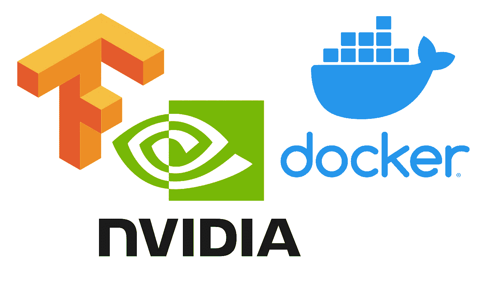

# 没有太多软件安装依赖的 ML 入门

> 原文：<https://medium.com/analytics-vidhya/getting-started-with-ml-without-much-of-software-installation-dependencies-1ce37f14b603?source=collection_archive---------13----------------------->



第二部分是[这里的](/analytics-vidhya/further-tweaks-to-improve-ml-training-experience-2ec73ae59f07)

第三部分是[这里的](/@lijojose/docker-tensorflow-gui-matplotlib-6cdd327d4a0f)

在一台新电脑上，我们将如何开始机器学习开发？设置太多。太多包裹了。Python 2，python3…有 gpu 支持的 Tensorflow，没有 gpu 支持的。张量流 2，张量流 1.14.2，张量流 1.15.2。有些 ML 训练只在 tensorflow 1.14 上有效。可能不支持 1.15 系列。我们将如何毫无顾虑地处理所有这些情况。在开始之前，需要为 NVidia GPU 做哪些配置？

对于一个经验丰富的 ML 从业者来说，这将是小菜一碟。对于刚开始学习的自学者来说，很难确定从哪里开始。在这篇文章中，让我试着介绍如何将 tensorflow docker 图像用于各种用例。在这篇文章中，我们将会看到在电脑上安装最低要求是什么。

这是要安装的软件列表

*   码头工人
*   nvidia gpu 驱动程序

Docker 安装我总是参考[如何在 Ubuntu 18.04 上安装和使用 Docker](https://www.digitalocean.com/community/tutorials/how-to-install-and-use-docker-on-ubuntu-18-04)。这在我所有的试验中都奏效了。

要安装 nvidia 驱动程序，首先通过命令确定设备中是否存在 gpu

```
$ lspci | grep -i nvidia 
$ ubuntu-drivers devices
```

一旦列出了 gpu，您就可以运行下面的*自动安装*来安装驱动程序。

```
$ sudo ubuntu-drivers autoinstall
```

下一步将是安装 [nvidia 容器工具包](https://github.com/NVIDIA/nvidia-docker/blob/master/README.md#quickstart)。可以使用下面的命令来验证安装。

```
$ docker run --gpus all --rm nvidia/cuda nvidia-smi
```

# 码头上的张量流

页面[中提到的细节 https://www.tensorflow.org/install/docker](https://www.tensorflow.org/install/docker)。一旦你经历了这些，参考这里。

我们可以选择如下张量流标签

```
tensorflow/tensorflow:<version>[-gpu][-py3]
```

比如我们想用 tensor flow 1 . 15 . 2 版本，支持 python3，支持 gpu，可以用标签*tensor flow/tensor flow:1 . 15 . 2-GPU-py3*。对于 v2.0.1，gpu，将是*tensor flow/tensor flow:2 . 0 . 1-GPU*

使用 gpu 时，使用标志*—gpu all*来使用 tensorflow docker 容器中的 GPU。

一个 docker 运行命令的例子看起来像这样

```
docker run -it --gpus all --name <name> -v <algo folder>:/algo -v <data folder>:/data tensorflow/tensorflow:1.15.2-gpu-py3 /bin/bash
```

我们将获得在 ML 领域使用 docker 的优势。“使用并丢弃”、“按需更改版本”、“保留多个冲突版本”等是这种方法的一些特征。

在帖子[中，我试图介绍如何充分利用 GPU 进行人工智能训练](/@lijojose/further-tweaks-to-improve-ml-training-experience-2ec73ae59f07)