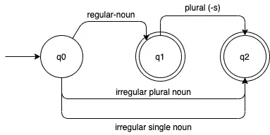
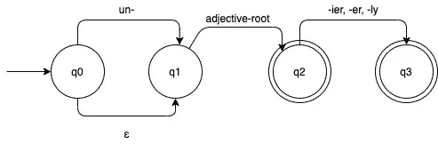
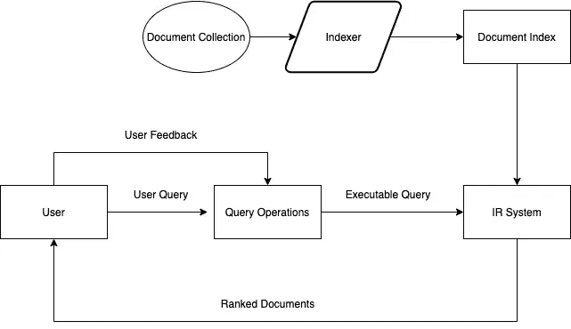
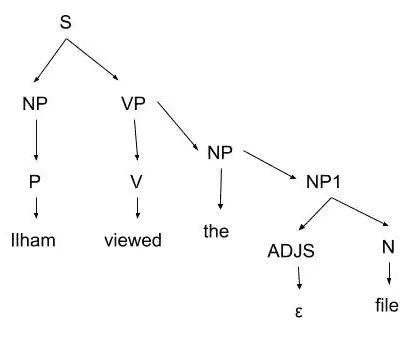

# 自然语言处理的基本理论

> 原文：<https://medium.com/analytics-vidhya/getting-started-with-natural-language-processing-nlp-3c91dfca6dc5?source=collection_archive---------25----------------------->

总的来说，交流是人类需要的重要事情之一。许多信息可以通过网站或互联网提取，大部分是自然语言。在获取这些信息时，最大的问题是含糊不清、杂乱的词语或不规范的语法。

自然语言处理(NLP)是人工智能的一种，它专注于人类自然语言，以阅读、理解或提取其含义。

自然语言是人类普遍用于交流的语言。与计算机不同，计算机在理解它之前必须进行处理。

根据定义，自然语言是一种允许通信者(发送者)通过媒体(如声音或文本)与通信者(接收者)进行通信的信息形式。NLP 可以解释为一个语法分析器句子，它一个字一个字地读取句子，并确定单词的下一种类型。

# 关心的领域

有几个感兴趣的开发领域，

> 问答系统(QAS)

QAS 能够回答用户提出的问题。用户可以直接用自然语言提问，而不是通过关键词在搜索引擎中搜索。

> 摘要

如其名，对一组内容进行总结。该应用程序可以帮助用户在不删除重要信息的情况下，将大型文本文档转换成较小的格式。

> 机器翻译

正如我们所知，它可以让机器理解人类的语言，然后将其翻译成另一种语言。比如*谷歌翻译。*

> 语音识别

这个领域是自然语言处理的一个分支。嗯，有些型号的电话或电脑已经用得很多了。

> 文件分类

这是现在常用的。应用程序可以确定系统中输入的文档应该放在哪里。我们可以在垃圾邮件过滤，新闻文章分类，甚至书评中遇到它。

# 有限状态自动机

有限状态自动机(FSA)是给定时间内状态集合的模型。让我们用例子来说明。我们知道，英语中的名词一般可以分为两类；定期和不定期。它们中的每一个都可以是单个或多个术语。对于每一项更改，我们都可以将其作为 FSA:

名词 FSA

左边的单箭头表示初始状态。在这种情况下，状态为 q0、q1 和 q2。双圈被称为最终状态。由此，我们可以得出结论，名词可以是:

1.  普通单人房
2.  基于规则单复数的规则复数(带后缀-s，-es，…)
3.  不规则单曲
4.  不规则复数

让我们再举一个例子。这是形容词的 FSA 之一:

形容词 FSA

epsilon (ε)表示一个空字符串，没有什么可输入的，或者我们可以跳过它。从 FSA 中，我们可以得出这样结论:

1.  它不仅前缀(un-)还是空字符串。
2.  只有从ε开始的基本形容词可以跳过，直到下一个状态。
3.  带后缀的形容词。

用这个词来表达清楚:

*   **清楚、不清楚、更清楚、不清楚**是一个形容词，如果输入到 FSA。但是，
*   **Un-，<空弦>，-ly** 不是形容词。

# 术语

就开发自然语言处理而言，自然语言可以形成知识库。理解自然语言的三个方面，

*   **语法**

句法解释了语言的形式。语法可以由语法指定。它超过了人工智能逻辑或计算机程序中的形式语言。

*   **语义**

语义学解释了句子的意思。在为应用构建 NLP 系统时，可以使用简单的语义表示。

*   **语用学**

语用学不仅解释句子中的关系或语境，还解释在像世界这样的环境中的陈述之间的关系或语境，或说话者的目的。

让我们看几个例子，让我们说三个句子:

1.  这篇文章是关于 NLP 的。
2.  田野里的蓝色自行车展示。
3.  无色的蓝色意识形态迅速消退。
4.  昏厥快速意识形态无色蓝色。

第一句适合放在文章的开头，因为它在句法、语义和语用上都是正确的。第二句在语法和语义上是正确的，但是如果放在 NLP 文章的开头会有点奇怪。第三句语法正确，但语义不正确。最后，它不在句法、语义和语用中。

# 信息检索

信息检索是寻找与用户信息需求相关的文档的工作。例如，我们已知的 IR 系统是万维网(WWW)中的*搜索引擎*。用户可以在搜索引擎中以文本形式输入任何查询并查看相关结果。这些是红外系统的特征:

1.  **一个文档集**，每个系统都必须定义文档用于。它可以是一个段落，一页，甚至是多页文本。
2.  **用查询语言发布的查询**，查询解释了用户想要得到的是什么。查询语言可以是字符列表，甚至是相邻单词的特定短语。
3.  **结果集**是被定义为与查询相关的文档的一部分。
4.  **结果集的表示**是文档结果信息的表示，以便作为列表排序。

让我们看一下简单的示意图:

红外系统流程

# **形态分析**

*词法分析是分析单个单词和从该单词中分离出的非单词类标点符号的过程。*

假设我们有这样一句话，

> “我想查看伊尔哈姆的。md 文件。

我们可以对那个句子进行形态分析，

1.  将“伊尔哈姆”拆分成专有名词“伊尔哈姆”和所有格后缀“' s”
2.  序”。md”被称为用于形容词句子的扩展文件。

句法分析使用形态分析的结果来构造句子的描述。最后的结果是解析。解析是将单词列表转换成结构单元形式的过程。

大多数用于句法处理的系统有两个主要组件，

1.  关于语言的语法事实的陈述性表述，称为语法。
2.  这个过程称为语法分析器，它将语法与输入的句子进行比较，以分析句子的结构。

语法表示的一般方式是产生式规则的序列。例如，“句子包括一个名词短语，后跟一个动词短语”。

解析过程使用语法中的规则，然后与输入的句子进行比较。最常用的解析是解析树。语法中的每个节点都与输入的单词或非终结符相关。

示例:

语法是这样的:

*   S → NP VP
*   NP→NP1
*   名词短语→名词短语
*   NP1 →调整 N
*   ADJS → ε |小|长
*   VP → V NP
*   VP → V
*   N →文件|计算机
*   V →已查看|已创建|想要
*   P →伊尔哈姆

如果我们有一个类似“伊尔哈姆查看了文件”的句子，解析树可以是:

简单解析树

# 堵塞物

词干化是减少代表单词的变化的过程。风险是词干单词的某些信息丢失或准确性降低。另一方面，词干增加了回忆的能力。

词干化的目的是通过减少唯一字的数量来提高性能并减少系统资源的使用。所以一般来说，词干算法做一些从单词到标准形态学的转换(称为词干)。

示例:

**compute**是可计算、兼容性、计算、计算、计算、计算、计算、计算、计算机化的词干。

# 词汇化

**词汇化是一个寻找单词基本形式(称为词汇)的过程**。甚至，有一种理论认为词汇化是基于基本形式来规范化文本或单词的方法。

规范化就是识别并去掉单词的前缀或后缀。所以，lemma 的意思是在字典中有特定含义的基本形式。

示例:

这个男孩的汽车是不同颜色的

1.  转变:男孩，男孩，男孩的→男孩
2.  转型:汽车，汽车，汽车的→汽车
3.  转换:am，is，are → be
4.  转变:不同→不同
5.  变换:颜色→颜色

结果:“*小汽车是不同颜色的*”

词干化和词汇化对于不同的语言有不同的算法。

# 一锤定音

这篇文章中没有涉及到很多东西。但是希望这篇文章能让你对 NLP 入门有一点了解。

# 参考

Budiharto，Widodo 和 Derwin Suhartono。2014.*人工智能*。日惹:安迪日惹。

 [## 自然语言处理(NLP)指南

### 机器如何处理和理解人类语言

towardsdatascience.com](https://towardsdatascience.com/your-guide-to-natural-language-processing-nlp-48ea2511f6e1)  [## 词干化和词汇化

### 下一步:更快发布列表交叉向上:确定以前的词汇:其他语言。的目录索引

nlp.stanford.edu](https://nlp.stanford.edu/IR-book/html/htmledition/stemming-and-lemmatization-1.html)  [## 准确度、精密度、召回率还是 F1？

### 当我与希望将数据科学应用到其流程中的组织交谈时，他们经常会问…

towardsdatascience.com](https://towardsdatascience.com/accuracy-precision-recall-or-f1-331fb37c5cb9)  [## 按感兴趣的领域细分 NLP

### 你是一个初露头角的 NLP 开发者，正在寻找一个起点吗？这里有一个感兴趣的自然语言处理领域的列表，可以帮助你发展…

medium.com](/@edwardcqian/breaking-down-nlp-by-areas-of-interest-7906f57fe587)