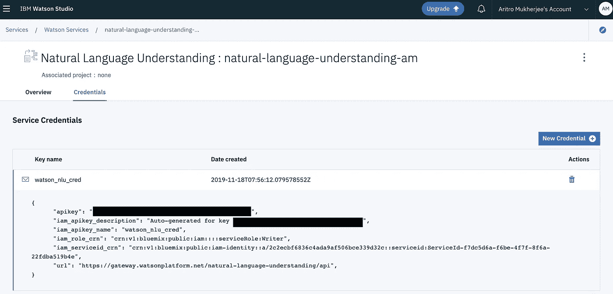
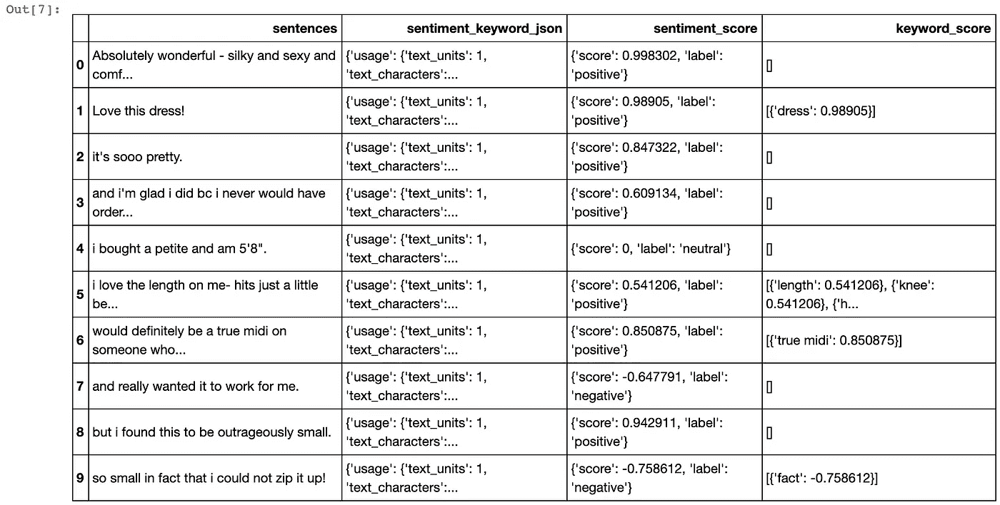
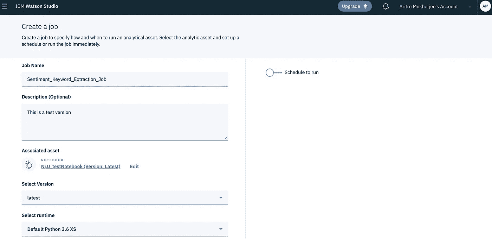

# 使用 IBM Watson Studio 开始学习 NLP

> 原文：<https://medium.com/analytics-vidhya/getting-started-with-notebooks-in-ibm-watson-nlu-part-1-3b0b92894901?source=collection_archive---------4----------------------->

你好。！！

欢迎阅读这篇关于利用 IBM Watson 的 NLU(自然语言理解)服务的能力进行自然语言处理的博文。


> 先决条件:思想开放

对于像我这样的 NLP 领域的新手来说，我觉得图像在讲述故事方面更具交流性。因此，我尽可能地添加了截图和代码片段。

我会努力让我们的学习经验尽可能与行业相关。

要开始使用最先进的 Watson 服务，您需要首先在 IBM Watson 上创建一个帐户。不用担心产生的费用！我会尽量坚持只提供免费服务。

## 今天的任务:


> 我们将把一个数据集上传到 IBM 云存储中，并在我们的笔记本上执行数据转换任务，同时与 Watson 的 API 进行通信，以获得我们的评论意见——数据集！

在这篇文章中，我们将使用 IBM Watson Studio。注册与沃森免费试用版为您的测试目的。成功创建您的新帐户后，您将看到以下主页。


点击**创建项目**按钮继续。


现在，我们将通过点击**新项目**按钮来创建我们的第一个项目。


您需要在对话框中为您的笔记本提供一个名称，将计划保存为 **Lite(自由层)。**完成后，点击确认继续。


每当你选择你的计划选择，通读功能。

在自由层类别下，你可以打 3 万个服务电话。我们将看到如何在严格的限制下使用这些服务，以避免产生成本。


一旦新项目被创建，它应该被列在 NLU 类别下。


一旦你进入这个项目，你会发现没有任何凭证。

我们将需要凭证来对 Watson 的 NLU 服务进行 API 调用，因此让我们单击 **New Credential** 按钮，并在记事本中保存凭证的备份。


您将被要求给出一个名称，所以继续命名您的凭证吧！


下面列出了服务凭据的各种属性。对于当前用例，我们将使用“ **api_key** 和“ **url** ”端点。



一旦我们的服务被创建，我们现在将构建我们的 NLP 项目。


选择第一个选项，创建一个空项目。


在对话框中，将提示您输入详细信息，以及存储位置。向下滚动查看我们如何创建存储( **IBM 云对象存储**)。


另外，请注意，有一个选择存储的选项。现在，我们需要为数据集指定一个存储。设置非常简单，只需按照下面的截图！


就像 NLU 服务一样，我们将坚持 IBM 云对象存储的 Lite(自由层)计划。


在对话框中更新存储名称，点击**确认**按钮。


现在让我们添加我们的笔记本，点击“**添加到项目**按钮。


从资产类型中选择**笔记本**。我们将在未来的迭代中探索其他资产。


选择 Python 的环境，包括您的工作可能需要的 CPU 支持。


我们完了！恭喜…我们已经成功地创造了我们的第一台笔记本电脑！


如果你想一睹这款笔记本的风采，请点击[这里](https://dataplatform.cloud.ibm.com/analytics/notebooks/v2/e61d0855-16bb-4211-85a8-17d8688a7148/view?access_token=11c481d4c8bbb8dd2fd1bc1830da23ceb407d8403324f270388fad4afa1c9cd8)。

# 该编码了！

肯定不会这样结束的！！

一旦你的笔记本被创建，它看起来就像这样！**一张白纸……**


笔记本的默认设置

## 数据摄取

ML 项目中的第一个组件是数据集。你可以在这里下载[。](https://drive.google.com/file/d/16MjczU1J_C04x01rUb_uL00mwhaVTZpG/view?usp=sharing)


该数据集由电子商务门户中的客户评论组成。这些评论中的每一篇都被分成了多个片段，让我们能够在更细的层面上更好地分析其观点。

迷茫？让我们看一个例子:

**回顾:**

> 由于可调节的前领带，这件衬衫非常讨人喜欢。这是搭配打底裤的完美长度，它是无袖的，所以它可以搭配任何开衫。喜欢这件衬衫！！！

**第一句:**

> 由于可调节的前领带，这件衬衫非常讨人喜欢。

**第二句:**

> 它是无袖的，所以可以和任何开衫搭配。

第三句:

> 喜欢这件衬衫！！

我希望你现在已经下载了数据集。赶紧导入吧！

菜单栏的右上角有一个 ***奇怪的*** 图标。请参考下面的快照。您可以拖放或直接从本地系统浏览。数据集将被上传到 **IBM 云对象存储**。


您始终可以查看“**数据资产**”类别下的所有数据集，如下所示:


为了在我们的笔记本中读取这个数据集，如果我说您不需要编写任何代码会怎么样？

享受沃森笔记本的美好！！！

只需点击数据集下的“插入熊猫数据框”,即可自动填充您的笔记本并创建一个数据框！


你会看到这样的东西。


**df_data_1** 是你默认的*数据帧。*

要查看数据集的样子*，只需运行* **df_data_1.head()**


为了分析每个句子的情感，我们将使用“句子”栏中的数据。

## 数据转换

> *在现实世界的场景中，这一层将由多个行动项组成，我们将在未来的迭代中讨论这些。*

在本教程中，我们将考虑“句子”列中的前 10 条记录，并将其存储到一个新的数据帧中。随后，我们将在调用 Watson 的 NLU API 后过滤掉重要的列。


执行以下代码复制前 10 条记录，并将其存储在 **df1** 中:


## 认知分析

我们可以使用屈臣氏 NLU 提供的以下选项从客户评论中推断出酒店的属性:

> 功能，实体选项，关键字选项，感知选项。

在当前教程中，我们将合并实体选项和感知选项


我们将导入所有必要的包，并包括 API 键，以促进基于 NLU 的分析。

正如我已经说过的，在今天的用例中，我们将找到评论的*情感评分*，以及评论中相关的*关键词*。我们将对完整的数据集执行这个操作。

下面的例子将更加清晰:

**句子:**

```
This would definitely be a true midi on someone who is truly petite.
```

对应**情绪:**

```
{"sentiment": {"document": {"score": 0.89721,"label":"positive"}}}
```

对应的**关键字:**

```
{“keywords”:[{ “text”:“true midi”,“relevance”:0.5,“count”: 1}]}
```

从这里可以看出，来自 NLU API 服务调用的输出负载由 JSON 数据组成。

> 因为我们使用的是 Lite-tier 版本，所以要注意 API 调用的数量。


因此，我们创建了一种方法来计算单个服务调用中评论的情感和关键词。

因此，我们将从这个 JSON 数据中提取我们需要的属性以及它们相应的分数。

我们现在将对数据集按行应用 API 服务调用。

让我们看看生成的数据框是什么样子的。点击[此处](https://drive.google.com/open?id=1JJny-pWHAPPoWxffOB4x5GEZESSK-n_p)下载笔记本。



恭喜你。！您已经学习了如何为并发 NLP 分析实现 Watson 服务。

我很高兴你陪了我这么久..这是给你的额外津贴！

# J 转播调度

在许多情况下，在处理工业项目时，您可能会被要求以重复的时间间隔运行作业，无论是数据接收、数据清理还是数据转换。

> 自动完成无聊的任务！

那真的很无聊！！！

所以，让我们来看看这一招吧！我保证它非常容易安装！

在笔记本的右上角，有一个选项“**创建工作**”。


我们现在将被重定向到一个专门用于创造就业机会的新控制面板。

您将获得一个选择环境的条款。选择 python 版本和其他属性开始。



一旦我们命名了我们的新作业，就该点击控制面板右侧的滑块了。现在，我们可以通过指定开始日期和设置时间来安排重复执行笔记本。


设置完成后，我们将被重定向到如下所示的控制面板。


所有作业运行，一旦成功执行，可以在“运行”类别下查看。您将能够看到模型执行所花费的时间。


瞧啊。！！！您不仅创建了一个笔记本，还安排它定期运行！多酷啊！