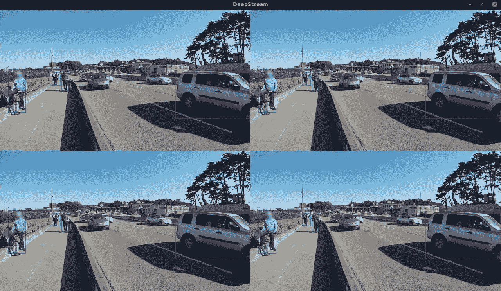

# NVIDIA DeepStream-5.0 入门

> 原文：<https://medium.com/analytics-vidhya/getting-started-with-nvidia-deepstream-5-0-8a05d061c4ee?source=collection_archive---------0----------------------->


在我的[上一篇文章](/@karthickai/using-gstreamer-plugin-to-extract-detected-object-from-nvidia-deepstream-104879cc7154)之后，我收到了写关于如何开始使用 NVIDIA DeepStream 的文章的请求。

NVIDIA DeepStream 发布了 5.0 版本，支持 DGPU 和 JETSON 设备的新功能。你可以在 https://developer.nvidia.com/deepstream-sdk[](https://developer.nvidia.com/deepstream-sdk)*上找到更多关于 NVIDIA DeepStream SDK 的信息。*

*在这篇文章中，我将分享如何在基于 DGPU 的设备上安装 NVIDIA DeepStream 的详细步骤。*

*您必须安装以下组件:*

**Ubuntu 18.04**

**GStreamer 1.14.1**

**英伟达驱动 440+**

**CUDA 10.2**

**tensort 7.0 或更高版本**

## ***1。移除先前的 DeepStream 安装***

*如果是第一次安装 DeepStream，您可以跳过这一部分*

***卸载 DeepStream 3.0**
要卸载任何以前安装的 DeepStream 3.0 库，请运行以下命令。*

```
*sudo rm -rf /usr/local/deepstream /usr/lib/x86_64-linux-gnu/gstreamer-1.0/libnvdsgst_* \
            /usr/lib/x86_64-linux-gnu/gstreamer-1.0/libgstnv* \
            /usr/bin/deepstream**
```

***卸载 DeepStream 4.0**
要卸载任何以前安装的 DeepStream 4.0 库，请使用 uninstall.sh 脚本。*

*1.打开位于/opt/NVIDIA/deepstream/deepstream/
2 中的 uninstall.sh 文件。将 PREV_DS_VER 设置为 4.0
3。以 sudo 的身份运行脚本。/uninstall.sh*

*请注意，这将仅在等于或高于 4.0 的 DeepStreamSDK 版本上运行。*

***移除 NVIDIA 驱动程序& CUDA**
移除任何先前安装的 NVIDIA 驱动程序和 CUDA 库，以避免版本冲突*

```
*sudo apt purge *nvidia*
sudo apt autoremove
sudo apt autoremove --purge 'cuda*'*
```

## *2.安装 Gstreamer 包*

*在您的终端中运行以下命令*

```
*sudo apt install build-essential gitsudo apt install \
libssl1.0.0 \
libgstreamer1.0-0 \
gstreamer1.0-tools \
gstreamer1.0-plugins-good \
gstreamer1.0-plugins-bad \
gstreamer1.0-plugins-ugly \
gstreamer1.0-libav \
libgstrtspserver-1.0-0 \
libjansson4*
```

## *3.安装 *NVIDIA 驱动 440+**

*将图形驱动程序添加到您的来源列表*

```
*sudo add-apt-repository ppa:graphics-drivers/ppa
sudo apt update
sudo apt upgrade*
```

*检查将要安装的驱动程序:*

```
*ubuntu-drivers devices*
```

*自动安装最新驱动程序*

```
*sudo ubuntu-drivers autoinstall*
```

*然后重新启动机器:*

```
*sudo reboot*
```

*启动后，您可以检查驱动程序的安装是否正确:*

```
*lsmod | grep nvidia*
```

## *4.要安装 CUDA 10.2+*

```
*wget [https://developer.download.nvidia.com/compute/cuda/repos/ubuntu1804/x86_64/cuda-ubuntu1804.pin](https://developer.download.nvidia.com/compute/cuda/repos/ubuntu1804/x86_64/cuda-ubuntu1804.pin)sudo mv cuda-ubuntu1804.pin /etc/apt/preferences.d/cuda-repository-pin-600wget [http://developer.download.nvidia.com/compute/cuda/10.2/Prod/local_installers/cuda-repo-ubuntu1804-10-2-local-10.2.89-440.33.01_1.0-1_amd64.deb](http://developer.download.nvidia.com/compute/cuda/10.2/Prod/local_installers/cuda-repo-ubuntu1804-10-2-local-10.2.89-440.33.01_1.0-1_amd64.deb)sudo dpkg -i cuda-repo-ubuntu1804-10-2-local-10.2.89-440.33.01_1.0-1_amd64.debsudo apt-key add /var/cuda-repo-10-2-local-10.2.89-440.33.01/7fa2af80.pubsudo apt-get updatesudo apt-get -y install cuda*
```

## *5.要安装 TensorRT 7.0*

*从 NVIDIA 开发者中心下载 TensorRT 7.0:*

*[https://developer.nvidia.com/nvidia-tensorrt-download](https://developer.nvidia.com/nvidia-tensorrt-download)*

**tensort 7.0.0.11 Ubuntu 1804 和 CUDA 10.2 DEB 本地回购包**

```
*cd ~/Downloadssudo dpkg -i ./nv-tensorrt-repo-ubuntu1804-cuda10.2-trt7.0.0.11-ga-20191216_1-1_amd64.debsudo apt-key add /var/nv-tensorrt-repo-cuda10.2-trt7.0.0.11-ga-20191216/7fa2af80.pubsudo apt-get updatesudo apt-get install tensorrtsudo apt-get install uff-converter-tf*
```

*验证安装。*

```
*dpkg -l | grep TensorRT*
```

## *6.安装 librdkafka*

*为消息代理启用 Kafka 协议适配器*

*从 GitHub 克隆 librdkafka 存储库:*

```
*git clone [https://github.com/edenhill/librdkafka.git](https://github.com/edenhill/librdkafka.git)*
```

*配置和构建库:*

```
*cd librdkafkagit reset --hard 7101c2310341ab3f4675fc565f64f0967e135a6a./configuremakesudo make install*
```

*将生成的库复制到 deepstream 目录:*

```
*sudo mkdir -p /opt/nvidia/deepstream/deepstream-5.0/libsudo cp /usr/local/lib/librdkafka* /opt/nvidia/deepstream/deepstream-5.0/lib*
```

## *7.要安装 DeepStream SDK*

*下载 DeepStream 5.0 dGPU Debian 包，DeepStream-5.0 _ 5 . 0 . 0–1 _ amd64 . deb[https://developer.nvidia.com/deepstream-getting-started](https://developer.nvidia.com/deepstream-getting-started)*

*然后输入命令:*

```
*sudo apt-get install ./deepstream-5.0_5.0.0-1_amd64.deb*
```

## *8.运行 deepstream-app 进行测试*

```
*deepstream-app -c /opt/nvidia/deepstream/deepstream-5.0/samples/configs/deepstream-app/source4_1080p_dec_infer-resnet_tracker_sgie_tiled_display_int8.txt*
```

**

*如果您在运行 deepstream-app 时遇到以下问题:*

***a)** 无法加载插件'/usr/lib/x86 _ 64-Linux-GNU/gstreamer-1.0/deepstream/libnvdsgst _ inferserver . so ':libtrtserver . so*

*解决方案:*

*清除 gstreamer 缓存以查看实际问题*

```
*rm -rf ~/.cache/gstreamer-1.0/*
```

***b)** 错误:无法获得 cuda 设备计数*

*解决方案:*

*启用所有 GPU*

```
*sudo nvidia-xconfig --enable-all-gpus*
```

*感谢阅读。*

*如果你有任何建议/问题，请在评论区告诉我们！*