# 熊猫入门！

> 原文：<https://medium.com/analytics-vidhya/getting-started-with-pandas-45c7639cd5ae?source=collection_archive---------16----------------------->


锡德·巴拉钱德朗在 [Unsplash](https://unsplash.com?utm_source=medium&utm_medium=referral) 上拍摄的照片

Pandas 是一个 Python 包，广泛用于处理结构化数据。

在这个博客中，我们将讨论 Pandas 中一些非常有用的方法，用于分析、转换和生成数据的基本统计数据。我们将使用来自 Kaggle 的数据集，名为[保险 _ 数据集](https://www.kaggle.com/utkarshakathayat/insurance-dataset)。

让我们从导入熊猫库开始。

```
import pandas as pd
```

## **读取数据**

现在，让我们将数据集读入熊猫数据帧。

Pandas dataframe 是带有标签轴(行和列)的表格形式的数据。

**read_csv()** 方法用于将一个*逗号分隔的*文件读入 Pandas。如果数据不是用逗号分隔，而是用任何其他字符(比如用|)分隔，那么这个字符应该作为分隔符传递给 read_csv()函数。

例如 read_csv("insurance.csv "，delimiter = "| ")

```
insurance = pd.read_csv("insurance.csv")
```

*数据太多，无法浏览？*

分别使用 **head()** 或 **tail()** 方法检查前 5 行或后 5 行。您还可以将希望看到的行数“n”传递给这两个函数。默认行数为 5。

```
insurance.head()
```

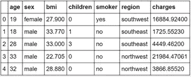

来源:作者

```
insurance.head(n = 10)
```

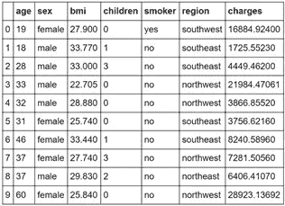

来源:作者

```
insurance.tail()
```

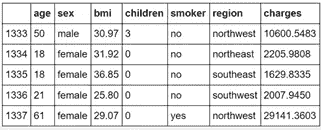

来源:作者

使用 **dtypes** 属性可以找到数据帧中每一列的数据类型。

python 中默认的数据类型是 float64、int64、object、bool、category、timedelta64、datetime64。

```
insurance.dtypes
```

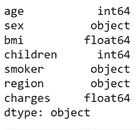

来源:作者

使用 **select_dtypes()** 只查看您想要的数据类型的列。

```
insurance.select_dtypes(include = ['float64', 'int64'])
```

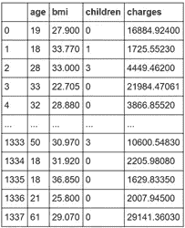

来源:作者

## 数据帧摘要

让我们检查数据帧中的行数和列数。

```
insurance.shape
```

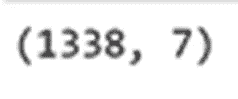

来源:作者

所以这个数据帧由 1338 行和 7 列组成。

Pandas **describe()** 是用来查看一些基本的统计细节，如均值、中位数、标准差等。一个数据帧。

```
insurance.describe()
```

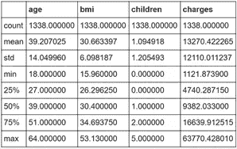

来源:作者

## **复制数据帧**

为了避免对原始数据帧进行修改，最好使用 **copy()** 方法创建一个副本并对其进行处理。

```
df = insurance.copy()
```

这里，如果我们改变第 4 行的性别和第 2 行的区域:

```
df.loc[3, ‘sex’] = ‘female’
df.loc[1, ‘region’] == ‘northwest’
```

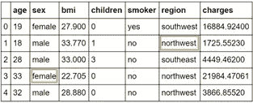

来源:作者

它不会影响原始数据帧。

```
insurance.head()
```

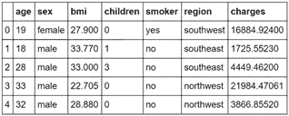

来源:作者

## **缺失值**

让我们检查每一列中 null 值的数量。

方法 **isnull()** 告诉我们数据帧中的值是否为空或缺失，方法 **sum()** 计算一列中此类值的数量。

```
print(df.isnull().sum())
```

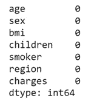

来源:作者

我们可以看到数据帧中没有空值或缺失值。但是如果有的话，我们可以使用 **dropna()** 方法删除空值，或者使用 **fillna()** 方法将它们替换为所需的值。

## 删除不需要的列

*如果在分析中有一个对你没有用的栏目怎么办？*

使用 **drop()** 方法删除这些列。

例如，让我们删除区域列。

```
df.drop(“region”, axis = 1, inplace = True)
```

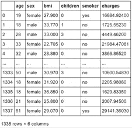

来源:作者

inplace 参数用于使数据帧中的更改永久化。

## 过滤和汇总数据

*吸烟和不吸烟的男女人数是多少？*

```
df.groupby(['sex'])['smoker'].value_counts()
```

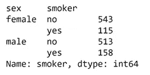

来源:作者

**groupby()是最有用的熊猫方法之一。**

**value_counts()** 统计应用该值的列中每个值的条目数。

现在，我们来看看这些人的平均保险费用，根据性别和是否吸烟来分类。

```
df.groupby(['sex', 'smoker'])['charges'].mean()
```

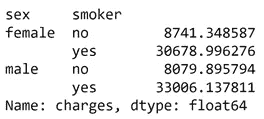

来源:作者

*哪个群体的低 bmi 人群最多？*

让我们对数据进行过滤，只包括那些低 bmi 的人(将其视为低于 19)。

```
low_bmi = df[df['bmi'] <= 19]
low_bmi.head()
```

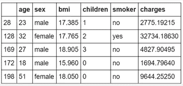

来源:作者

请注意，索引没有按顺序排列。为了解决这个问题，我们可以使用 **reset_index()** 方法。

```
low_bmi.reset_index(drop = True)
low_bmi.head()
```

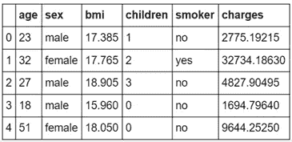

来源:作者

我们现在将检查哪个年龄组和性别患有低 bmi。

```
low_bmi.groupby(['sex'])['age'].value_counts().idxmax()
```

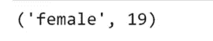

来源:作者

**idxmax()** 是另一个非常有用的函数，可以帮助我们确定出现频率最高的类别，即最大计数。

```
print(df['bmi'].min())
print(df['bmi'].max())
print(df['bmi'].mean())
print(df['bmi'].std())
```

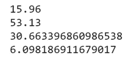

来源:作者

## 保存到新文件

最后，如果你想把对数据帧的修改保存到一个单独的文件中，可以使用 **to_csv()** 方法来完成。

```
df.to_csv("new_insurance.csv")
```

*感谢阅读！希望这篇帖子对你有帮助！*

*领英:*[https://www.linkedin.com/in/akshada-gaonkar-9b8886189/](https://www.linkedin.com/in/akshada-gaonkar-9b8886189/)