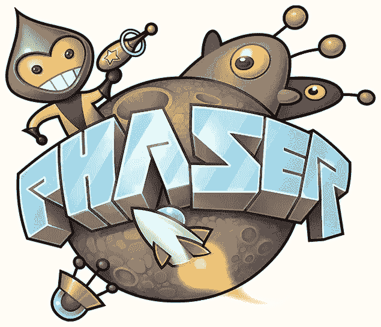
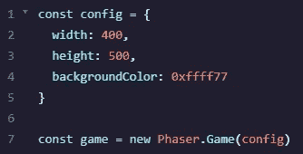
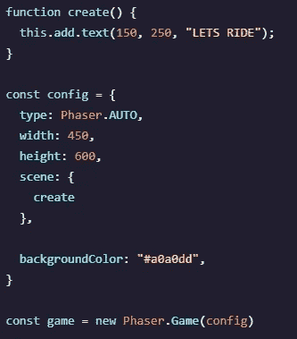
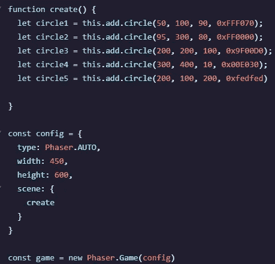
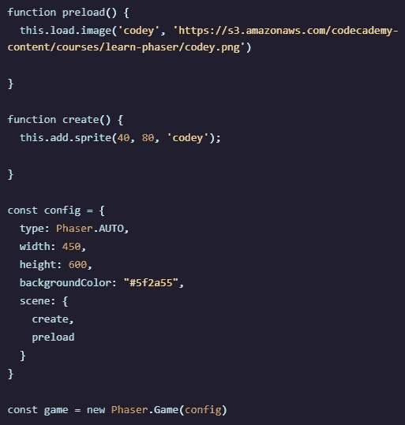
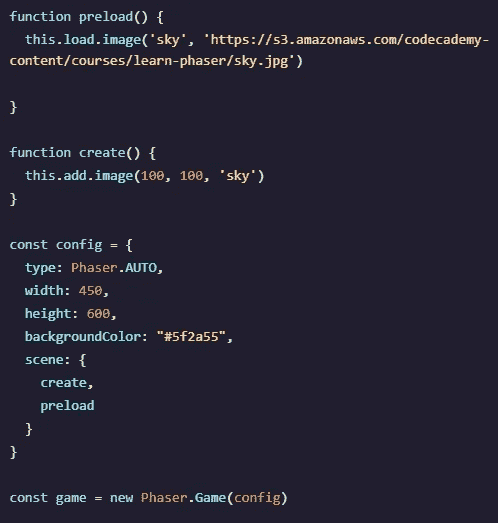

# PhaserJS 入门

> 原文：<https://medium.com/analytics-vidhya/getting-started-with-phaserjs-a81f1e228108?source=collection_archive---------2----------------------->

# 什么是相位器？

Phaser 是一个开源的 HTML 游戏设计框架！使用您的 JavaScript 能力来制作任何人都可以制作的简单游戏，尤其是对 JavaScript 有扎实背景的人。在本文中，我们将讨论 Phaser 中使用的一些最简单、最初级的想法和过程，以及具有 JavaScript 背景的人如何轻松地使用他们的技能开始制作游戏！

创建程序后，Phaser 既可用于桌面设备，也可用于移动设备。有了 Canvas 和 WebGL 这样的插件，框架中的渲染速度非常快，并且对于不同的 web 浏览器具有可塑性。Phaser 最棒的部分是它全部由社区资助，因此对初学者开发者是免费的！所需要的只是一个支持

<canvas>HTML 标签的 web 浏览器(比如 Chrome、Firefox、Safari、IE9+和 Opera)。虽然可以用 JavaScript 或 TypeScript 进行开发，但我们在这里将重点放在用 JavaScript 开发 Phaser 上。</canvas>

# 入门指南

有几个简单的概念可以帮助您开始编写 Phaser 框架的代码。我们将在后面的文章中更深入地讨论如何创建游戏，但这只是一个基本的介绍，看看这个框架是否适合你！

主要是当你开始从 JavaScript 的角度看 Phaser 时，你会发现它与使用 JS 的其他框架有一些相似之处；即反应！如果你有 React 的背景知识，你会发现这两个程序之间有一些共同的相似之处。好消息是，Phaser 比 React 简单得多。真正相似的是保存状态并将属性传递给不同对象的想法。

**创建新游戏**

要在 Phaser 中创建新游戏，首先调用 new Phaser。Game()，它将为我们的 HTML 文档创建一个新的

<canvas>(还记得我们之前提到过哪些浏览器使用 canvas 吗？几乎所有的人？).</canvas>

一旦我们解决了这个简单的设置，我们需要做一个*配置*。一旦声明了配置，它将成为一个对象，并为您的<画布>搭建舞台。以下是它的整体外观:

非常简单，简洁，容易！这是我们游戏的开始。一个具有宽度和高度的对象，一个十六进制的背景颜色，然后是新的 Phaser 游戏！

**现在来闹一闹**

现在为我们的游戏创建一个新的场景，这就是 Phaser 游戏的组成，我们可以创建一个新的函数来完成这个任务；创造！现在，如果我们从游戏的主屏幕开始，比如标题(在这种情况下，游戏被称为“LETS RIDE”)，我们可以很容易地做到这一点。一旦创建了函数，我们就用 scene 的键将它添加到我们的 config 对象中，然后调用函数本身。让我们看看这是什么样子:

# 创建形状、精灵和背景

现在我们的程序已经开始运行了(嗯…有点)，我们需要游戏中的某些东西，或者只是一个带标题的空白开始屏幕！我们可以创建简单的形状、精灵(角色、物体等)。)，还有一个背景。我们如何做到这一点？嗯，你猜对了，我们使用 create 函数！在我解释之前，先看一下这段代码，试着想想你*认为*它意味着什么:

在这里，我们正在创造一个奇妙的形状——圆形。在 create 函数中，我们声明了新的变量(不同编号的圆圈),它们被赋予了某些属性。有了 this.add.circle 之后，有四个不同的参数可以传入。第一个属性是圆形的 **x 坐标**在画布上的位置，接着是 **y 坐标**，比**像素大小的半径**，接着是**圆形的颜色**。

相当简单！虽然圆不是那么令人兴奋，但这是一个很好的理解的基础，可以用来创建你的场景并给它们添加形状。但是如果你想为你的精灵添加特殊的图片呢？

有了顶部的新函数 preload()，我们就能够从内存或在线的其他地方将某些**资产**带入我们的程序。preload()中的第一个参数是我们在程序中引用的图片的名称。第二是图像本身的位置。现在它已经被添加了，在我们的 create 函数中，我们可以 **this.add.sprite** ，你猜对了，x 坐标、 **y 坐标**和**哪个图像**(在预加载中声明后我们现在引用它的名字)用于我们的 sprite。现在，我们将 preload()函数添加到 config 对象的场景键中，这样就可以开始了！Preload()将把第一步中声明的所有资产带入我们的游戏！

现在这就是我们如何添加一个**背景**。现在你知道如何添加一个精灵，看它是多么容易阅读？我们在这里的主要区别是什么…嗯，嗯，不多！在 preload 中我们使用术语 **this.load.image** 来代替，在 create 中我们也使用 **this.add.image** ，这是我们唯一的区别！一旦你开始掌握设置的节奏，在 Phaser 中创建一个完整的场景(即使很简单)就变得又快又容易了！

# 在我们的下一篇文章中

我们要让那些精灵移动！我们可以了解与对象的交互性，以及如何读取用户的键盘和鼠标输入。这是 React 老手们真正注意到相似性是如何发挥作用的地方！我们将有一个状态，我们将与我们的资产上的事件侦听器一起工作，使它们移动、交互等！敬请游戏玩家和程序员关注，这仅仅是个开始！