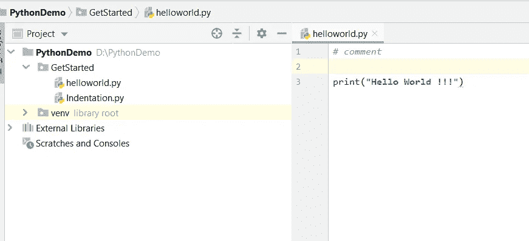

# Python 入门

> 原文：<https://medium.com/analytics-vidhya/getting-started-with-python-4f583147d6c0?source=collection_archive---------22----------------------->

在本教程中，您将学习如何在 windows 上安装和运行。一旦我们这样做了，我们也将编写我们的第一个 Python 程序

Python 是一种跨平台编程语言，这意味着它可以在 Windows、Mac 和 Linux 等多种平台上运行。

**1。Python 安装**

1.  下载[最新版本的 Python](https://www.python.org/downloads/)

2.运行安装文件，按照步骤安装 Python
在安装过程中，勾选**将 Python 添加到环境变量**。这会将 Python 添加到环境变量中，并且您可以从计算机的任何部分运行 Python。

一旦完成安装过程，您就可以运行 Python 了。

**2。在即时模式下运行 Python**

一旦 Python 安装完毕，在命令行中键入 ***python*** 并按下回车键将会在即时模式下调用解释器。我们可以直接输入 Python 代码，按回车键得到输出。

尝试键入 ***3 + 2*** 并按回车键。我们得到 ***5*** 作为输出。要退出此模式，请键入***exit()/quit()***并按回车键。

**3。在集成开发环境(IDE)中运行 Python**

我们可以使用任何文本编辑软件来编写 Python 脚本文件。

PyCharm 是一个用于计算机编程的集成开发环境(IDE ),专门用于 Python 语言。

我们只需要保存扩展名为`.py`的文件。但是使用 IDE 可以使我们的生活变得容易得多。IDE 是一个软件，它提供了一些有用的功能，如代码提示、语法高亮和检查、文件浏览器等。程序员进行应用程序开发。

我们可以在 IDE 中以两种方式运行 Python 脚本，

1.  使用如下所示的**运行**选项直接从 IDE 运行。

2.使用**终端**运行，如下所示，其中 **python** 是命令， **helloworld.py** 是脚本文件。**D:\ python demo \ get started**是 **helloworld.py** 脚本文件所在的目录。

