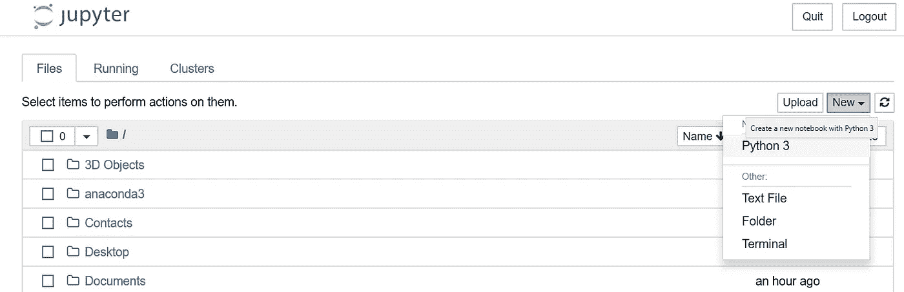
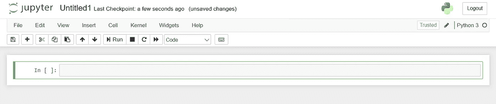
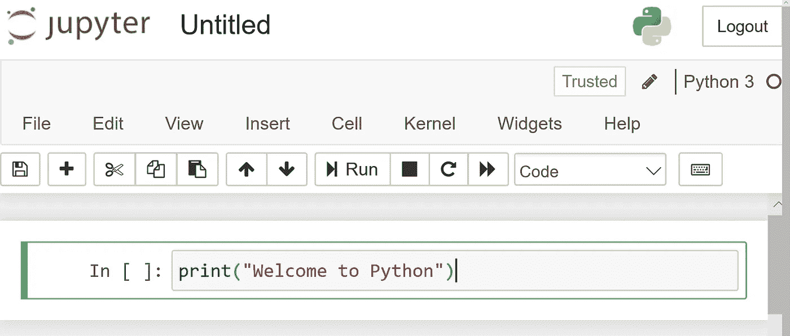
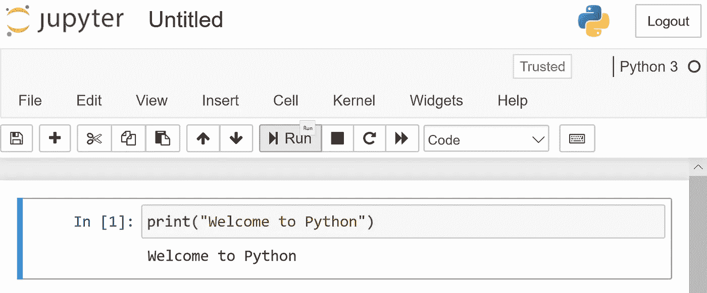
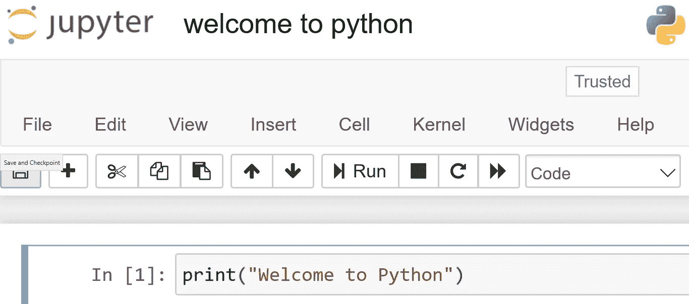

# 使用 Jupyter 笔记本开始 Python 编程

> 原文：<https://medium.com/analytics-vidhya/getting-started-with-python-programming-using-jupyter-notebook-fc21059078a9?source=collection_archive---------36----------------------->

一旦安装完成，我们就可以在 Jupyter 笔记本上写代码了。(要了解如何在电脑上安装 Python，请查看此链接:[https://medium . com/@ suma 31 selvam/installation-of-Python-e 12476 f83b 9](/@suma31selvam/installation-of-python-e12476f83b9))

Python 让你快速工作。

现在，让我们开始一步一步地为这个街区的新成员进行 python 编程。

第一步:

打开 Jupyter 笔记本。单击新建并选择 Python 3

第二步:

现在让我们创建一个非常简单的程序，在屏幕上输出“欢迎使用 python”。

第三步:

单击 Run 在屏幕上查看输出。

第四步:

我们可以通过单击“无标题”来重命名该文件，并按照您的意愿命名该文件。然后单击“保存和检查点”来保存它。

这难道不简单吗？这就是 Python 的妙处。

*“你值得拥有* ***祝贺你*** *用 Python 写了你的第一个程序…👏👏”*

快乐编码…😊😊😊