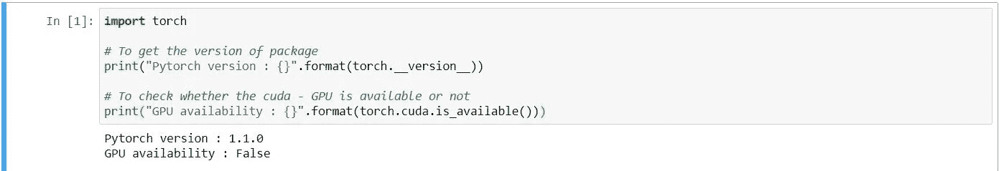
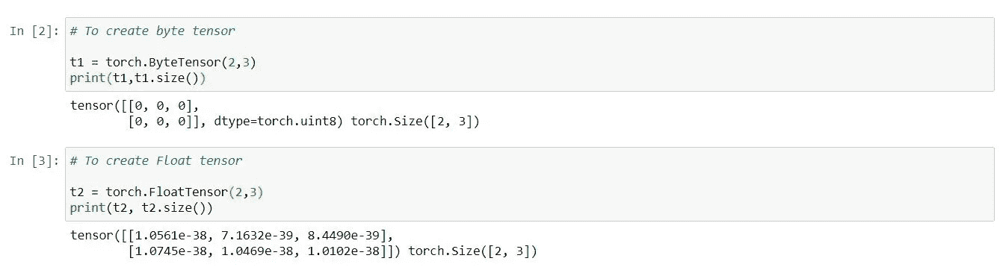
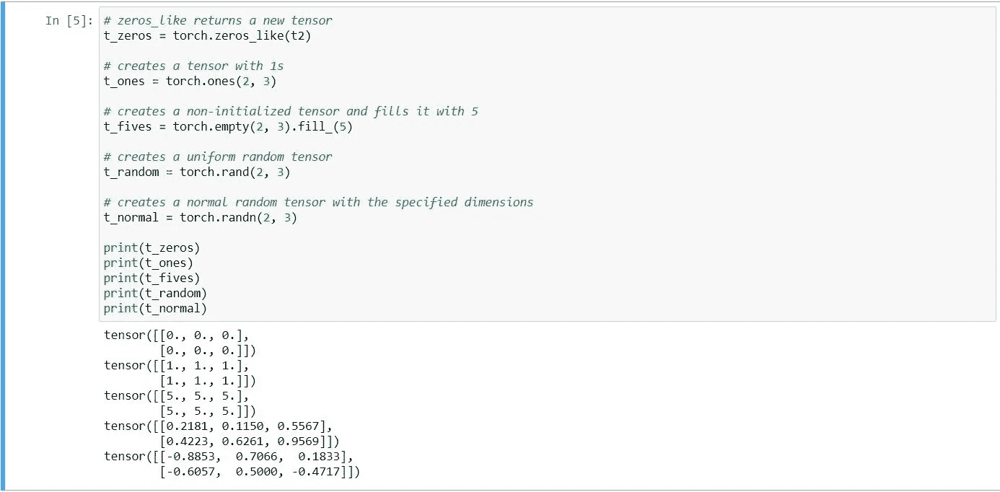
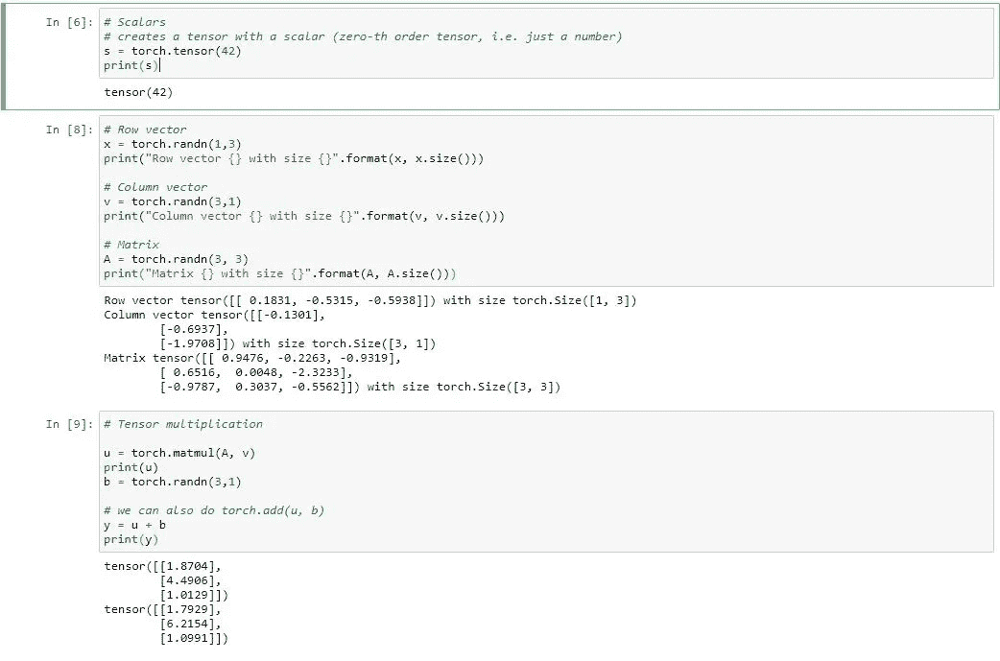

# Pytorch 入门

> 原文：<https://medium.com/analytics-vidhya/getting-started-with-pytorch-de71fe1a39d9?source=collection_archive---------16----------------------->

Pytorch 是一个用于科学计算的 python 包，主要关注两件事。比如，

1.  要使用 GPU 的功能，请替换为 Numpy package。
2.  在深度学习方法中提供最大的灵活性和速度。

***py torch 包的一些优点:***

1.  这对于动态图计算是有效的。
2.  几乎比[tensor flow](https://www.tensorflow.org/)1.0 版本快，在深度学习方面。(Tensorflow 版本比 Pytorch 快很多)。
3.  更容易学习和编码。
4.  易于调试和专注于开发人员的较小社区。
5.  对数据并行很有用。

**安装 Pytorch:**

*pip 安装 torchvision*

**开始在 Pytorch 中编码:**

从导入 Pytorch 的包开始 python 代码，比如“*导入 torch* ”。你可能会有疑问，为什么是 torch 而不是 Pytorch？原因是 Pytorch 开发背后的历史，torch 是 2002 年用 Lua 语言为 C 语言编写的库的原始名称。这个库继承了 python 语言的一些其他特性。他们在这个词的前面加上 Py。

图形处理器(GPU)在深度学习的快速训练和执行中发挥着重要作用。在我们开始编码之前，我们必须检查我们系统的 GPU 是否可用。

Pytorch 提供了一个简单的函数来检查它，函数是，***torch . cuda . is _ available()。***

检查 GPU 的可用性

**张量:**

1.  用数组表示的数的集合称为张量。
2.  张量有五种类型，

*   标量—单一数字(零阶张量)。
*   列向量—一阶张量。
*   行向量—一阶张量。
*   矩阵张量——二阶张量。
*   立方体张量——三阶张量(图像以这种形式表示)。

**创建张量:**

可以创建两种类型的张量，

1.  浮点张量有 3 种类型(16 位、32 位、64 位)，常用的是 32 位。
2.  整数张量的 5 种类型(有符号 8 位，无符号 8 位，16 位，32 位，64 位)，常用的张量有，以防 8 位 ***炬。bytentsor()***和 64 位是 ***火炬。LongTensor()。***

创建张量

**张量初始化:**

有各种各样的初始化张量的方法，像 Numpy，1，创建张量和填充一个值，均匀随机张量，正常随机张量。

初始化张量

**对张量的运算:**

1.  标量张量。
2.  列向量张量。
3.  行向量张量。
4.  矩阵张量。
5.  张量 x 张量乘法。

感谢阅读帖子，希望你喜欢。