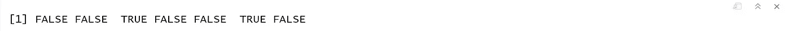

# R-1 入门

> 原文：<https://medium.com/analytics-vidhya/getting-started-with-r-1-4273a71fb885?source=collection_archive---------12----------------------->

> 本系列面向希望快速了解 R 基础知识的 R 初学者。它涵盖了 R 的基础知识，包括数据类型、控制结构、循环、函数和高级数据结构。
> 
> 如果您已经熟悉这些主题，并且正在使用 r 寻找统计和机器学习中所有重要主题的全面介绍，请从以下系列开始，其中讨论了与数据科学相关的所有必要主题。
> 
> [将数据读入 R — 1 的多种方式](/@viveksrinivasan/many-ways-of-reading-data-into-r-1-52b02825cb27)
> 
> 这些内容的灵感来自于我在 IIM-B 时代介绍的几本书。
> 
> *人人有责——贾里德·p·兰德*
> 
> *与 R — Nina Zumel 合作的实用数据科学&约翰·芒特*
> 
> *文中讨论的所有代码块都以 R markdown 的形式出现在* Github 链接*中。*
> 
> 希望有帮助，让我们开始吧！！！！！！！


R 是一个强大的工具，用于各种计算、数据操作和科学计算。在开始 R 中可能的复杂操作之前，我们必须从基础开始。像大多数语言一样，R 有它自己的数学能力、变量、函数和数据类型。

## 基础数学

作为一种统计编程语言，R 当然可以用来做基础数学，这就是我们要开始的地方。我们从“你好，世界！”基础数学:1 + 1。在控制台中，应该输入代码的地方有一个右尖括号(>)。让我们直接尝试一点复杂的操作作为例子。

```
(4 * 6) + 5
```


这些遵循基本的操作顺序:括号，指数，乘法，除法，加法和减法(PEMDAS)。这意味着括号内的操作优先于其他操作。优先级列表上的下一个是指数运算。之后，执行乘法和除法，接着是加法和减法。

到目前为止，我们已经在每个操作符之间放置了空格，例如*和/。这不是必需的，但作为一种良好的编码实践，我们鼓励这样做。

## 变量

变量是任何编程语言不可或缺的一部分，R 提供了很大的灵活性。与 C++等静态类型语言不同，R 不需要声明变量类型。变量可以采用任何可用的数据类型。它还可以保存任何 R 对象，如函数、分析结果或绘图。单个变量可以在某一时刻保存一个数字，然后保存一个字符，然后再保存一个数字。

给变量赋值有很多种方法，同样，这不依赖于被赋值的值的类型。有效的赋值操作符是`<-` 和`=`，首选第一个。例如，让我们将 2 保存到变量`x`，将 5 保存到变量`y`。箭头操作符也可以指向另一个方向。

```
x <- 2
y = 5
3 -> z
```

赋值操作可以连续地用于同时给多个变量赋值。

```
a <- b <- 7
```

一种更费力但有时也是必要的分配变量的方法是使用`assign` 函数。

```
assign(“j”, 4)
```

变量名可以包含字母数字字符以及句点 `(.)`和下划线`(_)`的任意组合。但是，它们不能以数字或下划线开头。

在 R 社区中，最常见的赋值形式是左箭头`(<-)`，它起初似乎很难使用，但最终变成了第二天性。这似乎很有意义，因为变量在某种程度上指向它的值。对于来自像 SQL 这样的语言的人来说，还有一个特别好的好处，在 SQL 中，单个等号`(=)` 测试相等性。

通常认为最好的做法是对变量使用实际的名称，通常是名词，而不是单个字母。这为阅读代码的人提供了更多的信息。这在本书中随处可见。

出于各种原因，可能需要删除某个变量。使用 remove 或其快捷方式 rm 很容易做到这一点。

```
rm(j)
```

这释放了内存，使得`R`可以存储更多的对象，尽管它不一定为操作系统释放内存。为了保证这一点，使用`gc`，它执行垃圾收集，将未使用的内存释放给操作系统。`R`自动定期进行垃圾收集，因此该功能不是必需的。

## 数据类型

R 中有许多数据类型存储各种类型的数据。最有可能使用的四种主要数据类型是`numeric`、`character` (字符串)、`Date/POSIXct`(基于时间)和`logical` (真/假)。变量中包含的数据类型用类函数检查

```
class(x)
```


## 数字数据

不出所料，R 擅长运行数字，所以数字数据是 R 中最常见的类型，最常用的数字数据是`numeric`。这类似于其他语言中的`float` 或`double` 。它处理整数和小数，正的和负的，当然还有零。存储在变量中的数值被自动假定为数字。使用函数`is.numeric`测试变量是否为数字。

```
is.numeric(x)
```


另一个重要的，虽然不常用，类型是`integer`。顾名思义，这仅适用于整数，不包括小数。要将一个整数设置到一个变量中，有必要给该值添加一个`L`。与检查数字一样，使用`is.integer`功能。

```
i <- 5L
is.integer(i)
```

请注意，即使 I 是一个整数，它也将通过数字检查。`R`在需要时很好地将`integers` 提升为`numeric` 。当一个整数乘以一个数字时，这一点很明显，但重要的是，当一个`integer` 除以另一个`integer`得到一个十进制数时，这一点很有用。

## 字符数据

尽管字符(字符串)数据类型不是明确的数学类型，但它在统计分析中非常常见，必须小心处理。`R`有两种处理字符数据的主要方式:`character` 和`factor`。虽然它们表面上看起来很相似，但处理起来却大不相同。

```
x <- "data"
y <-  factor("data")
```


请注意，`x`包含用引号括起来的单词“data ”,而`y`包含不带引号的单词“data”以及关于`y`的`levels` 的第二行信息。在讨论`Vectors`的时候我们会看到更多。

字符区分大小写，所以“数据”不同于“数据”或“数据”。要找到`character` (或`numeric`)的长度，使用`nchar`功能。但这不适用于如下所示的因子数据。

```
nchar(x)
nchar(y)
```


## 日期类型

在任何语言中处理日期和时间都是困难的，更复杂的是`R` 有许多不同类型的日期。最有用的是`Date` 和`POSIXct`。`Date` 只存储日期，而`POSIXct` 存储日期和时间。这两个对象实际上都表示为自 1970 年 1 月 1 日以来的天数(日期)或秒数`(POSIXct)`。

```
date1 <- as.Date("2012-06-28")
date1
```


```
date2 <- as.POSIXct("2012-06-28 17:42")
date2
```


使用`lubridate` 和`chron` 包可以更容易地操作日期和时间对象。使用像`as.numeric`或`as.Date`这样的函数不仅改变了对象的格式，而且实际上改变了底层类型。

## 逻辑式

`Logicals` 是一种表示数据的方式，可以是`TRUE` 或`FALSE`。数值上，`TRUE` 与 1 相同，`FALSE` 与 0 相同。所以`TRUE ∗ 5` 等于 5，而`FALSE * 5`等于 0。

类似于其他类型，逻辑有自己的测试，使用`is.logical`功能。

```
k <- TRUE
class(k)
is.logical(k)
```


r 提供了`T`和`F`分别作为`TRUE` 和`FALSE`的快捷方式，但是最好不要使用它们，因为它们只是存储值`TRUE` 和`FALSE` 的变量，并且可以被覆盖，这可能会导致很多麻烦。比较两个数字或字符可以得到逻辑结果。

## 向量

一个`vector` 是所有相同类型的元素的集合。例如，`c(1, 3, 2, 1, 5)`是一个由数字 1、3、2、1、5 依次组成的向量。类似地，`c(“R”, “Excel”, “SAS”, “Excel”)`是字符元素“R”、“Excel”、“SAS”和“Excel”的向量。向量不能是混合类型。

在 R 中扮演一个关键的、有用的角色。R 中的向量不仅仅是简单的容器，它的特殊之处在于它是一种语言。这意味着运算会自动应用到向量的每个元素，而不需要遍历向量。这是一个强大的概念，对于来自其他语言的人来说可能是陌生的，但这是 r 最伟大的事情之一。

`Vectors` 没有维度，意味着没有列向量或行向量这样的东西。这些矢量不像数学矢量，在数学矢量中，`row` 和`column` 方向是不同的。

创建向量最常见的方法是使用`c`。`“c”`代表组合，因为多个元素被组合成一个向量。

```
x <- c(1, 2, 3, 4, 5, 6, 7, 8, 9, 10)
```

现在我们有了前十个数字的向量，我们可能希望每个元素都乘以 3。在 R 中，这是一个简单的操作，仅使用乘法运算符`(*)`。

```
x*3
```


不需要循环。`Addition`、`subtraction` 、`division` 一样简单。这也适用于任何数量的操作。

前面我们使用 c 函数创建了一个前十个数字的向量，它创建了一个向量。一个快捷方式是`:` 操作符，它在两个方向上生成一系列连续的数字。

```
c(1:10)
```

`Vector` 操作可以进一步扩展。假设我们有两个长度相等的向量。每个相应的元素可以一起操作。

```
x <- 1:10
y <- -5:4## Add them
x+y
```


当对两个长度不等的`vectors` 进行操作时，事情变得稍微复杂一些。较短的向量被回收，也就是说，它的元素按顺序重复，直到它们与较长向量的每个元素都匹配。如果较长的一个不是较短的一个的倍数，则给出警告。

```
x + c(1, 2)
x + c(1, 2, 3)
```


比较也适用于向量。这里的结果是一个相同长度的向量，每个元素包含 TRUE 或 FALSE。

```
x <= 5
```


要测试所有结果元素是否都是`TRUE`，使用`all` 函数。类似地，`any` 函数检查是否有任何元素是`TRUE`。

```
x <- 10:1
y <- -4:5## Checking any and all
any(x < y)
all(x < y)
```


使用方括号`([ ])`访问`vector` 的单个元素。通过键入`x[1]`检索 x 的第一个元素，通过`x[1:2]`检索前两个元素，通过`x[c(1, 4)]`检索不连续的元素。

```
x[c(1, 4)]
```


这适用于所有类型的向量，无论它们是`numeric`、`logical`、`character` 等等。可以在创建过程中给一个向量命名，也可以在创建之后给它命名。

```
c(One="a", Two="y", Last="r")
```


## 因素向量

是 R 中的一个重要概念，尤其是在构建模型时。让我们创建一个简单的文本数据向量，它有一些重复。我们将从之前创建的向量`q`开始，并向它添加一些元素。

```
q2 <- c("Hockey", "Lacrosse", "Hockey", "Water Polo", "Hockey", "Lacrosse")
q2Factor <- as.factor(q2)
q2Factor
```


注意，在打印出`q2Factor`的每个元素后，R 还打印出`q2Factor`的等级。因子的级别是该因子变量的唯一值。从技术上讲，R 给一个因子的每个唯一值一个唯一的整数，将它与字符表示联系起来。这可以从`as.numeric`中看出。

```
as.numeric(q2Factor)
```


在普通的`factors` 中，`levels` 的顺序并不重要，一个等级与另一个等级没有区别。然而，有时理解一个因素的顺序是很重要的，例如在对教育水平进行编码时。将`ordered` 参数设置为`TRUE` 会创建一个有序因子，其顺序在 levels 参数中给出。

```
factor(x=c("High School", "College", "Masters", "Doctorate"),     levels=c("High School", "College", "Masters", "Doctorate"),       ordered=TRUE)
```


`Factors` 可以极大地减少变量的大小，因为它们只存储唯一的值，但是如果使用不当，它们会引起麻烦。

## 缺失数据— NA vs NULL

缺失数据在统计和计算中都起着至关重要的作用，R 有两种类型的缺失数据，`NA` 和`NULL`。虽然他们很相似，但他们的行为不同，这种差异需要引起注意。

我们经常会因为各种原因而丢失数据。统计程序使用各种技术来表示缺失数据，例如一个`dash`、`period` 甚至数字`99`。r 使用`NA`。`NA` 通常会被看作只是矢量的另一个元素。`is.na`测试`missingness`向量的每个元素。

```
z <- c(1, 2, NA, 8, 3, NA, 3)
is.na(z)
```



简单地通过键入字母`“N”`和`“A”`来输入`NA` ，就像它们是普通文本一样。这适用于任何类型的向量。

处理缺失数据是统计分析的一个重要部分。根据领域和偏好，有许多技术。一个流行的技术是`multiple imputation`，在`Chapter 25 of Andrew Gelman and Jennifer Hill’s book Data Analysis Using Regression and Multilevel/Hierarchical Models,`中有详细的讨论，并且在`mi`、`mice` 和`Amelia` 包中实现。

`NULL` 是什么都没有。不完全是`missingness`，是`nothingness`。函数有时可以返回`NULL` ，它们的参数可以是`NULL`。`NA` 和`NULL` 的一个重要区别是 NULL 是`atomical` 并且不能存在于`vector`中。如果在`vector`中使用，它就会消失。

```
z <- c(1, NULL,3)
length(z)
z
```


即使它被输入到向量`z`中，它也没有被存储在`z`中。实际上，`z` 只有两个元素长。对`NULL` 值的测试是 `is.null`。由于`NULL` 不能作为矢量的一部分，`is.null`不进行矢量化。

## 管道

在 R 中调用函数的一个新范例是`pipe`。`magrittr` 包中的管道通过获取管道左侧的值或对象并将其插入管道右侧的函数的第一个参数来工作。一个简单的例子是使用管道将`x` 输入到`mean` 函数。

```
library(magrittr)
x <- 1:10
x %>% mean
```


当在管道中把一系列函数调用连接在一起时最有用。给定一个包含数字和`NAs`的向量`z`，我们想知道有多少个`NAs`。传统上，这是通过嵌套函数来完成的。

```
z <- c(1, 2, NA, 8, 3, NA, 3) 
sum(is.na(z))## Using Pipes
z %>% is.na %>% sum
```

`Pipes` 以从左到右的方式更自然地阅读，使代码更容易理解。使用管道比嵌套函数调用慢得可以忽略不计，尽管正如`Hadley Wickham`指出的那样，`pipes` 不会成为代码中的主要瓶颈。

当将一个对象通过管道传递到一个函数中并且不设置任何附加参数时，不需要括号。但是，如果使用了额外的参数，那么它们应该被命名并包含在函数调用后的括号内。不使用第一个参数，因为管道已经将左边的对象插入到第一个参数中。

```
z %>% mean(na.rm=TRUE)
```

数据有很多种类型，R 能够很好地处理它们。除了基本的计算，R 还可以处理`numeric`、`character` 和基于时间的数据。使用 R 的一个更好的地方是`vectorization`，尽管这需要一种不同的编程思维方式。这允许同时对向量中的多个元素进行操作，从而产生更快、更数学化的代码。在下一篇文章中，我们将讨论 r。

> [R—2 中的高级数据结构](/@viveksrinivasan/advanced-data-structures-in-r-2-635cbbedbc8c)
> 
> 一定要通过评论和分享文章来分享你的想法和支持。