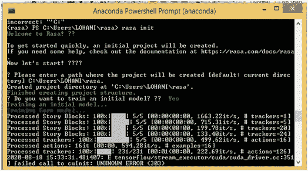
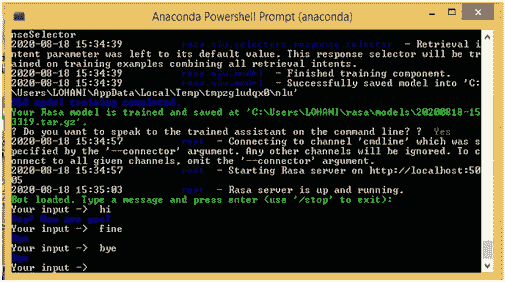

# windows 上的 Rasa 入门

> 原文：<https://medium.com/analytics-vidhya/getting-started-with-rasa-on-windows-99efbc29c24f?source=collection_archive---------25----------------------->

在我作为数据科学家追求者的旅程中，我遇到了在 rasa nlu 的帮助下建立对话聊天机器人。使用聊天机器人或虚拟助手来改变用户体验。如今，聊天机器人越来越受欢迎。下面是我对构建初学者的一点小小的努力。

## **RASA**

Rasa 是一个机器学习对话式人工智能，用于构建聊天机器人。它是最好的开源机器学习工具包之一，用于用最少的训练数据开发复杂的聊天机器人。

它基于两个框架-

1.**Rasa nlu**–自然语言理解库(nlu)，对意图进行分类，并从用户输入中提取实体。

**2。rasa Core**——一个聊天机器人框架，根据对话历史预测下一个最佳响应或行动。

*   当 Rasa 收到来自用户的消息时，它会预测或提取。这部分由**拉莎·NLU**负责。
*   然后，Rasa 试图预测下一步行动。这是由 **Rasa 核心完成的。**

## **要求**

rasa 在 window 上工作有一些先决条件:

微软 VC++编译器

Python(版本 3.5、3.6)

Anaconda 框架

创建虚拟环境后，将单独安装空间库。

安装 python 和 anaconda 之后。确保为 rasa 项目创建单独的虚拟环境。Python 虚拟环境通过允许您为不同的项目使用不同版本的包来帮助解决依赖性问题。使用以下命令:

> conda create-n rasa python = 3.6
> # rasa 是我使用过的环境的名称
> conda activate rasa

#安装 rasa 包
pip 安装 rasa
#安装空间
pip 安装空间

创建一个要存储项目的目录。导航到该目录。使用以下命令:

> rasa 初始化

执行完上述命令后，将在您的项目目录中创建以下文件，作为 RASA 的初始项目结构。

现在，您可以创建您的模型并训练它。如果我能得到掌声形式的感谢，我将不胜感激。

感谢阅读:)