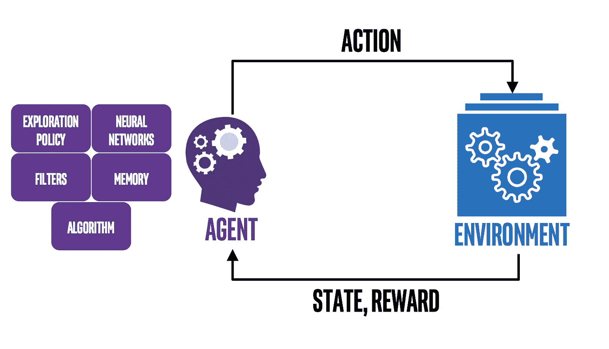
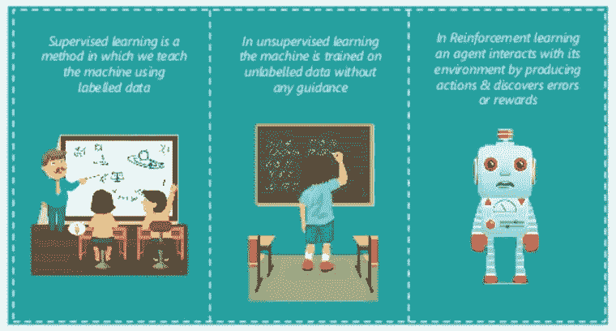

# 强化学习入门

> 原文：<https://medium.com/analytics-vidhya/getting-started-with-reinforcement-learning-89ef9c791180?source=collection_archive---------4----------------------->

# **概述:**

1.  什么是强化学习？
2.  强化学习与其他类型的机器学习有什么不同？
3.  强化学习是如何工作的？
4.  强化学习算法的实现方法
5.  强化学习的特征
6.  强化学习的类型
7.  强化学习的应用
8.  强化学习面临的主要挑战

# 什么是强化学习？

强化学习是一种机器学习，它使用动态编程来训练算法，以学习其环境，并使用奖励和惩罚系统执行特定任务。强化学习算法或代理通过与环境交互并采取相应的奖励或惩罚措施来学习。

强化学习

# **强化学习**与其他类型的机器学习有什么不同？****

****

**机器学习的类型(由 Edureka 提供)**

*   ****监督 vs 强化学习**:在监督和强化学习中，都存在输入和输出之间的映射。但在监督学习的情况下，模型从历史数据中学习以预测新数据，而在强化学习的情况下，有一个奖励函数作为对代理的反馈，代理从经验中学习。比如一盘棋，有上万步棋可以下。因此，创建一个可以播放的知识库是一项繁琐的任务。在这类问题中，更可行的是从自己的经历中学习，并从中获得知识。**
*   ****无监督 vs 强化学习**:在强化学习中，有一个从输入到输出的映射，这是无监督学习中不存在的。在无监督学习中，主要任务是找到潜在的模式，而不是映射。例如，如果任务是向用户推荐一篇新闻文章，无监督学习算法将查看此人以前读过的类似文章，并从中推荐任何人。而强化学习算法将通过建议几篇新闻文章从用户那里获得持续的反馈，然后构建一个人会喜欢哪些文章的“知识图”。**

> **为了理解强化学习是如何工作的，你需要了解强化学习中使用的基本术语。**
> 
> **请通读下面给出的文章，以便熟悉所用的术语。如果你已经知道，请随意跳过它。**

** [## 强化学习的基本术语

### 在这里，我们将看到强化学习中使用的基本术语。然后，我们将看到什么是马尔可夫决策过程(MDP ),以及我们如何使用它来构造我们的强化学习问题。

medium.com](/@thearsalion/basic-terminology-reinforcement-learning-2357fd5f0e51) 

# **强化学习**如何工作？

强化学习中的主体-环境交互(图片来源:[www.learndatasci.com](http://www.learndatasci.com)

强化学习的工作方式(如上图所示):

1.  在时间 t = 0 时，环境采样初始状态 s0(即初始化一个随机状态供代理启动),其中 s0 ~ P(s0)
2.  然后，对于下一个状态向前，即对于时间 t > 0，直到情节完成或者直到找到最佳学习策略:

*   代理使用为问题定义的学习策略 **π** 基于它遇到的状态 s(t)选择动作 a(t)。
*   环境基于代理采取的动作 a(t)对报酬 r(t)进行采样，并更新策略 **π。**
*   环境基于代理采取的动作 a(t)采样下一状态 s(t+1 ),并将元组{状态，动作，下一状态，奖励，完成}存储为体验。
*   代理收到奖励 r(t)，下一个状态 s(t+1)和 done，它告诉代理该集是否完成

# **实现** RL **算法的方法**

有三种广泛的方法来实现任何强化学习算法:

**1。基于策略:**目标是找到最佳策略，以便在每个状态下执行的操作帮助我们在未来获得**最大回报**。我们有确定性策略和随机策略。

*   **确定性策略**是π:S→A 形式的函数，即从环境的状态集 S 到动作集 A 的函数
*   一个**随机策略**通常被表示为一族条件概率分布，π(A∣S，从状态集 s 到动作集 a

> 注:概率分布是为每个事件(在这种情况下，事件是某些状态下的动作)分配一个概率的函数，使得所有概率的总和为 1。

**2。基于价值:**目标是找到最佳价值，即累积奖励。基本上，我们试图最大化一个价值函数 **V(s)** 。在这种方法中，代理期望在策略 **π** 下当前状态的**长期回报**。

> 注意:在**基于值的**中，我们不存储任何显式策略，我们只存储一个值函数。这里的**策略是隐式的**，可以直接从价值函数中导出(选择具有最佳价值的动作)。

**3。基于模型:**目标是找到仅适用于特定环境的最佳模型。在这里，我们训练我们的代理来学习特定的环境，并且代理在该环境中表现得非常好。

# **强化学习的特点**

*   **奖励信号的反馈不是瞬时的。它被延迟了许多时间步长。**
*   **为了达到目标，需要进行连续的决策，因此时间在强化问题中起着重要的作用。**
*   **代理的操作会影响它接收的后续数据。**

# ****强化学习的类型****

**强化学习的类型是基于它们引起的行为变化和影响。**

****1。**
正向强化学习:正向强化被定义为由于某一特定行为而发生的事件增加了该行为的强度和频率。换句话说，它对行为有积极的作用。如果代理采取了正确的行动，就给予奖励。**

****2。负强化学习:**
负强化定义为因为一个负面的条件被停止或避免而对一个行为的强化。换句话说，每当代理人做了好事，我们就带走了一些负面影响。例如:如果人(代理人)在离开家之前涂了防晒霜(正确的行动),就要去除防晒霜(负面影响)。**

# **强化学习的应用**

*   ****工业机器人:**训练它们执行特定的任务，如从传送带上移动的好物品中分离出有缺陷的物品，将物品拾取并放置在正确的位置，等等。**
*   ****自动驾驶汽车:**训练汽车在道路上安全行驶，不撞到障碍物，遵守交通规则。**
*   ****游戏:**强化学习可用于训练机器人学习和玩各种游戏，如国际象棋、双陆棋等。这些机器人往往在很短的时间内胜过它们的人类对手。**
*   ****医疗保健:**在医疗保健中，患者可以根据从 RL 系统学习到的政策接受治疗。RL 能够使用先前的经验找到最优策略，而不需要关于生物系统的数学模型的先前信息。这使得这种方法比医疗保健中其他基于控制的系统更适用。**
*   ****营销:**在营销中，准确定位个人的能力至关重要。这是因为正确的目标显然会带来高投资回报。RL 能够以高精度识别这些目标。**

# **强化学习面临的主要挑战**

**强化学习面临的主要挑战如下:**

1.  **给予模型的参数过多可能会导致结果延迟，并导致处理时间延长和 CPU 功耗增加。**
2.  **真实世界的 RL 系统在有限的数据量上学习。大多数真实系统没有独立的训练和评估环境。所有训练数据都来自真实系统，并且代理在训练期间不能有单独的探索策略，因为它的探索动作不是免费的。衡量它的表现可能会是一个巨大的挑战。**
3.  **许多现实世界的实际问题都有大而高维的连续状态和动作空间。这些会给传统 RL 算法带来严重的问题。**
4.  **安全应该是第一位的，不应该或至少很少被违反。为此，必须对制剂的性能进行全面评估，并且在涉及人/动物相互作用的情况下，必须实施安全限制。否则，它可能会对社会造成严重的不利威胁，这些行动可能会产生真正的后果。**
5.  **许多现实世界的任务可能是部分可观测的。(非平稳的或随机的)例如，给定相同的控制输入，相同的设备可能表现出不同的性能，或者系统的某些部分的状态(例如推荐系统的用户的精神状态)可能仅仅是不可知的。(参考[文章](/@thearsalion/basic-terminology-reinforcement-learning-2357fd5f0e51)了解部分可观测环境)**
6.  **需要适当地设计基于奖励的函数。奖励函数可能是不确定的，多目标的，或对风险敏感的。在许多情况下，系统或产品所有者并不清楚他们想要优化什么。**

# **摘要**

**通过这篇文章，我们介绍了以下内容:**

*   **什么是强化学习。**
*   **强化学习与其他类型的机器学习有何不同。**
*   **强化学习是如何工作的？**
*   **强化学习算法的实现方法**
*   **强化学习的特征**
*   **强化学习的类型**
*   **强化学习的应用**
*   **强化学习面临的主要挑战**

## **资源:**

1.  **[https://www . analyticsvidhya . com/blog/2017/01/introduction-to-enforcement-learning-implementation/](https://www.analyticsvidhya.com/blog/2017/01/introduction-to-reinforcement-learning-implementation/)**
2.  **[https://www . mygreatlearning . com/blog/reinforcement-machine-learning/](https://www.mygreatlearning.com/blog/reinforcement-machine-learning/)**
3.  **[https://www . learn datasci . com/tutorials/reinforcement-q-learning-scratch-python-open ai-gym/](https://www.learndatasci.com/tutorials/reinforcement-q-learning-scratch-python-openai-gym/)**
4.  **[https://towards data science . com/reinforcement-learning-made-simple-part-1-intro-to-basic-concepts-and-terminal-1 D2 a 87 aa 060](https://towardsdatascience.com/reinforcement-learning-made-simple-part-1-intro-to-basic-concepts-and-terminology-1d2a87aa060)**
5.  **[https://www . guru 99 . com/reinforcement-learning-tutorial . html # 4](https://www.guru99.com/reinforcement-learning-tutorial.html#4)**
6.  **[https://medium . com/free-code-camp/an-introduction-to-enforcement-learning-4339519 de 419](/free-code-camp/an-introduction-to-reinforcement-learning-4339519de419)**
7.  **[https://www . analyticsvidhya . com/blog/2017/01/introduction-to-reinforcement-learning-implementation/](https://www.analyticsvidhya.com/blog/2017/01/introduction-to-reinforcement-learning-implementation/)**
8.  **[https://blog . acolyer . org/2020/01/13/challenges-of-real-world-rl/#:~:text = %20 challenges %20 of %20 real-world % 20 强化% 20 学习%20%201、安全% 20 约束% 20 % E2 % 80 % 93 %包括% 20 在% 20 探索期间...%20 更多%20](https://blog.acolyer.org/2020/01/13/challenges-of-real-world-rl/#:~:text=%20Challenges%20of%20real-world%20reinforcement%20learning%20%201,safety%20constraints%20%E2%80%93%20including%20during%20exploratory...%20More%20)**

# **反馈/建议:**

**如有任何反馈或建议，请在下面评论或在 arsalan.anwar.7777@gmail.com 发邮件或通过 LinkedIn 联系我，地址是[www.linkedin.com/in/arsalananwar1998](http://www.linkedin.com/in/arsalananwar1998)****