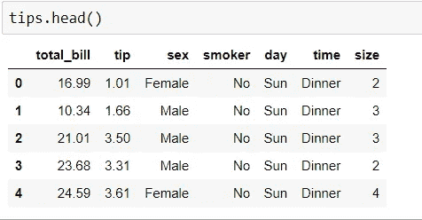
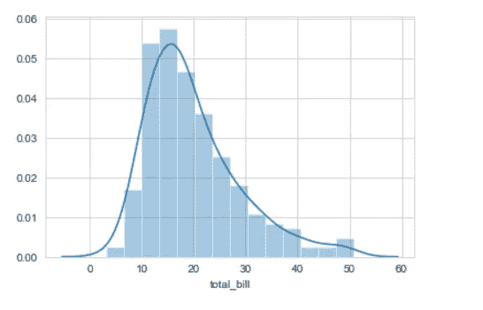
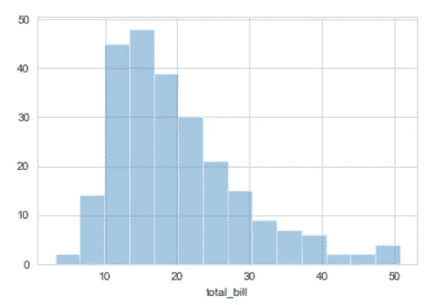
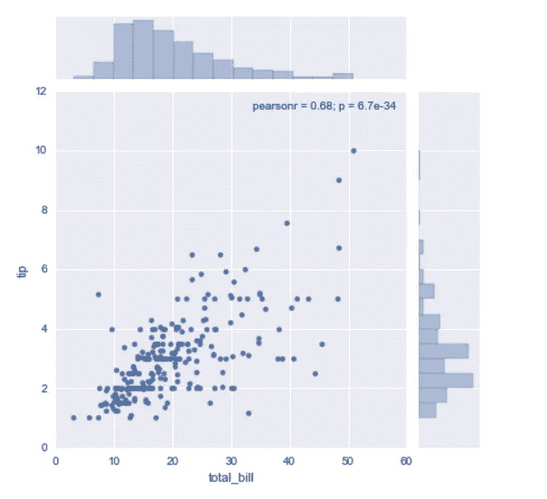
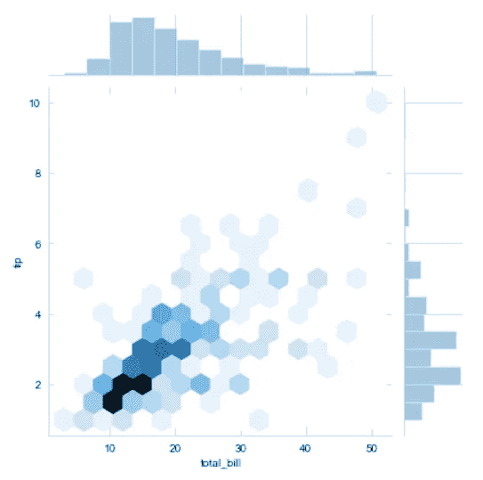
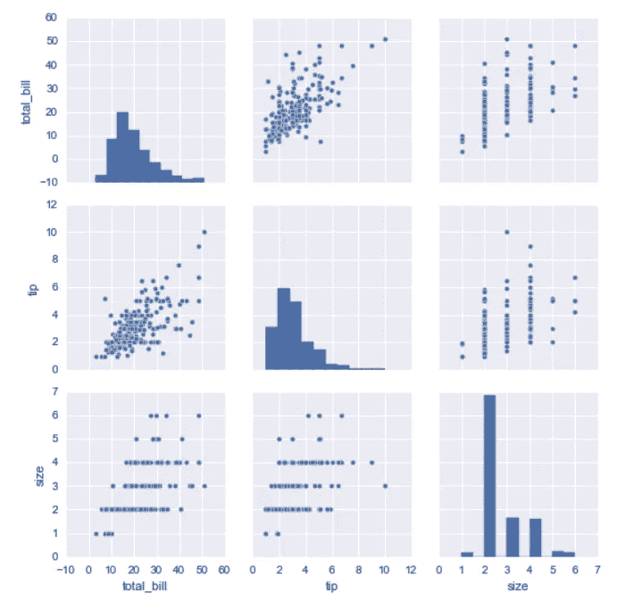
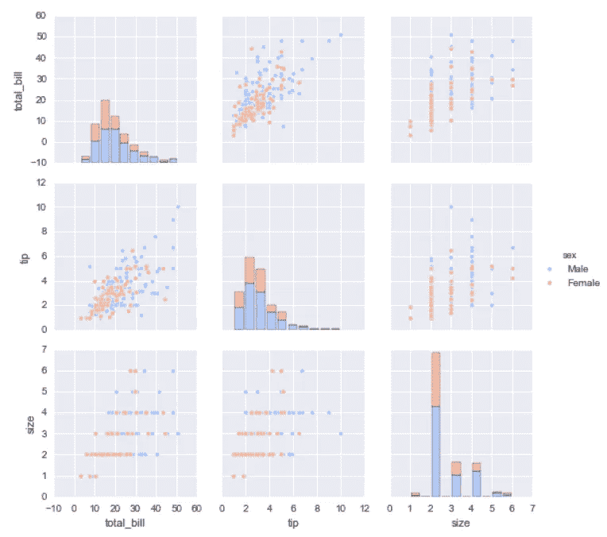
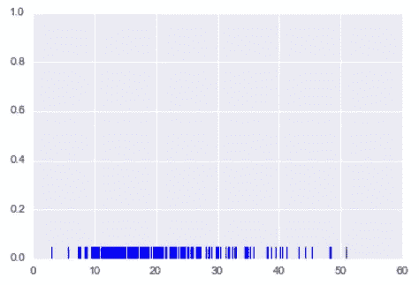
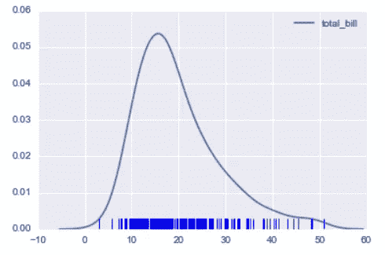

# Seaborn 入门:基础教程

> 原文：<https://medium.com/analytics-vidhya/getting-started-with-seaborn-basics-tutorial-ed67e45e611a?source=collection_archive---------35----------------------->

Python 包含许多数据可视化工具，可以让你增强和创建一些漂亮的图形、绘图和图表。当我查看这些可视化工具时，有一个库最为突出，那就是“Seaborn”。这个可视化工具就其应用而言非常强大，它非常容易使用&它将一些美学上的吸引力结合到你设计的图形中。

在本文中，我将浏览一些最简单和基本的图表，您可以使用 Seaborn 绘制这些图表。这会给你一个更好的画面，以便获得这个库的实践经验。

让我们开始导入我们的 Seaborn 库。

> *将 seaborn 作为 sns 导入*

一旦导入了库，您就可以设置所有绘图和图形的样式。有不少，我会详细讨论。但是你可以从下面开始-

> *sns.set_style('白色网格)*

好吧！现在，您的库已经被导入&您已经设置了 seaborn 背景样式。现在，我们需要导入数据来处理，以便创建一些非常简单的绘图。

注意——Seaborn 附带了一些您可以使用的内置数据集。

在这里，我们正在导入“提示”数据集，以便让您了解我们将如何进一步开展工作。这些数据都是关于人们在餐馆吃饭的&不管他们是否留下了小费。导入数据集非常简单，只需一行代码，如下所示

> *tips = SNS . load _ dataset(' tips ')*

我在这里将我的数据框设置为“提示”。

太好了！所以我们可以继续向你们展示几个 seaborn 可视化的例子。我把 seaborn 分成了四块地-

**1。分布图**

**2。分类图**

**3。矩阵图**

**4。回归图**

除了这四块地，还有很多其他的。但是，在这篇文章中，我将把重点放在“分布图”的类型上&通常只是用一行代码来绘制。

让我们从第一种开始-

## 分布图

分布图只不过是通过将数据的经验分布与数值/理论值进行比较而绘制的样本数据的分布。它被广泛用于比较范围和分布。

让我们看看这个类别下的所有子类型—

## 距离图

distplot 显示了一组单变量观察值的分布。

在绘制显示图之前，让我们先看看我们的数据。

> *tips.head()*

前 5 行和前 5 列

如上面的数据所示，我们有各种类别和分组，说明性别、一天中的时间和总账单中的小费。让我们用这些数据来绘制我们的距离图。

> *SNS . distplot(tips[' total _ bill '])*

如你所见，我们绘制了 Distplot，它显示了一组观察值的分布及其范围。分布曲线被称为“kde”。你可以完全去掉曲线，通过传递-

> *SNS . distplot(df[' total _ bill ']，kde = False)*

而现在，kde 曲线被去掉了。

## 接合图

联合图允许您基本上匹配两个二元数据的散点图。

在联合绘图中，您必须同时传递“x”和“y”的值。

> *sns.jointplot(x= '总账单'，y= '小费'，数据=小费)*

联合地块

如您所见，默认情况下，散点图已经绘制出来。你可以改变它&使用不同的种类来定制你的情节。以下数值可用于可视化—

*   分散
*   车辆注册号
*   残油
*   kde
*   十六进制

让我再向您展示一个例子，说明如何通过传入值来绘制这样的分布级别。

> *sns.jointplot(x='total_bill '，y='tip '，data=tips，kind='hex')*

使用“Hex”类型的联合绘图

## 配对图

Pairplot 将绘制整个数据帧中的成对关系(对于数字列)，并支持色调参数(对于分类列)。

> *sns.pairplot(提示)*

不同数据框架之间的关系

为了更好的形象化，你可以使用不同的颜色和风格来给人一种美感。

> *sns.pairplot(tips，hue='sex '，palette='coolwarm')*

对于不同种类的调色板，你可以访问 seaborn 官方文档页面

 [## 选择调色板- seaborn 0.10.1 文档

### 颜色比体型的其他方面更重要，因为颜色可以揭示数据中的模式，如果使用…

seaborn.pydata.org](https://seaborn.pydata.org/tutorial/color_palettes.html) 

## Rugplot

Rugplot 实际上是一个非常简单的概念，它们只是为一元分布上的每个点画一个破折号。

Rugplot

## KDE 图

kde 图被称为“核密度估计图”。这些 KDE 图用以该值为中心的高斯(正态)分布代替了每一次观察。

> *SNS . kdeplot(tips[' total _ bill '])*

太好了！我希望这篇文章能帮助你理解“分布”类型的基本绘图尺度。它被广泛使用&任何想要快速获取数据中的信息的用户都很容易理解。

感谢您抽出时间阅读这篇文章！

希望你喜欢！