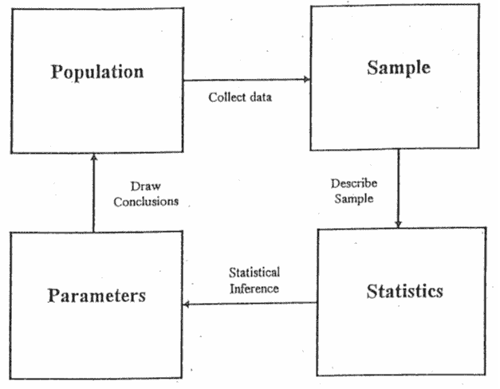
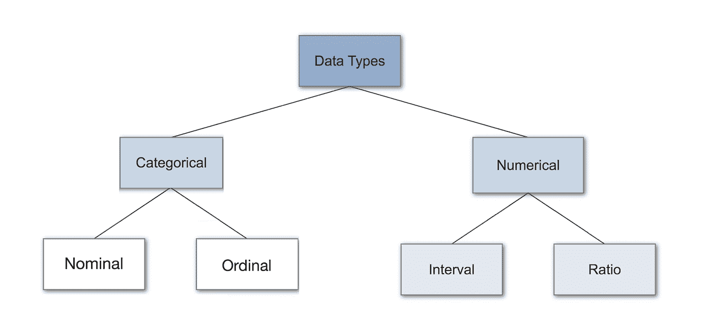
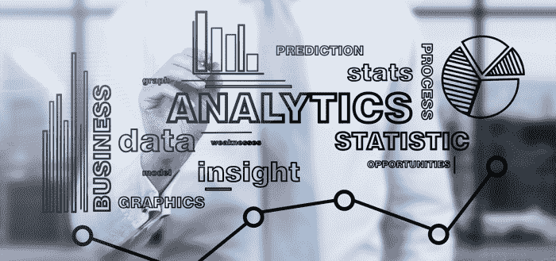

# 统计学入门

> 原文：<https://medium.com/analytics-vidhya/getting-started-with-statistics-5f53e5523888?source=collection_archive---------15----------------------->

**为什么要统计？**

商业统计是科学的良好决策，可用于多个学科和工作领域。在当今世界，数据已经成为公司发展的重要组成部分。有大量有价值的数据可以被处理成有意义的见解。还有大量的数据存储容量可以使用云计算和并行计算来处理。

**统计学中有哪些方法？**

统计学中有三种方法

*   ***分类-*** 当数据被分类到不同的桶或单位时使用该方法
*   ***模式识别-*** 该方法用于某些常见的形状、数据表单。例如:直方图，箱线图，散点图等。用于从噪声中分离图案
*   ***关联-*** 该方法用于关联和查看变量之间的关系

**统计的四大支柱是什么？**

基本上有两种类型——描述性的和推理性的，推理性又分为诊断性的、预测性的和规定性的

*   ***-*-**描述性统计定义了故事和作为画面的数据
*   ***诊断统计-*** 统计即定义为什么数字和数据看起来是这样的
*   ***预测统计-*** 统计定义了数据未来的样子
*   ***说明性统计-*** 统计定义了分析后应该推荐什么

**统计学中用到的重要术语有哪些？**

***群体-*** 它是一个未被观测到的特定对象的可能数据的宇宙。已经或将要访问网站的人

***参数-*** 它是与未被观察到的群体相关联的数值。人们在网站上花费的平均时间

***样本-*** 它是从被观察的总体中选取的观察值。在某一天访问过某个网站的人

***统计-*** 它是与一个观察值相关联的数值。人们在某一天花在网站上的平均时间。

**数据来源有哪些？**

主要有两个来源

*   ***原始数据-*** 连续收集的新鲜数据
*   ***次要数据-*** 已经存在、存档或发布的数据

**数据有哪些类型？**

***-*-**无法测量的定性数据，可以使用一些标签或 ASCII 码。性别，宗教，出生地。它有四种类型

*   ***事物的名义-*** 名称。头发颜色，邮政编码
*   ***-****是名义上只有两种状态(0 和 1)的二元，其中又进一步分为对称二元(两种结果同等重要，如:性别)和非对称二元(两种结果不同等重要，如:医学检验*
*   ****序数-*** 值具有有意义的顺序，但连续值之间的大小未知。例如:成绩，军队排名*

****定量数据-*** 可以测量并进一步分为离散和连续的数据*

*   ****-*-**数据可以取一定的值，不连续。在计数过程中工作。旅馆的房间数量*
*   ****区间-*** 在相同大小的单位尺度上测量的数据，数值有顺序。例如:温度、日历日期*
*   ****比率-*** 具有固有 0 点的数据，称数值为一个数量级。例如:以 K 为单位的温度，货币数量*

***数据集有哪些类型？***

*有 4 种类型的数据集:-*

*   ****记录-*** 例如:矩阵、交易数据、关系记录、交叉标签*
*   ****图网-*** 如:分子结构*
*   ****有序-*** 例如:视频数据，时间序列*
*   ****空间，图像&多媒体****

***总结！***

*到目前为止，我们已经知道了统计学中使用的不同的重要术语，以及统计学是如何被分成更广泛的概念的。这篇文档可以作为任何想学习统计和分析的人的入门指南*

**