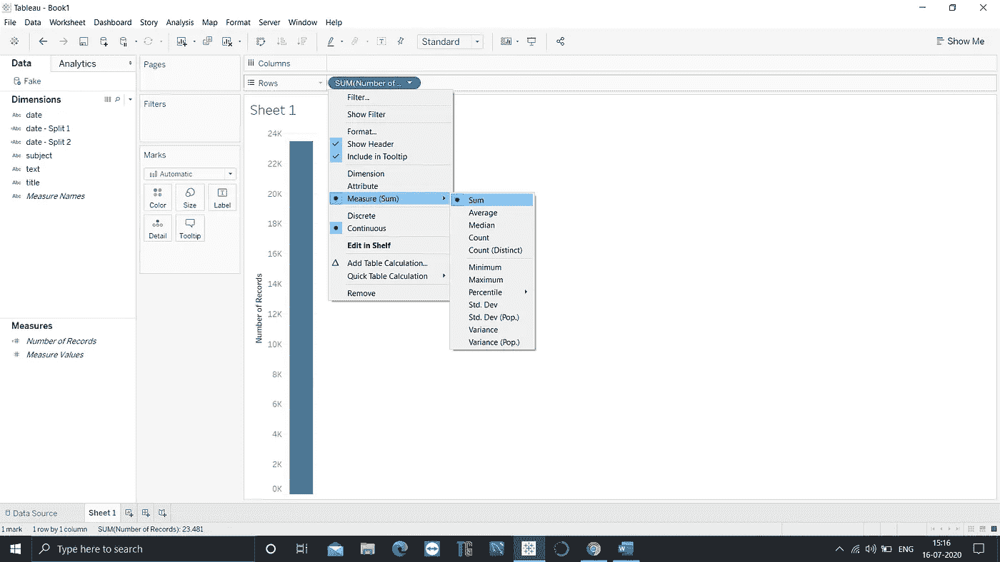

# Tableau 入门！

> 原文：<https://medium.com/analytics-vidhya/getting-started-with-tableau-9c4292e49fa9?source=collection_archive---------32----------------------->

> Tableau 可能是我们向自助式 BI 迈出的最重要的一步。

~凯文·金

Tableau 是发展最快的数据可视化工具之一，旨在帮助人们查看和理解数据。Tableau 产品查询关系数据库、在线分析处理多维数据集、云数据库和电子表格，以生成图形类型的数据可视化。根据维基百科，Tableau Software 是一家美国交互式数据可视化软件公司，由克里斯蒂安·查博特、帕特·汉拉汉和克里斯·斯托尔特于 2003 年 1 月在加利福尼亚州山景城成立。该公司目前总部位于美国华盛顿州西雅图，专注于商业智能。2019 年 8 月 1 日，Salesforce 收购 Tableau。

Tableau 产品包括:

Tableau 桌面(专业版和个人版)

Tableau 服务器

Tableau 在线

Tableau 准备生成器(2018 年发布)

tableau viz able(2015 年发布的消费者数据可视化移动应用)

Tableau Public(免费使用)

Tableau 阅读器(免费使用)

Tableau Mobile

## 我们开始吧！

***连接到你的数据库***

为了更好地理解，我将使用 Tableau 桌面和导入 CSV 文件。导入文件后，您可以预览数据。在可视化数据之前，您应该了解数据。预览允许您了解数据中不同列的数据类型。您甚至可以拆分、分组或透视列。要拆分列，右键单击列标题并选择拆分。您甚至可以使用自定义分割来自定义您的分割。

现在点击左下方的第 1 页。这将引导您进入工作簿。

***维度*** 是定性数据，如姓名或日期。默认情况下，Tableau 会自动将包含定性或分类信息的数据分类为一个维度，例如，任何具有文本或日期值的字段。这通常显示为数据行的列标题，例如本例中的日期、主题、文本等。

***措施*** 一般都是数值数据。默认情况下，Tableau 将包含这些数字的任何字段都视为一个度量，例如，本例中的记录数。被分类为度量的数据可以基于给定的维度进行聚合。

让我们更深入地研究，试图找出更多的见解。让我们从以不同的方式添加产品类别开始。

从维中，将主题拖动到列架，并将记录数拖动到行架。视图更新为条形图。在这种情况下，tableau 自动使用 sum 作为聚合函数。您可以通过将 CNT(记录数)拖动到 label(按住 ctrl 键，然后拖动它)来更改颜色、大小或向图表添加标签。

## 高级可视化

让我们在图表中添加过滤器。要做到这一点，拖动到标记上方出现的过滤器框。将出现一个对话框。根据您的需要定制您的过滤器，然后单击“应用”。

现在你会看到主题出现在过滤器框中。右键单击它并选择显示过滤器。您的过滤器将会出现。

我希望这能给你一个开始使用 Tableau 软件的想法。

参考资料:[https://www.tableau.com/](https://www.tableau.com/)T2【https://craft.co/tableau-software】